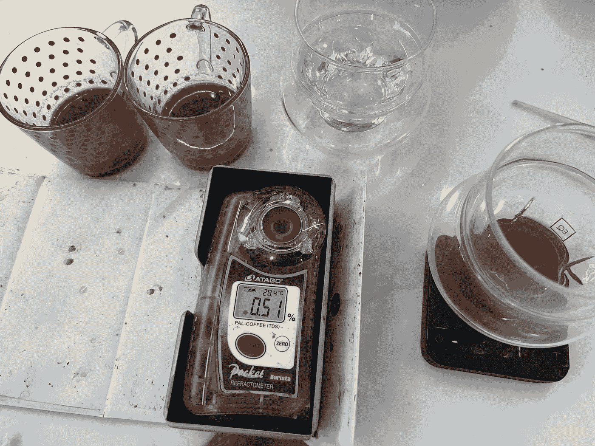
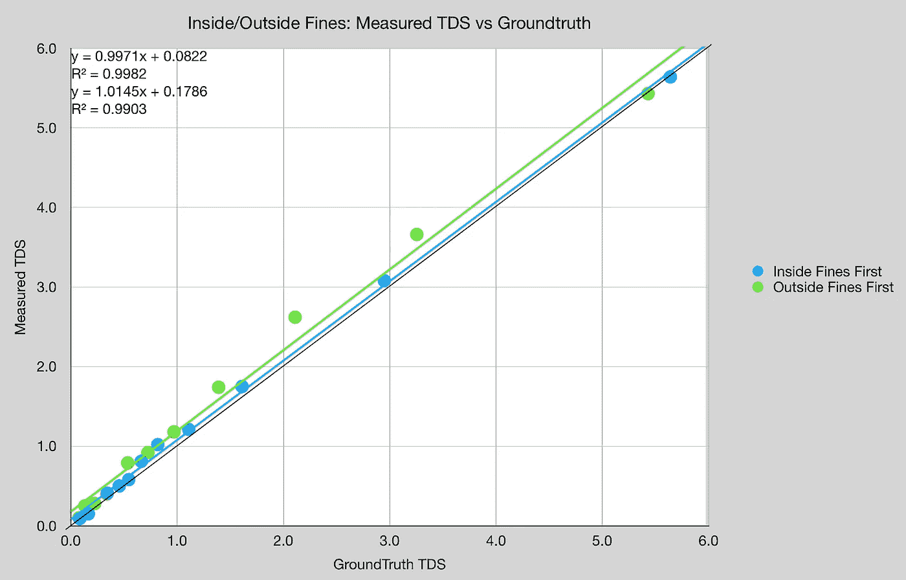
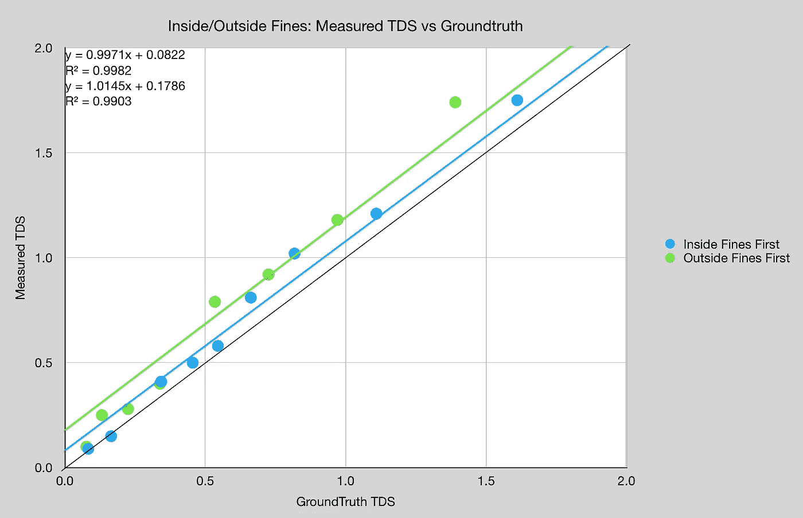
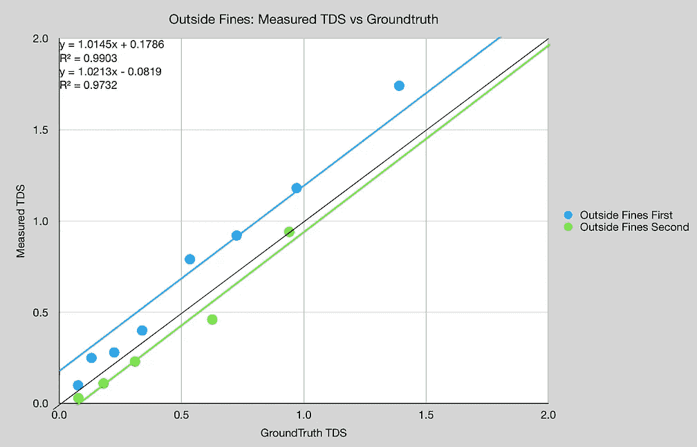
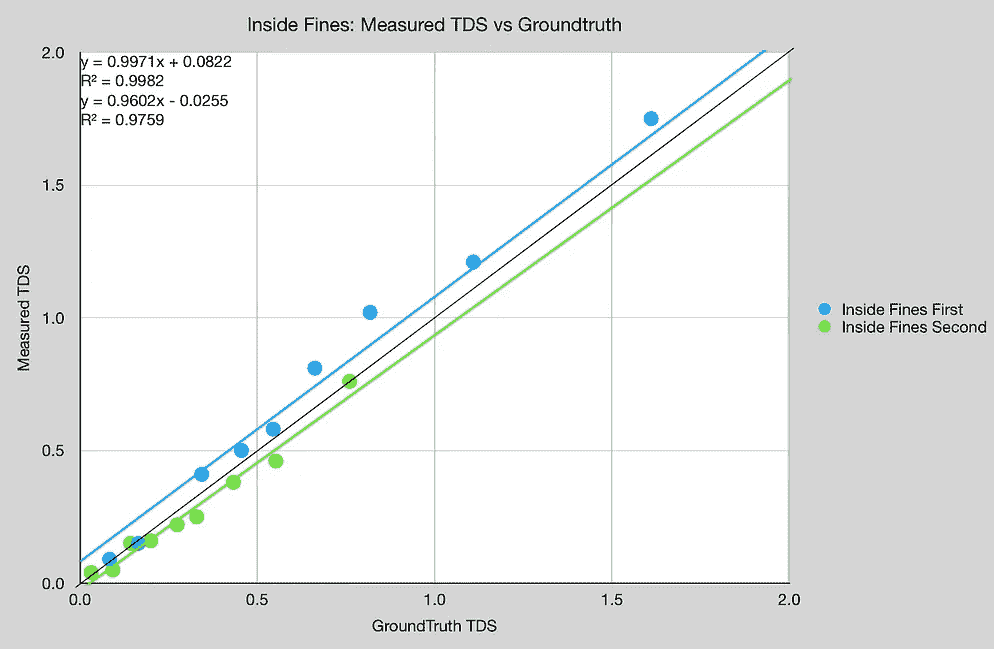
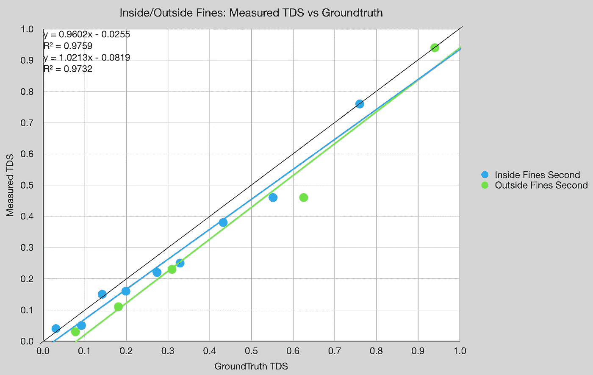

# 内外咖啡折光仪测量

> 原文：<https://towardsdatascience.com/inside-and-out-coffee-refractometer-measurements-ebfc3952c49c>

## 咖啡数据科学

## 最好知道折射仪

使用[折光仪](/measuring-refractometer-accuracy-to-groundtruth-for-coffee-421929644587)测量咖啡中的总溶解固体(TDS)是基于一些与 TDS 和折光率相关的数据。我不确定这个数据是基于什么，但是我在 TDS 测量中看到了一些奇怪的东西，与浓缩咖啡的 groundtruth 相比。

这种差异让我思考，那么[豆子](/the-coffee-bean-is-not-homogenous-sifted-salami-espresso-5b861bfbfbb7)的内部和外部呢？咖啡豆各部分溶解的固体会导致不同的测量结果吗？

# 方法

我首先通过研磨和筛除小于 300 微米的东西来分离出里面的 T4 粉末。然后，我取出较粗的粉末，放回研磨机中进行细磨，筛出小于 300 微米的粉末以弥补外面的粉末。

所有图片由作者提供

然后，我将 4g 样品与 11g 废咖啡混合。我用相同的轮廓拍摄每张照片，然后把每张照片分成三个杯子。我专注于前两个杯子(第一，第二)，因为第三个杯子的 TDS 很低。

对于每个样本，我将样本稀释几次，以测量 TDS 如何响应，假设每个样本的第一个和最高 TDS 读数是 groundtruth。如果你加水，在其他条件不变的情况下，它会线性稀释溶解的固体总量。

# 数据

数据并没有很好地显示这种稀释的线性趋势。我们可以看看第一个杯子，那是 1:1 的镜头。对于外部罚款，读数最终高于地面真相。

我们可以放大，看到读数的一些差异。

我们也可以把内外分开来看，但是要比较一个镜头的前半部分和后半部分。前半部分(第一部分)高估了基本事实，而后半部分(第二部分)略微低估了基本事实。外部微粒的差异比内部微粒更明显。

如果我们只关注秒，内部和外部微粒的行为是相似的，考虑到容易提取的可溶物已经不存在了，这是可以预料的。

这项研究的目的是表明我们对折光率仪如何表征咖啡萃取没有很好的理解。我怀疑这种描述最初是在较长时间的酿造过程中完成的，并没有考虑到咖啡豆的非同质性。当计算从折光率到 TDS 的转换时，不包括输出比的输入，但即使这样，也存在同质提取的假设。通常水温是被考虑的。

折光仪是目前最好的和最普遍的量化咖啡萃取和浓度的工具，但我们需要更好的工具来更好地了解咖啡。

如果你愿意，可以在推特、 [YouTube](https://m.youtube.com/channel/UClgcmAtBMTmVVGANjtntXTw?source=post_page---------------------------) 和 [Instagram](https://www.instagram.com/espressofun/) 上关注我，我会在那里发布不同机器上的浓缩咖啡照片和浓缩咖啡相关的视频。你也可以在 [LinkedIn](https://www.linkedin.com/in/dr-robert-mckeon-aloe-01581595) 上找到我。也可以关注我在[中](https://towardsdatascience.com/@rmckeon/follow)和[订阅](https://rmckeon.medium.com/subscribe)。

# [我的进一步阅读](https://rmckeon.medium.com/story-collection-splash-page-e15025710347):

[我未来的书](https://www.kickstarter.com/projects/espressofun/engineering-better-espresso-data-driven-coffee)

[我的链接](https://rmckeon.medium.com/my-links-5de9eb69c26b?source=your_stories_page----------------------------------------)

[浓缩咖啡系列文章](https://rmckeon.medium.com/a-collection-of-espresso-articles-de8a3abf9917?postPublishedType=repub)

工作和学校故事集