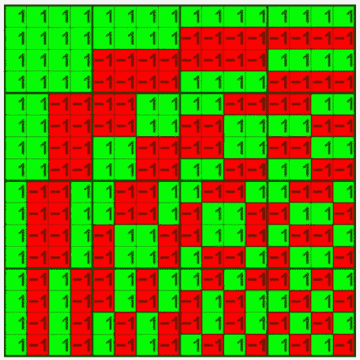
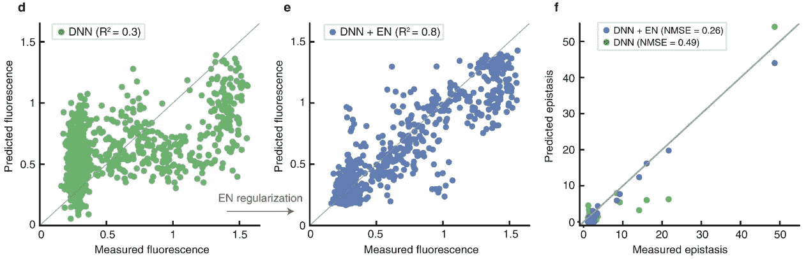
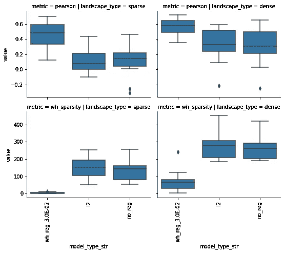

# 内部上位网

> 原文：<https://towardsdatascience.com/inside-epistatic-nets-d9afeaf80689>

## 正则化神经网络以更好地预测生物适应度景观


艾玛·戈塞特在 [Unsplash](https://unsplash.com?utm_source=medium&utm_medium=referral) 上的照片

**将你的归纳偏见与你的问题空间相匹配**

所有机器学习(ML)算法都有一个固有的[归纳偏差](https://en.wikipedia.org/wiki/Inductive_bias)。归纳偏差是我们对遇到某种解决方案的可能性所做的假设。归纳偏差的经典例子是[奥卡姆剃刀](https://en.wikipedia.org/wiki/Occam%27s_razor)，我们假设简单的例子比复杂的更有可能。在 ML 中，我们经常通过施加稀疏性约束来将归纳偏向简单性转化为实践。 [LASSO 回归](https://en.wikipedia.org/wiki/Lasso_(statistics))例如，惩罚学习解中非零系数幅度的总和——LASSO 偏向系数更小、更少的解。

并非所有的归纳偏差都适用于所有的问题空间(没有免费的午餐)。通过根据问题空间定制学习算法的归纳偏差，对于给定的努力，您将获得更好的性能——也就是说，您将需要更少的训练数据、更少的训练迭代，并且您的模型将更好地推广到看不见的示例。

**生物适应度景观稀疏**

生物学中一个常见的挑战是预测突变对健康的影响。生物有基因组，基因组由一系列基因组成，其中一些基因相互作用；更少的是一式三份；更高阶的更少；而且大部分基因根本不交互作用。在这种情况下，我指的是[“上位性”](https://en.wikipedia.org/wiki/Epistasis)方面的相互作用——也就是说，同时删除基因 A 和 B 可能会产生比你预期的 A 和 B 单独产生的影响更大(或更小)的影响。

一个生物体的整体“适应度”([其适应度“景观”](https://www.biorxiv.org/content/10.1101/2022.01.26.477860v2.full))不仅取决于基因本身的作用，还取决于基因之间的相互作用网络。适用于基因组的相同原理也适用于单个蛋白质；使得整个蛋白质的适合度不仅取决于其氨基酸序列，还取决于氨基酸之间的相互作用。例如，新型冠状病毒的新变种可能或多或少具有传染性(或多或少“适合”)，这取决于它们的蛋白质中包含的一系列突变，以及这些突变在蛋白质内和基因间如何相互作用。

在[最近的一篇 PNAS 论文](https://www.pnas.org/doi/10.1073/pnas.2109649118)【1】中，加州大学伯克利分校的 Listgarten 小组表明，就位点之间的上位性相互作用而言，上述生物景观——对于生物体或单个蛋白质——往往非常稀疏。大多数基因或蛋白质中的大多数位点不相互作用。更少的是一式三份或四份。并且高阶相互作用不能从低阶相互作用中预测。

**规则化可以加强特定的归纳偏差**

正如上面的 LASSO 回归例子所展示的，正则化 ML 模型是加强特定归纳偏差的一种方式。深度神经网络(DNN)模型能够表示比套索模型复杂得多的功能，能够表示生物适应度景观中潜在存在的更高阶相互作用。然而，对于 DNNs，大多数默认的正则化方法适用于单个层。例如， [L1 正则化可以应用于 DNN](https://www.tensorflow.org/api_docs/python/tf/keras/regularizers/L1) 的单层，使得该特定层的权重偏向更稀疏的解决方案。

然而，在 Berkeley 的 Listgarten 和 Ramchandran 小组最近发表的一篇自然通讯论文[中，他们指出了一个关键的细节:当使用 DNN 预测生物序列的适合度时，简单地将 DNN 层 T10 限制为稀疏不会导致整个 DNN 水平的稀疏解。引用他们 2021 年的论文:](https://www.nature.com/articles/s41467-021-25371-3)

> 尽管有其好处，促进上位相互作用的稀疏性并没有在 DNNs 中作为一种归纳偏差进行研究。障碍在于找到一种方法来提高 DNNs 中的上位稀疏性。不幸的是，直接惩罚具有促进稀疏先验的 DNNs 的所有或一些参数(权重)不可能导致稀疏上位正则化，因为上位系数是 DNNs 中权重的复杂非线性函数。

换句话说，当输入要素通过 DNN 传播时，即使具有稀疏权重的图层也可以(并且确实)重新组合成非稀疏解决方案。

总结一下:

*   我们喜欢 dnn，因为它们可以表示任意程度的相互作用。
*   但是，dnn 是如此灵活，它们很容易过度拟合，损害了通用性。
*   就特征之间的上位性交互而言，生物景观往往是稀疏的。
*   我们需要一种方法来加强整个 DNN 的上位稀疏性，以便更好地推广到新数据(即，施加更合适的归纳偏差)。

现在我们到了有趣的部分。Listgarten 和 Ramchandran 小组通过在 DNN 训练期间向损失函数添加上位稀疏度的测量，解决了上述问题。

**使用沃尔什-哈达玛变换测量上位稀疏度**

测量变量间相互作用稀疏性的一种方法是通过[沃尔什-哈达玛(WD)变换](https://en.wikipedia.org/wiki/Hadamard_transform)。



排序后的[沃尔什矩阵(维基百科)](https://en.wikipedia.org/wiki/Walsh_function)

有几种不同的方式来思考 [WD 转换](https://en.wikipedia.org/wiki/Walsh_function)。第一个，是作为一个离散的[傅立叶变换](https://en.wikipedia.org/wiki/Fourier_transform)。花点时间看看上面的沃尔什矩阵，你可以看到一个由低到高频率交替变化的模式。第一行(和列，因为矩阵是对称的)是一系列 1。第二个是半 1，和半 1。第三行更频繁地交替 1 和-1，直到最后一行每隔一个位置交替 1 和-1。从“频谱分析”/傅立叶的角度来看，这些行的线性组合[可以表示任何布尔函数](https://en.wikipedia.org/wiki/Walsh_function)。也就是说，您可以使用这些行的组合来表示健身景观。*WD 变换是用于识别沃尔什矩阵系数的过程(“沃尔什频谱”)，该矩阵可精确分解布尔函数。*WD 变换的稀疏性是指非零系数的数量。

*边注*:沃尔什矩阵根据被分解的布尔函数的维数改变维数。上面的矩阵是 16 阶的(2⁴或四维布尔函数)。显然，更大的空间需要更大的沃尔什矩阵。

从生物学角度来看，WD 变换的一个补充方法是列举生物序列中所有可能的上位性相互作用(具体来说，“平均上位性”)。关于这种联系的全面解释，请参见德克萨斯大学阮冈纳赞小组的这篇 [2016 年论文【3】。想法是沃尔什矩阵的每一行对应于用于计算上位相互作用的系数。](https://www.ncbi.nlm.nih.gov/pmc/articles/PMC4919011/#pcbi.1004771.s005)

例如，考虑一个三维布尔函数(2 或 8 种可能的特征组合)。在生物景观中，这种布尔表示可能意味着许多事情，例如在蛋白质的位置 1、2 或 3 处特定突变的存在/不存在。每个特征组合的适合度由 y 值表示，因此“y101”是样本的 y 值，其中第一个和第三个元素为 1，第三个元素为 0。

特定位置对适应度的影响可能略有不同，这取决于存在的其他突变。例如，背景(00*)中位置 3 (001)的效果将被计算为[y001-y000]。背景中位置 3 的影响(01*)将被计算为[y011-y010]。这两个效应可以用 1/2*[(y001-y000) + (y011-y010)]来平均。结果是位置 3 对整体健康的平均影响([见这里的等式 7](https://www.ncbi.nlm.nih.gov/pmc/articles/PMC4919011/#pcbi.1004771.s005))。高阶上位相互作用可以用同样的方法计算。以矩阵形式表示完整的一系列方程会产生沃尔什矩阵，使用这些函数分解适应度景观会产生完整的上位相互作用集，这相当于 WD 谱。

因此，WD 变换允许我们将适合度测量转换为上位交互。我们可以通过计算非零值的数量来衡量这些相互作用的稀疏性。

**用 WD 变换正则化 DNN**

我们现在知道，WD 变换提供了一种量化 DNN 学会的上位相互作用的稀疏性的方法。通过计算非零系数的数量，我们量化了深度网络已经学会如何稀疏(或不稀疏)地表示变量之间的相互作用。我们可能看不到这将如何明显地转化为一个改进的 DNN 架构(至少，我不这样认为)，但这有什么关系呢？通过[反向传播](/how-does-back-propagation-in-artificial-neural-networks-work-c7cad873ea7#:~:text=Back%2Dpropagation%20is%20the%20essence,reliable%20by%20increasing%20its%20generalization.)的奇迹，我们需要做的就是定义一个合适的损失函数。

在这种情况下，Listgarten 和 Ramchandran 小组以如下方式将 WD 变换包含在损失函数中。对于每次迭代训练:

1.  列举布尔输入特征的所有可能组合，并使用当前的 DNN 权重来计算*预测的*适应度前景。
2.  对预测的适应值执行 WD 变换
3.  计算 WD 变换中非零系数的数量，并将该数量添加到损失函数中，乘以权重。

*边注*:步骤 3 是理想化的过程，但实际上，L0 范数(计算非零系数的数量)是不可微的，因此不适合反向传播。相反，他们放宽了对 L1 范数(系数绝对值之和)的限制。

总之，在输入为布尔型而输出为适应值的回归场景中，损失函数变为均方误差(MSE)加上 WD 变换的加权 L1 范数。给定这个损失函数，模型被训练以最小化预测*误差*和解决方案的*稀疏度*。

使用这个损失函数正则化 DNN 在本文中被称为“上位网”(EN)。

**上位网络提高生物景观预测任务的性能**

作者在几个公共数据集上证明，当使用上述 EN loss 函数进行正则化时，训练用于预测生物序列适合度的 DNNs 表现更好。约束完全 DNN 来学习输入变量之间的稀疏上位关系允许模型更好地泛化。例如，下图显示了 GFP 荧光数据集的改进。



有和没有 EN 正则化的 DNN 预测的 GFP 荧光。[图 3 来自 2021 年 Listgarten 和 Ramchandran 的论文](https://www.nature.com/articles/s41467-021-25371-3)。

**tensor flow 中的上位网络实现**

让我们使用 TensorFlow 2 和 Python 在玩具数据集上实现一个上位网络。完整的实现可以在 GitHub 上以 Jupyter 笔记本的形式获得。

我们的玩具数据集将是 6 维的。这意味着有 6 个布尔输入特征，以及这些特征的 64 种可能的组合。我们将包括一个稀疏函数和一个稠密函数。稀疏函数将包括 1-4 度的 4 项。密集函数将包括 13 个 1-4 度项。

```
sparse_fun = lambda x: 2*x[0]*x[3] - 2*x[2] + 2*x[0]*x[1]*x[4] \                          
                       + 2*x[0]*x[2]*x[3]*x[5]dense_fun = lambda x: 2*x[0]*x[3] - 2*x[2] + 2*x[0]*x[1]*x[4] \
                      + 2*x[0]*x[2]*x[3]*x[5] \
                      -  2*x[1]*x[3] - 2*x[5] + 2*x[3]*x[1]*x[5] \
                      +  2*x[0]*x[4] - 2*x[0] + 2*x[3]*x[4]*x[5] \
                      -  2*x[2]*x[5] + 2*x[1] - 2*x[2]*x[3]*x[4]# itertools.product for generating all combinations of features
n_bits = 6
all_comb =  list(product([0, 1], repeat=n_bits))
```

为了计算 WH 变换，我们将使用 [scipy.linalg.hadamard](https://docs.scipy.org/doc/scipy/reference/generated/scipy.linalg.hadamard.html) 函数来生成沃尔什矩阵，然后使用张量流函数执行矩阵乘法(以便梯度带可以跟踪运算)。

```
from [scipy.linalg](https://docs.scipy.org/doc/scipy/reference/generated/scipy.linalg.hadamard.html) import hadamard# bool model predicts fitness using Boolean inputs
y_all = tensorflow.squeeze(bool_model(all_comb))# Walsh-Hadamard matrix (without normalizing constant)
had_mat = tensorflow.convert_to_tensor(
    hadamard(2**n_bits),
    dtype=tensorflow.float32
)# Multiply Walsh matrix by predicted fitness values
wh_t = tensorflow.linalg.matvec(had_mat, y_all)# Sum absolute value of coefficients
coeff_l1 = tensorflow.reduce_sum(
    tensorflow.cast(
        tf.abs(wh_t),
        dtype=tensorflow.float64)
    )
```

然后，用于训练模型的损失函数变成 MSE 加上 WH 变换的系数之和，如下所示:

```
mse = tensorflow.reduce_mean(
    tensorflow.math.squared_difference(y_pred, y_true)
)# Here wh_weight balances the contribution of MSE and WH transform
# This code adds the weighted factors together into a single loss
loss_sum = tensorflow.add(
    tensorflow.cast(mse, dtype=tensorflow.float32),
    tensorflow.cast(wh_weight * coeff_l1, dtype=tensorflow.float32)
)
```

现在我们有了运行实验的基本组件(参见[全 Jupyter 笔记本](https://github.com/mbi2gs/epistatic_net_demo)了解所有细节)。我们比较了三种类型的 DNN 正则化:非正则化，分层 L2 正则化，WH 稀疏正则化(又名上位网)。我们可以在 25%的稀疏函数景观上训练每个模型，然后尝试推广到剩余的 75%。将使用 MSE 作为损失函数来训练每个模型，除了上位网，上位网将使用 MSE 加上稀疏性约束。



上位网(“wh_reg”)在稀疏和密集数据集上都更好地概括，因为它偏向于学习稀疏特征交互。每个方框代表 10 个随机的训练/测试分割。顶行显示了模型预测与保留数据的皮尔逊相关性。底部一行显示了训练模型的相互作用系数大小的总和。左栏是稀疏的风景，右栏是密集的。

从上图中我们可以看到，稀疏度约束的“wh _ reg”DNN 在稀疏和密集景观(顶行，皮尔逊相关系数)中都能更好地推广测试数据。不出所料，同一个模型学会了用更大的稀疏性来表示特征交互(底部一行)。

**结论**

根据问题空间定制 ML 模型的归纳偏差可以带来显著的改进。就特征交互而言，生物适应度景观往往非常稀疏。使用 WH 变换来测量上位稀疏性，并将该度量包括在损失函数中，导致在预测生物序列的适合度时模型性能大大提高(一种称为[上位网](https://www.nature.com/articles/s41467-021-25371-3)的训练过程)。我们已经在 TensorFlow 中完成了上位网络的[实现，并演示了它的完美工作！](https://github.com/mbi2gs/epistatic_net_demo)

**参考文献**

[1] D. Brooks，A. Aghazadeh 和 J. Listgarten，[关于适应度函数的稀疏性及其对学习的影响](https://www.pnas.org/doi/10.1073/pnas.2109649118) (2021)， *PNAS* 119(1):e2109649118

[2] A. Aghazadeh，H. Nisonoff，O. Ocal，D. Brookes，Y. Huang，O. Koyluoglu，J. Listgarten 和 K. Ramchandran，[上位网允许深度神经网络的稀疏谱正则化以推断适应度函数](https://www.nature.com/articles/s41467-021-25371-3) (2021)，*Nature communication s*12:5225

[3] F. Poelwijk，V. Krishna 和 r .阮冈纳赞，[突变的背景依赖性:形式主义的联系](https://www.ncbi.nlm.nih.gov/pmc/articles/PMC4919011/#pcbi.1004771.s005) (2016)， *PLoS 计算生物学* 12(6):e1004771