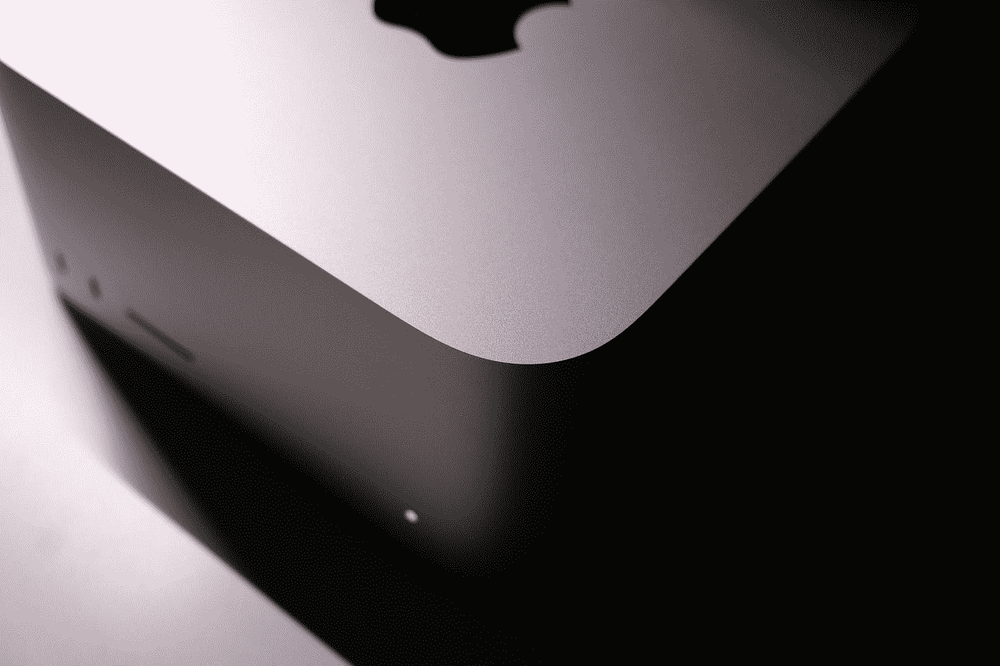
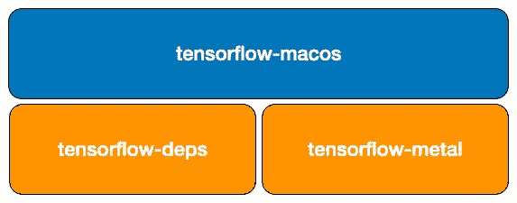
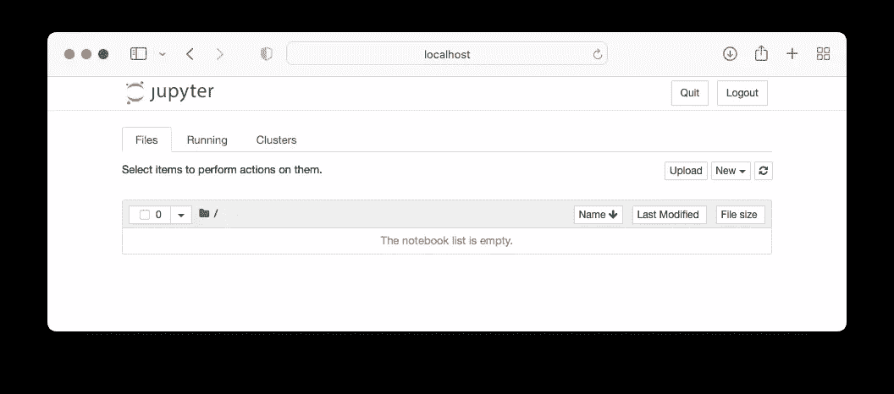

# 在 Apple Silicon Macs 上安装 TensorFlow 和 Jupyter 笔记本

> 原文：<https://towardsdatascience.com/installing-tensorflow-and-jupyter-notebook-on-apple-silicon-macs-d30b14c74a08>

## 了解如何安装 configure tensor flow with Jupyter Notebook，以便在您的 M1/M2 MAC 上使用



由[弗拉德·耶拉](https://unsplash.com/@ar7work?utm_source=medium&utm_medium=referral)在 [Unsplash](https://unsplash.com?utm_source=medium&utm_medium=referral) 上拍摄的照片

如果你对机器学习或深度学习感兴趣，你肯定会对 Anaconda 包和 Jupyter 笔记本很熟悉。对于那些刚刚拥有崭新闪亮的运行苹果芯片的 MacBook Air 或 Mac Studio 的人来说，当你试图在 Anaconda 中安装 TensorFlow 包时，你可能会有点失望。

去年，我写过一篇关于如何在你的 Apple Silicon Mac 上安装 TensorFlow 的文章:

</installing-tensorflow-on-the-m1-mac-410bb36b776> [## 在 M1 Mac 上安装 TensorFlow

towardsdatascience.com](/installing-tensorflow-on-the-m1-mac-410bb36b776) 

今年我给自己弄了一个 Mac 工作室，所以我想看看有什么变化。因此，在本文中，我将带您了解在 Apple Silicon Mac 上安装 TensorFlow 的最新步骤。好消息是程序现在更加简单了。所以让我们直接开始吧！

# 苹果硅上的张量流

不幸的是，在苹果芯片上安装 TensorFlow 并不像在 Windows 上安装 Anaconda 然后使用`pip install tensorflow`命令那样简单。原因如下。

TensorFlow 不正式支持 Apple Silicon——这意味着 TensorFlow 没有针对 Apple Silicon 架构(arm64)预编译的包。

> TensorFlow 只为 x86 架构(Linux、Windows、Mac(在 Intel 芯片上))和 Raspberry PI (arm64)分发官方轮子。

为了克服这一限制，苹果保留了自己的`tensorflow-macos`包:



作者图片

使用 Tensorflow 的 **PluggableDevice API** ，苹果能够将 TensorFlow 操作翻译成苹果芯片(M1 和 M2)的 GPU 可以理解的代码。

> 你可以从[https://blog . TensorFlow . org/2021/06/PluggableDevice-device-plugins-for-tensor flow . html](https://blog.tensorflow.org/2021/06/pluggabledevice-device-plugins-for-TensorFlow.html)了解更多关于 tensor flow 的 PluggableDevice API

`tensorflow-macos`包依赖于另外两个包:

*   `tensorflow-deps` —在 arm64 上运行 Tensorflow 的依赖关系，例如`python`、`numpy`、`grpcio`和`h5py`。
*   `tensorflow-metal` —确保 TensorFlow 能够在**金属**上运行的插件

**Metal** 框架让你的应用直接访问设备的图形处理单元(GPU)。本质上，这意味着您的 TensorFlow 代码现在能够利用新 Apple Silicon 中可用的强大 GPU。

> 注意，如果没有`tensorflow-metal`包，你的 TensorFlow 代码仍然可以在你的 Apple Silicon Mac 上运行，只是 TensorFlow 将无法利用 M1 或 M2 的 GPU(它只能使用 CPU)。

# 在 Apple Silicon Mac 上安装 TensorFlow 的步骤

在 Apple Silicon Mac 上安装 TensorFlow 非常简单。我在下面几节中列出了这些步骤。

## 下载 Conda

不使用 **Anaconda** ，而是使用 **MiniForge** ，一个轻量级 Python 解释器，可以完全访问 conda 生态系统。

> **Conda** 是一个运行在 Windows、Mac OS 和 Linux 上的开源包和环境管理系统。

对于苹果硅机，可以直接从[https://github . com/conda-forge/miniforge/releases/latest/download/miniforge 3-ma cosx-arm 64 . sh](https://github.com/conda-forge/miniforge/releases/latest/download/Miniforge3-MacOSX-arm64.sh)下载 **MinForge 安装程序**

下载完[**miniforge 3-ma cosx-arm 64 . sh**](https://github.com/conda-forge/miniforge/releases/latest/download/Miniforge3-MacOSX-arm64.sh)文件后，打开**终端**，输入以下命令:

```
$ **chmod +x ~/Downloads/Miniforge3-MacOSX-arm64.sh**
$ **sh ~/Downloads/Miniforge3-MacOSX-arm64.sh** 
```

遵循屏幕上的安装说明。安装完成后，将为您创建一个基本的 Python 环境。您可以使用以下命令来验证这一点:

```
$ **conda info --envs**
# conda environments:
#
base                  *  /Users/weimenglee/miniforge3
```

## 激活环境

使用以下命令激活基本环境:

```
$ **source ~/miniforge3/bin/activate**
```

> 如果您的机器只有一个环境，这一步是可选的。

## 安装 TensorFlow 依赖项

键入以下命令安装 TensorFlow 所需的依赖项(`tensorflow-deps`包):

```
$ **conda install -c apple tensorflow-deps**
```

## 安装 TensorFlow

键入以下命令安装适用于 Mac OS 的 TensorFlow:

```
$ **python -m pip install tensorflow-macos**
```

# 安装 tensor flow-金属插件

键入以下命令安装`tensorflow-metal`软件包:

```
$ **python -m pip install tensorflow-metal**
```

# 安装其他基本库

除了安装 TensorFlow 库，您还很可能需要为您的机器学习和深度学习项目安装其他包，如 **matplotlib** 、 **sklearn** 、 **OpenCV** 、 **Pandas** 等。因此，请继续安装它们，如下所示:

```
$ **conda install -c conda-forge matplotlib -y**
$ **conda install -c conda-forge scikit-learn -y**
$ **conda install -c conda-forge opencv -y**
$ **conda install -c conda-forge pandas -y**
```

> `**-y**`选项为您省去安装库时回答确认的麻烦。

## 安装 Jupyter 笔记本电脑

最后，您可能希望安装 Jupyter 笔记本:

```
$ **conda install notebook -y**
```

就是这样！要测试 Jupyter 笔记本安装是否正确，请启动它:

```
$ **jupyter notebook**
```

如果你能看到以下内容，你就万事俱备了！



作者图片

创建一个新的 Jupyter 笔记本，并键入以下代码:

```
import tensorflow as tf
print(tf.__version__)
print(tf.keras.__version__)
```

如果您没有看到任何报告的错误，您应该会看到类似如下的输出:

```
2.9.2
2.9.0
```

既然这样，恭喜你！您已成功安装 TensorFlow！

# 升级 TensorFlow

如果您要升级到 TensorFlow 的新版本，可以遵循以下步骤:

*   卸载`tensorflow-macos`和`tensorflow-metal`包:

```
$ **python -m pip uninstall tensorflow-macos**
$ **python -m pip uninstall tensorflow-metal**
```

*   重新安装`tensorflow-deps`包:

```
$ **conda install -c apple tensorflow-deps --force-reinstall**
```

> 如果你的 TensorFlow 安装在一个特定的环境中，那么在上面的命令中添加`**-n *<environment_name>***`选项。

*   重新安装`tensorflow-macos`包:

```
$ **python -m pip install tensorflow-macos**
```

<https://weimenglee.medium.com/membership>  

# 摘要

希望这篇短文能让你在苹果 Silicon Mac 上轻松安装 TensorFlow。对于长期使用 Anaconda 的用户，请注意，在本文中您现在使用的是 MiniForge，我只安装了一些常用的包，如 matplotlib、sklearn、OpenCV 和 Pandas。当您处理项目时，很可能需要使用`pip`命令手动安装所需的包(而如果您使用 Anaconda，那么已经预安装了很多包)。尽管如此，这只是一点点不便，而不是一个交易破坏者。跟 TensorFlow 玩得开心！