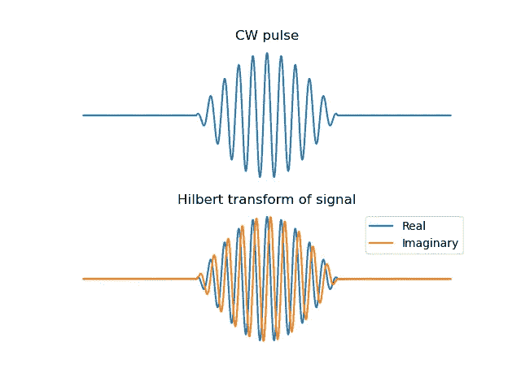
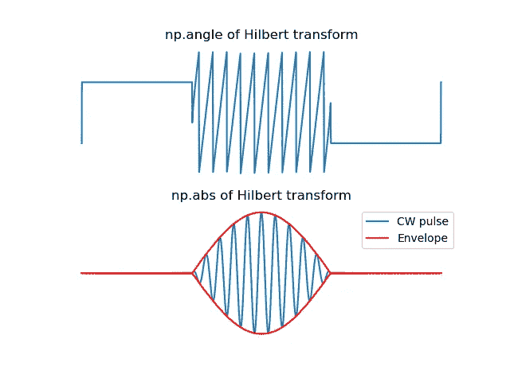

# 希尔伯特变换的瞬时相位和幅度

> 原文：<https://towardsdatascience.com/instantaneous-phase-and-magnitude-with-the-hilbert-transform-40a73985be07>

## 使用希尔伯特变换更好地理解周期性数据

马克西姆·托尔钦斯基在 [Unsplash](https://unsplash.com?utm_source=medium&utm_medium=referral) 上拍摄的照片

# 动机

在其他文章中，我们探讨了傅立叶变换在信号频率成分分解中的应用。

*   [https://towards data science . com/teach-and-learn-the-Fourier-transform-geometrically-ce 320 f 4200 c 9](/teach-and-learn-the-fourier-transform-geometrically-ce320f4200c9)

然而，傅立叶变换并不能告诉我们太多关于原始信号的时间或空间动态。我们知道*哪些*频率组成了我们的原始信号，但不知道*何时* / *频率在哪里*或者*它们如何随着时间演变。让我们通过构建我们的数字信号处理工具包来解决这一缺陷吧！这里，我们将考察希尔伯特变换对实值信号的一个简单应用，以了解它的实际重要性。*

为什么这对数据科学家很重要？轻松点。当我们处理周期性数据时，我们通常最感兴趣的是相位和幅度的动态变化，而不是原始值。从[时间生物学](https://ithems.riken.jp/en/events/hilbert-transform-and-its-applications-biology)到[气候科学](https://ui.adsabs.harvard.edu/abs/2018EGUGA..20.1591Z/abstract)，希尔伯特变换对于理解数据至关重要。

# 样本信号

为了演示希尔伯特变换的应用，让我们考虑一个简单的连续波(CW)脉冲。

在这个代码片段中，第一个余弦为我们的载波定义了一个恒定的频率。正弦函数缩放该载波，对脉冲进行幅度调制。

# 希尔伯特变换的实部和虚部

在*图 1a* 中，显示了模拟的 CW 脉冲。正如预期的那样，该信号是实值的，并且包括由较低频率调制的单一恒定频率幅度。

**图 1** : (a)简单 CW 脉冲和(b)该实值信号的希尔伯特变换。图片作者。

希尔伯特变换返回值的实部和虚部如图 1b 所示。对我们的实值信号调用希尔伯特变换是…复杂的！实分量与我们的输入脉冲相同。然而，虚部是相移的复制品。

# 相位和幅度估计

好的，希尔伯特变换给我们的信号增加了一个虚部……为什么？另外，我们不能自己改变脉冲的相位吗？

我们会问“为什么？”一会儿，但在我们继续之前，有必要回答第二个问题。我们当然可以！但是，请记住，我们设计了这个简单的信号来演示其机制。正确地对具有任意频率成分的信号进行相移可能很棘手！[我们把它作为一个练习留给读者](https://en.wikipedia.org/wiki/Hilbert_transform#Definition)😉

**图 2** : (a)希尔伯特变换的相位和(b)幅度。图片作者。

现在是魔法！让我们检查希尔伯特变换的复值结果的相位和幅度。

引入这种相移复制信号作为虚部，我们可以连续测量相位和幅度！如果您需要复习一下相位和幅度在这种情况下反映了什么…

*   [https://towards data science . com/the-Fourier-transform-3-magnitude and-phase-encoding-in-complex-data-8184 e2ef 75 f 0](/the-fourier-transform-3-magnitude-and-phase-encoding-in-complex-data-8184e2ef75f0)
*   [https://towards data science . com/mind-your-is-and-q-s-the-basics-of-I-q-data-D1 F2 b 0 DD 81 f 4](/mind-your-is-and-q-s-the-basics-of-i-q-data-d1f2b0dd81f4)

虽然相角值对于信号的稳定前导和尾随零值尾部没有意义，但它显示了脉冲持续时间的预期包裹相位级数(*图 2a* )。

使用我们通过希尔伯特变换恢复的幅度信息，我们可以绘制信号的“包络”:限制信号的平滑曲线(*图 2b* )。

# 结论

希尔伯特变换扩展了我们的 DSP 工具包，允许我们估计输入信号的相位和幅度。处理调幅信号时，这一点至关重要！如果你看一下支持我的 [NOAA 信号解码文章](https://peterbbryan.medium.com/selfies-from-space-downlinking-imagery-from-noaa-satellites-637ae1f76f4e)的源代码，你会看到[希尔伯特变换扮演着核心角色](https://github.com/peterbbryan/NOAA-APT-decoder-experiments/blob/master/noaa_apt_decoder.py#L58)。

接下来，我将介绍如何使用小波来恢复频率信息，同时保留时间/空间信息！感谢阅读！