# 原生 C 语言中深度学习的纯整数推理

> 原文：<https://towardsdatascience.com/integer-only-inference-for-deep-learning-in-native-c-e57f29a20adc>

## 教程:通过统一量化和定点表示，转换深度神经网络以部署在低延迟、低计算设备上。

纯整数推理允许压缩深度学习模型，以部署在低计算和低延迟设备上。许多嵌入式设备使用本机 C 编程，不支持浮点运算和动态分配。然而，通过统一量化和定点表示，小型深度学习模型可以部署到具有纯整数推理流水线的这种设备。

我们采用这些方法在网络接口卡(NIC)上部署深度强化学习(RL)模型(Tessler 等人 2021[1])。在不支持浮点运算的设备上成功部署 RL 模型需要 *O(微秒)*的推理延迟。小延迟限制抑制了通过 GPU 运行模型。为了实现我们的目标，我们使用了郝等人 2020[2]指定的训练后量化(PTQ)技术和 TensorRT 的 pytorch 量化包。

在本教程中，我们将学习郝等人 2020[2]之后的量子化和 PTQ 技术。此外，我们将了解定点表示，并给出一个详细的示例，将在 MNIST 上训练的 PyTorch 分类器转换为原生 C 语言，以最小的性能损失进行纯整数推理。

**目录**

Q [量化](#452f)
[训练后量化](#e27f)
∘ [校准](#e4f1)
[唯整数推理](#039c)
∘ [定点表示](#03e6)
∘ [定点运算](#5d91)
[教程—唯整数推理在原生 c 中用于 MNIST 分类](#59d3)
∘ [模型训练和量化在 Python 中](#0321)

# 量化

量化是将数值从一个大集合(通常是连续的)映射到一个较小集合的过程。在我们的例子中，我们感兴趣的是减小神经网络的大小和加快计算速度，以便它可以在低计算量、低内存的设备上运行推理。我们将集中讨论均匀整数量化，这样我们可以在整数域中执行矩阵乘法和卷积。更具体地说，我们将量化网络的输入和参数，从 float32 到 int8。

**均匀量化—** 在均匀量化中，输入*x∈【β，α】被变换到范围*

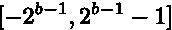

其中 *b* 是比特数*。*输入范围之外的值被剪切到最近的界限。在我们的例子中，变换后的范围是[-128，127]，为了对称，我们将使用[-127，127]。

均匀量化通过两个函数完成:

1.  **量化-** 将 float32 值映射到 int8 范围，然后进行舍入和限幅(float32 → int8)
2.  **反量化—** 将 int32 值映射到 float32

假设我们想要最小化运算的数量，我们将使用**比例量化**来实现这些运算。

在标度量化中，输入范围为 *x ∈ [-α，α]，*并且校准最大α值(amax)以最大化精度。校准α后，通过乘以/除以比例因子 ***s*** 进行映射。


比例因子计算，其中α最大值(a max)在校准期间计算，b=8 位。

对于比例量化，我们的操作定义如下:

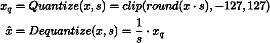

**张量量化粒度**

张量粒度指的是共享量化参数(例如，比例因子)。在精度和计算成本之间存在权衡，其中用不同的比例因子缩放每个张量元素将导致最高的精度和计算成本，相反，用单个因子缩放整个张量导致最低的精度和计算成本。

**线性层量化**

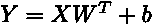

PyTorch 中实现的线性层，X 是 NxK 输入张量，W 是 MxK 权重张量，b 是 M 长度偏移向量，Y 是 NxM 输出张量。

我们用每个张量的粒度来量化层输入(所有张量元素共享相同的比例因子)。相比之下，层的权重以每行粒度进行量化(每行有不同的比例因子)。这种选择允许分解比例因子，并执行整数的矩阵乘法。

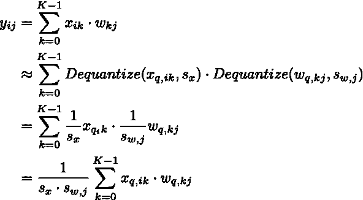

通过将一个向量连接到输入并向图层权重添加另一个维度，可以轻松实现偏差量化。

**卷积层量化**

与线性情况一样，我们可以从分解比例因子中获得计算上的好处。这是通过为层输入选择每张量粒度和为层权重选择每通道粒度来实现的。

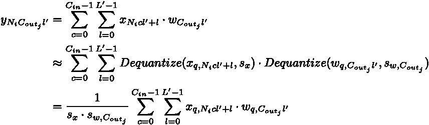

在 PyTorch 的实现之后，输入张量 *X* 具有维度 *N，C_in，L* ，输出张量 *Y* 具有维度 *N，C_out，L_prime* ，然后是具有步长 1、膨胀 1 和**无**填充的 1D 卷积。

# 训练后量化

在训练后量化中，我们通过构建绝对值的直方图(一个用于层输入，一个用于参数)来校准每个模型层的比例因子。推理在图层输入的样本数据集上运行，而图层参数校准可以离线完成。

## 校准

校准部分选择量化精度损失最小的α。有三种主要方法来为每个直方图选择合适的α:

1.  最大值—使用绝对值分布的最大值进行校准
2.  熵——最小化量化分布和原始分布之间的 KL 散度
3.  百分点-选择与绝对值分布的第 k 个百分点相对应的条柱

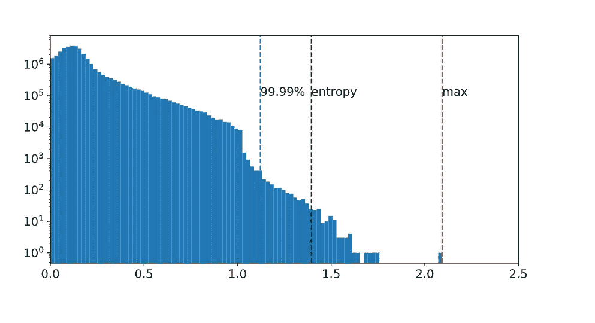

ResNet 50 第三层输入和校准范围的绝对值直方图。图片摘自(郝等 2020) [2]

一旦校准完成，我们可以在推理中构建一个量化的线性层。

# 纯整数推理

到目前为止，我们讨论了用于执行线性运算的量化，例如卷积和整数的矩阵乘法。另一方面，非线性激活不适合均匀量化，应该近似。非线性函数可以用查找表、分段函数和其他方法来近似，这些方法值得专门撰写一篇文章。相反，我们将不讨论非线性近似，而是使用 ReLU 激活函数，因为它**不需要近似。**

然而，我们仍然将 float32 作为*量化/去量化*操作的输入/输出。当我们在*量化* / *去量化*操作期间用比例因子乘/除数值时，我们**无法**避免处理分数。为了处理这种整数运算，我们将使用定点表示法。

## 定点表示法

定点表示法是一种用整数表示分数的方法。我们可以拆分组成整数的 K 位来表示一个数的整数部分和小数部分。使用符号幅度格式，我们保留 1 位表示符号，其他位表示分数。基数将剩余的 *K-1* 位拆分为代表整数值的 *M* 个最高有效位(MSB)和代表分数的 *N* 个最低有效位(LSB)。 *M* 和 *N* 的选择导致表示范围和精度之间的折衷。

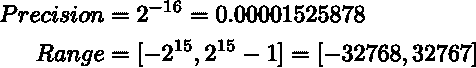

32 位有符号整数的定点 16 位表示形式。16 LSB 表示小数，15 MSB 表示整数。

浮点和它的定点表示之间的转换是通过乘以/除以 2 的定点值的幂来完成的。

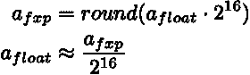

浮点数与其定点 16 位表示形式之间的转换。

## 定点算法

定点运算的三条经验法则:

1.  两个定点数之和就是定点数。

2.整数与定点数的乘积就是定点数。

3.两个定点数的乘积**除以 2 的定点数的幂**就是一个定点数。

定点表示用整数代替剩余的浮点运算。

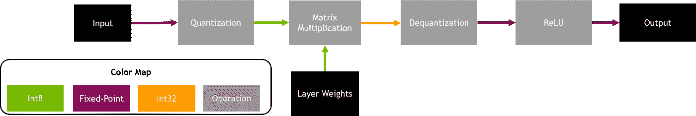

具有量化图层输入和权重的纯整数线性图层的方案

# 教程—针对 MNIST 分类的纯整数 C 推理

我们将在 PyTorch 的 MNIST 数据集上训练一个简单的分类器。接下来，我们将网络参数量化为 int8，并校准其比例因子。最后，我们将用原生 c 语言编写一个纯整数的推理代码。

## Python 中的模型训练和量化

**模型** —一个多层感知器(MLP)，具有两个隐藏层(分别为 128、64)，并在 MNIST 数据集上进行 ReLU 训练。MLP 不包含使模型参数和计算开销最小化的偏差。

让我们在 PyTorch 中定义一个简单的 MLP 模型。

并训练它十个纪元

```
Epoch: 1 — train loss: 0.35650 validation loss: 0.20097
Epoch: 2 — train loss: 0.14854 validation loss: 0.13693
Epoch: 3 — train loss: 0.10302 validation loss: 0.11963
Epoch: 4 — train loss: 0.07892 validation loss: 0.11841
Epoch: 5 — train loss: 0.06072 validation loss: 0.09850
Epoch: 6 — train loss: 0.04874 validation loss: 0.09466
Epoch: 7 — train loss: 0.04126 validation loss: 0.09458
Epoch: 8 — train loss: 0.03457 validation loss: 0.10938
Epoch: 9 — train loss: 0.02713 validation loss: 0.09077
Epoch: 10 — train loss: 0.02135 validation loss: 0.09448
Evaluate model on test data
Accuracy: 97.450%
```

**模型量化—** TensorRT 是一款用于高性能深度学习推理的 SDK。它包含 pytorch-quantization，允许 pytorch 模型的直接量化(假的，量化感知训练，PTQ)。

让我们从导入相关模块开始。

*   `quant_nn`包含 PyTorch 层的量化版本，如 nn.Linear。
*   `calib`是用于构建直方图和计算比例因子的校准模块。
*   `quant_modules`允许用量化版本动态替换 PyTorch 层。
*   `QuantDescriptor`定义如何量化张量。

第一步是使用直方图校准器定义量化。然后，我们用期望的量化描述来设置我们的量化线性层。最后，通过调用 *initialize()，用量化版本为 PyTorch 模块打补丁。*

我们只在定义量化方案和猴子修补 PyTorch 模块之后加载训练好的 MLP 模型**。**

让我们定义一个函数，在推断过程中输入用于校准的统计数据。首先，我们禁用量化来从浮点值构建直方图。然后，我们执行推理，并在我们希望使用量化模型进行推理的情况下重新启用量化。

现在让我们定义一个函数来计算 amax 值(比例因子= 127 / amax)。

为了减少推理时的运算次数，我们离线计算比例因子值。为了避免定点除法，我们可以将它们反转，并在 c 中乘以反转后的值。

*可以将* ***反量化*** *比例因子组合成一个变量。尽管如此，它可能会降低精度，因为对于定点 16，结果数可能非常小(参见教程中的* ***反量化*** *部分的示例)。*

一旦我们定义了函数，我们就可以运行代码了。

## 本机 C 代码中的模型推理

实施 MLP 模型需要定义:

1.  矩阵乘法
2.  定点乘法
3.  数字转换
4.  去量化
5.  热卢
6.  argmax(代替 softmax 进行推理)
7.  线性层

假设神经网络的架构和参数是预先确定的，并且我们不能使用动态分配，我们将不定义矩阵和张量的一般结构。相反，在本教程中，我们将把矩阵/张量视为展平的 1D 阵列，并使用它们的形状来应用运算。

**矩阵乘法**

我们在两个平坦的 int8 矩阵之间执行矩阵乘法。为了避免溢出，结果存储在一个比 int8 大的整数中。

Y = XW，其中 X 是 NxK 矩阵，W 是 KxM 矩阵，结果 Y 是 NxM 矩阵。乘法和累加运算以大整数类型存储，以避免溢出

**定点乘法**

两个定点 16 数之间的简单乘法如下所示:

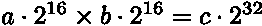

因此，我们需要将结果除以 2 的 16 次方。

在 C 中，左移运算符可以看作是乘以 2 的幂，而右移运算符可以看作是除以 2 的幂。我们可以在 C 中定义一个定点乘法函数，其中两个输入都用相同的定点值表示，如下所示:

当乘以定点值时有两个主要问题

1.  舍入
2.  泛滥

**舍入—** 默认情况下，使用左移和右移的乘法/除法会导致截断(地板)。一种简单的舍入方法是通过 round half up 方法舍入到最接近的整数。

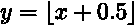

带舍入的定点乘法如下所示:

采用四舍五入法的定点乘法。

**溢出—** 很直观的看到，两个大定点数的乘积在右移之前很容易溢出。一个简单的解决方案是将值存储在更大的类型中(如 int64)，但在某些情况下，定点数已经用最大的可用类型表示了。一种替代方法是按部分执行定点乘法。这意味着我们在两个整数的乘积不会溢出的假设下，将定点数分成一个整数和一个小数部分。

部分乘的定点乘法实现如下所示:

既然我们已经讨论了定点乘法，我们可以编写量化函数了。

**量化**

量化函数将两个定点数、层的输入和比例因子相乘，然后裁剪到 int8 范围[-127，127]。在执行定点乘法之前，我们通过将输入与反转比例因子的乘积和我们的限幅范围的边界进行比较来降低溢出的风险。与标准的定点乘法相反，在量化中，我们希望乘积是一个四舍五入的整数。因此，我们不会将输出转换为定点。

定点量化函数的实现。FXP 值= 16，INT8 最大值= 127，舍入常量= (1 << FXP 值— 1)。注意——我们不像在定点乘法实现中那样右移最终值，因为(input*scale_factor)的定点表示代表一个四舍五入的整数。

**反量化**

反量化操作需要将一个整数(矩阵与 int8 相乘的乘积)与图层输入(标量)和图层权重(按每行粒度量化的向量)的反向比例因子相乘。这意味着我们需要混合常规和定点乘法。一般来说，整数和定点数相乘有很高的溢出风险。另一方面，当定点数表示小分数时(在我们的例子中确实如此)，将它们相乘会导致精度损失。当他们右移前的乘积可能小于我们右移的值时，就会出现这种情况。因此，它们的输出会被错误地归零。
为了说明这一点，在下面的例子中，我们用两个整数乘以不同大小的值:50，500。我们比较右移前或右移后的乘法。

```
a: 0.001000 b: 0.000400 int: 50, c_before: 1 c_after: 0
a: 0.001000 b: 0.000400 int: 500, c_before: 13 c_after: 0
a: 0.100000 b: 0.000400 int: 50, c_before: 130 c_after: 150
a: 0.100000 b: 0.000400 int: 500, c_before: 1300 c_after: 1500
a: 0.001000 b: 0.400000 int: 50, c_before: 1300 c_after: 1300
a: 0.001000 b: 0.400000 int: 500, c_before: 13000 c_after: 13000
a: 0.100000 b: 0.400000 int: 50, c_before: -14 c_after: 131050
a: 0.100000 b: 0.400000 int: 500, c_before: -140 c_after: 1310500
```

我们可以看到，对于小的 *a* 和 *b* 值，我们受益于右移前的乘法，但当它们的值较大时，我们会溢出。另一方面，当我们在(精度损失)之后乘时，我们得到稍微不同的结果。最后，只有当 *a=0.001* 和 *b=0.4* 时，两种方法才输出相同的结果。

一个简单的解决方案是计算比例因子的乘积，并将其与 1(定点)进行比较。当它们大于 1 时，我们有过度拟合的风险，我们应该在定点乘法后乘以矩阵值。否则，我们在定点乘法中乘以矩阵值。

最后，我们将反量化定义为:

**ReLU**

ReLU 的 C 实现很简单

**argmax**

我们通过 NxM 矩阵的列来计算 argmax(其中 N 是批次大小，M 是标签的数量)。

**线性图层**

线性层由所有先前定义的部分组成:

**MLP** —将几个线性图层组合在一起

对于本教程，模型参数和比例因子编码在一个头文件中，并且使用 C 类型从 python 调用 *run_mlp* 函数。

## 模型评估

```
Evaluating integer-only C model on test dataAccuracy: 97.27%
```

这比 python 中的浮点模型少了 0.18%。

# 结论

在本文中，我们讨论了训练后量化、定点表示，以及如何使用 PyTorch 中完全精确训练的分类器在本机 C 中运行纯整数推理。

完整的代码，包括卷积神经网络版本，请访问 Github 知识库:[https://Github . com/benja 263/Integer-Only-Inference-for-Deep-Learning-in-Native-C](https://github.com/benja263/Integer-Only-Inference-for-Deep-Learning-in-Native-C)

感谢您的阅读！

# 参考

[1] Tessler，c .，Shpigelman，y .，Dalal，g .，Mandelbaum，a .，卡萨科夫，D. H .，Fuhrer，b .，Chechik，g .，和 Mannor，S. (2021)。*数据中心拥塞控制的强化学习*。【http://arxiv.org/abs/2102.09337 

[2]吴，h .，贾德，p .，张，x .，伊塞耶夫，m .，&米契克维丘斯，P. (2020)。*深度学习推理的整数量化:原理与实证评估*。[http://arxiv.org/abs/2004.09602](/<div class="csl-entry">Wu, H., Judd, P., Zhang, X., Isaev, M., &#38;%20Micikevicius,%20P.%20(2020).%20%3Ci%3EInteger%20Quantization%20for%20Deep%20Learning%20Inference:%20Principles%20and%20Empirical%20Evaluation%3C/i%3E.%20http://arxiv.org/abs/2004.09602%3C/div%3E)