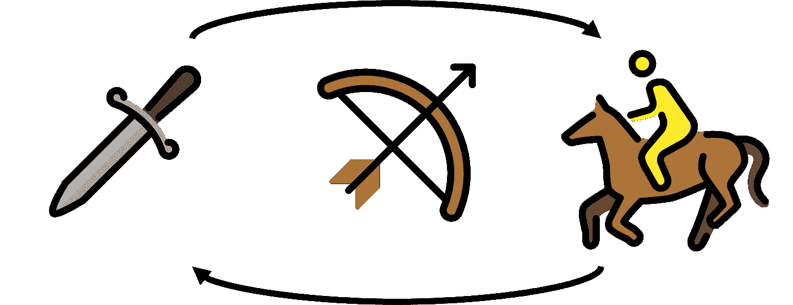
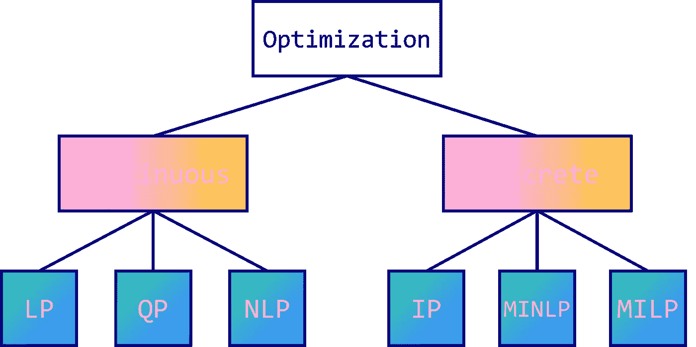
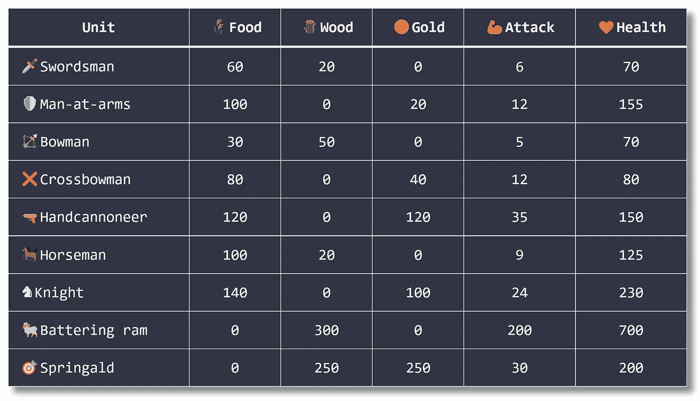
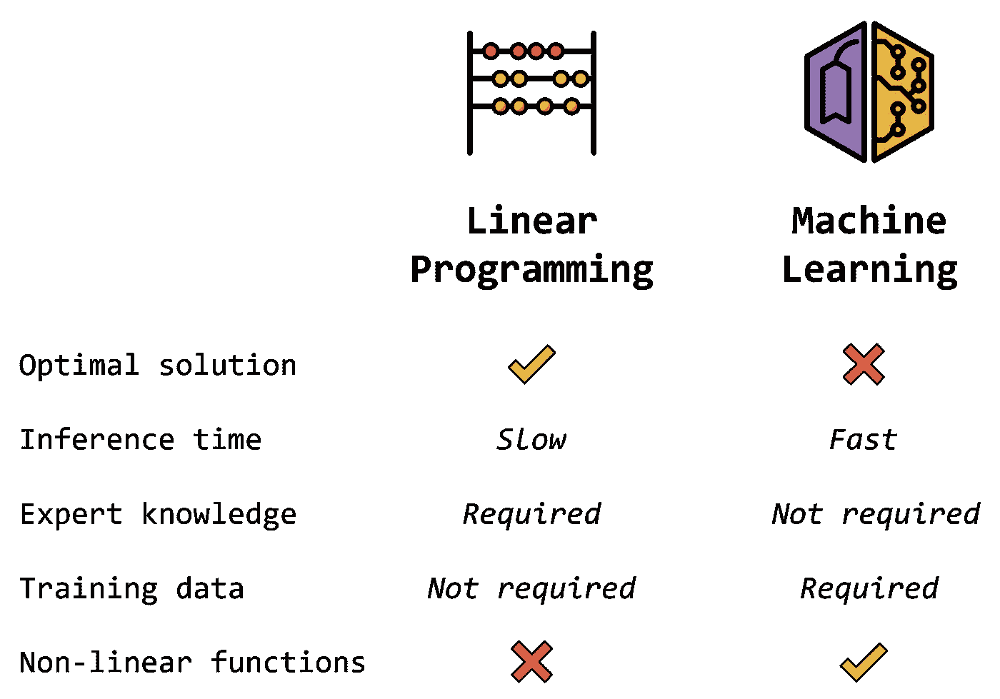

# Python 中整数与线性编程的比较

> 原文：<https://towardsdatascience.com/integer-programming-vs-linear-programming-in-python-f1be5bb4e60e>

## 使用 Google OR-Tools 优化混合整数规划


图片由作者提供，表情符号由[open moji](https://openmoji.org/)([CC BY-SA 4.0](https://creativecommons.org/licenses/by-sa/4.0/#))

为什么**线性规划**这么叫？

这两个术语都令人困惑:

*   **线性**暗示**非线性**编程存在；
*   **编程**实际上在这个上下文中的意思是“**策划**”。

综上，与代码无关:线性与否。是关于**用各种约束优化**变量。

在本文中，我们将讨论另一种类型的优化:**整数编程**。我们将会看到为什么对我们所面临的问题有一个很好的理解对于选择正确的解算器是必要的。最后，我们将编写一个能够接受更大挑战的模型，并实际解决一整类优化问题。

你可以用下面的 [**Google Colab 笔记本**](https://colab.research.google.com/drive/1aIKnXPEiXFo1M3U0EM6arE2teD9KkJdF?usp=sharing) 运行本教程的代码。



图片由作者提供，表情符号由[open moji](https://openmoji.org/)([CC BY-SA 4.0](https://creativecommons.org/licenses/by-sa/4.0/#))

# 📊一、优化问题类型

在[线性规划介绍](/introduction-to-linear-programming-in-python-9261e7eb44b)中，我们**优化了一个军队构成**。结果如下:

```
================= Solution =================
Solved in 87.00 milliseconds in 2 iterations

**Optimal power** = 1800.0 💪power
Army:
 - 🗡️**Swordsmen** = 6.0000000000000036
 - 🏹**Bowmen** = 0.0
 - 🐎**Horsemen** = 5.999999999999999
```

怎么会有 5.999……骑兵？我们指定我们的变量**应该是带有`VarInt`的整数**。我们的代码有什么问题？

问题不在于模型，而在于求解者的选择。

GLOP 是一个[纯线性规划求解器](https://en.wikipedia.org/wiki/GLOP)。这意味着它**无法理解整数**的概念。它仅限于具有线性关系的连续参数。

这就是**线性**编程(LP)和**整数线性**编程(ILP)的区别。总之，LP 求解器只能使用实数而不能使用整数作为变量。如果不考虑变量，为什么我们把变量声明为整数呢？

GLOP 不能解决 ILP 问题，但是其他解决者可以。其实他们很多都是**混合整数线性规划** (MILP，俗称 MIP)求解器。这意味着他们既可以考虑**连续的**(实数)，也可以考虑**离散的**(整数)变量。离散值的一个特殊情况是布尔变量用 0-1 值来表示决策。

其他解算器如 SCIP 或 [CBC](https://projects.coin-or.org/Cbc) 可以解决 **MILP 和**(混合整数*非线性*规划)问题。多亏了 OR-Tools，我们可以使用相同的模型，只需将求解器更改为 SCIP 或 CBC。

```
================= Solution =================
Solved in 3.00 milliseconds in 0 iterations**Optimal value** = 1800.0 💪power
Army: 
 — 🗡️**Swordsmen** = 6.0
 — 🏹**Bowmen** = 0.0
 — 🐎**Horsemen** = 6.0
```

严格地说，我们的变量仍然是浮点数(`type(swordsmen.solution_value()) = float`)，但是我们可以看到它们不再有奇怪的小数:CBC 求解器实际上认为它们是整数**。**

**在本例中，我们通常只需**将这些值**向上取整，因为误差很小。然而，重要的是要记住根据所研究的问题选择合适的求解器:**

*   ****LP** 为连续变量；**
*   ****连续和离散变量组合的 MIP/MILP** 。**

**还有其他类型，如**二次** (QP)或**非线性** (NLP 或 MINLP，例如具有指数目标函数或约束)问题。它们适用于不同的环境，但遵循与 LP 或 MIP 解算器相同的原则。**

****

**作者图片**

# **🧱二世。建立一个通用模型**

**但是如果我们的**资源发生变化**呢？还是一个单位的成本进化了？如果我们升级了骑士，他们的力量增加了呢？**

**OR-Tools 最好的好处之一是它使用了 Python 这样的通用编程语言。代替静态数字，我们可以将我们的参数存储在类似于**字典**或**列表**的对象中。**

**代码不那么可读，但它变得更加灵活:实际上，它非常灵活，我们可以在不改变模型(只是参数)的情况下解决一整类优化问题。**

**让我们将输入参数转换成 Python 列表，并通过函数将它们提供给求解器。**

```
================= Solution =================
Solved in 2.00 milliseconds in 0 iterations**Optimal value** = 1800.0 💪power 
Army:
 — 🗡️**Swordsmen** = 6.0
 — 🏹**Bowmen** = 0.0
 — 🐎**Horsemen** = 6.0
```

**我们获得了相同的结果:我们的代码似乎工作正常。现在让我们**改变参数**来解决一个稍微复杂一点的问题。**

**想象我们有更多的资源:🌾183000 ，🪵 **90512** ，🪙 **80150** ，所以我们还可以生产更多的单位！这是新的表格:**

****

**请注意，我们转换了💪**功率**分为两个值:💪**攻击**和❤️ **生命值**，后者更详细一点。生命值高于攻击值，这就是为什么我们要增加一个加权因子，让它们更有可比性。**

**我们以 10 为例，那么*力量= 10 *攻击+生命值*。我们的目标函数变成了:**

****

**让我们的代码适应这个新问题实际上很简单:我们只需要**改变输入参数**并更新**目标函数**。**

```
================= Solution =================
Solved in 74.00 milliseconds in 412 iterations**Optimal value** = 1393145.0 💪power
Army:
 — 🗡️**Swordsmen** = 2.0
 — 🛡️**Men-at-arms** = 1283.0
 — 🏹**Bowmen** = 3.0
 — ❌**Crossbowmen** = 0.0
 — 🔫**Handcannoneers** = 454.0
 — 🐎**Horsemen** = 0.0
 — ♞**Knights** = 0.0
 — 🐏**Battering rams** = 301.0
 — 🎯**Springalds** = 0.0
 — 🪨**Mangonels** = 0.0
```

**这个问题需要人类花很长时间来解决，但是 ILP 解决者在眨眼之间就解决了。比这更好的是:它也给了我们保证**我们的解决方案是最优的**，这意味着我们的敌人无法以同样的成本找到更好的军队构成！**

**我们可以增加单元的数量，并提供数十亿的资源，但你会明白:这只是需要更长的时间来获得一个解决方案，但它不会改变问题。**

# **⚔️三世。组合约束**

**现在，假设我们侦察了我们的敌人，知道他们的军队有一支💪**100 万**的功率。我们可以建立一支更好的军队，但是我们的资源很宝贵，而且效率不高:我们所要做的就是建立一支拥有**的军队💪功率高于 1，000，000** (即使 1，000，001 也足够)。**

**换言之，总功率现在是一个**约束**(💪> 1，000，000)而不是目标最大化。新的目标是最大限度地减少生产这支军队所需的资源。然而，我们可以重用我们的输入参数，因为它们没有改变。**

**新的约束可以翻译为“所选单元的功率之和必须严格大于 1，000，000”。**

****

**在代码中，我们可以遍历我们的单元和资源来设计这个约束。**

**目标函数也必须改变。我们的目标是将花费在建军上的资源最少化。**

****

**同样，我们可以循环使用我们的资源，在 OR-Tools 中实现它。**

```
================= Solution =================
Solved in 4.00 milliseconds in 0 iterations**Optimal value** = 111300.0 🌾🪵🪙resources
**Power** = 💪1001700.0 
Army:
 — 🗡️**Swordsmen** = 0.0
 — 🛡️**Men-at-arms** = 0.0
 — 🏹**Bowmen** = 0.0
 — ❌**Crossbowmen** = 0.0
 — 🔫**Handcannoneers** = 0.0
 — 🐎**Horsemen** = 0.0
 — ♞**Knights** = 0.0
 — 🐏**Battering rams** = 371.0
 — 🎯**Springalds** = 0.0
 — 🪨**Mangonels** = 0.0Resources:
 — 🌾**Food** = 0.0
 — 🪵**Wood** = 111300.0
 — 🪙**Gold** = 0.0
```

**规划求解找到了一个最优解:我们需要建造 371🐏攻城槌总共花费 111300 🪵wood.等等，如果我们没有那么多木头怎么办？在上一节中，我们只有🪵90512:，我们无法生产 371🐏攻城锤。😱**

**那么有没有可能将这些**有限的资源**考虑在内，同时仍然努力**打造最好的军队**？实际上，这非常简单:我们只需要复制/粘贴上一节中的约束。**

**在这个版本中，我们有两种类型的约束:**

*   **总功率必须大于 100 万；**
*   **我们不能花费超过我们有限的资源。**

```
================= Solution =================
Solved in 28.00 milliseconds in 1 iterations**Optimal value** = 172100.0 🌾🪵🪙resources
**Power** = 💪1000105.0
Army:
 — 🗡️**Swordsmen** = 1.0
 — 🛡️**Men-at-arms** = 681.0
 — 🏹**Bowmen** = 0.0
 — ❌**Crossbowmen** = 0.0
 — 🔫**Handcannoneers** = 0.0
 — 🐎**Horsemen** = 0.0
 — ♞**Knights** = 0.0
 — 🐏**Battering rams** = 301.0
 — 🎯**Springalds** = 0.0
 — 🪨**Mangonels** = 0.0 Resources:
 — 🌾**Food** = 68160.0
 — 🪵**Wood** = 90320.0
 — 🪙**Gold** = 13620.0
```

**既然我们现在有一个**🪵wood**的有限资源，数量🐏攻城锤可悲的从 371 降到了 301。作为交换，我们得到了 681 个🛡️men-at-arms，失去了 1 个🗡️swordsman(欢迎他们)。**

**军队的总花费是 **172，100** ，这比我们之前发现的 111，300 要高得多(+65%的增长)，但是在这些限制下这确实是最优的解决方案。这表明我们应该生产更多的木材，因为这些🐏攻城锤性价比极高！**

**这个例子向**展示了** LP 模型的模块化程度。可以在另一个模型中重用部分代码，比如约束，以组合它们并解决更复杂的问题。**

# **🧠四世。线性规划 vs 机器学习**

**让我们来谈谈房间里的大象。为什么不用**机器学习**(广义)代替线性规划？这并不是说这个问题不能用遗传算法来解决。**

**数学优化往往被机器学习技术所忽视，但两者都有其优点:**

*   **线性规划可以在不确定的时间内(可能需要数年)产生一个**最优解**，而机器学习可以在任何时间内逼近复杂函数。**
*   **LP 里没有**训练**，但是需要专家建立数学模型。机器学习需要数据，但模型可以用作黑盒来解决问题。**
*   **根据经验，没有特定时间约束**和/或不是非常复杂的问题可以有利地用线性规划来解决。****

****

**图片由作者提供，表情符号由[open moji](https://openmoji.org/)([CC BY-SA 4.0](https://creativecommons.org/licenses/by-sa/4.0/#))**

# **结论**

**在本教程中，我们深入了解了数学优化。**

*   **我们讲了最优化问题的求解器和类型: **LP，MIP，NLP**；**
*   **我们以最佳方式建模并解决了一个极其常见的优化问题，并且**通过一个函数推广了我们的模型**；**
*   **我们重新架构了这个问题，**合并了两组约束**，以最低的价格获得最佳的军队构成；**
*   **我们对比了线性编程和机器学习的**利弊**。**

**还有很多可以应用优化的问题。例如，如何创建满足每个人要求的学校时间表？如何在最短的时间内交付 1000 份不同的订单？在哪里建造一条新的地铁线以最大化其效用？**

**在以后的文章中，我们将讨论这些技术的新型应用，包括可满足性和非线性问题。**

**我希望你喜欢这篇更高级的文章。如果你喜欢机器学习和优化， [**我们在 Twitter 上联系一下**](https://twitter.com/maximelabonne) ！**

# **相关文章**

**</constraint-programming-67ac16fa0c81>  </introduction-to-linear-programming-in-python-9261e7eb44b> **