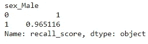
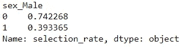
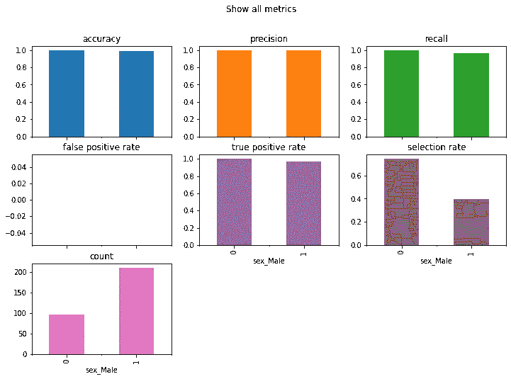
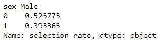

# 在您的数据科学技能组合中集成偏差检测

> 原文：<https://towardsdatascience.com/integrate-bias-detection-in-your-data-science-skill-set-982a699653f2>

## 不要忘记偏见会影响你的项目


克里斯蒂安·卢在 [Unsplash](https://unsplash.com?utm_source=medium&utm_medium=referral) 上的照片

当我们在数据科学世界中谈论偏差时，它会指机器学习在学习输入数据时出现错误，无法客观地给出预测。如果我们打一个人类的比方，机器学习中的偏见可能意味着该模型偏爱特定的预测/条件。为什么我们需要关注偏见？

模型偏差是我们的数据科学项目中的一个潜在问题，因为输入数据和输出数据之间的关系不能反映真实世界的情况，这可能会在多个层面上导致问题，包括法律问题。

机器学习模型中的偏差是不可接受的，但它仍在发生。有偏见产生灾难性结果和挫折的例子；比如[皂液机只给白人的手配](https://metro.co.uk/2017/07/13/racist-soap-dispensers-dont-work-for-black-people-6775909/)或者[自动驾驶汽车更有可能撞到黑人](https://www.independent.co.uk/tech/self-driving-car-crash-racial-bias-black-people-study-a8810031.html)的情况。这就是为什么进行了大量的研究来检测和减轻偏见。

避免偏差的机器学习研究仍然是数据科学中的一个大问题，如何完全检测偏差仍然是一个大问题。然而，与过去相比，我们已经取得了很大进步。本文将讨论为什么我们的机器学习模型会引入偏差以及检测偏差的一些方法。

事不宜迟，我们开始吧。

# **为什么机器学习会有偏差？**

机器学习模型是一种从我们的数据中学习的工具。这意味着我们的数据是我们的模型中为什么会出现偏差的主要来源。然而，我们需要更深入地了解为什么数据(以及 ML 模型)可能包含偏差。

准确地说，我们需要知道偏差是如何在建模过程的每个阶段发生的。如果我们划分阶段，我们数据中的偏差可能出现在以下阶段:

1.  收藏品
2.  预处理
3.  特征工程
4.  剧烈的
5.  模特培训
6.  估价

让我们简单了解一下为什么每个阶段都会引入偏差。

## 数据收集

数据是机器学习模型的核心，我们通过收集数据来获取数据。然而，当我们的数据收集充满偏见的假设时，偏见问题可能会出现。偏见可能早在数据收集阶段就出现了。

当我们收集数据时错误地关注趋势，或者当特征收集不符合业务问题时，可能会发生错误。这就是为什么我们必须完全理解数据需求，并与业务专家合作。

例如，当团队想要建立一个机器学习项目来评估信用卡可信度时，可能会出现数据收集偏差。然而，数据收集可能包括种族特征，并反映历史数据中的社会偏见。如果我们在机器学习训练中隐式使用这些数据，这可能会导致灾难性的后果。

## 数据预处理

在数据收集发生后，我们需要对数据进行预处理；具体来说，我们做数据预处理来检查和清理数据，以适应数据科学项目。然而，在这个阶段可能会出现偏差，因为我们缺乏业务理解或适当的领域理解。

比如我们有一个全公司的薪资数据集，这个数据中出现了缺失数据。我们从工资中进行平均插补，以填补缺失的数据。你认为这些数据会发生什么？当我们用平均工资填充缺失的数据，而没有检查工资与其他特征的关系时，这将引入偏差。

上面的例子会导致不一致偏差，因为我们取了公司每个员工的工资并进行平均。有些工资肯定会高一些，有些会低一些——这取决于水平和经验。

我们需要理解数据集，并在清理数据时使用正确的策略来最小化预处理偏差。

## **特色工程**

在预处理步骤之后，我们对数据集进行特征工程。这一步将数据转换为机器学习模型可消化的形式，并产生可能有助于模型更好地预测的特征。然而，特征工程也可能引入偏差。

如果特征工程是基于社会经济、性别、种族等。，如果我们处理不好，这些功能可能会引入偏见。从有偏差的代表的集成创建的特征可能偏向特定的段。

特征之间的不同尺度也可能从统计角度呈现偏差。想象一个特色工资和工作年限；它们的规模非常不同，可能需要标准化——否则，我们的机器学习模型就会出现偏差。

我们的特征工程中的选择包括、删除、标准化、聚合等。，可能会影响我们机器学习模型中的偏差。这就是为什么我们需要在任何特征工程之前理解数据。

## 数据分割

如果拆分不能反映真实世界的人口，数据拆分可能会给训练数据带来偏差。当我们在拆分过程中没有进行随机选择时，这种情况经常发生。例如，我们选择了前 70%的数据用于训练，但不知不觉地，底部的数据包含了选择没有捕捉到的变化。这在不知不觉中给训练数据带来了偏差。

为了避免数据分割中的偏差，尝试使用随机抽样方法，如分层抽样或 K 倍交叉验证。这些技术将确保我们分离的数据是随机的，并使偏差最小化。

## **模特培训**

当模型的输出通常远离实际情况时，模型训练中就会出现偏差。可以证明，当模型在训练数据中产生高度量，但不能在测试数据中重复时，存在偏差。在我们的机器学习模型中，模型选择对于最小化偏差是至关重要的。

我们需要了解我们的数据和模型算法，以避免我们的机器学习模型中的偏差。不是每个算法都适合所有数据集。当您有线性数据时，您可能希望使用线性模型；但也许对于另一个数据集，它需要一个神经网络模型。了解每个项目需要什么模型来减少偏差。

## **车型评测**

最后，如果我们没有使用适当的度量标准来测量，并且没有使用看不见的数据来验证模型，则模型评估可能包括机器学习模型中的偏差。

了解指标(例如，精确度、召回率、准确度、RMSE 等。)才能知道哪个适合你的用例。例如，不平衡的情况可能不适合使用准确性作为度量标准，因为大多数预测只关注一个类。

# 如何用 Python 检测偏差

正如我提到的，在我们的机器学习项目中，已经做了很多研究来帮助检测和减轻偏见。在本文中，我们将使用名为 [Fairlearn](https://fairlearn.org/) 的开源 Python 包来帮助检测偏见。还开发了各种 Python 包来包含我们可以使用的偏差检测技术，但我们将重点关注 Fairlearn。

请注意，该软件包有助于在模型训练和评估期间检测偏差。在此阶段之前，我们需要根据我们的领域、业务和统计知识来检测偏差。

对于项目示例，我将使用 UCI 的[心脏病预测数据集](https://archive.ics.uci.edu/ml/datasets/Heart+Disease) (License: CC BY 4.0)。在这个例子中，我们将使用各种函数来检测偏差，并根据我们拥有的特征来减轻偏差。

如果您还没有安装 Fairlearn 包，您可以用下面的代码来完成。

```
pip install fairlearn
```

为了开始分析，让我们开始导入包函数并加载数据集。

```
import pandas as pd
import numpy as np
from sklearn.model_selection import train_test_split
from sklearn.metrics import accuracy_score, precision_score, recall_score
from lightgbm import LGBMClassifier
from fairlearn.metrics import (
    MetricFrame,
    false_positive_rate,
    true_positive_rate,
    selection_rate,
    count
)
from fairlearn.reductions import ExponentiatedGradient, DemographicParitydf = pd.read_csv('HeartDisease.csv')
```

然后，我们将使用数据集加载对数据集进行预处理，这样数据就可以供模型学习了。

```
#One-Hot Encode the categorical features
df = pd.get_dummies(df, columns = ['sex', 'chest_pain_type', 'fasting_blood_sugar', 'rest_ecg','exercise_induced_angina', 'slope', 'vessels_colored_by_flourosopy', 'thalassemia'],drop_first = True )
```

当数据准备好时，我们将把数据集分成训练和测试。

```
X_train, X_test, y_train, y_test = train_test_split(df.drop('target', axis = 1), df['target'], train_size = 0.7, random_state = 42,stratify = df['target'] )
```

接下来，我们将训练一个分类器预测。

```
clf = LGBMClassifier()
clf.fit(X_train, y_train)
```

分类器准备就绪后，我们将使用模型来检测预测中的偏差。首先，我们需要指定我们建立的敏感特性。敏感特征可以是我们认为敏感的任何东西，可能是因为隐私(例如，性别、婚姻状况、收入、年龄、种族等。)或者别的。关键是我们想避免敏感特征在预测中的偏差。

在这种情况下，我会将敏感特性设置为性别。因为我们已经创建了一个 OHE 特征，所以性别在性别 _ 男性(男性)中是特定的。

```
sensitive_feat = X_test['sex_Male']
```

然后，我们将使用测试数据从我们的分类器准备预测结果。

```
y_pred = clf.predict(X_test)
```

接下来，我们将基于敏感特性来度量指标。例如，我想测量基于敏感特征的回忆分数的差异。

```
gm = MetricFrame(metrics=recall_score, y_true=y_test, y_pred=y_pred, sensitive_features=sensitive_feat)print(gm.by_group)
```



作者图片

在回忆分数上，性别、男性和女性之间似乎存在差异，男性的回忆分数略高。在这种情况下，我们可以看到基于回忆的偏见。

我们还可以看看另一个指标，比如选择率(标签为“1”的人口的百分比)。

```
sr = MetricFrame(metrics=selection_rate, y_true=y_test, y_pred=y_pred, sensitive_features=sensitive_feat)sr.by_group
```



作者图片

选择率显示，两种性别的预测 1 的人群都偏向于女性，所以存在偏倚。

我们可以使用下面的代码来创建所有指标的图表。

```
metrics = {
    'accuracy': accuracy_score,
    'precision': precision_score,
    'recall': recall_score,
    'false positive rate': false_positive_rate,
    'true positive rate': true_positive_rate,
    'selection rate': selection_rate,
    'count': count}
metric_frame = MetricFrame(metrics=metrics,
                           y_true=y_test,
                           y_pred=y_pred,
                           sensitive_features=sensitive_feat)
metric_frame.by_group.plot.bar(
    subplots=True,
    layout=[3, 3],
    legend=False,
    figsize=[12, 8],
    title="Show all metrics",
)
```



作者图片

从上面的图中，我们可以看到各种指标都略微偏向女性。

那么，如果我们想减轻模型中出现的偏差呢？Fairlearn 提供的选择很少，但让我们使用一种称为[人口统计均等](https://faculty.washington.edu/yenchic/short_note/note_fair_parity.pdf)的方法作为偏差约束，并使用[指数梯度](https://hunch.net/?p=286)算法来创建分类器。

```
np.random.seed(42)
constraint = DemographicParity()
clf = LGBMClassifier()
mitigator = ExponentiatedGradient(clf, constraint)
sensitive_feat = X_train['sex_Male']
mitigator.fit(X_train, y_train, sensitive_features=sensitive_feat)
```

然后，我们将使用我们的减轻分类器再次进行预测。

```
sensitive_feat = X_test['sex_Male']
y_pred_mitigated = mitigator.predict(X_test)sr_mitigated = MetricFrame(metrics=selection_rate, y_true=y_test, y_pred=y_pred_mitigated, sensitive_features=sensitive_feat)
print(sr_mitigated.by_group)
```



作者图片

选择率的百分比略有增加，比以前更接近了。通过这种方式，我们试图减少预测中的偏差。你可以用各种算法做更多的实验来减轻这种偏见。

# **结论**

机器学习中的偏差是指模型偏好某些预测/条件而非其他预测/条件。每个阶段的不同方面都可能导致偏差。从数据收集到模型评估，可能会出现偏差，我们需要非常了解我们的项目。

为了检测和减轻机器学习模型中的偏差，我们可以使用 Fairlearn Python 包。我们可以探索各种函数来检测偏差。

希望有帮助！

> *访问我的* [***社交媒体***](https://bio.link/cornelli)**进行更深入的交谈或有任何问题。**

> **如果您不是作为中等会员订阅，请考虑通过* [*我的推荐*](https://cornelliusyudhawijaya.medium.com/membership) *订阅。**