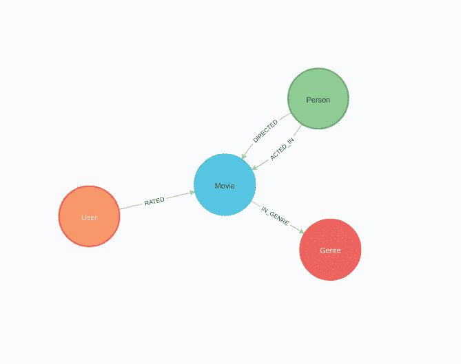
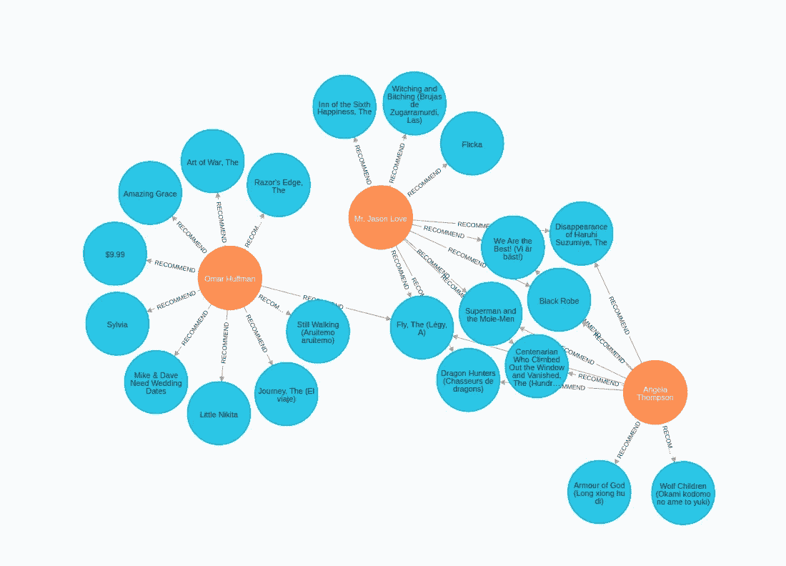

# 将 Neo4j 与 PyTorch Geometric 集成以创建推荐

> 原文：<https://towardsdatascience.com/integrate-neo4j-with-pytorch-geometric-to-create-recommendations-21b0b7bc9aa>

## 利用 PyTorch Geometric 的强大功能，为您的应用开发和训练自定义图形神经网络

自从我看到 PyTorch Geometric (pyG)宣布与斯坦福大学合作举办他们的[研讨会](https://snap.stanford.edu/graphlearning-workshop/)以来，我就一直想写关于 PyTorch Geometric 的文章。PyTorch Geometric (pyG)是一个建立在 PyTorch 基础上的库，可以帮助您轻松地为您的应用程序编写和训练自定义图形神经网络。在这篇博文中，我将展示如何从 Neo4j 获取数据，以 PyTorch Geometric 创建电影推荐。

我们将使用的图表是 MovieLens 数据集，它可以作为 [Neo4j 沙盒项目](https://sandbox.neo4j.com/?usecase=recommendations)方便地获得。之前不知道，pyG 中有一个[示例，它也使用 MovieLens 数据集来完成链接预测任务。用户和电影之间的链接是有评分的。然后，我们可以使用图形神经网络模型来预测用户可能对哪些未看过的电影评价较高，然后使用该信息来推荐它们。](https://github.com/pyg-team/pytorch_geometric/blob/master/examples/hetero/hetero_link_pred.py)

这篇文章的主要目的是向您展示如何将 Neo4j 图转换为异构 pyG 图。作为一个附带目标，我们还将使用[图形数据科学](https://neo4j.com/docs/graph-data-science/current/)库准备 Neo4j 中的一些节点特性，并将它们导出到 pyG。

## 议程

1.  开发电影嵌入，根据演员和导演捕捉电影相似性
2.  导出 Neo4j 图并构建一个异构 pyG 图
3.  在 pyG 中训练 GNN 模型
4.  创建预测，并选择性地将其存储回 Neo4j

和往常一样，如果你想了解这篇文章中的例子，我准备了一个 [Google Colab 笔记本](https://github.com/tomasonjo/blogs/blob/master/pyg2neo/Movie_recommendations.ipynb)。

## 开发电影嵌入，根据演员和导演捕捉电影相似性

首先，您需要在 Neo4j 沙箱中创建并打开[建议项目，该项目已经填充了 MovieLens 数据集。接下来，您需要在笔记本中定义 Neo4j 连接。](https://sandbox.neo4j.com/?usecase=recommendations)

您可以在沙盒界面的**连接详情**选项卡下找到凭证。


沙盒连接详细信息。图片由作者提供。

Neo4j 实例包含一个具有以下图表模式的图表。



MovieLens 图形架构。图片由作者提供。

pyG 中的链接预测示例使用标题的单词嵌入和流派的一键编码作为节点特征。为了让它更有趣一点，我们还将开发电影节点特性，封装演员和导演的相似性。我们可以，类似于流派，一次性编码演员和导演。但相反，我们将选择另一条路线，根据电影中出现的演员来捕捉电影的相似之处。在这个例子中，我们将使用 FastRP 嵌入模型来产生节点嵌入。如果你想了解更多关于 FastRP 算法的知识，我建议你去看看我的朋友 [CJ Sullivan](https://medium.com/u/a9bc11f7a61b?source=post_page-----21b0b7bc9aa--------------------------------) 写的[这篇优秀的文章](/behind-the-scenes-on-the-fast-random-projection-algorithm-for-generating-graph-embeddings-efb1db0895)。

FastRP 算法将只考虑电影和人物的二分网络，而忽略类型和分级。这样，我们可以确保只根据电影中出现的演员和导演来捕捉电影的相似性。首先，我们需要投影 GDS 内存图。

```
CALL gds.graph.create('movies', ['Movie', 'Person'],
  {ACTED_IN: {orientation:'UNDIRECTED'}, 
   DIRECTED: {orientation:'UNDIRECTED'}})
```

现在，我们可以继续在投影图上执行 FastRP 算法，并将结果存储回数据库。

```
CALL gds.fastRP.write('movies', 
  {writeProperty:'fastrp', embeddingDimension:56})
```

在执行 FastRP 算法之后，每个电影节点都有一个节点属性 **fastrp** ，它包含了基于当前演员和导演封装相似性的嵌入。

## 导出 Neo4j 图并构建一个异构 pyG 图

我从[这个例子](https://github.com/pyg-team/pytorch_geometric/blob/master/examples/hetero/load_csv.py)中获得了很多构建自定义异构 pyG 图的灵感。该示例从多个 CSV 文件创建一个 pyG 图。我简单地重写了示例，从 Neo4j 而不是 CSV 文件中获取数据。

从 Neo4j 检索数据时创建节点映射和特征的通用函数如下:

类似地，创建边索引和特征的函数是:

如上所述，代码几乎与 pyG 示例相同。我只是改变了熊猫数据帧是由从 Neo4j 中检索的数据而不是 CSV 文件构建的。在下一步，我们必须定义特征编码器，但我将在文章中跳过它们，因为它们与示例相同。但是，我显然已经将它们包含在 [Colab 笔记本](https://github.com/tomasonjo/blogs/blob/master/pyg2neo/Movie_recommendations.ipynb)中，所以如果你感兴趣，可以查看一下。

最后，我们可以从 Neo4j 获取数据，并构建用户映射和特性，它们将被用作 pyG 异构图的输入。我们将从构造用户节点输入开始。它们没有可用的节点特性，所以我们不需要包含任何编码器。

接下来，我们将构建电影的映射和特征。

对于电影，我们有几个节点特征。首先，序列编码器使用[句子转换器](https://www.sbert.net/)库根据标题产生单词嵌入。使用流派编码器对流派进行一次性编码，最后，我们简单地将 FastRP 嵌入转换成正确的结构，以便能够在 PyTorch Geometric 中使用它们。

在我们构建 pyG 图之前，我们必须获取关于收视率的信息，这些信息被表示为用户和电影之间的加权链接。

我们有我们需要的所有信息。现在，我们可以继续构建一个异构的 pyG 图。在异构图中，不同类型的节点包含不同的特征。

构建异构 pyG 图的过程似乎很简单。首先，我们定义每种节点类型的节点特性，然后添加这些节点之间的任何关系。记住，GNNs 要求所有节点都包含节点特性。这里有一个例子，说明对于没有预先存在的特性的用户节点可以做些什么。

与所有机器学习流程一样，我们必须执行训练/测试数据分割。pyG 库用 **RandomLinkSplit** 方法使这变得非常容易。

准备好 pyG 图。现在，我们可以继续定义我们的 GNN。我只是简单地从 pyG 示例中复制了定义，所以我不会在这里展示它，因为它是相同的。GNN 将预测用户对电影的评分在 0 到 5 之间。我们可以认为这是一个链接预测任务，我们预测用户和电影之间的新链接的关系属性。一旦我们定义了 GNN，我们就可以继续训练我们的模型。

由于数据集不是很大，训练模型应该不会花很长时间。如果可以的话，使用 Google Colab 环境下的 GPU 模式。

最后，我们将预测用户和电影之间的新链接，并将结果存储回 Neo4j。对于电影推荐，我们将只考虑预测评级等于 5.0 的链接，这是最高的可能评级。

我只为每个用户选择了前十个推荐，这样做很简单，不必将成千上万的关系导入 Neo4j。需要注意的一点是，我们不会在预测中过滤掉现有的链接或评级，所以我们会在导入到 Neo4j 数据库时跳过它们。让我们在**推荐**关系下将这些预测导入 Neo4j。

如果您打开 Neo4j 浏览器，您应该能够在数据库中看到新的**推荐**关系。



用户和高评分电影之间的预测链接，我们可以使用推荐。图片由作者提供。

## 结论

PyTorch Geometric 是一个强大的库，允许您开发和训练自定义图形神经网络应用程序。我期待着更多地探索它，并看到我可以使用它创建的所有应用程序。

MovieLens 数据集包含几个我们没有使用过的节点特性，比如可以测试的发行日期或电影预算。你也可以尝试改变 GNN 的定义。如果你发现了任何对你有用的令人兴奋的方法，请告诉我。

和往常一样，代码可以作为一个 [Colab 笔记本](https://github.com/tomasonjo/blogs/blob/master/pyg2neo/Movie_recommendations.ipynb)获得。

*特别感谢* [*马提亚斯·菲*](https://medium.com/u/24cd20b3728e?source=post_page-----21b0b7bc9aa--------------------------------) *对代码编写的支持和帮助！*