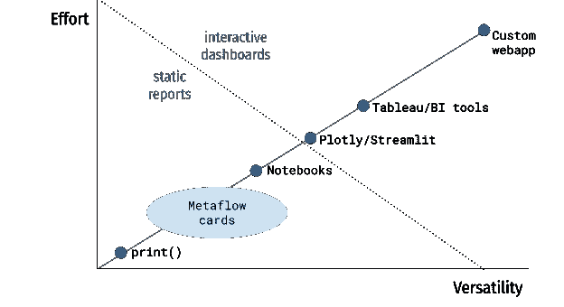
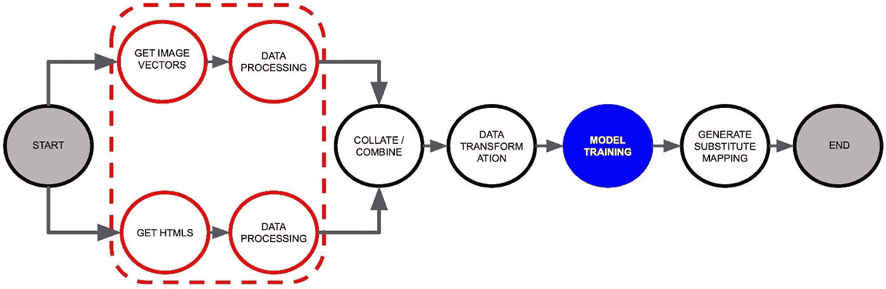
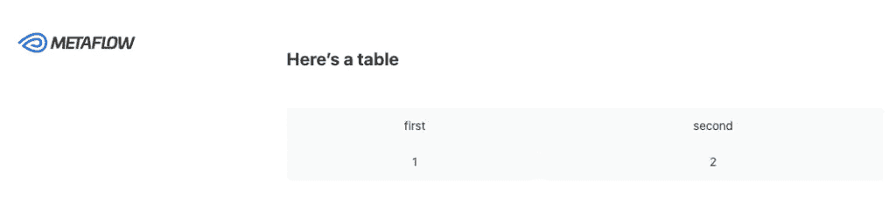
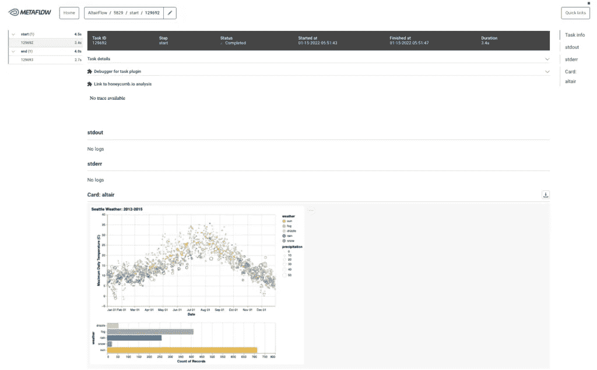

# 将 Pythonic 可视化报告集成到 ML 管道中

> 原文：<https://towardsdatascience.com/integrating-pythonic-visual-reports-into-ml-pipelines-a163d150ed04>

## 每一个工作流的执行都值得被记录(自动地)



作者图片

作者:瓦雷·戴夫、维尔·图洛斯、西罗·格列柯和雅格布·塔利亚布埃

**TL；在这篇文章中，我们很高兴介绍用于机器学习管道的 DAG 卡！这些卡片使得在每个工作流程中附加定制的可视化报告变得非常容易，而不需要安装任何额外的工具或基础设施。这项功能是与 [Metaflow](https://metaflow.org) 在 [Coveo](https://coveo.com) 的用户一起开发的，其动机是现代以数据为中心的 ML 工作流的普遍需求。如果你想马上开始，你可以直接进入文档。或者看下面的视频快速游览一下(没有声音)！**

# 每个 ML 管道的人类可读的可视化报告

*模型文档需要涵盖整个 ML 渠道。*

数据科学和机器学习从业者需要更好、更符合人体工程学的工具来可视化和询问他们的工作流。仅仅关注模型监控是不够的，因为现代 ML 工作流涉及一组异构的功能:要将模型投入生产，您需要非常关注培训之前的工作(例如数据收集、准备和标记)和之后的工作(例如测试、服务、监控和数据漂移)。简单来说，机器学习由构建、测试、部署和维护模型组成，每个步骤都需要多个子步骤。

这在一个我们认为特别重要的重大转变中变得很明显:焦点从建模转向数据，通常被称为以数据为中心的人工智能。尽管一些著名的学者已经谈论它有一段时间了，但以数据为中心的人工智能直到最近才引起整个社区的注意。在 2021 年末， [NeurIPS](https://nips.cc/) 举办了第一次关于以数据为中心的人工智能的[研讨会，在那里我们有幸展示了](https://datacentricai.org/)[我们在机器学习工作流程的 DAG 卡方面的工作](https://arxiv.org/pdf/2110.13601.pdf)。

作为一个具体的例子，考虑来自 [Chia 等人](https://arxiv.org/abs/2107.03256)的这个推荐管道，其中端到端管道是一系列具有显式依赖关系的任务。有些任务必须在其他任务之前执行，有些可以并行运行(红框)；有的需要 GPU(蓝色)，有的是轻计算；当失败时，有些可能需要重启其他一些，有些可能不需要——等等。



作者图片

我们非常重视这最后一点，我们相信文档也应该包含这些方面:**模型文档需要整合到整个 ML 管道中**。由于 ML 管道实际上是一个有向无环图(DAG ),我们很高兴为[元流](https://metaflow.org)推出 DAG 卡，这是一个开源框架，我们在网飞开始并继续在 Outerbounds 开发。在过去的四年里，我们一直在与不同公司的数据科学家一起系统地开发 Metaflow，添加卡片等功能，以提高他们的生产力和所交付项目的质量。

DAG Cards 的想法最初是由雅格布·塔利亚布埃和一家 B2B 公司的团队开发的，这家公司为从电子商务到工作场所的客户服务等各种业务提供基于 ML 的搜索和推荐。雅格布是这样描述这个想法的起源的:

> *我们有大量的生产模型，但只有其中一些是完全不言自明的。我们拥有的模型在很大程度上依赖于用例，因为用例会改变数据流和用户行为。最后，要理解我们的许多模型做什么，需要一定程度的领域知识。由于我们的团队发现 Metaflow 对于 ML 管道来说是一个灵活的、符合人体工程学的工具，自然要做的事情就是尝试构建一个 DAG 卡生成器，它位于 Metaflow 现有类的顶部。*
> 
> *我们最初受* [*模型卡*](https://arxiv.org/pdf/1810.03993.pdf) *概念的启发，于 2019 年由玛格丽特·米歇尔和同事推出，并由* [*谷歌云*](https://modelcards.withgoogle.com/about) *进一步开发。模型卡是伴随经过训练的 ML 模型的简短文档，提供关于不同条件下模型行为的基准评估和关键信息。我们立刻喜欢上了这个想法。该提议的美妙之处在于它的包容性:技术人员可以使用模型卡来构建更好的 ML 系统，而非技术人员可以使用它们来思考模型的优点和缺点，并负责任地使用它们。我们意识到这对于工作数据科学家是多么有用，并且喜欢为每个工作流获得人类可读报告的想法。但是在实践中应该如何编写报告呢？*

# 如何制作卡片？

*找到一种符合人体工程学且毫不费力的方式来生成静态的可视报告，如 DAG 卡，以补充现有工具。*

许多现实世界的 ML 管道仍然没有被记录和监控的原因是这些特性不是免费的。特别是，当数据科学家想要监控特定于用例的业务指标和属性时，他们需要花费大量的时间来寻找合适的报告工具，设计和实现报告，并将其连接到生产工作流。

最后一点尤其令人痛苦。虽然现代工具使构建令人惊叹的仪表板成为可能，但让仪表板呈现建模工作流的最新(更不用说历史)结果并不容易，因为您必须连接两个独立的工具。尽管如此，我们还是希望能够看到一份关于曾经生产过的每个模型的报告，包括原型和生产。

在从事了许多以各种形式面临这一问题的数据科学项目之后，我们对当今的工具前景有了以下的高度理解:


在工具的多功能性(使用它可以构建多复杂和多高级的报告)和生成最简单的报告所需的工作量之间存在固有的权衡。明确地说，这种评估是专门从在 ML 管道中生成报告的角度进行的。对于一组不同的需求，排序看起来会有所不同(我们鼓励您在大部分时间里进行这样的评估)。

在左下角，我们有一个最简单的解决方案:从每个建模任务中生成文本日志，这很简单。为每个模型分别存储和访问日志也不难。一个挑战是文本日志不是通用的——特别是，人们不能使用它们来产生任何类型的可视化，而这是数据科学的关键。

笔记本是制作可视化效果的流行选择。打开笔记本，制作图表，并不需要太多的努力。然而，基于现有的参数化模板自动生产笔记本，虽然可能使用像 [Papermill](https://papermill.readthedocs.io/) 这样的工具，但需要更多的工具和基础设施，以及以新方式使用笔记本的新心智模型。笔记本当然仍然是[元流堆栈](https://docs.metaflow.org/metaflow/client)的关键部分，因为它们对于临时探索和快速原型制作是不可或缺的，而当你知道管道的哪些方面受益于自动化报告时，卡片就派上了用场。

像 [Streamlit](https://streamlit.io/) 和 [Plotly Dash](https://plotly.com/dash/) 这样的工具使得创建交互式仪表板变得非常容易，但是将它们连接到工作流并不简单，并且在生产环境中可靠地托管它们需要付出努力。对于这个用例来说，这些工具可能太强大了，因为我们的卡片不需要交互。沿着同样的路线，在右上角，还有其他复杂的工具，如 Tableau 和定制 web 应用程序，它们需要大量的前期投资，我们已经看到它们主要用于少数高级用例。**我们的目标是降低报告成本，这样我们就可以期望每个渠道都至少包含一个基本卡**。

为了实现这一愿景，我们需要一个极其简单的解决方案

*   允许丰富的视觉输出，
*   可以像简单的 print()语句一样轻松地使用，
*   轻松连接到 ML 工作流，并且
*   可以很容易地与非技术利益相关者分享。

由元流卡实现的这些需求在图表上占据了独特的位置:它们使得在每个管道中生成静态的、可视化的报告变得简单，就像 DAG 卡一样。因为它们关注于一组特定的用例，所以它们是对现有工具的补充而不是竞争。

# 卡片入门

如果你是元流新手，从[安装元流](https://docs.metaflow.org/getting-started/install)开始，看看[元流教程](https://docs.metaflow.org/getting-started/tutorials)。在这之后，你就准备开始用卡了！

最新版本的 Metaflow 带有一个内置的 [*默认卡*](https://docs.metaflow.org/metaflow/visualizing-results/effortless-task-inspection-with-default-cards) ，您可以将它附加到任何现有的流上——不需要修改代码！就这样运行您的“带卡”流程:

```
python myflow.py run -with card
```

运行完成后，您可以通过指定步骤名称来查看运行生成的卡片。例如，要查看开始步骤生成的卡片，请键入:

```
python myflow.py card view start
```

这将在您的浏览器中打开卡片。默认的卡片显示了一个任务产生的所有工件，关于它的元数据，以及流 DAG 的可视化。这些信息在开发过程中会派上用场，因为您可以快速观察任务的结果是否有效。

按照我们最初的动机，我们想让从任何元流任务中产生丰富的视觉输出变得非常容易。例如，以下代码片段输出一个表:

```
from metaflow import card, current
from metaflow.cards import Table, Markdown@card(type='blank')
@step
def start(self):
    current.card.append(Markdown("# Here's a table"))
    current.card.append(Table([['first', 'second'], [1, 2]]))
```

您可以像以前一样通过“卡片视图开始”看到的卡片看起来像这样:



有关更多详细信息和示例，请参见 [*卡组件*](https://docs.metaflow.org/metaflow/visualizing-results/easy-custom-reports-with-card-components) 的文档。如果您安装了[元流 GUI](https://netflixtechblog.com/open-sourcing-a-monitoring-gui-for-metaflow-75ff465f0d60) ，卡片在任务视图中自动可见，就像这个使用 [Altair](https://altair-viz.github.io/) 进行可视化的卡片:



如上所示，您可以使用卡片在 GUI 中嵌入定制的可视化和图表。例如，您可以在模型训练步骤中附加一个定制的基准测试卡，它会自动将新模型的性能与现有模型的性能进行比较。参与该项目的任何人都可以在 GUI 中实时看到结果。

为了支持更高级的用例，您可以创建一个定制的 [*卡片模板*](https://docs.metaflow.org/metaflow/visualizing-results/advanced-shareable-cards-with-card-templates) ，它可以使用任何 Javascript 库并输出任意 HTML。卡片模板可以作为公共 Python 包发布和共享，因此您可以与您的团队和更广泛的元流社区共享自定义可视化。

感谢阅读！我们希望听到您对这一新功能的反馈，以及对新卡片模板的想法。最简单的方法是[加入我们和 Metaflow 社区 Slack 的 900 多名数据科学家和工程师](http://slack.outerbounds.co)👋

*原载于 2022 年 1 月 25 日*[*【https://outerbounds.com】*](https://outerbounds.com/blog/integrating-pythonic-visual-reports-into-ml-pipelines/)*。*