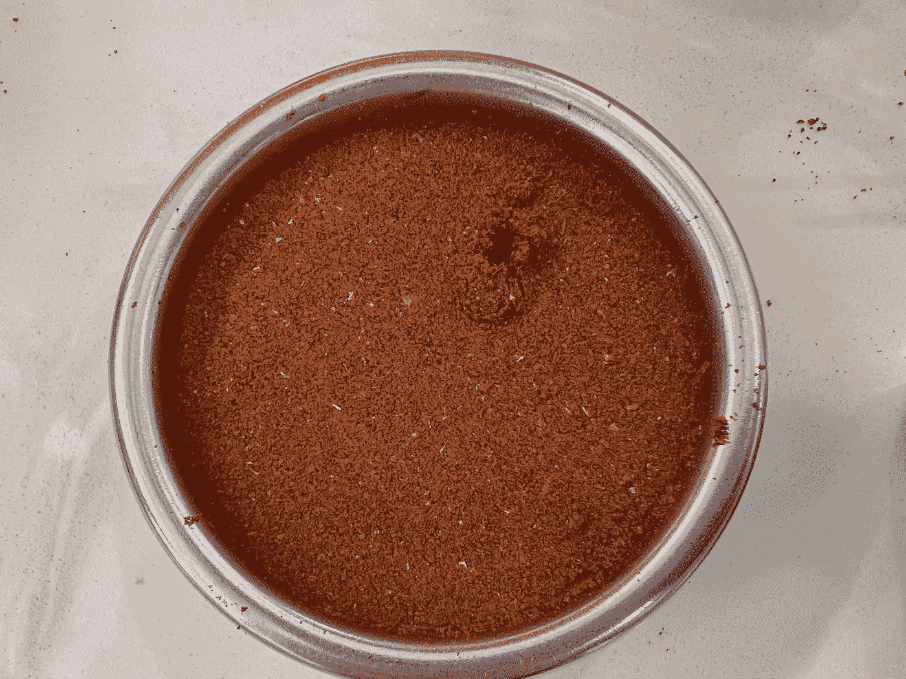
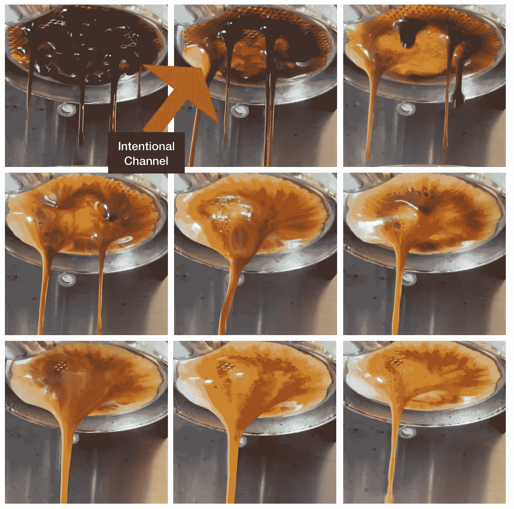
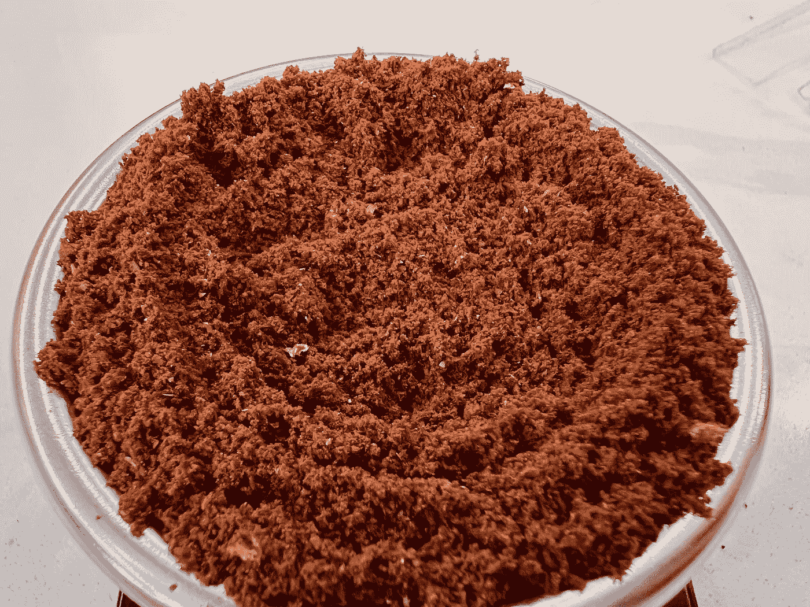
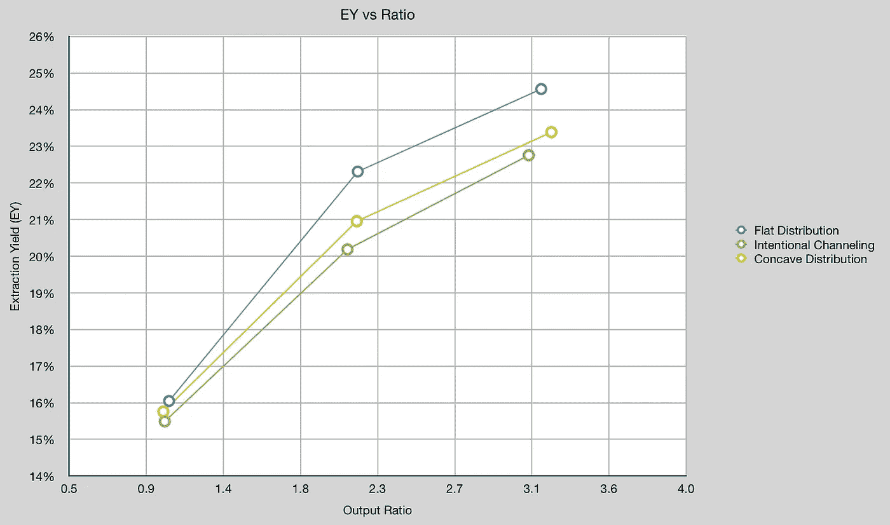
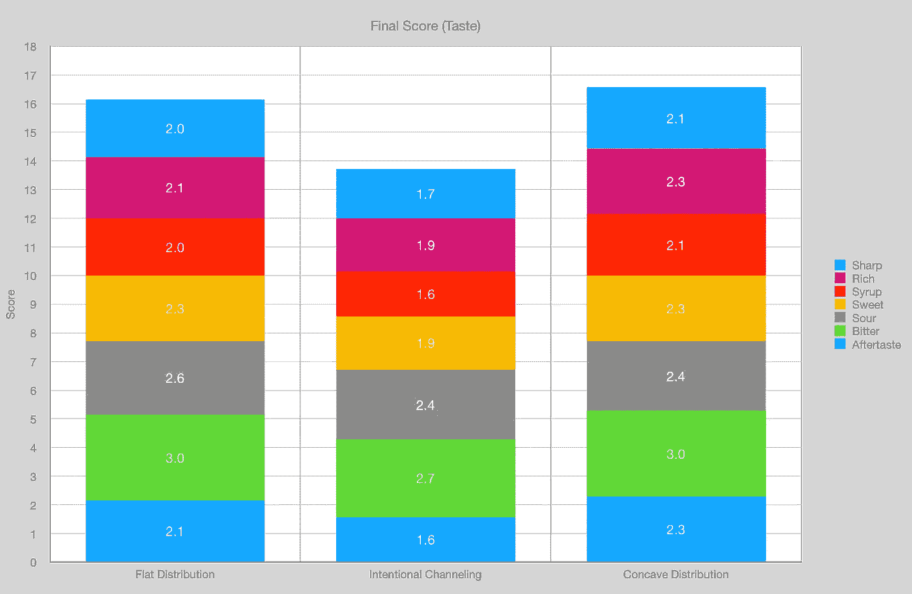
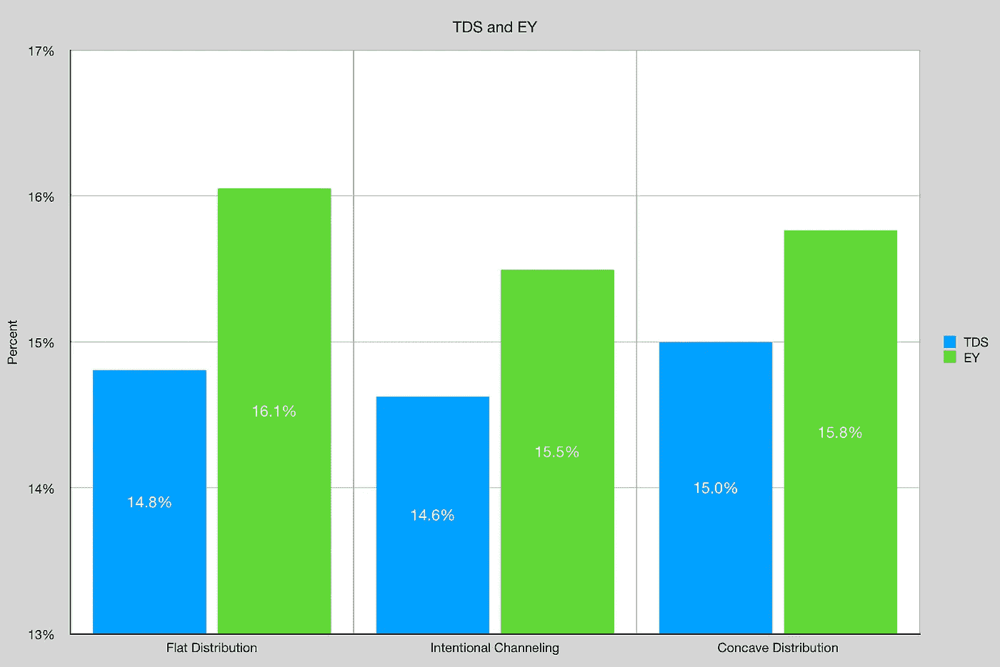
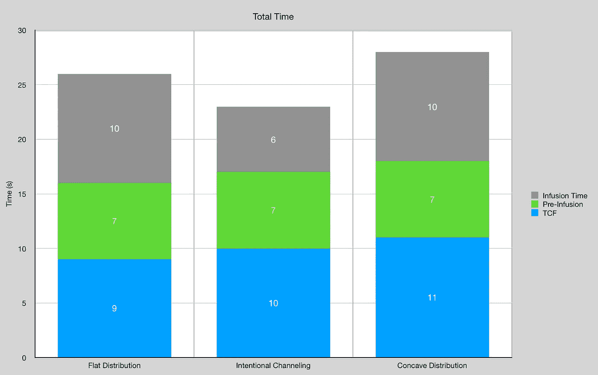
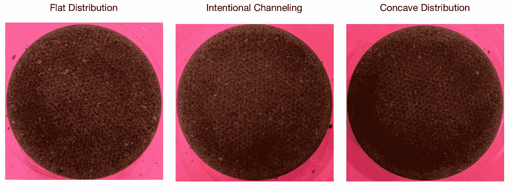

# 意式浓缩咖啡中的有意通灵

> 原文：<https://towardsdatascience.com/intentional-channeling-in-espresso-e5f288c05578>

## 咖啡数据科学

## 为了科学，故意弄乱镜头

在一次在线讨论中，有人提出有意的窜流并不总是会降低提取率。所以我决定尝试重复一个实验，并引起一些有意的通灵。然后我可以看看味道和提取率。

我从一个普通的冰球开始，然后在夯实后用牙签在冰球上打了一个洞。

所有图片由作者提供

我打了一针，虽然有一些通道，但它似乎部分自愈。

然后我又拉了一个没有意向渠道的镜头。我还拉了一个凹分布的额外镜头，你可以在下图中看到。这是微妙的，但边缘比中心有更多的咖啡，使他们有更高的密度。

凹型分布，中间咖啡较少，以形成更密集的边缘。

# 设备/技术

[意式咖啡机](/taxonomy-of-lever-espresso-machines-f32d111688f1) : [像样的意式咖啡机](/developing-a-decent-profile-for-espresso-c2750bed053f)

[咖啡研磨机](/rok-beats-niche-zero-part-1-7957ec49840d) : [小生零](https://youtu.be/2F_0bPW7ZPw)

咖啡:[家庭烘焙咖啡](https://rmckeon.medium.com/coffee-roasting-splash-page-780b0c3242ea)，中杯(第一口+ 1 分钟)

镜头准备:[断奏夯实](/staccato-tamping-improving-espresso-without-a-sifter-b22de5db28f6)

[预灌注](/pre-infusion-for-espresso-visual-cues-for-better-espresso-c23b2542152e):长，约 25 秒

输液:[压力脉动](/pressure-pulsing-for-better-espresso-62f09362211d)

[过滤篮](https://rmckeon.medium.com/espresso-baskets-and-related-topics-splash-page-ff10f690a738) : 20g VST

其他设备: [Atago TDS 计](/affordable-coffee-solubility-tools-tds-for-espresso-brix-vs-atago-f8367efb5aa4)、 [Acaia Pyxis 秤](/data-review-acaia-scale-pyxis-for-espresso-457782bafa5d)

# 绩效指标

我使用了两组[指标](/metrics-of-performance-espresso-1ef8af75ce9a)来评估技术之间的差异:最终得分和咖啡萃取。

[**最终得分**](https://towardsdatascience.com/@rmckeon/coffee-data-sheet-d95fd241e7f6) 是记分卡 7 个指标(尖锐、浓郁、糖浆、甜味、酸味、苦味和余味)的平均值。当然，这些分数是主观的，但它们符合我的口味，帮助我提高了我的拍摄水平。分数有一些变化。我的目标是保持每个指标的一致性，但有时粒度很难确定。

**使用折射仪测量总溶解固体量(TDS)，这个数字结合咖啡的输出重量和输入重量用于确定提取到杯中的咖啡的百分比，称为**提取率(EY)** 。**

# **数据**

**对于这三个镜头，我将它们分别放入三个杯子中，这样我就可以看到提取率如何随着时间的推移而发展。有意通灵做得最差。**

****

**至于味道，有意通灵在味道上也明显更差，而凹面在味道上稍微好一些。**

****

**对 TDS 和 EY 来说，有意通灵就没那么好了。**

****

**就时间而言，有意通灵跑得更快，这可能是由于通过通道的流动更快。**

****

**我看了看冰球的底部，在冰球的底部没有明显的通道。我以为会有，而凹型分布的黑点更多。**

****

**我观察了有意的通道，对味道和提取率有明显的影响。然而，这种效果并不总是容易在镜头的视频中看到，也不容易在冰球的底部看到。这提供了一些有趣的证据，表明一些在镜头中诊断问题的工具并不总是清晰的。**

**如果你愿意，可以在 [Twitter](https://mobile.twitter.com/espressofun?source=post_page---------------------------) 、 [YouTube](https://m.youtube.com/channel/UClgcmAtBMTmVVGANjtntXTw?source=post_page---------------------------) 和 [Instagram](https://www.instagram.com/espressofun/) 上关注我，我会在那里发布不同机器上的浓缩咖啡照片和浓缩咖啡相关的视频。你也可以在 [LinkedIn](https://www.linkedin.com/in/dr-robert-mckeon-aloe-01581595) 上找到我。你也可以关注我的[媒体](https://towardsdatascience.com/@rmckeon/follow)和[订阅](https://rmckeon.medium.com/subscribe)。**

# **[我的进一步阅读](https://rmckeon.medium.com/story-collection-splash-page-e15025710347):**

**[我的未来之书](https://www.kickstarter.com/projects/espressofun/engineering-better-espresso-data-driven-coffee)**

**[我的链接](https://rmckeon.medium.com/my-links-5de9eb69c26b?source=your_stories_page----------------------------------------)**

**[浓缩咖啡系列文章](https://rmckeon.medium.com/a-collection-of-espresso-articles-de8a3abf9917?postPublishedType=repub)**

**[工作和学校故事集](https://rmckeon.medium.com/a-collection-of-work-and-school-stories-6b7ca5a58318?source=your_stories_page-------------------------------------)**