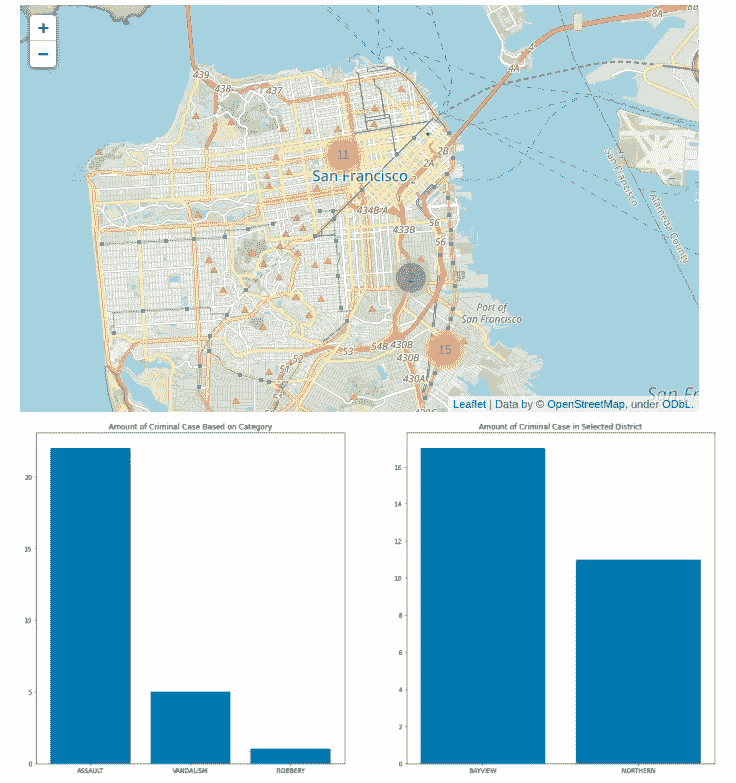
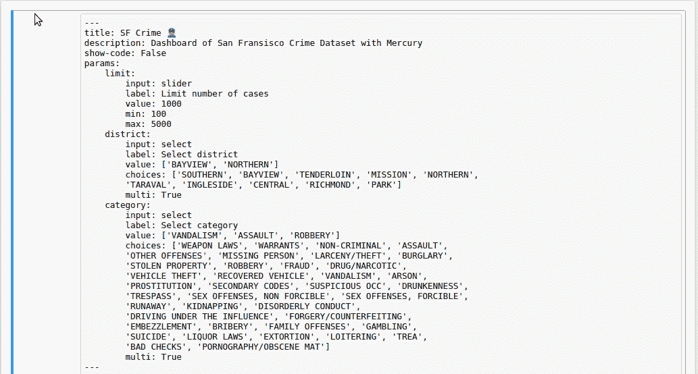
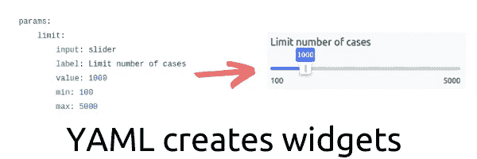
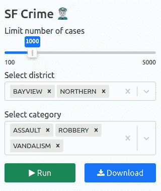
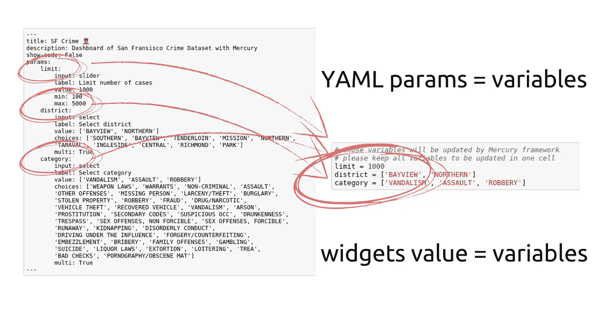
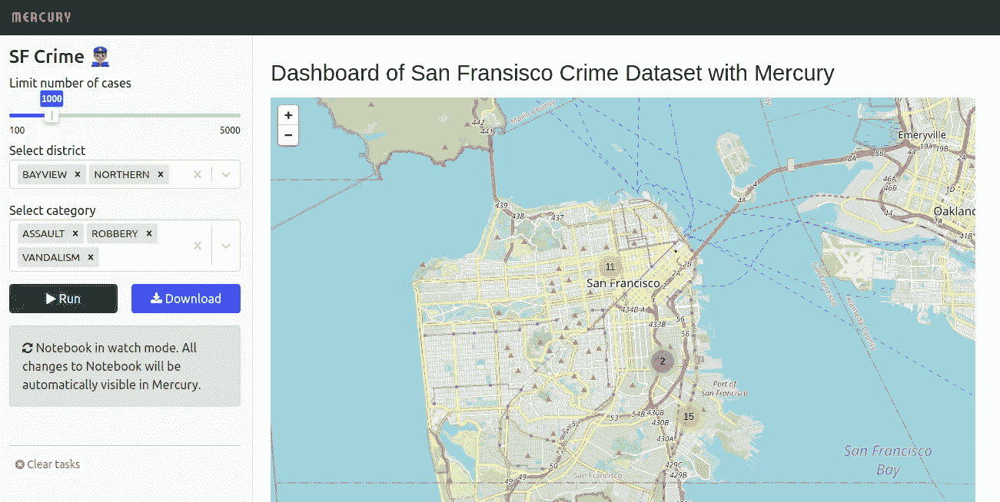
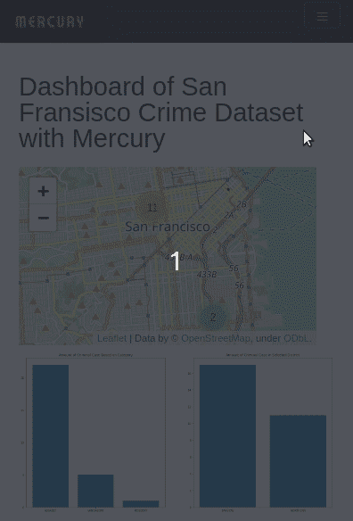
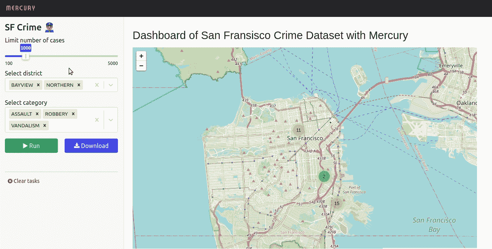

# Jupyter 笔记本的交互式仪表盘，带有 Mercury 框架

> 原文：<https://towardsdatascience.com/interactive-dashboard-from-jupyter-notebook-with-mercury-framework-e1269fdbe73c>


由[路易斯·汉瑟](https://unsplash.com/@louishansel?utm_source=unsplash&utm_medium=referral&utm_content=creditCopyText)在 [Unsplash](https://unsplash.com/s/photos/woodworking?utm_source=unsplash&utm_medium=referral&utm_content=creditCopyText) 拍摄的照片

你刚刚在笔记本上准备了分析报告。恭喜你！🎉你想与他人分享你的结果和发现。坏消息是你不能直接和你的朋友分享 Jupyter 笔记本代码，因为他们不会说 Python🐍。他们不能安装所需的包，不能从 GitHub 库提取代码，也不能在本地运行笔记本。好消息是，你可以轻松地将你的笔记本转换成一个独立的网络应用程序。

在这篇文章中，你将学会如何:

*   在 Jupyter 笔记本中创建仪表板，
*   将笔记本转换为独立的 web 应用程序，
*   将基于笔记本的应用程序部署到 Heroku。

这篇文章的灵感来自于上一篇文章[Ruben Winastwan](/creating-an-interactive-dashboard-from-jupyter-notebook-with-voila-b64918b4d15a)的《从 Jupyter Notebook 创建一个交互式仪表板》。

鲁本在他的文章中创造了旧金山犯罪的仪表板。他的代码可以在 GitHub[https://github.com/marcellusruben/sf-crime-voila](https://github.com/marcellusruben/sf-crime-voila)获得

# 笔记本中的仪表板

创建仪表板的代码可以分为三个部分:

1.  从 CSV 文件加载数据集。
2.  设置过滤数据的参数。
3.  将数据绘制成地图和直方图。

代码在下面的要点中给出。

创建仪表板的代码。

您将需要在`requirements.txt`文件中的以下包来运行笔记本:

```
mljar-mercury                             
pandas                             
numpy                             
matplotlib                             
folium
```

仪表板显示在下面的屏幕截图中:



Jupyter 笔记本中的仪表板视图

创建仪表板的代码只是 Python 代码。请注意，仪表板中使用的参数只是简单的变量。**没有使用小部件**。如果你想改变仪表板中的一些东西，你需要改变变量并重新执行笔记本。

激动人心的事情将发生在🪄的下一步

# 将笔记本转换为 Web 应用程序

现在我们需要一些魔法。鲁本在他的[文章](/creating-an-interactive-dashboard-from-jupyter-notebook-with-voila-b64918b4d15a)中，使用 [ipywidgets](https://github.com/jupyter-widgets/ipywidgets) 和 [Voila](https://github.com/voila-dashboards/voila) 将笔记本变成了网络应用。这里我将使用一个 [Mercury](https://github.com/mljar/mercury) 框架。它允许您通过在笔记本的开头添加 YAML 标题来定义笔记本的小部件。YAML 在下面:

作为第一个原始单元格添加到笔记本中的 YAML 标题。

YAML 标题应添加在笔记本的开头，作为一个 ***原始*** 单元格。



完整的笔记本代码和 YAML 标题。

YAML 配置用于为笔记本创建小部件。



小部件是基于 YAML 配置定义的。

以下微件面板是基于 YAML 创建的:



从 YAML 标题生成的窗口小部件面板。

需要注意的是，YAML 中的变量应该与代码中的变量同名。稍后，在点击`Run`按钮后，widgets 值将被赋给代码中的变量。



YAML 参数应该与变量名相同。

YAML 准备好了。是时候检查一下它在[水星](https://github.com/mljar/mercury)里的样子了。

您可以在笔记本开发过程中观察 web 应用程序的外观。笔记本上有一个命令`mercury watch —` 用于观看*代码更新*。请运行以下命令:

```
mercury watch SF_crime.ipynb
```

您将在 [http://127.0.0.1:8000/](http://127.0.0.1:8000) 上运行应用程序



在监视模式下运行的应用程序。

每次您更新笔记本时，它都会在 Mercury 中自动更新(无需按 F5😊)

# 部署到 Heroku

仪表板已经准备好了，让我们把它部署到 Heroku 上。

*我假设你已经安装了 Heroku 账号和 Heroku 命令行(CLI)工具(如果需要的话，查看* [*文档*](https://devcenter.heroku.com/articles/heroku-cli) *)。*

让我们运行以下命令来创建一个 Heroku 应用程序:

```
heroku create dashboard-mercury
```

在项目目录中。*(你应该在创建命令中使用不同的名称)*

我们将需要添加一个`Procfile`到我们的项目中:

```
web: mercury runserver 0.0.0.0:$PORT --runworker
```

让我们在 dyno 中设置必要的环境变量:

```
heroku config:set ALLOWED_HOSTS=dashboard-mercury.herokuapp.com
heroku config:set SERVE_STATIC=True
heroku config:set NOTEBOOKS=*.ipynb
```

您可以通过运行以下命令来部署应用程序:

```
git push heroku main
```

仅此而已。你应该能够检查在 https://dashboard-mercury.herokuapp.com 运行的应用程序。以下是笔记本电脑仪表盘在移动和桌面上的视图。



仪表板应用程序的移动视图。



仪表板应用程序的桌面视图。

# 结论

Jupyter 笔记本是分析数据和可视化结果的绝佳工具。由于有了 [Mercury](https://github.com/mljar/mercury) 框架🧰.，用 Python 创建的仪表板可以作为独立的 web 应用程序轻松共享交互部件由 YAML 头定义。小部件的值被分配给代码中的变量，因此不需要重写或更改笔记本的代码。该应用程序可以很容易地在免费的 Heroku dyno 上发布。

仪表板代码和数据可从 [GitHub](https://github.com/pplonski/dashboard-from-jupyter-with-mercury) 库获得。

*我是* [*水星*](https://github.com/mljar/mercury) *框架的作者。*