# PowerBI 中具有形状地图可视化的交互式地理空间可视化

> 原文：<https://towardsdatascience.com/interactive-geospatial-visualization-with-shape-map-visual-in-powerbi-70def7153469>

## 使用公共收入和数字边界数据的逐步指南/演示

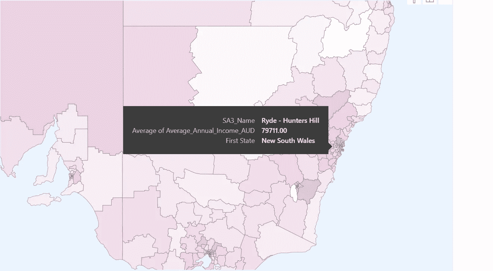

作者图片

# 动机

对于大多数公司来说，PowerBI 是一个流行的商业智能报告工具。除了可视化结构化表格数据的常见用例之外，它还能够读取地理空间数据，并将它们转换为交互式可视化，其中可以添加参考图层(如特定地区的平均收入)以了解潜在的人口统计模式和关系。

数字边界将地图划分为不同大小的地理区域。一个众所周知的数字边界是国家边界。尽管 PowerBI 在其地图设置中提供了一些内置的数字边界，如下所示，但对于商业应用程序来说，它通常被认为是不够的，因为商业应用程序通常需要较低的粒度来输出更多的“区域”数据。

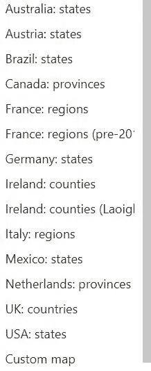

图 1: PowerBI 内置数字边界。图片作者。

这个问题的一个解决方案是将自定义地图导入到 PowerBI 中，并使用所需的数字边界设置。要做到这一点，需要很多步骤，其中一些步骤利用了外部依赖性，但是当我第一次尝试这个任务时，通过在线搜索(更不用说在 Medium 平台上，甚至是 ChatGPT 上)很少有文章能够提供足够的帮助。

使用 Shape Map Visual(可以在 PowerBI 中免费访问),本文提供了从将自定义地图导入 PowerBI 到将地图数据与参考图层进行匹配，以及最终创建交互式地理空间可视化(为数据提供上下文)的一步一步的指导，最终可能会给业务决策者留下深刻印象！

# 步骤 1:根据特定的数字边界准备自定义地图数据

出于本演示的目的，我将使用澳大利亚的统计区域 3(“SA3”)数字边界。这个演示可以很容易地推广或扩展到其他国家设置的数字边界。

作为背景，澳大利亚的 SA3s 旨在输出区域数据，该数据涵盖 30，000 至 130，000 人之间的人口(相比之下，SA2 为 3，000 至 25，000 人，SA4 为 100，000 人以上)。

SA3 数字边界的数据可以来源于[这里的](https://www.abs.gov.au/statistics/standards/australian-statistical-geography-standard-asgs-edition-3/jul2021-jun2026/access-and-downloads/digital-boundary-files)。特别是，Shapefile 被下载到一个 zip 文件中。

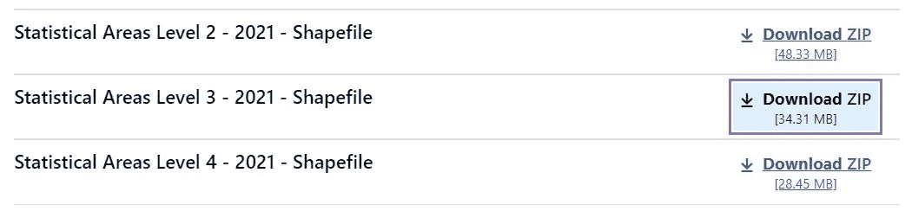

图 2: SA3 数据下载。图片作者。

下载的 zip 文件(不需要解压缩)然后被转换成 PowerBI 可读的 JSON 文件。这可以通过以下两(2)个步骤完成:

*   进入 mapshaper.org[的](https://mapshaper.org/)，导入下载的 zip 文件，按照下面的提示选择“导入”。

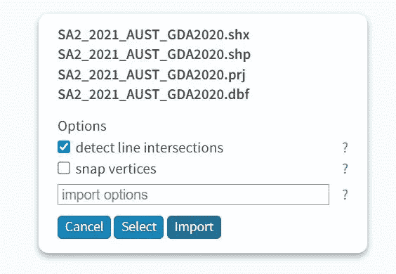

图 3:导入 shapefile。图片作者。

*   特定数字边界的地图应出现在屏幕上，如下所示。通过单击右上角的“导出”将此导出为 JSON 文件(GeoJSON 或 TopoJSON)。

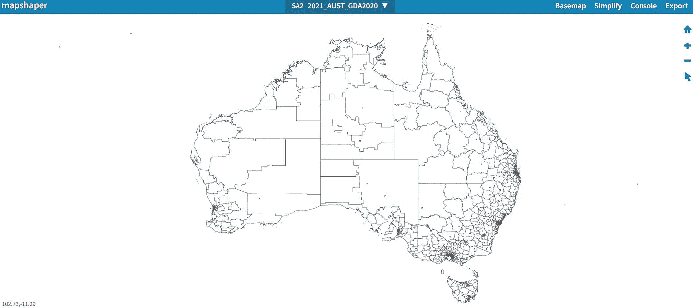

图 4:导出地图。图片作者。

值得一提的一个技术性问题是，使用上述步骤导出的 JSON 文件对于 PowerBI 导航来说几乎肯定是计算开销很大的(例如，由于地图特征和属性的维数很高，在尝试放大和缩小地图时可能会有相当大的延迟)。因此，建议在导出之前，通过点击右上角附近的“简化”来“缩小”形状文件。出于本演示的目的，地图数据已按 0.3%的简化比例进行了简化(这并未对地图要素和属性的质量产生实质性影响，您将在后面看到这一点)。

# 步骤 2:准备参考数据

出于本演示的目的，我将通过 SA3 数字边界可视化人口收入。

这里公布了各个统计领域的个人收入数据(表 2)。下面提供了要导入到 PowerBI 的参考数据片段。这是以 Excel/CSV 格式编写的。

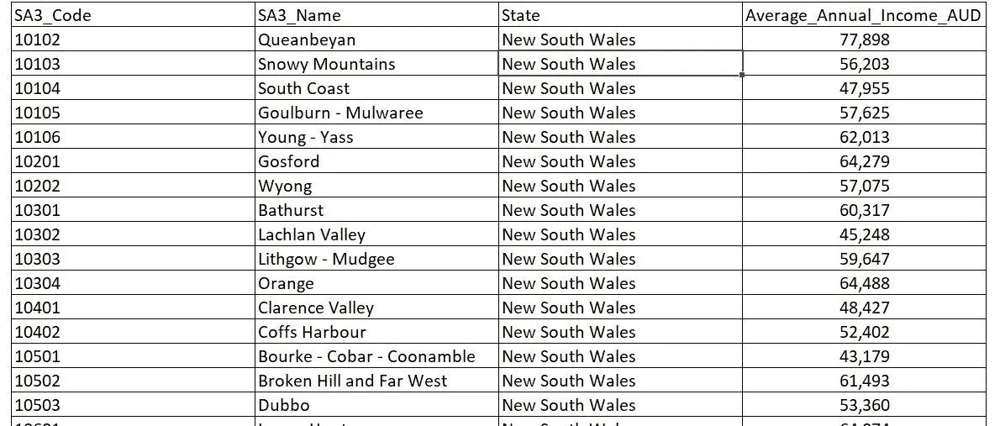

图 5:参考数据。图片作者。

# 步骤 3:增强 BI 形状地图的视觉效果

在我们匹配 PowerBI 中的地理空间和参考数据之前，需要首先启用 Shape Map Visual。在 PowerBI 中，这可以通过转到文件(左上角) >选项和设置>选项>预览功能并选中“形状映射可视化”复选框来完成。

然后，我们导入步骤 2 中准备的参考数据。成功导入后，数据中的四(4)个字段应出现在字段窗格中，如下所示。

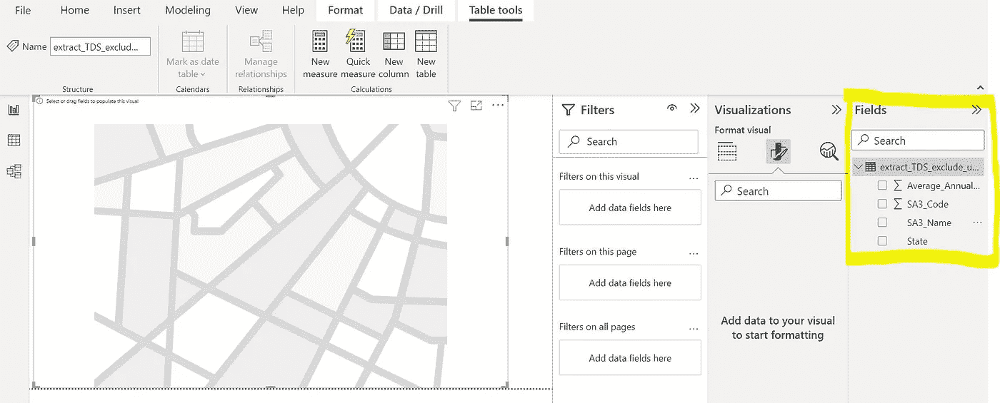

图 6:参考数据导入。图片作者。

现在，使用以下步骤导入在步骤 1 中创建的自定义地图。

*   选择位于可视化效果窗格中的形状映射图标，并选中字段窗格中某个字段旁边的框(只是为了在下一步中激活可视化效果窗格下的选项)，如下所示。

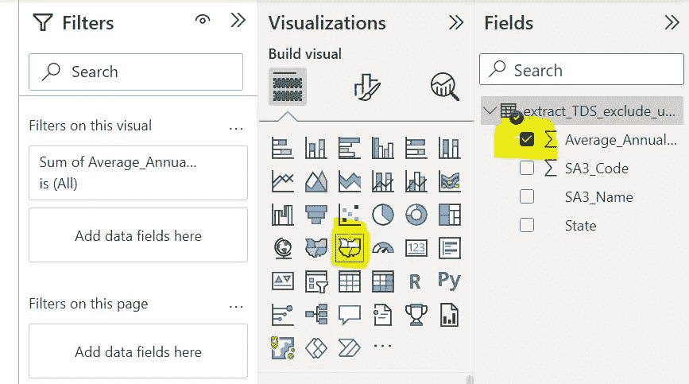

图 7:导入步骤。图片作者。

*   导航到“可视化效果”窗格中“构建可视化效果”图标右侧的“可视化效果格式”图标。在“Map Setting”下拉列表中，选择 Custom map 并导入在步骤 1 中创建的 JSON 文件，如下所示。

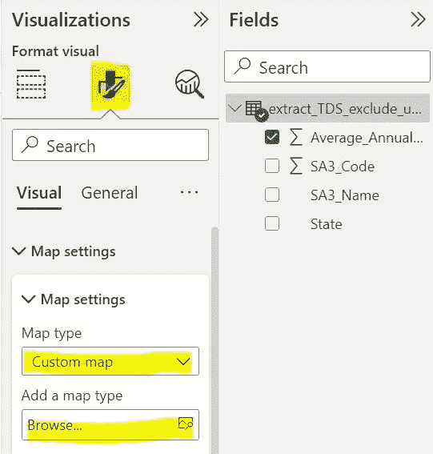

图 8:导入步骤继续。图片作者。

*   导航回“构建视觉”图标，将 SA3_Name 和 Average_Annual_Income 字段从“字段”窗格分别拖到“位置”和“颜色饱和度”字段，如下所示。

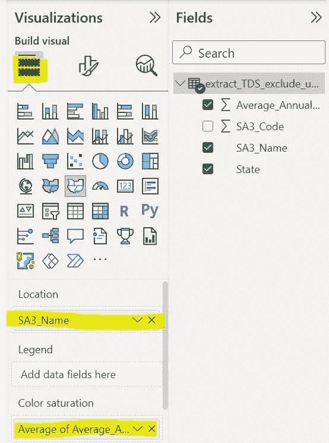

图 9:匹配数据。图片作者。

最后，现在 PowerBI 主机中应该会出现一个如下所示的视图。这种可视化通过色标来表示不同的收入水平，并通过在地图上选择特定的 SA3 区域时显示参考数据来与用户进行交互。

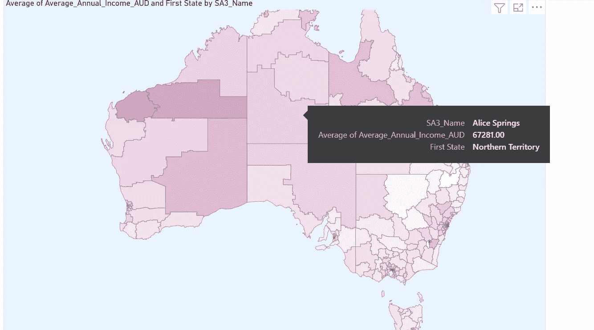

# 进一步定制

您可以通过编辑色标、将不同的参考数据放在 tooptip 上、更改缩放设置或在侧面添加滑块(例如，对于 State，当选择特定状态时会自动缩放可视化)来进一步定制可视化。

此外，如果您按日期排列参考数据，PowerBI 允许动画显示参考数据如何随时间变化。例如，您将能够看到特定区域的颜色如何随时间变化。对于一个时间序列的形状图数据，本[链接](https://www.youtube.com/watch?v=71zQL-9QdgU)中的视频提供了一个很好的教程。

总之，本文提供了如何将表格参考数据与地理空间数据结合起来的分步指南，最终使用 PowrBI 中的 Shape Map Visual 将它们可视化。

对于对其他可视化技术或数据科学应用感兴趣的读者，我在[媒体](https://jin-cui.medium.com/)上写了关于它们的博客！

# 参考

[1]澳大利亚统计局(2021)，数字边界文件，[澳大利亚统计地理标准(ASGS)第 3 版](https://www.abs.gov.au/statistics/standards/australian-statistical-geography-standard-asgs-edition-3/jul2021-jun2026/access-and-downloads/digital-boundary-files) *，* ABS 网站，2022 年 12 月 17 日访问，(在[https://creativecommons.org/licenses/by/4.0/](https://creativecommons.org/licenses/by/4.0/)获得许可)

[2]澳大利亚统计局(2021) [*澳大利亚个人收入*](https://www.abs.gov.au/statistics/labour/earnings-and-work-hours/personal-income-australia/latest-release) *，* ABS 网站，2022 年 12 月 17 日访问，([https://creativecommons.org/licenses/by/4.0/许可](https://creativecommons.org/licenses/by/4.0/))