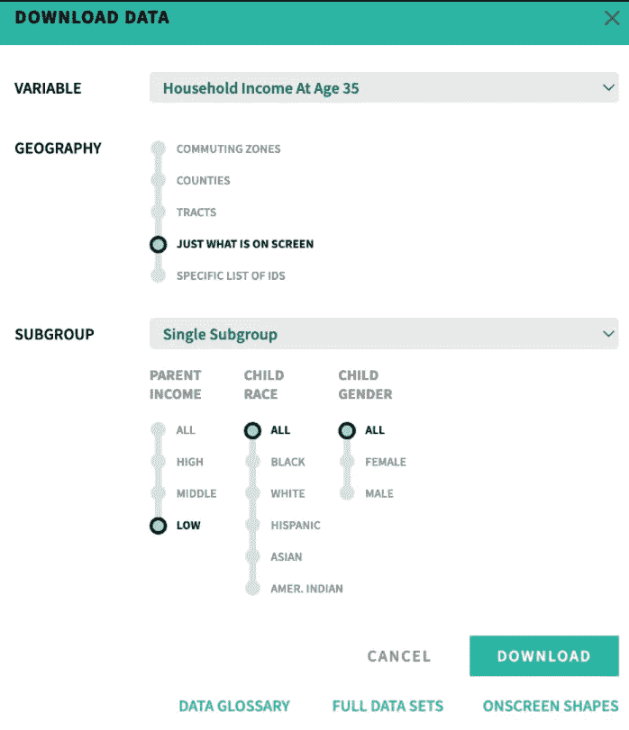

# 美国的代际流动——一个数据科学问题(1/5)

> 原文：<https://towardsdatascience.com/intergenerational-mobility-in-the-us-a-data-science-problem-1-5-5ab0d6569edd>

> 本系列由 Ibukun Aribilola 和 Valdrin Jonuzi 共同撰写，是社会公益数据科学教程的一部分。


图片来自 [Julian Hochgesang (Unsplash)。](https://unsplash.com/photos/sA5wcAu4CBA)

# 界定代际流动

虽然衡量代际流动的方法可能有所不同，但现有文献中对代际流动的定义通常是指成年子女与其父母的社会经济表现的比较。

在美国国家经济研究局(National Bureau of Economic Research)最近发表的一篇由乔利和杜劳夫(Cholli and Durlauf)撰写的工作论文中，代际流动性被定义为“父母和子女的社会经济地位之间的关系”。在经济学家中，社会经济地位是指收入。人们提出了一系列机制来解释父母与子女地位之间的联系，这些机制大致分为家庭和社会因素。家庭因素可以包括财富、教育、家庭构成等。另一方面，社会模型关注社会环境，尤其关注学校和社区(Cholli & Durlauf，2022)。

在研究邻里关系对代际流动的影响时，Chetty 和 Hedren (2018a)将代际流动定义为子女的预期收入取决于父母的收入。Chetty 等人(2014 年)提供了代际流动性的等级定义，将收入分配相对于父母向上移动的机会描述为父母和子女收入百分位等级之间的相关性。Deutscher (2018)使用等级定义测量了澳大利亚环境下的代际流动性，并得出了与 Chetty 之前工作一致的结果。

另一项关于美国代际流动性下降的研究使用邓肯社会经济指数(SEI)得分——职业排名的指标——来判断职业随着时间推移的相对地位(Song et al .，2019)。然而，对邓肯社会经济指数的一个主要批评是，它的计算是基于男性人口普查数据，可能不代表女性人口(Marsh，1968)。因此，我们决定不使用代际流动的职业定义，而使用百分位等级定义。

这些研究中有许多是在作为西方世界一部分的美国进行的，当外推至重视经济成功以外的特征的社会和文化时，这些研究是有限的。这类研究是在核心家庭是常态的市场经济国家进行的。例如，Titma 等人(2002 年)注意到苏联社会是如何重视等级而不是经济成功的，将自己定位为精英统治。

# 衡量代际流动性

大多数代际流动研究使用线性回归来预测孩子的收入，父母的收入和其他变量是预测变量。线性回归的许多限制之一是它不能产生贫困或富裕陷阱；认为贫穷家庭更难向上爬或富裕家庭更难向下爬的观点。非线性模型弥补了这一点。

研究还表明，代际流动因地理区域、人口统计和时间而异。2012 年，美国总统经济顾问艾伦·克鲁格(Alan Krueger)提出了了不起的盖茨比曲线(Great Gatsby curve)，强调了收入不平等和代际流动性之间明显的直接关系(Krueger，2012)。

Chetty 和 Hendren (2018a)测量了童年邻里接触对代际流动性的因果影响，方法是取搬到一个新地区的儿童的平均等级结果与一直生活在所搬到地区的儿童的平均结果之间的差异。他们还使用线性回归来衡量协变量的影响，如父母的婚姻状况，流离失所的冲击(父母收入的变化，自然灾害)，以及兄弟姐妹的比较。在他们的附带出版物中，Chetty 和 Hendren (2018b)使用了一个固定效应回归模型来确定儿童成长时收入高于父母的县的特征，如种族和收入隔离、收入不平等、教育质量等。

在对美国代际流动的地理特征的描述性分析中，Chetty 等人为他们的等级定义提供了两个相关的模型。他们根据儿童相对于同一出生队列中其他儿童的收入进行排名，并根据这些儿童的父母相对于这些出生队列中有儿童的其他父母的收入进行排名。在回归父母和子女的等级分布后，作者通过截距和斜率与父母百分位数的乘积来测量绝对流动性——来自任何给定百分位数家庭的子女的预期等级。Chetty 等人创造了“等级-等级”一词来描述这种回归父母和子女收入等级分布来计算代际流动性的方法。另一方面，相对流动性只是回归模型的斜率，这意味着流动性是聚合的，而不是以孩子的父母为条件。其他一些关于流动性的著名著作也使用了这种等级-等级方法来衡量流动性。此类研究包括代际流动性的近期趋势研究(Chetty 等人，2014 年)和 Deutscher 关于童年接触对流动性影响的研究。

另一方面，Titma 等人(2002 年)试图通过使用苏联的数据来衡量代际流动性。等级在社会中的重要性，加上劳动自由的限制和职业归属政策，使得教育在预测代际流动时具有更高的权重。使用参与者的性别和教育水平以及他们父母的级别和教育水平的数据，并应用对数线性模型(特别是逻辑回归)，该假设得到了证实。虽然与西方世界的结果相比，遗传对流动性的影响较小，但教育和文化资本(父母的教育水平)的影响更大。

费瑟曼-琼斯-豪泽假说认为，虽然工业化国家之间观察到的(或结构性的)流动性可能不同，但循环流动性不会。从本质上讲，流通流动性因素存在于个人地位与其父母地位之间的独立关联中，不受技术变革、特定职业的供求变化、家庭规模等因素的影响(McMurrer 等人，1997)。这个假设受到了极大的质疑；Slomczynski 和 Krauze (1987)对 16 个国家的样本进行的比较似乎否定了这一观点，而小岛康誉和马克在 1994 年对日澳数据进行的研究则支持这一观点。如果是真的，这可能意味着在美国进行的研究结果可以推广到其他工业化国家。

# 设计我们的方法

最初，我们的计划是预测和比较美国和德国的代际流动性。交付内容是一个交互式数据新闻网络项目，因为我们的团队分布在旧金山和柏林，我们打算采访当地人并分享他们的故事。由于缺乏德国代际流动的可用数据，我们决定将研究重点放在美国。

之后，我们查看并整合了来自机遇地图集和谷歌数据共享空间的代际流动性和相关数据。在回顾该领域的研究(美国经济学家和领域专家哈吉·柴提占据了压倒性优势)时，我们设法拿到了他的一篇论文中使用的数据。在进行了初步的探索性数据分析后，我们得出结论，我们需要转向；我们发现的结果并不特别有趣，继续研究方法不太可能产生足够的原创内容，使我们在网络项目上花费的努力值得。

最终，我们选定了这一系列针对对数据科学感兴趣的同学的文章，在这些文章中，我们将以代际流动为例来解释数据科学的思想和方法。该系列的概念是由 Ines Montani 的自然语言处理课程，高级自然语言处理与空间的启发。虽然这个项目和类似的项目动机相似，但据我们所知，我们的项目是唯一一个将代际流动作为案例研究的项目。

# 收集数据

既然我们知道这项研究的主要目标是预测美国的代际流动，我们需要收集数据来帮助我们的分析。我们将结合来自三个来源的县级数据，即来自 Chetty & Hendren 论文的全国人口普查数据、机会地图集和数据共享空间。

# 切蒂-亨德伦公司

正如本文前面提到的，Chetty 和 Hendren 研究了儿童的代际流动机会是如何受到他们成长环境的影响的。他们使用了 1996 年至 2012 年间举家跨县迁移的 500 多万儿童的人口普查数据。

Chetty & Hendren 制作的主要数据之一是县级因果效应估计和协变量的表格。换句话说，除了一系列可能影响代际流动的其他协变量之外，他们还提供了一系列迁移到一个县对代际流动的因果影响。该数据集提供了我们县级结果数据的主要来源，可以在 [Opportunity Insights](https://opportunityinsights.org/paper/neighborhoodsii/) 网站上找到，以及他们论文中的其他数据集。具体来说，我们使用“在线数据表 4”和附带的[变量描述](https://opportunityinsights.org/wp-content/uploads/2018/04/online_table4-2.pdf)。

# 机会图册

本分析的第二个数据来源是[机会图谱](https://www.opportunityatlas.org/)。机会地图集是一个互动平台，旨在分享关于为儿童提供最佳脱贫机会的社区的特征或机会的数据。我们获得了县和地区层面的社会流动性因素的数据，如监禁率和就业率。该数据可在 Opportunity Atlas 网站上下载(侧栏>‘下载数据’)，并可根据您对特定变量、地理粒度(通勤区、县或地区)和子群(父母收入、孩子种族和孩子性别)的需求轻松定制。



截图来自[机遇图集](https://www.opportunityatlas.org/)网站作者。

为了我们的分析目的，我们下载了县和地区级别的七个特征的数据，即 2012-2016 年 35 岁时的家庭收入、监禁率、35 岁时结婚的比例、高中毕业率、大学毕业率和贫困率。所有 14 个数据表都可以在这个 [Google Drive 文件夹](https://drive.google.com/drive/u/5/folders/1U8bSZ1CD3bqCNmiBiDTR0VXtFp5Rzsai)中找到。

# 数据共享空间

最后，我们从数据共享空间中获得了其他县的特征。Data Commons 数据集中的变量既不在 Chetty & Hendren 的数据集中，也不在 Opportunity Atlas 数据集中。数据共享 [Python](https://docs.datacommons.org/api/python/#:~:text=The%20Data%20Commons%20Python%20API,analysis%20workflows%20and%20much%20more.) 和[Pandas](https://docs.datacommons.org/api/pandas/)API 使我们能够使用 Python 脚本下载数据。要使用，首先导入 Python 中的模块。

```
import datacommons as dc
import datacommons_pandas
```

现在我们已经设置了数据共享 API，我们可以查询县一级的变量列表。

```
dcid_usa = "country/USA"
dcids = dc.get_places_in([dcid_usa], "County")[dcid_usa]stat_vars_to_query = ["Median_Age_Person",
                    "Median_Income_Person",
                    "Population",
                    "Count_Person_PerArea",
                    "Count_Person_Literate",
                    "Count_Person_BornInStateOfResidence",
                    "Count_Person_AbovePovertyLevelInThePast12Months",
                    "Count_Household",
                    "Count_HousingUnit",
                    "UnemploymentRate_Person",
                    "LifeExpectancy_Person",
                    "Count_Person_DetailedEnrolledInCollegeUndergraduateYears",
                    "Count_Person_DetailedHighSchool",
                    "Count_School",
                    "dc/c58mvty4nhxdb", *#Mean Cohort Scale Achievement of Student*
                    "GenderIncomeInequality_Person_15OrMoreYears_WithIncome",
                    "LifeExpectancy_Person",
                    "Count_Person_15OrMoreYears_NoIncome",
                    "Median_Earnings_Person",
                    "Count_Person_1OrMoreYears_DifferentHouse1YearAgo",
                    "Median_Income_Household",
                    "Count_Household_LimitedEnglishSpeakingHousehold"
                    ]df = datacommons_pandas.build_multivariate_dataframe(dcids, stat_vars_to_query)
df.insert(0, 'name', df.index.map(dc.get_property_values(df.index, 'name')).str[0])
df.insert(1, 'lat', df.index.map(dc.get_property_values(df.index, 'latitude')).str[0])
df.insert(2, 'lng', df.index.map(dc.get_property_values(df.index, 'longitude')).str[0])
display(df)
```

如本[笔记本](https://github.com/valdrinj/dssg_final_project/blob/main/finalised_notebooks/DataCleaning/google_data_commons.ipynb)的最后几个单元格所示，进一步清理数据集后，您将获得最终的数据集。(点击[此处](https://share.streamlit.io/ibukunlola/dssg_final_project/main/finalised_notebooks/Introduction/Introduction.py)查看完整表格)。

# 结论

在这篇文章中，我们总结了代际流动领域其他杰出研究人员的工作，并解释了为什么我们坚持 Chetty 和 Hendren 对代际流动的百分位数排名定义——相对于父母收入分配上升的机会。我们还带领读者通过这个项目的迭代过程，从美国和德国的比较到我们现在拥有的一系列数据科学教程风格的文章。我们还通过介绍我们的三个数据源(Google 的数据共享、Opportunity Atlas 和 Chetty & Hendren 的数据集)暗示了下一篇文章，并解释了为什么每个数据源对即将进行的分析都很重要。

这是一个关于如何使用代际流动作为案例研究来进行数据科学项目的 5 部分演练。第二篇文章展示了我们如何合并和清理数据集，以创建一个可用于各种分析的综合数据集。第三篇文章侧重于执行探索性数据分析，以理解数据并开始思考如何预测代际流动。第四和第五篇文章分别描述了如何使用回归和分类方法预测代际流动。

# 参考

Chetty、n . Hendren、p . Kline、e . Saez 和 n . Turner(2014 年)。美国还是一片充满机遇的土地吗？代际流动的最新趋势。《美国经济评论》,第 104 卷第 5 期，第 141-47 页。

Chetty，n . Hendren，p . Kline，Saez，E. (2014 年 11 月)。机会之地在哪里？美国代际流动的地理分布，《经济学季刊》，第 129 卷，第 4 期，2014 年 11 月，第 1553-1623 页，[https://doi.org/10.1093/qje/qju022](https://doi.org/10.1093/qje/qju022)

切蒂。新泽西州亨德伦市(2018 年 8 月)。邻里关系对代际流动的影响 I:童年接触效应，《经济学季刊》，第 133 卷，第 3 期，2018 年 8 月，第 1107–1162 页，【https://doi.org/10.1093/qje/qjy007 

Chetty，r .，& Hendren，N. (2018 年)。邻里关系对代际流动的影响 II:县级估计。经济学季刊，133(3)，1163–1228。

北卡罗来纳州乔利，南卡罗来纳州杜劳夫(2022 年 2 月)。代际流动性(NBER 工作文件第 29760 号)。美国国家经济研究局。【http://www.nber.org/papers/w29760 

德国北卡罗来纳州(2018 年)。地点、工作、同伴和青少年时期的重要性:暴露效应和代际流动性。

琼斯，F. L .，小岛康誉，h .，，马克斯，G. (1994)。比较社会流动性:1965-1985 年日本和澳大利亚父子流动性的长期趋势。社会力量，72③，775。[https://doi.org/10.2307/2579780](https://doi.org/10.2307/2579780)

克鲁格，A. B. (2012 年 1 月 12 日)。美国不平等的兴起和后果【论文陈述】。美国华盛顿特区美国进步中心。[https://obamawhitehouse . archives . gov/sites/default/files/Krueger _ cap _ speech _ final _ rema](https://obamawhitehouse.archives.gov/sites/default/files/krueger_cap_speech_final_rema)rks.pdf

麦克莫勒博士，康登，m .，&索希尔，I. V. (1997 年 5 月 1 日)。美国的代际流动。城市学院。从 http://webarchive.urban.org/publications/406796.html[取回](http://webarchive.urban.org/publications/406796.html)

马什，R. M. (1968)。美国的职业结构。彼得·m·布劳和奥蒂斯·达德利·邓肯。纽约:约翰·威利父子公司，1967 年。520.

Slomczynski，K. M .，& Krauze，T. K. (1987)。社会流动模式的跨国相似性:对费瑟曼-琼斯-豪泽假说的直接检验。美国社会学评论，52(5)，598。[https://doi.org/10.2307/2095597](https://doi.org/10.2307/2095597)

宋，x，梅西，C. G .，罗尔夫，K. A .，费里，J. P .，罗斯鲍姆，J. L .，，谢，Y. (2020)。自 19 世纪 50 年代以来，美国代际流动性的长期下降。美国国家科学院学报，117(1)，251–258。

蒂特玛，m .，马图，N. B .，，k .罗斯玛(2003 年)。教育是苏联社会代际流动的一个因素。欧洲社会学评论，19(3)，281–297。【http://www.jstor.org/stable/3559612 号