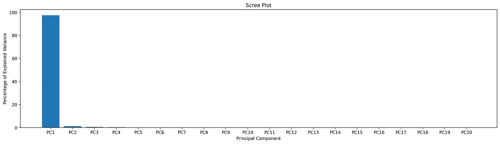
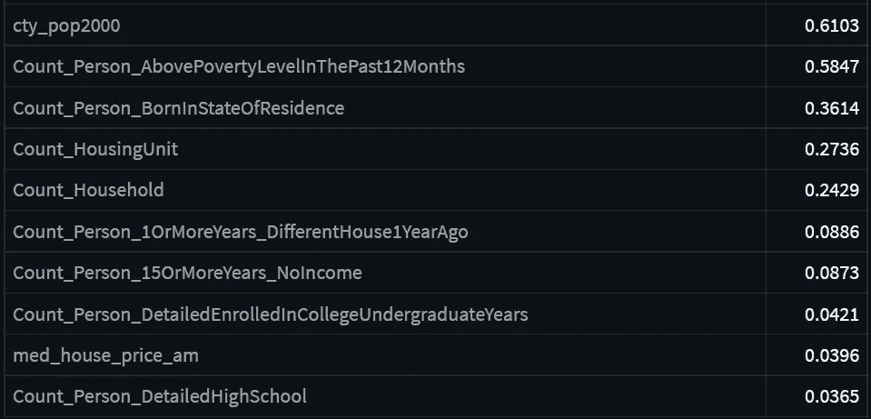
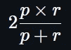
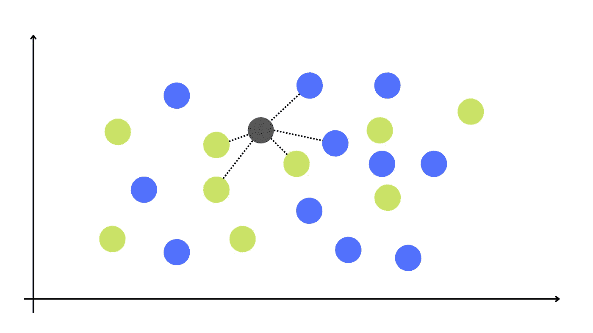
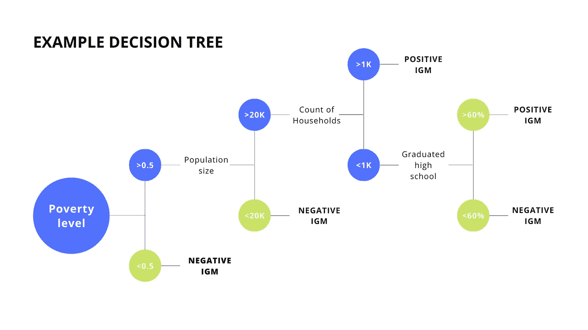
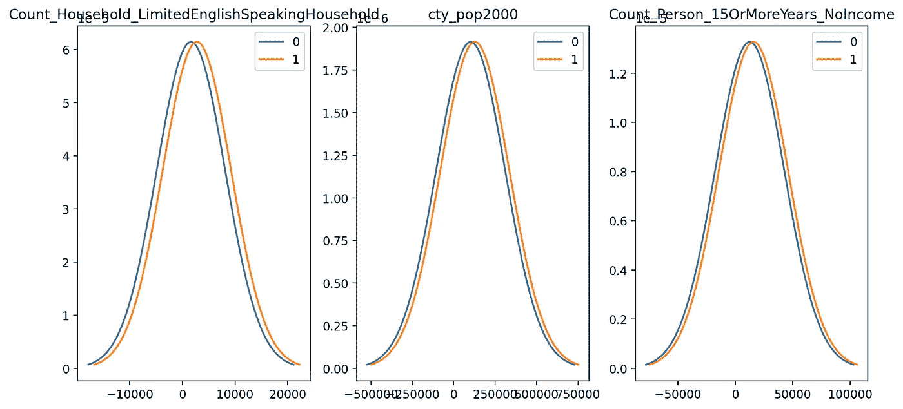
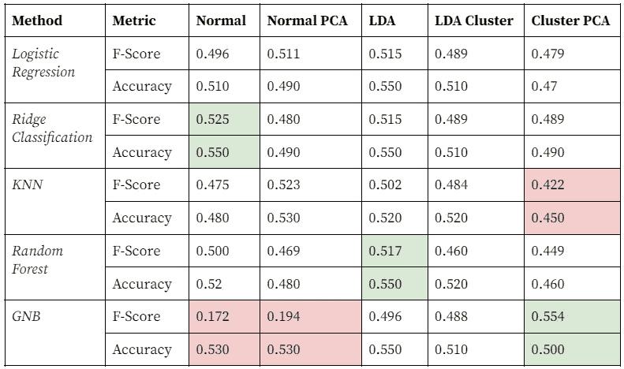

# 美国的代际流动——分类(5/5)

> 原文：<https://towardsdatascience.com/intergenerational-mobility-in-the-us-classification-5-5-707c6191034a>

> 本系列由 Ibukun Aribilola 和 Valdrin Jonuzi 共同撰写，是社会公益数据科学教程的一部分。

在[的第二篇文章](https://share.streamlit.io/ibukunlola/dssg_final_project/main/finalised_notebooks/DataCleaning/data_preprocessing.py)中，我们从 Chetty & Hendren 的[论文](https://academic.oup.com/qje/article/133/3/1163/4850659)中收集并清理了数据，并将其与来自[机会图谱](https://opportunityinsights.org/data/?geographic_level=0&topic=0&paper_id=1652#resource-listing)和[数据共享](https://datacommons.org/)的数据结合起来。然后，在第二篇[文章](https://share.streamlit.io/anglilian/dssg_final_project/main/finalised_notebooks/ExploratoryDataAnalysis/exploratory_data_analysis.py)中，我们探索了我们可能对数据集执行的潜在分析。

在我们系列的第五篇也是最后一篇文章中，我们将尝试几种分类方法，以确定哪些方法最能让我们了解每个县的哪些特征有助于代际流动(IGM)。为了将这变成一个分类问题，我们将具有正流动性的县分类为`1`，将负流动性的县分类为`0`。

代际流动性的因变量和标志是所有父母的子女在 26 岁时国民收入第 75 个百分点的收入变化。

在本文结束时，您将学会如何:

*   对分类问题进行降维
*   选择适当的指标来比较结果
*   在 Python 中执行几种分类方法
*   有意义地解释分类结果

我们将主要使用 Python [scikit-learn](https://scikit-learn.org/) 库，您可以在这里找到本文[的所有代码。点击](https://github.com/anglilian/dssg_final_project/blob/main/finalised_notebooks/Classification/LL-classification.ipynb)[此处](https://share.streamlit.io/anglilian/dssg_final_project/main/finalised_notebooks/Classification/classification.py)获取文章的互动版本。

# 降维

## 主成分分析

我们在前两篇文章中学习了 PCA。PCA 是一种无监督的降维技术，因为它不需要标签，所以它可以应用于回归和分类问题。主成分分析告诉我们什么样的混合变量导致了数据中的一定量的变化。

```
from sklearn.decomposition import PCA
*# Make a PCA model*
pca = PCA(n_components = 20)
pca.fit(X_train)
```

在对我们的训练数据运行上述代码之后，我们可以在一个 scree 图中绘制出每个组件所解释的变化量。



图片来自作者。

我们可以看到，主成分 1 ( `PC1`)占数据变化的 90%以上。太多了！但是什么是`PC1`。我们可以打印出加载分数来查看:

```
loading_scores = pd.Series(pca.components_[0], index = X.columns)
sorted_loading_scores = loading_scores.abs().sort_values(ascending=False)top_10 = sorted_loading_scores[:10].index.values
print(loading_scores[top_10])
```



图片来自作者。

加载分数显示了每个变量与`PC1`的相关性。这些符号显示了这种相关性是正还是负。比如 2000 年的县人口与`PC1`有 0.610 的相关性，也就是说人口每增加 1 个单位，IGM 排名就增加 1 个单位。

基于这些结果，我们可以只对`PC1`进行改造。这意味着我们将把所有的数据点向下投射到一个维度上。如果我们使用`PC1`和`PC2`，我们将基于这两个组件提供的轴将数据点投影到二维空间中。这个想法是，将数据转换到这些不同的空间将有助于我们分离类。

然而，我们不是限制主成分的数量，而是迭代地遍历多个成分，以查看哪一个对每种分类方法给出了最好的结果。

## 线性判别分析(LDA)

类似地，LDA 将我们的数据点带入一个不同的多维空间，帮助我们进行分类。与 PCA 不同，LDA 将类别标签考虑在内，使其成为一种受监督的降维方法。此外，LDA 更侧重于最大化类之间的可分性，而不是确定哪些变量导致数据中的最大变化量。

```
from sklearn.discriminant_analysis import LinearDiscriminantAnalysis
lda = LinearDiscriminantAnalysis().fit(X_train, y_train)*# Transform data*
lda_train =lda.transform(X_train)
lda_test = lda.transform(X_test)
```

运行代码很简单，但是到底发生了什么呢？LDA 基于我们所有的变量创建了一个轴来转换我们的数据，以优化两件事:

*   最大化两个类别之间的手段分离
*   最大限度地减少每个类别中的差异。

```
print(lda_train.shape)
>> (1893, 1)
```

转换的结果是一维数据集。

# 聚类(高斯混合模型)

在第二篇文章中，我们使用高斯混合模型对数据进行了聚类实验。我们将在此测试移除多数聚类之外的县是否会改善我们的结果。

# 韵律学

我们如何确定哪个模型比另一个模型表现得更好？准确度、精确度和召回率是最常用的三个分类标准。通常，在这些指标之间进行选择，决定了我们是更关心假阳性、假阴性，还是不特别关心。高精度表示低假阳性，而高召回表示低假阴性。

就我们的目的而言，我们并不特别担心县被误归类为 IGM 阳性或阴性。但是，我们更喜欢我们的模型提供平衡的结果，这意味着，更可取的是，该模型因准确标记两个类别中的县而受到奖励。F 分数确保了精确度和召回率之间的平衡，并且基于以下公式计算:



F 值为 0 意味着精度或召回率为 0，而 F 值为 1 意味着精度和召回率都为 1。在解释结果时，我们还将考虑其他指标，但我们将使用 F 分数作为选择模型参数的主要指标。

我们需要从 scikit-learn 获得以下信息:

```
from sklearn.metrics import classification_report, f1_score
```

即使有这些指标，我们如何知道这些结果是否“好”呢？我们需要确定一个成功的基准，我们可以通过将我们的结果与其他进行类似分析或其他启发式方法的人的结果进行比较来选择。例如，也许我们的基准是 50%的准确率，而我们的模型在预测哪些县 IGM 阳性时比无偏的抛硬币更准确。

正如上一篇文章中所讨论的，我们还将把我们的结果分成一个训练集和一个测试集，并进行交叉验证，以使我们的结果偏差最小化。(如果你需要复习，请回到上一篇文章！)

# 分类方法

这是我们可以应用的可能分类方法的非详尽列表，但我们选择它们是为了展示如何根据数据集的特征选择模型。在这一小节中，我们将提供对这些方法如何工作、所需参数的高级理解，并根据我们对数据的理解评估我们期望这些方法的工作效果。

记住，运行代码进行分类并不难。挑战来自于对正在发生的事情有足够的理解来恰当地解释结果！

## 逻辑回归

在上一篇文章中，我们介绍了几个处理未标记的连续数据的回归模型。在线性回归中，我们的目标是预测一个特定的值，而逻辑回归预测一个二元类。

如果我们只处理一个独立变量，我们将基于对数标度转换数据，因此 y 轴现在表示数据被分类为`0`或`1`的可能性。然后，我们拟合一个逻辑函数(S 形线)。数据点的分类基于其在逻辑函数上的概率。一般如果概率超过 50%，那么我们就认为是那一类。我们调整了基于最大似然的逻辑函数。最大似然是通过在给定类别中标记的所有数据点的联合概率来计算的。

我们这里只有一个变量，但当我们添加更多的变量并将逻辑函数移动到多维空间时，情况是一样的。

```
from sklearn.linear_model import LogisticRegression
clf = LogisticRegression(C= c)
```

## Rdige 分类

岭分类器背后的想法是向逻辑回归引入一些偏差以减少方差，这意味着我们故意使训练结果不太准确，以便我们在测试数据中获得更好的结果。

逻辑回归旨在最大化可能性之和，即属于某个类别的数据点与其实际所属类别之间的置信度差异。如果一个县出现阳性 IGM 的可能性为 0.9，并且其实际类别为“1”，则可能性为 0.9。然而，如果该县的实际分类为“0”，那么其可能性为 0.1，因为它被正确分类的可能性较小。岭分类为这种优化增加了一个惩罚项。

*   对数回归→最大值(可能性之和)
*   岭分类→最大化(可能性之和+$ \ n 乘以变量**2$)

*λ* 控制我们引入的偏差量，我们可以通过惩罚自变量对因变量的影响来调整它作为一个参数。更高的 *λ* 意味着逻辑函数的“S”形不太陡。在 scikit-learn 中，我们称这个参数为`alpha`。

```
from sklearn.linear_model import RidgeClassifier
clf = RidgeClassifier(alpha=alpha)
```

至少与逻辑回归相比，这种方法可以改善我们的测试结果。

## k-最近邻(KNN)

KNN 是关于投票的！假设我们的数据集如下图所示，我们有一个未赋值的数据点。如果我们将`k`设置为 5，那么我们将采用 5 个最近邻居的投票来决定它应该属于哪个类。有 3 张绿色票和 2 张蓝色票，因此多数票获胜，该点被归类为绿色。



图片来自作者。

灰色节点从它的 5 个最接近的邻居那里获得投票。

我们将根据交叉验证后给出最佳 F 值的那个来设置`k`。

```
from sklearn.neighbors import KNeighborsClassifier
knn = KNeighborsClassifier(n_neighbors=k)
```

我们的数据越分离，KNN 的结果就越好。我们将看看我们的降维技术是否能增加可分性并改善结果！

一个与 KNN 相关的方法是半径最近邻法(RNN)。对于 RNN，我们不是通过确定最近邻的数量来估计属于某个组的可能性，而是从感兴趣的点(我们考虑的数据点)确定半径。RNN 的一个问题是，如果你对变量不够熟悉，可能很难估计一个合适的半径。

对于 KNN 和 RNN，我们需要考虑的最后一点是权衡邻国。虽然在大多数情况下使用统一加权，但也可以使用基于距离的加权，最近的数据点对结果的影响更大。

## 随机森林

随机森林是更一般化的决策树。这里有一个决策树的例子:



图片来自作者。

这是一个分类树，因为它的叶节点代表二进制值，而回归树的叶节点代表连续值。

我们可能构建的任何单一决策树都会因用于构建它的数据而异。这导致任何结果都有很大的偏差。随机森林通过向构建的决策树类型添加更多变化来解决这个问题。

首先，引导数据集进行自我测试。这里的自举意味着算法通过替换从自身随机采样，直到它具有设定数量的数据点。这导致了树与树之间的差异！

第二，每棵树都是从`x`变量的随机子集而不是所有变量构建的。然后每棵树都变得明显不同。该树分割每个节点，直到叶子以设定的最小样本数结束。

第三，数据通过每棵树传递，并且所有树的分数对于森林(创建的所有树)是聚合的。选择获得最高投票的标签。

最后，我们使用外袋数据集(即所有不包括在引导数据集中的数据点)来测试随机森林。然后，我们可以回过头来改变`x`，直到我们实现一个具有最佳精度的随机森林。

```
from sklearn.ensemble import RandomForestClassifier
rf = RandomForestClassifier(class_weight = "balanced_subsample", max_depth = k)
```

`max_depth`决定我们允许树在停止之前分裂它的节点到什么程度。我们在这里限制它是为了便于计算，也是为了防止树变得太具体而产生偏差。设置`class_weight = “balanced_subsample”`意味着每个标签的权重是基于标签在每个引导数据集中的比例而不是整个数据集中的比例来计算的。这导致更精确的树。

随机森林的优势在于，与 KNN 和逻辑回归不同，它不依赖于类的可分性。随机森林假设数据被一种极其复杂的模式所分隔，这种模式无法通过扭曲维度来解决。根据我们探索的数据，这种方法似乎会更好。

## 高斯朴素贝叶斯(GNB)

还记得我们在探索性数据分析文章中创建了这个图吗？



图片来自作者。

我们将数据集一分为二—一个是 IGM 阳性的县，另一个是 IGM 阴性的县。然后，我们通过绘制它们的高斯分布来比较它们的变量分布。GNB 使用这些分布来计算一个县属于每个类的可能性。它比较具有一组要素的未分类县的联合概率，并根据哪个概率更高来标注它。

```
from sklearn.naive_bayes import GaussianNB
gnb = GaussianNB()
```

除了先验概率(我们对每个类的每个变量的分布情况的最佳猜测)之外，没有其他参数需要设置。我们不需要设置任何东西，因为当我们有足够大的训练时，先验并不重要。

我们可能认为这个方法会失败，因为这两个类的分布没有什么不同，但是结果会让你吃惊。

# 结果

这些结果都是基于对测试数据集的预测。



图片来自作者。

我们在表格中突出显示了三个最高(绿色)和最低(红色)的 F 值。请注意，即使高斯朴素贝叶斯的结果可以进入前三名，如果我们基于准确性来衡量标准，他们的结果对于一个类来说会比另一个类更准确。这意味着该模型在预测具有负或正代际流动性的县时会比另一个更好。相反，考虑到我们分析的需要，F 值给了我们一个更平衡的画面。

总的来说，我们的结果告诉我们，移除少数聚类、执行 PCA 并通过高斯朴素贝叶斯模型运行数据会给我们最好的结果。对未改变的数据集执行岭分类给出了第二好的结果，执行 LDA 和随机森林给出了第三好的结果。没有一种降维或分类方法比另一种方法表现得更好。

最终，我们期望所有这些方法的表现和掷硬币一样好。这并不意味着厄运，因为我们的结果可能会更糟，这只是意味着我们需要考虑其他方法来转换或分割数据，以获得更好的结果！

# 结论

在本文中，我们讨论了降维以及一些最流行的分类方法。我们了解到:

*   用于比较回归方法的度量取决于项目的具体情况和您试图避免的错误类型
*   执行降维几乎一致地改善了结果
*   尽管 IGM 阳性和 IGM 阴性的县之间变量的分布并不明显，但高斯朴素贝叶斯方法产生了不错的结果

在进行回归分析之前，我们使用 PDA 和 LDA 通过降低数据的维度来捕捉数据的本质。我们注意到，PDA 的目标是最大化它所能解释的数据的变化，而 LDA 的目标是首先识别导致这种变化的变量。

我们看到了带有逻辑回归的 sigmoid 函数如何允许我们对二元预测变量使用概率模型。另一方面，在尝试随机森林分类器时，我们使用了 bootstrapping 来创建几个决策树，以最大化我们的测试准确性

像分类一样，回归是一种有用的方法，可以应用于给定一组预测因子来预测分类变量。不同的方法都有各自的优缺点，但是通过实验，你可以找到对你的研究产生最佳结果的方法。本文总结了我们通过数据科学分析代际流动的系列文章。我们希望你喜欢它们！