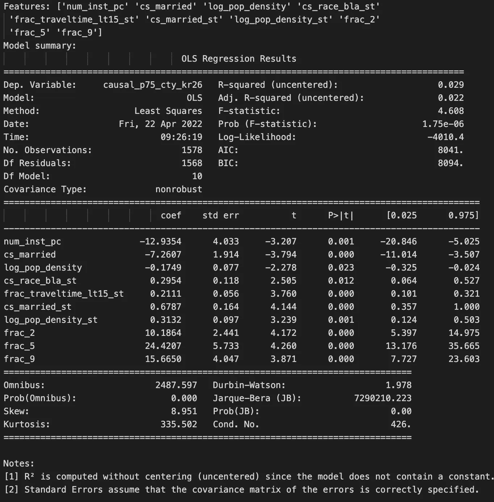
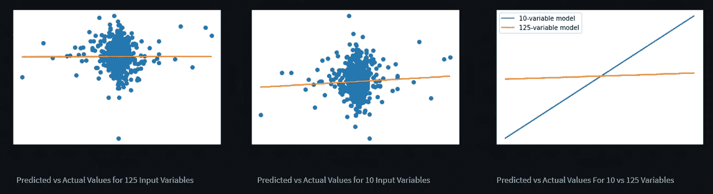
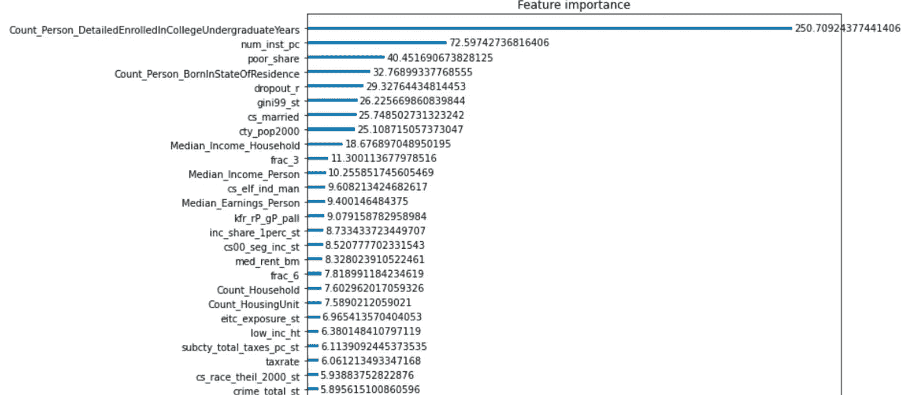
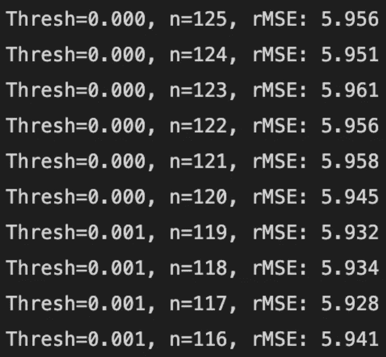

# 美国的代际流动——回归(4/5)

> 原文：<https://towardsdatascience.com/intergenerational-mobility-in-the-us-regression-85b25499e6e6>

> 本系列由 Ibukun Aribilola 和 Valdrin Jonuzi 共同撰写，是社会公益数据科学教程的一部分。

在[上一篇文章](https://apps.streamlitusercontent.com/ibukunlola/dssg_final_project/main/finalised_notebooks%2FRegression%2Fregression.py/+/LINK)中，我们使用 Pandas Profiling 和地理空间制图来获得对数据集的整体理解。我们还研究了如何使用主成分分析和反向消除来缩减变量列表，以提高分析性能。

在本文中，我们将讨论交叉验证以及为什么要这样做，扩展本系列第三篇文章中的普通最小二乘(OLS)回归模型，并使用 XGBoost 运行梯度推进回归模型。最后，我们将使用均方根误差和 r 平方等指标来讨论这些模型的性能。本节使用的代码的完整笔记本可以在[这里](https://github.com/valdrinj/dssg_final_project/blob/main/finalised_notebooks/Regression/IA_regression.ipynb)找到。

# 交叉验证

在设计预测模型时，我们需要采取多种措施来确保模型的稳健性。换句话说，模型在外部数据集上产生的结果应该与在训练数据集上产生的结果相似。交叉验证是一种帮助我们建立稳健模型的程序，因为它涉及对数据集进行重新采样，根据数据子集训练模型，并根据不同的数据子集测试模型，以查看它与测试数据集的吻合程度。它也被称为 k 倍交叉验证，k 指的是数据被分成的子集的数量。

在此分析中，我们通过将数据集随机分为两组(训练集和测试集)来进行双重交叉验证。我们使用来自 [sklearn](https://scikit-learn.org/stable/modules/generated/sklearn.model_selection.train_test_split.html) 的`train_test_split`函数来随机拆分数据集，其中三分之二在训练集中，三分之一在测试集中。

```
from sklearn.model_selection import train_test_split
*# load data*
df = pd.read_csv("../../data/processed/processed_data.csv")*# start with all 125 predictors in the dataset*
predictors = df[df.columns[6:]]
*#pull out the outcome variable column*
outcome = df['causal_p75_cty_kr26']*#cross-validation, train-test split*
pred_train, pred_test, outcome_train, outcome_test = train_test_split(
    predictors, outcome, test_size=1/3, random_state=10)
```

# OLS 回归

让我们回顾一下上一篇文章。逆向选择过程留给我们 10 个变量。下图显示了反向选择过程的输出，这是一个包含这 10 个变量的 OLS 回归模型。



图片来自作者。

这个模型的(差)表现将在下一小节讨论，所以让我们集中解释变量对代际流动性的影响大小。一些影响最大的变量是`frac_5`、`frac_9`和`num_inst_pc`。换句话说，在国民收入分配的第五和第九个十分位数中，父母每增加一个分数，代际流动性就分别增加 24.4 和 15.7。另一方面，根据这个效应大小为-12.9 的模型，人均大学数量对代际流动有负面影响。

# 韵律学

你可能会发现自己想知道这个模型的结果意味着什么，或者如何判断这个模型是否“好”。有几个指标可以帮助我们确定我们的回归模型是否能很好地预测结果变量。在本文中，我们将关注其中的两个指标:均方根误差(RMSE)和 r 平方。

## 均方根误差

RMSE 是通过计算模型的预测结果值和实际结果值之差的平方根得到的一个指标。目标是使 RMSE 为零或尽可能接近零。Python 的“statsmodels”库有一个 rmse 特性，可以自动计算这个值。在下面的代码单元格中，我们用我们开始的所有 125 个变量计算 OLS 模型的 RMSE(向后选择的第 2 步)。这个模型的 RMSE 是 2.44。

```
import statsmodels.api as sm*# Run regression model on all variables*
OLS_mod = sm.OLS(outcome_train, pred_train).fit()
y_pred_init = OLS_mod.predict(pred_test)
rmse_init = sm.tools.eval_measures.rmse(y_pred_init, outcome_test)
print("RMSE:", rmse_init)
OLS_mod.summary()
```

下面的代码单元格显示了我们如何计算有 10 个变量的后向选择模型的 RMSE。这个降维模型的 RMSE 是 2.28，与第一个 OLS 模型相比下降了 6.5%，这是一个改进。

```
p = 0.05
back_elim = backwards_elimination(outcome_train, pred_train, p)
ols = back_elim[0]
features = back_elim[1]
*# use model to predict outcome variable*
y_pred = ols.predict(pred_test[features.columns])
*# calculate rmse*
rmse = sm.tools.eval_measures.rmse(y_pred, outcome_test)
print("RMSE: %.3f, 
Features: %s" % (rmse, features.columns.values), "
Model summary:
", ols.summary())
```

## r 平方

r 平方值是一个度量标准，它描述了输入变量在结果变量中所占的百分比。在包含所有 125 个输入变量的第一个 OLS 模型中，r 平方值为 0.078 或 7.8%，这仅仅意味着还有其他代际流动性的预测因素没有包括在我们的数据中。第二个模型有 10 个输入变量，其 r 平方值为 0.029 或 2.9%，这是有意义的，因为我们已经放弃了许多可能在某种程度上预测代际流动的变量。

我们还可以在预测值与实际值的曲线图上直观显示两个模型的拟合情况。该图传递了与 RMSE 相同的信息，即预测值和实际值之间的差异。拟合良好的模型将显示位于 45 度线附近的分散点，表明它们高度相关。后向消除模型比第一个模型具有更好的拟合，如第三个图中其直线的陡度所突出显示的。



图片来自作者。

总之，两个 OLS 回归模型都不是很稳健，因为模型中没有包括某些变量，这些变量解释了 90%以上的代际流动性差异。但是，后淘汰模型有更好的拟合。

# XGBoost 回归

第二个回归模型使用[梯度提升树算法](https://en.wikipedia.org/wiki/Gradient_boosting)来预测结果变量。我们使用 Python 中的 [XGBoost](https://xgboost.readthedocs.io/en/stable/) 模块运行回归模型并进行特征选择，即减少模型中包含的变量数量。让我们从将这个分析所需的包导入 Python 开始。

```
*# load relevant packages*
from sklearn.feature_selection import SelectFromModel
from sklearn import metrics
from sklearn.compose import ColumnTransformer
from xgboost import plot_importance
from xgboost import XGBRegressor
```

在高层次上，XGBoost 中的特性选择非常类似于本系列第三篇文章中概述的 OLS 特性选择步骤，主要区别在于变量选择标准。此分析的选择标准是特征重要性分数 f-score，也称为“增益”。增益衡量变量对其所添加的分支带来的精度提高。在[这篇文章](/be-careful-when-interpreting-your-features-importance-in-xgboost-6e16132588e7)中阅读更多关于特性重要性分数的信息。下面的代码单元格显示了如何用所有 125 个输入变量拟合一个回归模型，并生成一个重要性图。

```
*# fit model with training data*
model = XGBRegressor()
model.fit(pred_train, outcome_train)
*# feature importance*
print(model.feature_importances_)
*# plot importance*
fig, ax = plt.subplots(figsize=(10, 35))
plot_importance(model, ax=ax, grid=False, importance_type="gain")
plt.show()
```

下面是重要性图的一个片段。它以降序显示每个变量及其重要性分数，最“重要”的变量位于顶部。



图片来自作者。

我们可以使用 RMSE 评估该模型的拟合度，代码如下所示。

```
*# run training model on the test dataset*
y_pred = model.predict(pred_test)
*# evaluate the model using the mean squared error*
rmse = np.sqrt(metrics.mean_squared_error(outcome_test, y_pred))
print(" Root Mean squared error:", rmse)
```

特征选择是通过按重要性分数的升序对变量进行排序，并使用具有相同或更高特征重要性分数的变量运行回归分析来完成的。在这种情况下，重要性分数是阈值或变量选择标准。对于每个模型，我们计算 RMSE，以便我们可以检查每个模型的性能，然后选择一个最适合我们的模型。下面的代码单元显示了我们如何完成这个特性选择过程。

```
thresholds = np.sort(model.feature_importances_)
for thresh in thresholds:
	*# Select features using threshold=importance. Only variables with equal or higher importance will be selected*
	selection = SelectFromModel(model, threshold=thresh, prefit=True) *# Get indices of selected variables and find the corresponding column names. Source: Liang (https://stackoverflow.com/a/42527851)*
	feature_idx = selection.get_support()
	feature_name = pred_train.columns[feature_idx] *# Subset the predictor dataframe with the selected features*
	select_X_train = selection.transform(pred_train) *# Train model*
	selection_model = XGBRegressor()
	selection_model.fit(select_X_train, outcome_train) *# Evaluate model*
	select_X_test = selection.transform(pred_test)
	y_pred = selection_model.predict(select_X_test)
	rmse = np.sqrt(metrics.mean_squared_error(outcome_test, y_pred)) *# Only print out the list of features when we have 10 or less features to save space* 
	if select_X_train.shape[1]<=10:
		print("Thresh=%.3f, n=%d, RMSE: %.3f, Features: %s" % (thresh, select_X_train.shape[1], rmse, feature_name))
	else:
		print("Thresh=%.3f, n=%d, RMSE: %.3f" % (thresh, select_X_train.shape[1], rmse))
```

这个代码单元的结果是 125 行文本，每一行都说明了重要性分数阈值、满足阈值的变量数量以及模型的 RMSE。



图片来自作者。

RMSE 最低(2.680)的模型以本科院校人数为输入变量。第二好的模型是 RMSE 模式(2.684)，使用本科院校的人数和人均院校数量作为输入变量。

虽然 XGBoost 模型产生的模型的 RMSEs 没有 OLS 回归模型小，但 XGBoost 仍然是一个很好的工具，因为它产生的预测模型通常表现更好。

XGBoost 部分的代码改编自 Jason Brownlee 的文章。

# 结论

在本文中，我们讨论了交叉验证及其对防止预测模型过度拟合的重要性。我们还评估了反向消除前后的 OLS 回归模型。我们讨论了作为替代回归工具的 XGBoost，并介绍了如何运行 XGBoost 模型和进行特性选择。我们使用 RMSE 和 r 平方作为我们的回归模型的度量，并发现后向后消除模型比前向后消除模型和最佳 XGBoost 模型具有更好的拟合。在特征选择之后出现的一些值得注意的变量是人均大学数量、大学生数量以及在国民收入排名中处于第五十分位数的父母的比例。在下一篇文章中，我们将学习如何使用分类方法来预测代际流动以及这种方法的利弊。