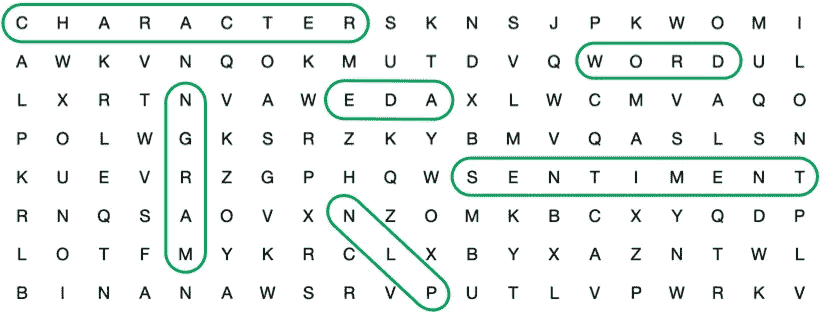
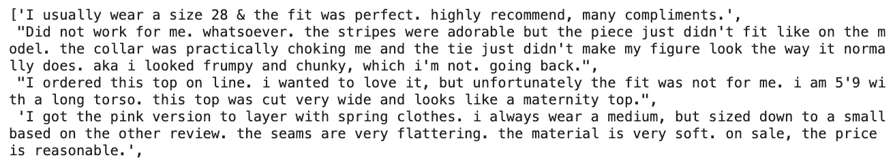
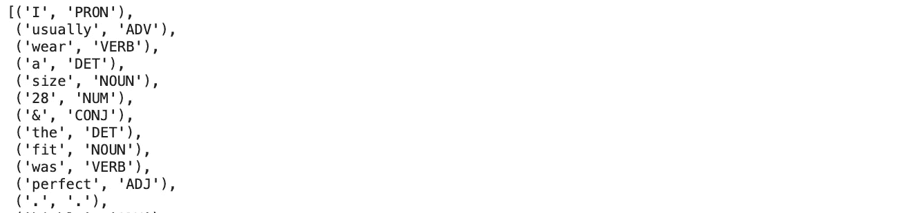
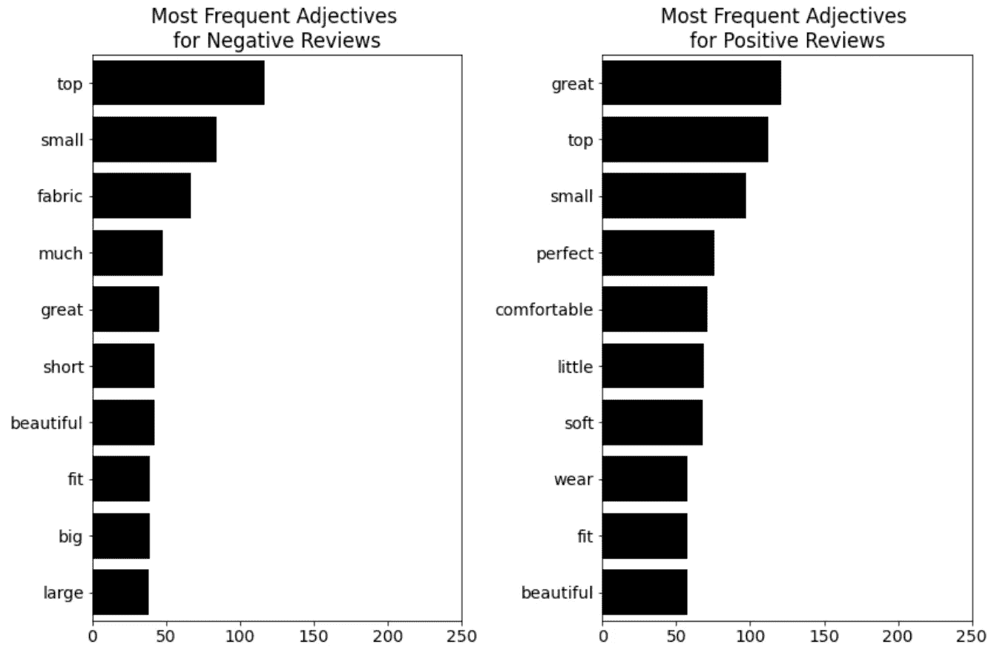
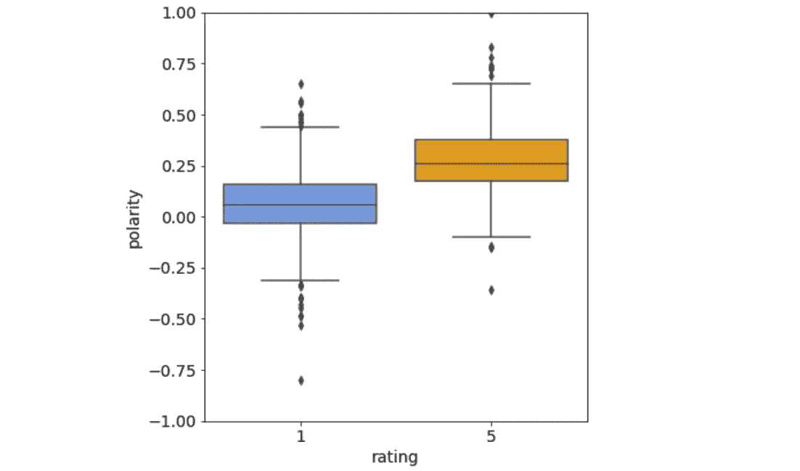

# 面向自然语言处理的中级 EDA 技术

> 原文：<https://towardsdatascience.com/intermediate-eda-techniques-for-nlp-2c898cc96d1d>

## 如何对自然语言处理的文本数据进行探索性数据分析



图片由作者提供。

文本数据的探索性数据分析(EDA)不仅仅是计算字符和术语。为了让你的 EDA 更上一层楼，你可以查看每个单词并对其进行分类，或者你可以分析文本的整体情绪。

> 对文本数据的探索性数据分析不仅仅是计算字符和术语。

在本文中，我们将研究一些针对文本数据的中级 EDA 技术:

1.  [**词性标注**](#74ea) **:** 我们来看看词性(POS)标注，以及如何使用它来获取最常用的形容词、名词、动词等。
2.  [**情绪分析**](#05ba) **:** 我们来看看情绪分析，探究数据集是有正面倾向还是负面倾向。

这篇文章是我上一篇文章[“NLP 的基本 EDA 技术”](/fundamental-eda-techniques-for-nlp-f81a93696a75)的延续。你可以在这里阅读:

</fundamental-eda-techniques-for-nlp-f81a93696a75>  

正如在[上一篇文章](/fundamental-eda-techniques-for-nlp-f81a93696a75)中一样，我们将在本文中再次使用来自 Kaggle 的[女装电子商务服装评论](https://www.kaggle.com/datasets/nicapotato/womens-ecommerce-clothing-reviews)数据集。

为了简化示例，我们将使用 450 条正面评论(`rating == 5`)和 450 条负面评论(`rating == 1`)。这将数据点的数量减少到 900 行，将评级类别的数量减少到两个，并平衡正面和负面的评论。

此外，我们将只使用两列:评论文本和评级。

精简数据集的数据帧头如下所示:


简化的[女性电子商务服装评论](https://www.kaggle.com/datasets/nicapotato/womens-ecommerce-clothing-reviews)数据集负责人(图片由作者提供)

# 词性标注

在[基本 EDA 技术](http://TK)中，我们涵盖了最常见的单词和双字母组合，并注意到像“棒极了”和“完美”这样的形容词是正面评论中最常见的单词。

有了词性标注，您可以根据最常用的术语来细化 EDA。例如，你可以探索**哪些形容词或动词最常用**。

词性标注获取文本中的每个标记，并将其分类为名词、动词、形容词等，如下所示:


*如果你对我是如何形象化这句话感到好奇，你可以在这里查看我的教程:*

</visualizing-part-of-speech-tags-with-nltk-and-spacy-42056fcd777e>  

为了检查哪些 POS 标签是最常见的，我们将从创建数据框架中所有评论文本的语料库开始:

```
corpus = df["text"].values.tolist()
```



作为评论文本列表的语料库(图片由作者提供)

接下来，我们将标记整个语料库，为词性标注做准备。

```
from nltk import word_tokenize
tokens = word_tokenize(" ".join(corpus))
```


令牌列表(图片由作者提供)

然后，我们将使用粗标记集“universal”对语料库中的每个标记进行 POS 标记:

```
import nltk
tags = nltk.pos_tag(tokens, 
                    tagset = "universal")
```



POS 标记令牌(图片由作者提供)

正如在[上一篇文章](/fundamental-eda-techniques-for-nlp-f81a93696a75)的词频分析中一样，我们将通过删除所有停用词来创建一个标签列表。此外，我们将只包括特定标签的单词，例如形容词。

然后我们要做的就是像在[上一篇文章](/fundamental-eda-techniques-for-nlp-f81a93696a75)中一样使用`Counter`类。

```
from collections import Countertag = "ADJ"
stop = set(stopwords.words("english"))# Get all tokens that are tagged as adjectives
tags = [word for word, pos in tags if ((pos == tag) & ( word not in stop))]# Count most common adjectives
most_common = Counter(tags).most_common(10)# Visualize most common tags as bar plots
words, frequency = [], []
for word, count in most_common:
    words.append(word)
    frequency.append(count)

sns.barplot(x = frequency, y = words)
```

下面，你可以看到负面和正面评论中最常见的 10 个形容词:



最常见的形容词由“评级”类分隔(图片由作者提供)。

从这个技巧中，我们可以看到像“小”、“适合”、“大”、“大”这样的词是最常见的。这可能表明顾客对一件衣服的合身程度比对它的质量更失望。

# 情感分析

情感分析的主要思想是理解一个文本是积极的还是消极的语气。例如，句子“我爱这件上衣。”有一个积极的情绪，和句子“我讨厌颜色。”有负面情绪。

您可以使用 [TextBlob](https://textblob.readthedocs.io/en/dev/) 进行简单的情感分析，如下所示:

```
from textblob import TextBlobblob = TextBlob("I love the cut")blob.polarity
```

**极性是一个陈述是正还是负的指标，是一个介于-1(负)和 1(正)之间的数字。**句子“我喜欢剪裁”的极性为 0.5，而句子“我讨厌颜色”的极性为-0.8。

组合句子“我喜欢这种剪裁，但我讨厌这种颜色”的极性为-0.15。

对于文本中的多个句子，您可以获得每个句子的极性，如下所示:

```
text = “I love the cut. I get a lot of compliments. I love it.”
[sentence.polarity for sentence in TextBlob(text).sentences]
```

这段代码返回一个极性数组[0.5，0.0，0.5]。这意味着第一句和最后一句有积极的情绪，而第二句有中性的情绪。

如果我们像这样把这种情感分析应用到整个数据框架中，

```
df["polarity"] = df["text"].map(lambda x: np.mean([sentence.polarity for sentence in TextBlob(x).sentences]))
```

我们可以用下面的代码绘制一个箱线图比较:

```
sns.boxplot(data = df, 
            y = "polarity", 
            x = "rating")
```

下面，您可以看到负面和正面评价的极性箱线图:



由“评级”类分隔的极性(图片由作者提供)。

正如你所料，我们可以看到负面评论(`rating == 1`)的极性总体低于正面评论(`rating == 5`)。

# 结论

在本文中，我们研究了一些针对文本数据的中级 EDA 技术:

1.  **词性标注:**我们以词性标注以及如何使用词性标注来获取最常见的形容词为例。
2.  **情感分析:**我们看了情感分析，探索了评论文本的极性。

下面是所有可快速复制的代码片段:

# 喜欢这个故事吗？

*这里收集了我的其他自然语言处理文章:*


莉奥妮·莫尼加蒂

## 自然语言处理

[View list](https://medium.com/@iamleonie/list/natural-language-processing-nlp-52815a8f7361?source=post_page-----2c898cc96d1d--------------------------------)3 stories

*如果你想把我的新故事直接发到你的收件箱，* [*订阅*](https://medium.com/subscribe/@iamleonie) *！*

*成为媒介会员，阅读更多其他作家和我的故事。报名时可以用我的* [*推荐链接*](https://medium.com/@iamleonie/membership) *支持我。我将收取佣金，不需要你额外付费。*

<https://medium.com/@iamleonie/membership>  

*在* [*Twitter 上找我*](https://twitter.com/helloiamleonie) *，*[*LinkedIn*](https://www.linkedin.com/in/804250ab/)，*[*Kaggle*](https://www.kaggle.com/iamleonie)*！**

# 资料组

《nicapotato》《女装电商服装评论》。(License:CC0:Public Domain)[https://www . ka ggle . com/datasets/nica potato/women-ecommerce-clothing-reviews](https://www.kaggle.com/datasets/nicapotato/womens-ecommerce-clothing-reviews)(2022 年 8 月 30 日访问)。