# 面向所有人的中级 SQL

> 原文：<https://towardsdatascience.com/intermediate-sql-for-everyone-fe35c541147a>

# 面向所有人的中级 SQL

## 创建数据库，学习有用的语法，构建信息查询

马修·布罗德在 [Unsplash](https://unsplash.com?utm_source=medium&utm_medium=referral) 上的照片

当我开始学习 SQL 时，我发现很难超越绝对的基础。我喜欢[数据营的课程](https://www.datacamp.com/courses/introduction-to-sql)，因为我可以直接在屏幕上的控制台上输入代码。但是一旦课程结束，我怎么能实践我学到的东西呢？当我找到的所有教程都是代码片段，而没有我自己可以查询的底层数据库时，我该如何继续改进呢？

我发现自己陷入了一个“先有鸡还是先有蛋”的问题——我需要访问数据库来学习足够的 SQL 以便被录用，但是我所知道的唯一数据库是我试图被录用的那些公司的*！*

**事实证明，创建自己的数据库很简单。在本帖中，我们将创建一个简单的关系数据库，它将让我们探索基础知识之外的 SQL 主题。如果你理解了下面的问题，那么你就为这篇文章的其余部分做好了准备。(如果没有，请查看工程基础帖子中的 [SQL 初级读本和](/engineering-essentials-for-data-science-4a7a92a1ff3e) [SQL 与 NoSQL](/a-hands-on-demo-of-sql-vs-nosql-databases-in-python-eeb955bba4aa) 深度探讨。)**

# 目录

*   安装
*   有用的语法
*   高级查询
*   往引擎盖下看:`EXPLAIN`

# 安装

学习一门新语言时，练习至关重要。阅读这篇文章并点头附和是一回事，能够自己探索想法是另一回事。所以让我们从在你的电脑上建立一个数据库开始，这样你就可以实验和练习了。虽然这听起来有点吓人，但实际上很简单！

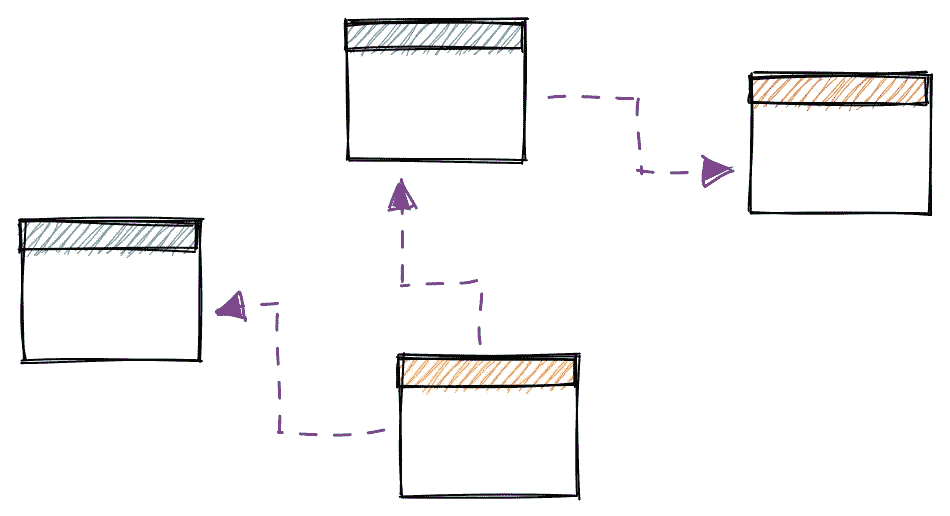

作者图片

第一步是在您的计算机上安装 SQL。我们将使用 [PostgreSQL (Postgres)](https://www.postgresql.org/) ，一种常见的 SQL 方言。为此，我们访问[下载页面](https://www.postgresql.org/download/)，选择我们的操作系统(如 Windows)，然后运行安装。如果您在数据库上设置了密码，请在下一步使用它！(由于我们的数据库不会公开，所以使用类似`admin`的简单密码就可以了。)

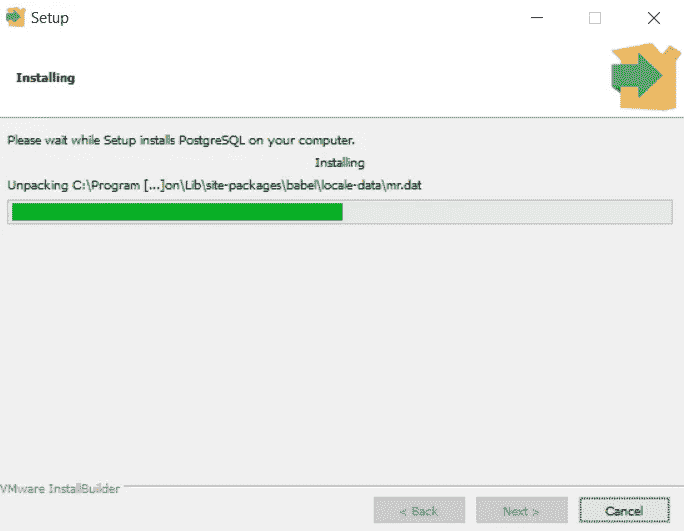

作者截图

下一步是安装 [pgAdmin](https://www.pgadmin.org/) ，这是一个图形用户界面(GUI ),可以轻松地与我们的 PostgreSQL 数据库进行交互。我们通过进入[安装页面](https://www.pgadmin.org/download/)，点击我们操作系统的链接，然后按照步骤操作。

(仅供参考，本教程使用 Postgres 14 和 pgAdmin 4 v6.3。)

一旦两者都安装了，我们打开 pgAdmin 并点击“添加新服务器”这一步实际上建立了一个到现有服务器的连接，这就是为什么我们需要先安装 Postgres。我将我的服务器命名为`home`,并传递了我在 Postgres 安装过程中定义的密码。

我们现在准备创建一些表格！让我们制作一组表格来描述学校可能有的数据:学生、教室和成绩。我们将对数据进行建模，假设一个教室由多个学生组成，每个学生都有多个年级。

我们可以用 GUI 完成所有这些工作，但是我们将编写代码来使我们的工作流可重复。要编写将创建我们的表的查询，我们将右键单击`postgres`(在`home` > `Databases (1)` > `postgres`下)，然后单击查询工具。

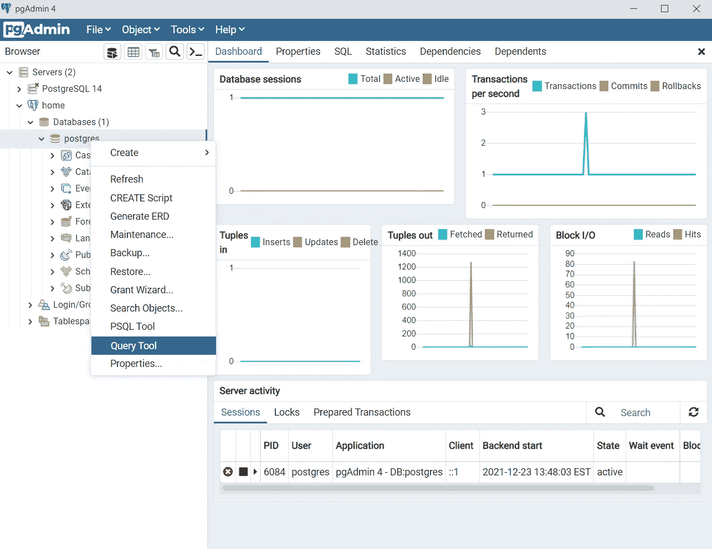

作者截图

让我们从创建`classrooms`表开始。我们将保持这个表的简单:它将只包含一个`id`和`teacher`名称。在查询工具中键入以下代码，然后点击 run。

在第一行中，`DROP TABLE IF EXISTS classrooms`，删除已经存在的`classrooms`表。(有道理！)如果其他表指向它，Postgres 将阻止我们删除`classrooms`，所以我们指定`CASCADE`来覆盖这个约束。[1]这没关系——如果我们删除了`classrooms`，我们可能会从头开始重新生成所有内容，因此所有其他表也会被删除！

在`CREATE TABLE`之前添加`DROP TABLE IF EXISTS`让我们**在脚本**中编写我们的数据库模式，如果我们决定以某种方式改变我们的数据库——添加表、改变列的数据类型等等，这是很方便的。我们可以简单地将生成数据库的指令存储在一个脚本中，当我们想要进行更改时更新该脚本，然后重新运行它。[2]

我们现在也能够[版本控制](https://www.atlassian.com/git/tutorials/what-is-version-control)我们的模式并共享它。事实上，本文中的整个数据库都可以从[这个脚本](https://github.com/mgsosna/sql_fun/blob/main/school/create_db.sql)中重新创建，所以请随意尝试！

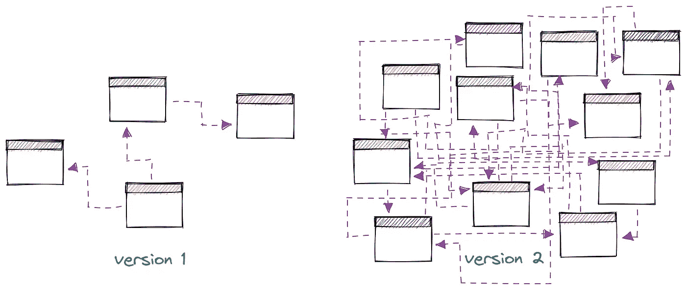

作者图片

第 4 行可能也会引起您的注意:这里我们指定`id`是主键，这意味着该列中的每一行都必须包含一个值，并且每个值都必须是唯一的。为了避免需要跟踪哪些`id`值已经被使用，我们使用了`GENERATED ALWAYS AS IDENTITY`，这是对 [**序列**](https://www.postgresql.org/docs/9.5/sql-createsequence.html) 语法的替代。因此，在将数据插入该表时，我们只需要提供`teacher`名称。

最后，在第 5 行，我们指定`teacher`是一个最大长度为 100 个字符的字符串。[3]如果我们碰到一个老师的名字比这个长，我们就不得不缩写他们的名字或者修改表格。

现在让我们创建`students`表。我们的表将由一个唯一的`id`、学生的`name`和一个指向`classrooms`的 [**外键**](https://www.postgresqltutorial.com/postgresql-foreign-key/) 组成。

我们在创建表之前再次删除它，然后指定一个自动递增的`id`和一个 100 字符的`name`。我们现在包括一个`classroom_id`列，并在第 7-9 行指定该列指向`classrooms`表的`id`列。

通过指定`classroom_id`是一个外键，我们已经设置了一个关于如何将数据写入`students`的规则。Postgres 不允许我们在`students`中插入一个不存在于`classrooms`中的带有`classroom_id`的行。

现在让我们创建一些教室。因为我们指定了`id`列将自动递增，所以我们只需插入教师姓名。

太好了！现在我们有了一些教室，我们可以向`students`添加记录，并引用这些教室。

如果我们得到一个还没有被分配教室的学生，会发生什么？是不是要等他们收到教室才能记录到数据库里？

答案是否定的:**虽然我们的外键需求会阻止写入引用** `**classrooms**` **中不存在的 id，但它允许我们传入一个**`**NULL**`**`**classroom_id**`**。我们可以通过为`classroom_id`显式声明`NULL`或者只传入`name`来做到这一点。****

**最后，我们来记录一些成绩。由于分数对应于*作业*——比如家庭作业、项目、出勤和考试——我们实际上将使用两个表来更有效地存储我们的数据。`assignments`将包含作业本身的数据，而`grades`将记录每个学生在作业中的表现。**

**不过，现在让我们通过 CSV 上传数据，而不是手动插入行。你可以从[这个 repo](https://github.com/mgsosna/sql_fun/tree/main/school) 下载文件或者自己写。请注意，要允许 pgAdmin 访问数据，您可能需要[更新文件夹](https://stackoverflow.com/questions/14083311/permission-denied-when-trying-to-import-a-csv-file-from-pgadmin)(下面的`db_data`)的权限。**

**最后，让我们看一看，以确保一切就绪。下面的查询查找按教师分组的每个作业类别的平均分。**

**建立数据库做得好！我们现在准备试验一些更复杂的 SQL 概念。我们将从您可能还没有遇到过的语法开始，这会让您更好地控制您的查询。然后，我们将介绍一些其他的连接，以及在查询增长到几十行或几百行时组织查询的方法。**

****

**作者图片**

****

**照片由 [Shifaaz shamoon](https://unsplash.com/@sotti?utm_source=medium&utm_medium=referral) 在 [Unsplash](https://unsplash.com?utm_source=medium&utm_medium=referral) 拍摄**

# **有用的语法**

## **过滤器:`WHERE`与`HAVING`**

**您可能熟悉`WHERE`过滤器，并且您可能听说过`HAVING`。但是它们到底有什么不同呢？让我们在`grades`上执行一些查询来找出答案。**

**首先，让我们从`grades`中抽取一些行来提醒我们自己数据是什么样子的。我们使用`ORDER BY RANDOM()`来洗牌，然后用`LIMIT`来取 5。(仅仅为了获得一个样本而对表中的所有行进行排序是非常低效的，但是如果表很小的话，这也没什么。)**

**每一行都是学生在作业中的分数。现在，假设我们想知道每个学生的平均分数。我们会执行一个`GROUP BY`，使用`AVG(score)`和四舍五入来保持整洁。**

**现在，假设我们想要上表，但是只包含那些`avg_score`在 50 和 75 之间的行。换句话说，我们只想显示学生 2。如果我们使用`WHERE`滤镜会发生什么？**

**那看起来一点也不对。学生 5 正确地消失了，但是学生 1、3 和 4 仍然在那里。更糟糕的是，他们的`avg_score`值变了！如果这些数字被写入一份重要的报告，而你不明白发生了什么，这可能会引起一些恐慌。**

**我们实际上想要做的是使用一个`HAVING`滤镜。看下面的区别。**

**这两个查询返回截然不同的结果，因为`**WHERE**` **和** `**HAVING**` **在聚合的不同阶段过滤数据。**上面的`WHERE`查询在聚合之前过滤数据*，而`HAVING`过滤*结果*。***

**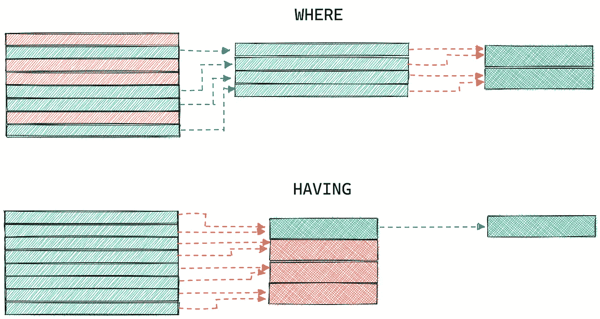**

**作者图片**

****上述** `**WHERE**` **查询中的汇总结果发生了变化，因为我们更改了*用于计算每个学生平均分数的原始数据*。学生 5 没有任何介于 50 和 75 之间的分数，因此被放弃。与此同时，`HAVING`查询只是在计算之后过滤结果。****

**一旦你熟悉了`WHERE`和`HAVING`，你就可以使用它们来创建非常具体的查询，例如查找平均*家庭作业*分数在 50 到 75 之间的学生。**

## **如果——那么:`CASE WHEN` & `COALESCE`**

**在一个列上需要某种类型的`if` - `else`逻辑是很常见的。例如，您可能有一个模型预测表，您希望通过某个阈值将值二进制化为正负标签。**

**在我们的数据库中，假设我们想将`grades`表中的分数转换成字母等级。我们可以用`CASE WHEN`轻松做到这一点。**

**我们传递给`CASE WHEN`的逻辑可以扩展到多个列。例如，我们可以从我们的`students`表中生成一个`instructor`列，其中包含学生的老师(如果有的话)，否则包含他们自己的名字。**

**如果我们所做的只是处理空值，那么`COALESCE`是一个更干净的选择。`COALESCE`返回传递给它的参数中的第一个非空值。重写上面的查询，我们得到这样的结果:**

**漂亮又干净！上面的第 4 行与第二个`CASE WHEN`示例中的第 4–7 行相同:如果`teacher`不为空，则返回该值。否则返回`name`。**

**`COALESCE`将下移您提供的参数，直到找到一个非空值。如果所有值都为空，则返回 null。**

**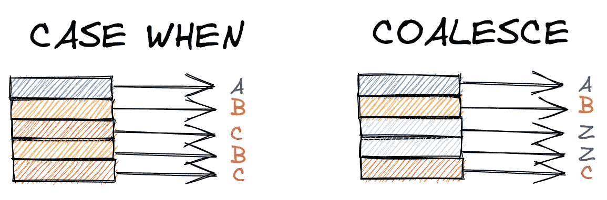**

**作者图片**

**最后，*是 Postgres 中的一个`IF`语句，但是它用于多个*查询的控制流，而不是在一个查询中。作为一名数据科学家，你不太可能经常使用`IF`——即使作为一名数据工程师，我也认为你会在像 [Airflow](https://airflow.apache.org/) 这样的协调器中处理这样的逻辑，所以我们在这里跳过它。[4]**

# **设置运算符:`UNION`、`INTERSECT`和`EXCEPT`**

**当我们`JOIN`表格时，我们横向追加数据*。例如，在下面的查询中，我们将来自`students`、`grades`和`assignments`表的亚当的数据放在一起，创建一个这些列并排的表。***

***水平附加我们的数据在大多数时候对我们很有用。但是如果我们想垂直堆叠查询结果*呢？****

****让我们想象一下，我们的学校腐败得令人难以置信，用学生的名字来决定他们是否毕业，而不是成绩。如果学生的名字 1)以`A`或`B`开头，或者 2)有五个字母长，则通过考试。我们可以通过查找符合每个标准的学生来查找所有即将毕业的学生，然后使用`UNION ALL`将这些行堆叠起来。****

****我们已经在第 4–11 行和第 18–24 行看到了第一个**子查询**，它是更复杂查询的构建块。注意，这些子查询需要被命名为(`x`和`y`)，以便`UNION ALL`能够工作。****

****你可能还注意到我们使用了`UNION ALL`而不是`UNION`。区别在于`UNION ALL`返回*所有的*行，而`UNION`删除重复的行(包括在`x`和`y`内)。这个查询的结果是相同的，因为 Betty 满足两个条件，但是如果我们不包括`reason`列，我们将只看到 Betty 和`UNION`一次。****

****选择`UNION`或`UNION ALL`取决于您想要如何处理副本。当编写复杂的查询时，我更喜欢使用`UNION ALL`来确保结果表具有我期望的行数——如果有重复的，我很可能在前面的某个地方搞砸了`JOIN`。如果您在源头解决问题，而不是在最后过滤，那么您的查询将会更高效。****

****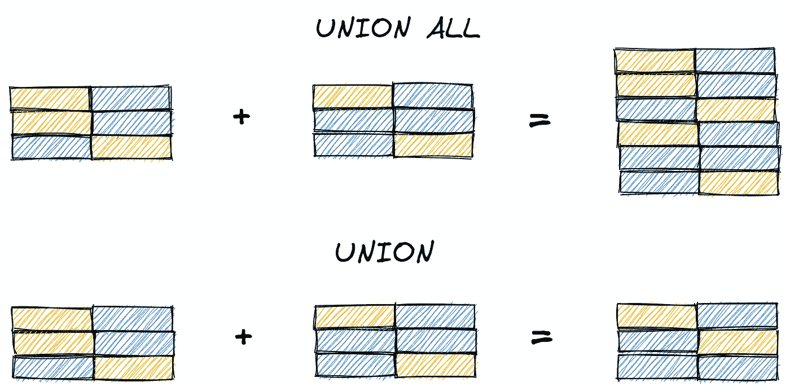****

****作者图片****

****`UNION`和`UNION ALL`是 [**集合操作符**](https://en.wikipedia.org/wiki/Set_operations_(SQL)) ，从子查询 A 和 B 返回*所有*行(sans 与`UNION`重复)。另外两个操作符`INTERSECT`和`EXCEPT`，让我们只返回*符合特定标准*的行。`INTERSECT`只返回出现在*和*子查询中的行，而`EXCEPT`返回 A 中不属于 b 中*而不是*的行。****

****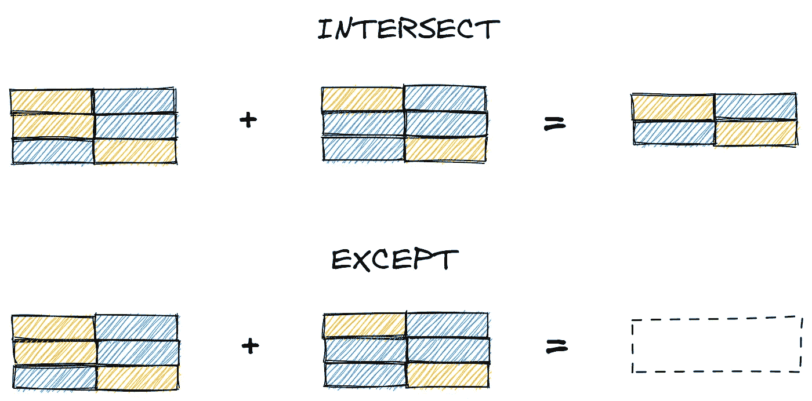****

****作者图片****

****这里我们演示了`INTERSECT`，它查找子查询之间共享的行(即 id 为 2 或 3 的行)。与`UNION`不同，我们不需要命名子查询。****

****这里我们展示了相同的查询，但是使用了`EXCEPT`，它在 A 中查找不在 B 中的*而不是*的行(即 ID 为 1 的行)。****

****集合操作符共同赋予我们组合查询结果(`UNION`)、查看重叠记录(`INTERSECT`)以及精确查看表之间哪些行不同(`EXCEPT`)的能力。不再需要打印表格来堆叠或手动比较它们！****

## ****数组函数****

****关系数据库中的数据通常是 [**原子**](https://en.wikipedia.org/wiki/First_normal_form#Atomicity) ，其中每个单元格包含一个值(例如`grades`表中每行一个分数)。但有时将值存储为数组会很有用。对于这种类型的数据，Postgres 提供了广泛的[数组函数](https://www.postgresql.org/docs/12/functions-array.html)，让我们可以创建和操作数组。****

****一个有用的函数是`ARRAY_AGG`，它将行转换成数组。下面，我们将`ARRAY_AGG(score)`和`GROUP BY name`结合起来，为每个学生创建所有分数的数组。****

****我们可以使用`CARDINALITY`来查找数组的长度，使用`ARRAY_REPLACE`来替换指定的值。(或者，`ARRAY_REMOVE`删除它们。)****

****您可能会发现最后一个有用的函数是`UNNEST`，它将数组解包为行。(本质上与`ARRAY_AGG`相反。)****

****太好了！已经介绍了[过滤器](http://localhost:4000/Intermediate-SQL/#filters-where-vs-having)、 [if-then 逻辑](http://localhost:4000/Intermediate-SQL/#if-then-case-when--coalesce)、[集合操作符](http://localhost:4000/Intermediate-SQL/#set-operators-union-intersect-and-except)和[数组函数](http://localhost:4000/Intermediate-SQL/#array-functions)，现在让我们继续构建更高级的查询。****

****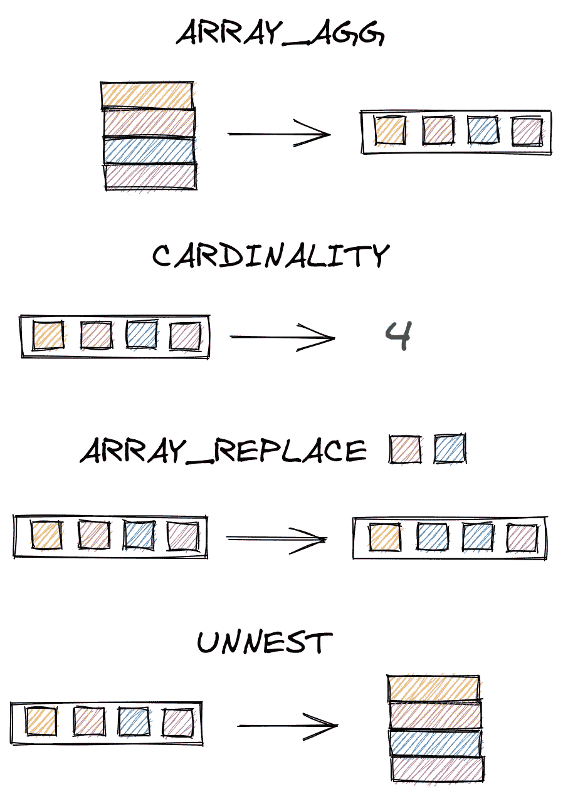****

****作者图片****

********

****照片由[赛夫·穆罕默德](https://unsplash.com/@saiph?utm_source=medium&utm_medium=referral)在 [Unsplash](https://unsplash.com?utm_source=medium&utm_medium=referral) 上拍摄****

# ****高级查询****

## ****自连接****

****有时，我们可能希望将表*与自身*连接起来，以获得我们需要的数据。一个常见的例子是[“经理”问题](https://www.postgresqltutorial.com/postgresql-self-join/)，我们在这里将它重新表述为“最好的朋友”问题。其思想是，如果表中的行包含指向表中其他行的*的值(比如 IDs)，那么我们可以将表*连接到其自身*以获得对应于这些值的附加数据。*****

******

***作者图片***

***让我们从添加然后填充一个`best_friend_id`列到我们的`students`表开始。***

***将最好的朋友的身份存储为一个数字是有效的，但是可读性不是很好。为了确定每个学生最好的朋友是谁，我们进行了一次自我加入。我们将`students` *连接到自身*，其中一个表中的`id`列是另一个表中的`best_friend_id`。在我们的例子中，我们用别名`x`和`y`来区分这些表。***

## ***窗口功能***

***窗口函数类似于聚合函数(任何带有`GROUP BY`的函数)，因为它们将计算应用于一组值。然而，与聚合函数不同，*窗口函数不会减少行数。****

***假设我们取每个学生的平均分。在下面的第 4–6 行，我们添加了`OVER`和`PARTITION BY`来将聚合转换成窗口函数。***

***对于像`AVG`、`MIN`或`MAX`这样的聚合器，`PARTITION BY`分组中的每一行都将具有相同的值。这可能对某些分析有用，但它并不能真正体现窗口函数的优势。***

***一个更有用的案例是**排名**每个学生的分数。首先，这是我们如何对所有学生的分数进行排名。我们使用`RANK() OVER`，然后传入列进行排名。***

***对每个学生的分数*进行排名*是一行代码的修改:我们简单地将`PARTITION BY s.name`添加到`OVER`子句中。***

***[其他窗口功能](https://www.postgresql.org/docs/9.3/functions-window.html)包括计算领先值和滞后值(如时间序列的前一个值)、累积分布以及密集或百分比等级。***

******

***作者图片***

## ***`WITH`***

***让我们通过介绍一种技术来结束这一节，这种技术将使我们能够编写尽可能复杂的查询，只需将子查询串在一起。`**WITH**` **让我们命名一个子查询，**意味着我们可以在其他地方引用该子查询的结果。***

***比方说，我们想标记学生在`grades`的分数是否高于他们的平均分。在一个查询中消除这个问题似乎很简单——我们只需要用一个`GROUP BY`计算每个平均值，然后做一些类似于`g.score > avg`的事情，对吗？先说`GROUP BY`聚合。***

***很简单。但是，我们如何将个人得分与这些平均值进行比较呢？以下两种尝试都会引发错误。***

***我们*可以*通过调用一个窗口函数两次让这个工作起来，但是看起来有点难看。***

***一个更干净、更具可伸缩性的替代方法是使用`WITH`。我们可以将我们的查询分成两个子查询——一个计算平均值，另一个将平均值表加入到`grades`中。***

***`WITH`查询比只写两次窗口函数要长得多。何必呢？这个更详细的查询提供了两个重要的优势:**可伸缩性**和**可读性。*****

***查询可能会变得非常长——在 Meta(脸书)，这是我遇到的最长的查询(到目前为止！)超过 1000 行，调用了 25 个表。如果没有`WITH`子句，这个查询将完全不可读，这些子句划分了代码中不同的、*命名为*的部分。***

***在处理大数据时，我们没有时间依次运行这些子查询，将结果保存到 CSV，然后用 Python 执行合并和分析。所有的数据库交互都需要一次性运行。***

***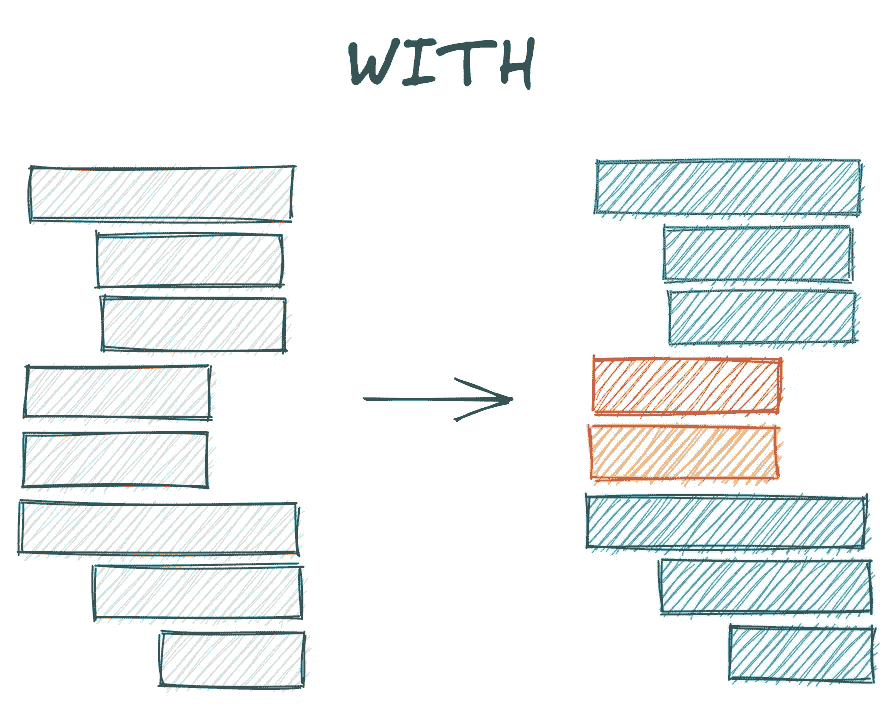***

***作者图片***

***这是另一个例子。比方说，我们学校腐败的成绩及格政策被曝光，管理人员被解雇。现在，通过一门课的标准是 1)你的加权平均分数至少是 85%,或者 2)你的传记项目分数超过 70%。将这个逻辑捆绑到一个`CASE WHEN`中会很痛苦，但是如果我们用`WITH`分解查询，这就很简单了。***

***让我们首先确定哪些学生会通过考试，因为他们的加权平均分数超过了 85%。***

***艰苦的学校！(但是加油卡罗琳！)现在，让我们来确定哪些学生通过了考试，因为他们的传记项目获得了 70%以上的分数。***

***我们希望找到符合任一标准的学生，因此我们需要一个类似如下的查询:***

***这对于`WITH`来说很简单。我们简单地将上面的两个查询命名为`weighted_pass`和`project_pass`，然后像上面一样引用它们。***

******

***照片由[泰勒·尼克斯](https://unsplash.com/@nixcreative?utm_source=medium&utm_medium=referral)在 [Unsplash](https://unsplash.com?utm_source=medium&utm_medium=referral) 上拍摄***

# ***往引擎盖下看:`EXPLAIN`***

***在结束这篇文章之前，让我们讨论最后一个概念。我们对 SQL 了解得越多，就有越多的方法来构建复杂的查询。应该用`EXCEPT`还是`NOT IN`？我们应该执行几个额外的`JOIN`还是使用`WITH`和`UNION ALL`？***

*****本质上，我们如何知道一个查询比另一个查询更高效还是更低效？*****

***Postgres 其实可以告诉你这个。关键字`EXPLAIN`提供了一个 [**执行计划**](https://www.postgresguide.com/performance/explain/) ，详细描述了*Postgres 如何在幕后执行您的查询*。从本文开头重新回顾一下查询，我们看到 Postgres 执行查询的顺序与我们编写查询的顺序完全不同。***

***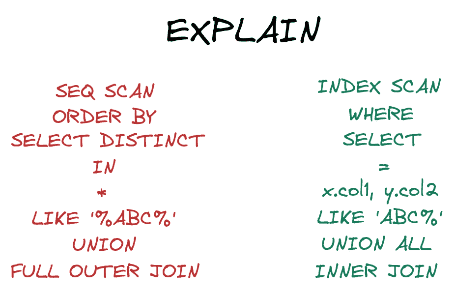***

***作者图片***

***我们可以用`EXPLAIN ANALYZE`更进一步，它将运行查询并详述性能。***

***例如，我们在上面看到，Postgres 顺序扫描(`Seq Scan`)我们的`grades`和`students`表，因为这些表没有索引。换句话说，Postgres 不知道`students`表中后面的行将比前面的行具有更低还是更高的 ID(如果我们要对 ID 进行索引)。这种次优的性能对于我们的小型数据库来说并不是一个大问题，但是如果我们的数据库增长到数百万行，我们肯定需要识别并修复这样的瓶颈。[5]***

******

***丹尼尔·劳埃德·布兰克-费尔南德斯在 [Unsplash](https://unsplash.com?utm_source=medium&utm_medium=referral) 上的照片***

# ***结论***

***这篇文章概述了一些 SQL 技巧，一旦你超越了基础，这些技巧就会变得有用。我们从安装 Postgres 和 pgAdmin 开始，通过在我们自己的笔记本电脑上进行 SQL 实验，为自己的成功做准备。***

***然后，我们讨论了构建更复杂查询的有用语法。我们从过滤器开始，概述了`WHERE`和`HAVING`之间的区别。然后我们讨论了 if-then 逻辑，展示了如何用`CASE WHEN`存储值，用`COALESCE`处理空值。我们用集合操作符从水平合并转移到垂直合并，详细说明了`UNION`、`UNION ALL`、`INTERSECT`和`EXCEPT`如何在提供的表中保留一些或所有行。然后，我们通过展示如何创建和处理数组来结束这一部分。***

***接下来，我们讨论了更高级查询的组件，比如使用自连接来连接自身的表、用于组内比较的窗口函数以及命名子查询的`WITH`。最后，我们讨论了`EXPLAIN`和`EXPLAIN ANALYZE`如何量化我们的查询性能并指出需要改进的地方。***

***想要不断拓展自己的知识面？总是有更多的函数需要学习，比如`CAST`(用于转换数据类型，例如将浮点数转换为整数)，或者[用户自定义函数](https://www.postgresql.org/docs/8.0/xfunc.html)，用于进一步简化您的代码。这些都是有用的，但是实际上我建议考虑让*尽可能优化你的查询。即使在计算能力基本不受限制的 FAANG 公司，如果查询需要的内存超过了服务器的处理能力，查询也会失败。为复杂的查询选择正确的方法会使数据管道更容易维护，这意味着当它中断时，您不太可能在午夜被调用。(希望如此！)****

***最好，
哑光***

******

***作者图片***

# ***脚注***

## ***1.安装***

***当我们在删除一个表时指定`CASCADE`时，实际上会发生什么？一点演示可能会有帮助。***

***假设我们删除了`classrooms`而没有删除任何其他表。`students`中的*数据*不受影响——我们仍然可以看到原始的教室 id。***

***如果我们现在重新创建`classrooms`并输入*不同的*教师，`students`和`classrooms`之间的关系不再准确。***

*****这是因为** `**CASCADE**` **删除了** `**students**` **中的外键引用。**我们可以通过手动将`students`中的`classroom_id`(现在不是外键)更新为不在`classrooms`中的 ID 来看到这一点，但是无法通过`grades`中的`student_id`(其中*是*外键)来做到这一点。***

***关于`CASCADE`的最后一点说明。如果我们在`students`中创建外键时指定了`ON DELETE CASCADE`，那么删除`classrooms`中的行将会删除`students`中的链接行。出于隐私原因，这可能很重要，例如，如果您希望在客户或员工离开您的公司后删除他们的所有信息。***

## ***2.安装***

***编写我们的数据库*模式*是一个工程最佳实践，但是对于实际数据，我们将执行[数据库备份](https://www.ionos.com/digitalguide/server/security/how-does-data-backup-work-for-databases/)。有多种方法可以做到这一点，从占用大量内存的完整备份到相对较轻的更改快照。理想情况下，这些文件被发送到地理上远离存储我们数据库的服务器的某个地方，因此自然灾害不会摧毁您的整个公司。***

## ***3.安装***

***我们将`teacher`列指定为最多 100 个字符的字符串，因为我们不认为我们会遇到比这更长的名称。但是，如果我们将行限制为 100 个字符而不是 200 或 500 个字符，我们真的节省了存储空间吗？***

***在 Postgres 中，无论我们指定 10、100 还是 500，从技术上来说都无关紧要。因此，指定一个限制可能更像是向未来的工程师(包括您自己)传达您对本专栏中的数据的期望的最佳实践。***

***但是在 MySQL [中，大小限制*对*有影响](https://stackoverflow.com/questions/1962310/importance-of-varchar-length-in-mysql-table):临时表和`MEMORY`表将存储长度相等的字符串，填充到表模式中指定的最大值，这意味着如果没有值接近该限制，那么`VARCHAR(1000)`将浪费大量空间。***

## ***4.如果——那么:`CASE WHEN` & `COALESCE`***

***如果你很好奇，下面是带有`IF`语句的 Postgres 代码的样子。***

## ***5.引擎盖下看:`EXPLAIN`***

***随着数据库大小的增长，在表上设置索引对于确保性能至关重要。我们可以很容易地为`grades`中的分数设置一个索引，例如，使用下面的查询:***

***然而，如果我们再次运行`EXPLAIN ANALYZE`，我们将看到 Postgres 仍然运行顺序扫描。这是因为 Postgres 的优化已经超出了一篇“中级 SQL”博客文章所能教给你的！如果表中的行数相对较少，[执行顺序扫描](https://stackoverflow.com/questions/5203755/why-does-postgresql-perform-sequential-scan-on-indexed-column/5203827)实际上比使用索引更快，因此 Postgres 使用更快的方法执行查询。***