# 解读用于时间序列预测的 ACF 和 PACF 图

> 原文：<https://towardsdatascience.com/interpreting-acf-and-pacf-plots-for-time-series-forecasting-af0d6db4061c>

## 如何确定 AR 和 MA 模型的阶数

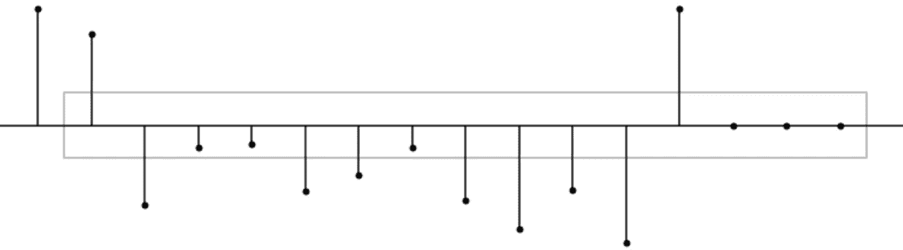

图片由作者通过 [Kaggle](https://www.kaggle.com/code/iamleonie/time-series-interpreting-acf-and-pacf/notebook) 提供

自相关分析是时间序列预测探索性数据分析的重要步骤。**自相关分析有助于检测模式和检查随机性。**当您打算使用自回归移动平均(ARMA)模型进行预测时，这一点尤为重要，因为它有助于确定其参数。该分析包括查看自相关函数(ACF)和偏自相关函数(PACF)图。

> 这篇文章帮助你建立一个解释 ACF 和 PACF 情节的直觉。

这篇文章帮助你建立一种直觉来解释这些 ACF 和 PACF 情节。我们将简要回顾 ACF 和 PACF 的基本原理。然而，由于重点在于对剧情的**解读**，对底层数学的详细讨论超出了本文的范围。我们将参考其他资源。

*本文是我的* [*Kaggle 笔记本*](https://www.kaggle.com/code/iamleonie/time-series-interpreting-acf-and-pacf/notebook) *的改版，原载于 2021 年 12 月。您可以在那里下载或派生代码。*

# 基本原则

ACF 和 PACF 图用于计算 AR、MA 和 ARMA 模型的阶数。在这一节中，我们将只简要介绍相关术语。对于详细的解释，我们将参考其他资源。

## 自回归和移动平均模型

**自回归模型**

自回归(AR)模型假设当前值(y_t)依赖于先前值 ( *y_(* t-1)，y_(t-2)，…)。因为这个假设，我们可以建立一个**线性**回归模型。


要弄清楚一个 AR 模型的**顺序，你需要**看一下 PACF** 。**

**移动平均模型**

移动平均(MA)模型假设当前值(y_t)取决于误差项，包括当前误差(𝜖_t，𝜖_(t-1),…).因为误差项是随机的，所以在当前值和误差项之间没有线性关系。


要搞清楚一个 MA 型号的**顺序，需要**看 ACF** 。**

## 前提条件:平稳性

ACF 和 PACF 假设基础时间序列平稳。

## 自相关函数(ACF)和偏自相关函数(PACF)

ACF 和 PACF 用于计算 AR、MA 和 ARMA 模型的阶数。

如果你需要一些关于 ACF 和 PACF 的介绍或复习，我推荐以下视频:

**自相关函数**

自相关是时间序列与其自身滞后版本之间的相关性。ACF 从滞后 0 开始，这是时间序列与其自身的相关性，因此导致相关性为 1。

我们将使用`statsmodels.graphics.tsaplots`库[5]中的`plot_acf`函数。在这篇文章中，我们将只看 15 个滞后，因为我们使用了最少的例子。

```
from statsmodels.graphics.tsaplots import plot_acfplot_acf(time_series_values, lags = 15) 
```

ACF 图可以回答以下问题:

*   观察到的时间序列**是否为白噪声/随机**？
*   一个观察值是否与一个相邻的观察值相关，一个被删除两次的观察值，等等？
*   观察到的时间序列可以用 **MA 模型**建模吗？如果是，顺序是什么？

**偏自相关函数(PACF)**

> 滞后 k 处的部分自相关是滞后 1 到𝑘−1.没有考虑的 X_t_t 和 X_(t-k)之间的自相关[4]

我们将使用`statsmodels.graphics.tsaplots`库中的`plot_pacf`函数，带有参数`method = "ols"`(时间序列的滞后和常数回归)[5]。

```
from statsmodels.graphics.tsaplots import plot_pacfplot_pacf(time_series_values, lags = 15, method = "ols")
```

*侧注:* `*method*` *的默认参数是* `*yw*` *(Yule-Walker 在 acovf 的分母中调整样本大小)。但是，该默认值会导致样本数据中出现一些高于 1 的不可信自相关。因此，我们将* `*method*` *参数更改为不会导致此问题的参数。* `*ywmle*` *也能很好地工作，就像这篇 StackExchange 帖子中建议的那样[3]。*

PACF 图可以为以下问题提供答案:

*   观察到的时间序列可以用一个 **AR 模型**建模吗？如果是，顺序是什么？

## AR、MA 和 ARMA 模型的阶数

下面你可以看到一个 ACF 和 PACF 图的例子。这些地块被称为“棒棒糖地块”[2]。

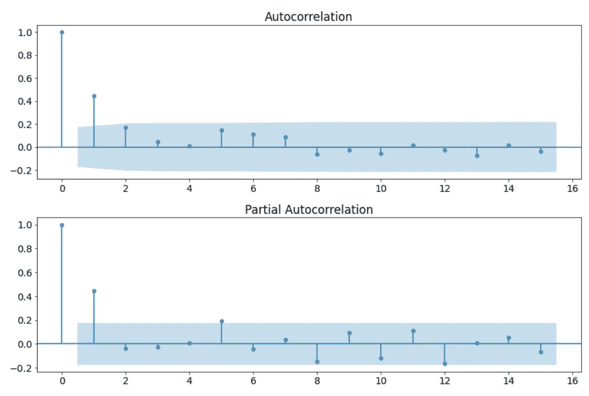

ACF 和 PACF 图的示例。(图片由作者通过 [Kaggle](https://www.kaggle.com/code/iamleonie/time-series-interpreting-acf-and-pacf/notebook) 提供)

ACF 和 PACF 都以 0 的**滞后开始，这是时间序列与其自身的相关性，因此导致 1** 的**相关性。**

ACF 和 PACF 的区别在于计算中是否包含间接相关性。

此外，您可以在 ACF 和 PACF 图中看到一个蓝色区域。这个蓝色区域描绘了 95%的置信区间，并且是**显著性阈值**的指示器。这意味着，蓝色区域内的任何东西在统计上接近于零，蓝色区域外的任何东西在统计上不为零。

要确定模型的顺序，您需要检查:

> “在下一个棒棒糖进入蓝色区域之前，有多少棒棒糖高于或低于置信区间？”— [2]


图片由作者 via [Kaggle](https://www.kaggle.com/code/iamleonie/time-series-interpreting-acf-and-pacf/notebook) 启发而来[1]

# 例子

在本节中，我们将查看一些时间序列示例，并了解:

*   ACF 和 PACF 图是什么样子的
*   如何确定是用 AR 模型还是 MA 模型对时间序列建模
*   如何确定 AR 或 MA 模型的阶数
*   如何找到 AR 或 MA 模型的参数

## AR(1)过程

下面的时间序列是一个 AR(1)过程，有 128 个时间步和`alpha_1 = 0.5`。它满足平稳性的前提条件。


虚构的样本时间序列:alpha_1 = 0.5 的 AR(1)过程(图片由作者通过 [Kaggle](https://www.kaggle.com/code/iamleonie/time-series-interpreting-acf-and-pacf/notebook) 提供)

下图显示了生成的 ACF 和 PACF 图:

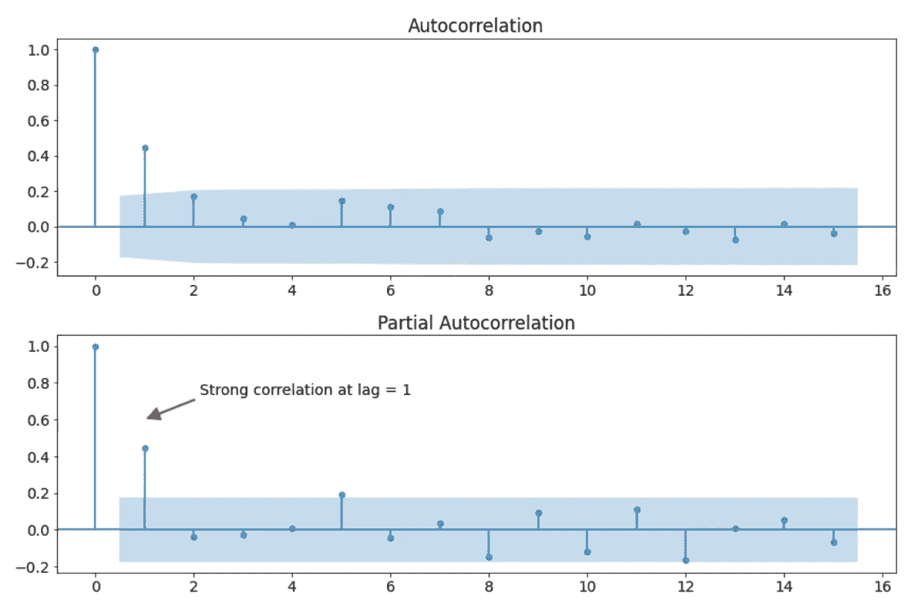

ACF 和 AR(1)过程的 PACF 图。(图片由作者通过 [Kaggle](https://www.kaggle.com/code/iamleonie/time-series-interpreting-acf-and-pacf/notebook) 提供)

我们可以做出如下观察:

*   有几个明显非零的自相关。因此，时间序列是非随机的。
*   PACF 图中相邻(滞后= 1)之间的高度自相关
*   ACF 图中的几何衰减

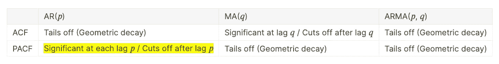

基于上表，我们可以使用一个 **AR(1)模型**来建模这个过程。

对于 AR(p=1)，公式为


可以重写为以下内容:


为了找到参数`alpha_1`,我们拟合 AR 模型如下:

```
from statsmodels.tsa.ar_model import AutoRegar_model = AutoReg(X_train, **lags = 1**).fit()

ar_model.summary()
```

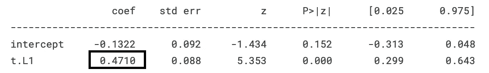

AR 模型拟合的参数。(图片由作者通过 [Kaggle](https://www.kaggle.com/code/iamleonie/time-series-interpreting-acf-and-pacf/notebook) 提供)

如您所见，AR(1)模型符合一个`alpha_1 = 0.4710`，它与我们设定的`alpha_1 = 0.5`非常接近。

## AR(2)过程

以下时间序列是具有 128 个时间步长的 AR(2)过程，`alpha_1 = 0.5`和`alpha_2 = -0.5`。它满足平稳性的前提条件。

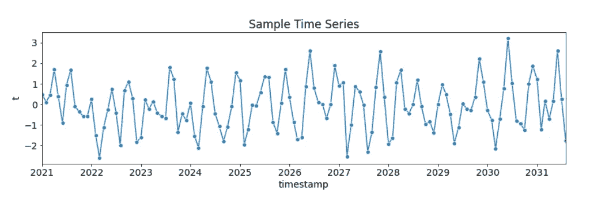

虚构样本时间序列:alpha_1 = 0.5，alpha_2 = -0.5 的 AR(2)过程(图片由作者通过 [Kaggle](https://www.kaggle.com/code/iamleonie/time-series-interpreting-acf-and-pacf/notebook) 提供)

下图显示了生成的 ACF 和 PACF 图:

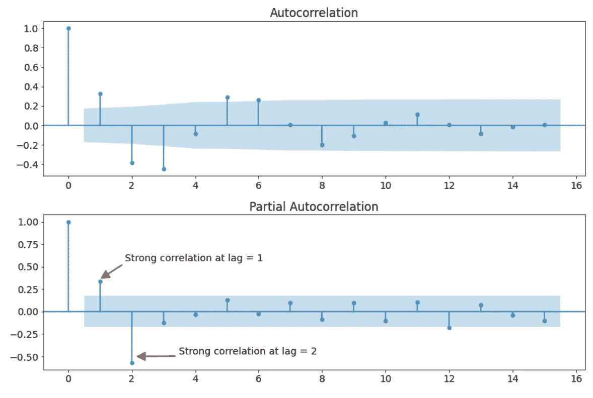

ACF 和 AR(2)过程的 PACF 图。(图片由作者通过 [Kaggle](https://www.kaggle.com/code/iamleonie/time-series-interpreting-acf-and-pacf/notebook) 提供)

我们可以做出如下观察:

*   有几个明显非零的自相关。因此，时间序列是非随机的。
*   PACF 图中相邻(滞后= 1)和近相邻(滞后= 2)观测值之间的高度自相关
*   ACF 图中的几何衰减


图片由作者通过 [Kaggle](https://www.kaggle.com/code/iamleonie/time-series-interpreting-acf-and-pacf/notebook) 获得灵感[1]

基于上表，我们可以使用一个 **AR(2)模型**来建模这个过程。

对于 AR(p=2)，公式为


可以重写为以下内容:


为了找到参数`alpha_1`和`alpha_2`，我们拟合 AR 模型如下:

```
from statsmodels.tsa.ar_model import AutoRegar_model = AutoReg(X_train, **lags = 2**).fit()

ar_model.summary()
```

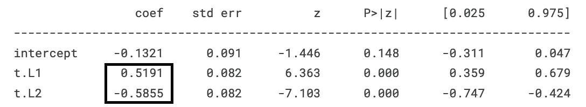

AR 模型拟合的参数。(图片由作者通过 [Kaggle](https://www.kaggle.com/code/iamleonie/time-series-interpreting-acf-and-pacf/notebook) 提供)

如你所见，AR(2)模型符合一个`alpha_1 = 0.5191`和`alpha_2 = -0.5855`，与我们设定的`alpha_1 = 0.5`和`alpha_2 = -0.5`相当接近。

## MA(1)过程

以下时间序列是具有 128 个时间步长和`beta_1 = 0.5`的 MA(1)过程。它满足平稳性的前提条件。

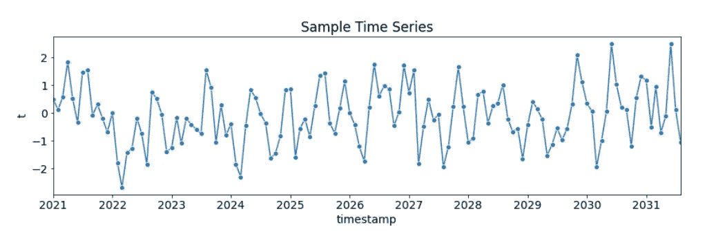

虚构的样本时间序列:beta_1 = 0.5 的 MA(1)过程(图片由作者通过 [Kaggle](https://www.kaggle.com/code/iamleonie/time-series-interpreting-acf-and-pacf/notebook) 提供)

下图显示了生成的 ACF 和 PACF 图:

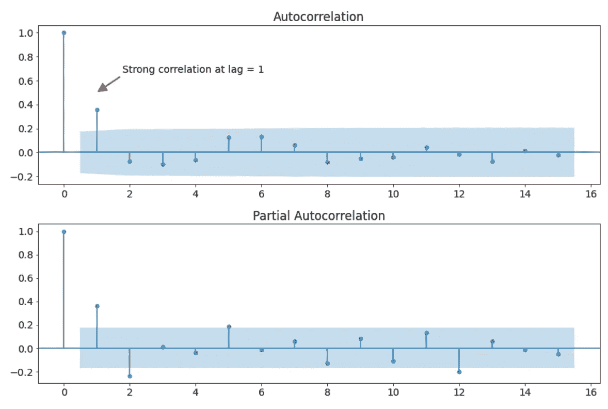

ACF 和 MA(1)过程的 PACF 图。(图片由作者通过 [Kaggle](https://www.kaggle.com/code/iamleonie/time-series-interpreting-acf-and-pacf/notebook) 提供)

我们可以做出如下观察:

*   有几个明显非零的自相关。因此，时间序列是非随机的。
*   ACF 图中相邻(滞后= 1)之间的高度自相关
*   PACF 图中的几何衰变

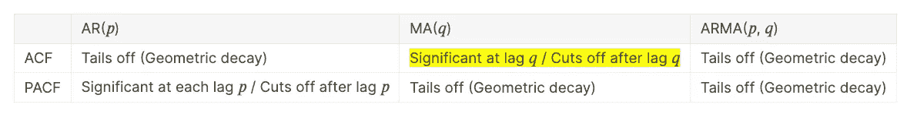

图片由作者 via [Kaggle](https://www.kaggle.com/code/iamleonie/time-series-interpreting-acf-and-pacf/notebook) 启发而来[1]

基于上表，我们可以使用一个 **MA(1)模型**来对这个过程建模。

用 MA(q=1)，公式


可以重写为以下内容:


为了找到参数`beta_1`,我们拟合 MA 模型如下:

```
from statsmodels.tsa.arima_model import ARMAma_model = ARMA(X_train, **order = (0, 1)**).fit()

ma_model.summary()
```

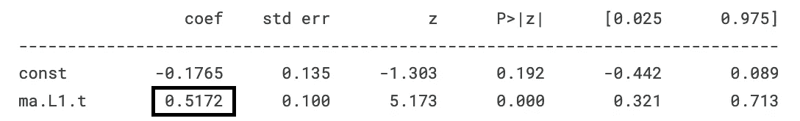

(AR)MA 模型拟合的参数。(图片由作者通过 [Kaggle](https://www.kaggle.com/code/iamleonie/time-series-interpreting-acf-and-pacf/notebook) 提供)

正如你所看到的，MA(1)模型符合一个`beta_1 = 0.5172`，它与我们设定的`beta_1 = 0.5`非常接近。

## MA(2)过程

下面的时间序列是一个 MA(2)过程，有 128 个时间步和`beta_1 = 0.5`和`beta_2 = 0.5`。它满足平稳性的前提条件。

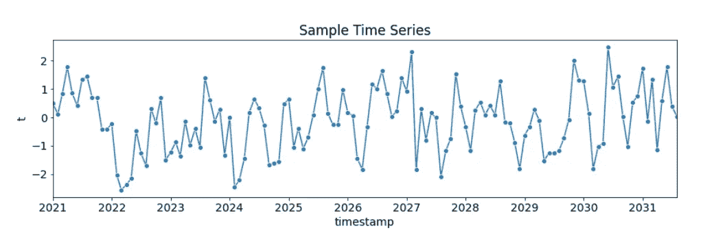

虚构的样本时间序列:beta_1 = 0.5 和 beta_2 = 0.5 的 MA(2)过程(图片由作者通过 [Kaggle](https://www.kaggle.com/code/iamleonie/time-series-interpreting-acf-and-pacf/notebook) 提供)

下图显示了生成的 ACF 和 PACF 图:

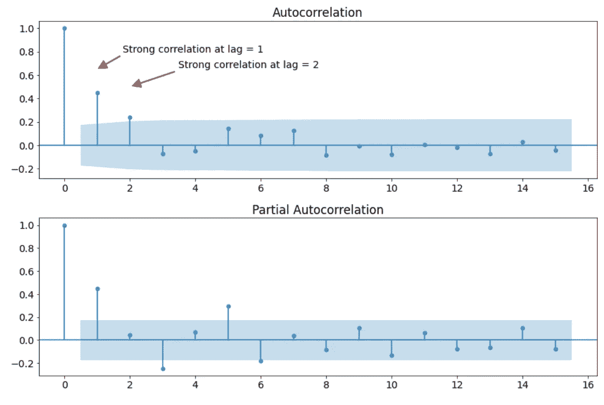

ACF 和 MA(2)过程的 PACF 图。(图片由作者通过 [Kaggle](https://www.kaggle.com/code/iamleonie/time-series-interpreting-acf-and-pacf/notebook) 提供)

我们可以做出如下观察:

*   有几个明显非零的自相关。因此，时间序列是非随机的。
*   ACF 图中相邻(滞后= 1)和近相邻(滞后= 2)观测值之间的高度自相关
*   PACF 图中的几何衰变


图片由作者 via [Kaggle](https://www.kaggle.com/code/iamleonie/time-series-interpreting-acf-and-pacf/notebook) 启发而来[1]

根据上表，我们可以使用一个 **MA(2)模型**来对这个过程建模。

用 MA(q=2)，公式


可以重写为以下内容:


为了找到参数`beta_1`和`beta_2`，我们拟合 MA 模型如下:

```
from statsmodels.tsa.arima_model import ARMAma_model = ARMA(X_train, **order = (0, 2)**).fit()

ma_model.summary()
```

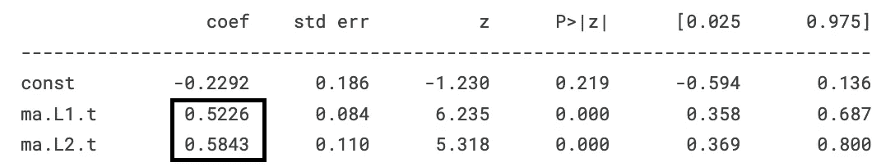

(AR)MA 模型拟合的参数。(图片由作者通过 [Kaggle](https://www.kaggle.com/code/iamleonie/time-series-interpreting-acf-and-pacf/notebook) 提供)

如你所见，MA(2)模型符合一个`beta_1 = 0.5226`和`beta_2 = 0.5843`，与我们设定的`beta_1 = 0.5`和`beta_2 = 0.5`相当接近。

## 期刊

以下时间序列是周期性的，T=12。它由 48 个时间步长组成。

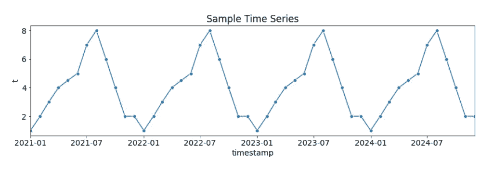

虚构的样本时间序列:T=12 的期刊(图片由作者通过 [Kaggle](https://www.kaggle.com/code/iamleonie/time-series-interpreting-acf-and-pacf/notebook) 提供)

下图显示了生成的 ACF 和 PACF 图:

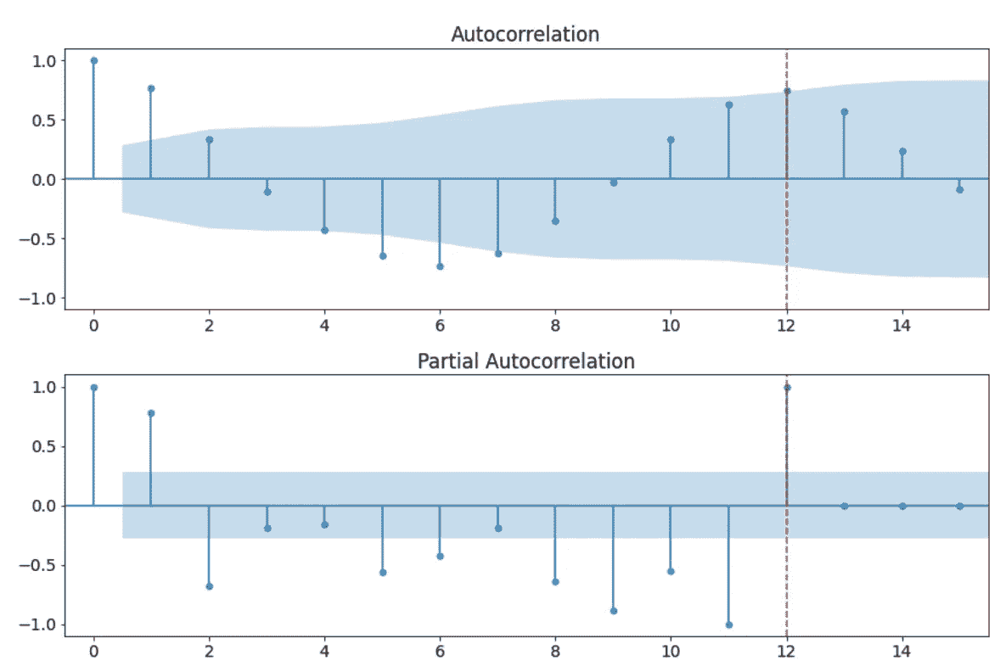

ACF 与周期过程的 PACF 图。(图片由作者通过 [Kaggle](https://www.kaggle.com/code/iamleonie/time-series-interpreting-acf-and-pacf/notebook) 提供)

我们可以做出如下观察:

*   有几个明显非零的自相关。因此，时间序列是非随机的。
*   PACF 图中相邻(滞后= 1)和近相邻观测值之间的高度自相关
*   从 ACF 和 PACF 图中，我们可以看到与相邻观测值(滞后= 1)的强相关性，以及滞后 12，这是 t 的值


图片由作者 via [Kaggle](https://www.kaggle.com/code/iamleonie/time-series-interpreting-acf-and-pacf/notebook) 启发而来[1]

对于 AR(p=12)，公式为


可以重写为以下内容:

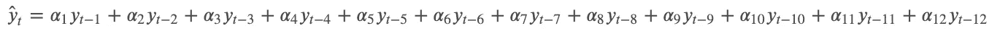

为了找到参数`alpha_1`到`alpha_12`，我们拟合 AR 模型如下:

```
from statsmodels.tsa.ar_model import AutoRegar_model = AutoReg(X_train, **lags = 12**).fit()

ar_model.summary()
```

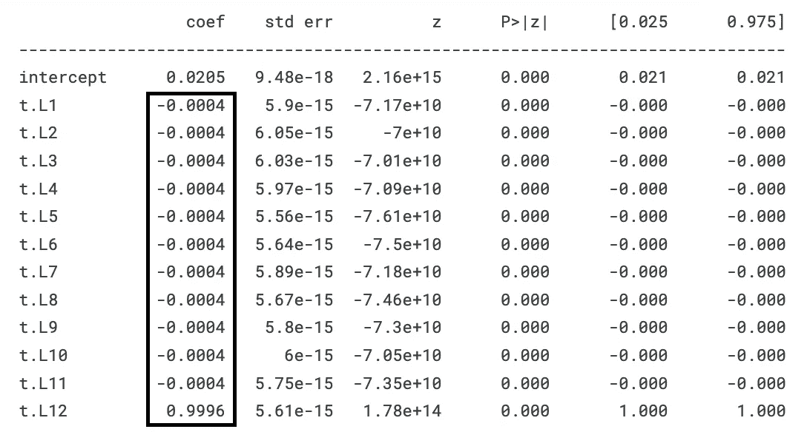

AR 模型拟合的参数。(图片由作者通过 [Kaggle](https://www.kaggle.com/code/iamleonie/time-series-interpreting-acf-and-pacf/notebook) 提供)

如你所见，MA(2)模型符合参数`alpha_1..11 = -0.0004`和`alpha_12 = 0.9996`，与我们设定的`alpha_1..11 = 0`和`alpha_12 = 1`相当接近。

有了这些参数，公式可以改写如下:


## 白噪声

以下时间序列是随机的。它由 48 个时间步长组成。

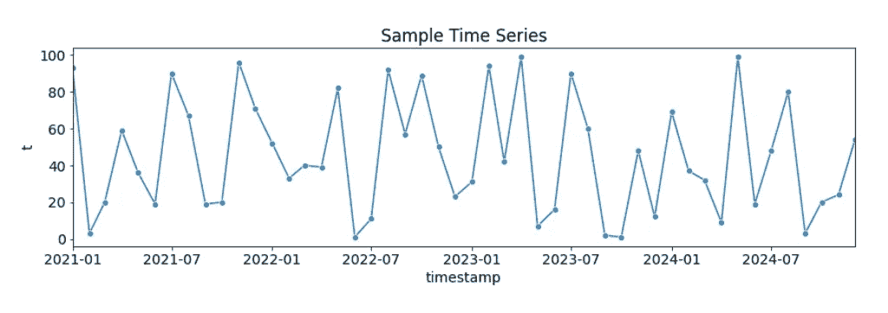

虚构的时间序列样本:白噪声(图片由作者通过 [Kaggle](https://www.kaggle.com/code/iamleonie/time-series-interpreting-acf-and-pacf/notebook) 提供)

下图显示了生成的 ACF 和 PACF 图:

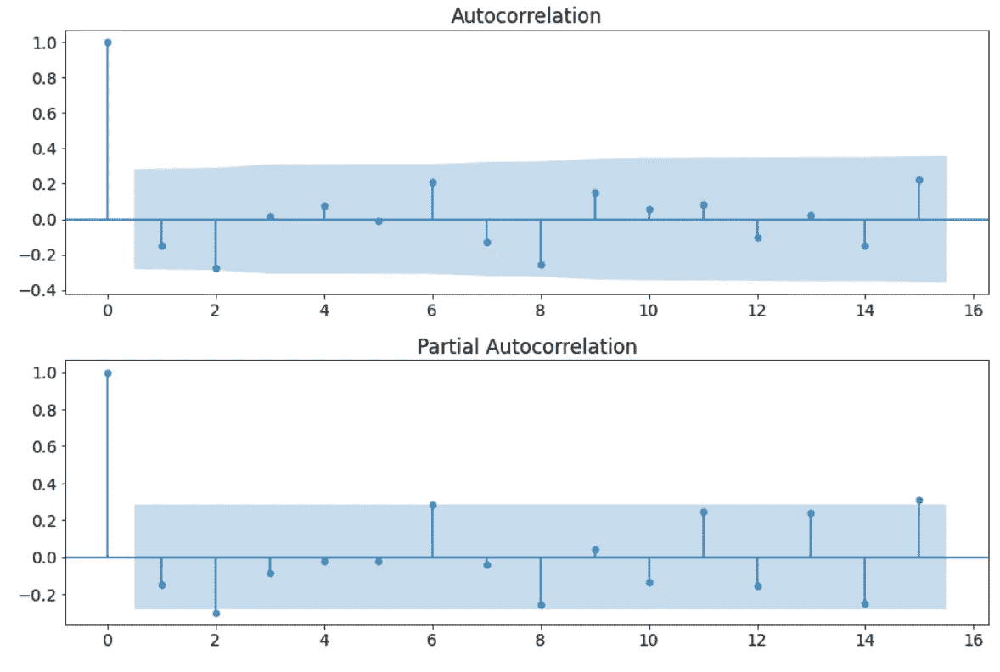

ACF 和白噪声的 PACF 图。(图片由作者 via [Kaggle](https://www.kaggle.com/code/iamleonie/time-series-interpreting-acf-and-pacf/notebook)

我们可以做出如下观察:

*   只有一个自相关在滞后为 0 时显著非零。因此，时间序列是随机的。

建模白噪声是困难的，因为我们无法从 ACF 和 PACF 图中检索任何参数。

# 结论

在本文中，我们查看了 AR 和 MA 过程、周期性时间序列和白噪声的各种示例，以帮助您建立解释 ACF 和 PACF 图的直觉。

本文讨论了:

*   如何检测时间序列中的随机性
*   如何确定是用 AR 模型还是 MA 模型对时间序列建模
*   如何确定 AR 或 MA 模型的阶数
*   如何找到 AR 或 MA 模型的参数

下图以备忘单的形式直观地总结了本文:

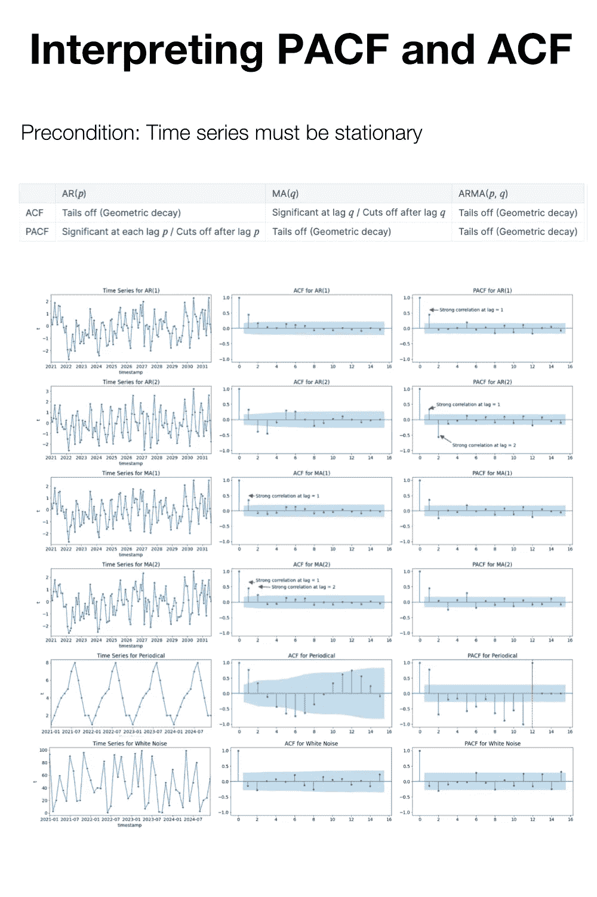

解读 ACF 和 PACF 备忘单(图片由作者提供)

# 喜欢这个故事吗？

成为一名媒体会员，阅读更多来自我和其他作家的故事。报名时可以使用我的 [*推荐链接*](https://medium.com/@iamleonie/membership) *支持我。我将收取佣金，不需要你额外付费。*

[](https://medium.com/@iamleonie/membership) [## 通过我的推荐链接加入 Medium—Leonie Monigatti

### 阅读 Leonie Monigatti(以及媒体上成千上万的其他作家)的每一个故事。您的会员费直接…

medium.com](https://medium.com/@iamleonie/membership) 

*在*[*LinkedIn*](https://www.linkedin.com/in/804250ab/)*和*[*ka ggle*](https://www.kaggle.com/iamleonie)*！*

# 参考

[1] S. Ali，“解读 ACF 和 PACF 阴谋——缺失的手册/备忘单”。linkedin.com。[https://www . LinkedIn . com/pulse/reading-ACF-pacf-plots-missing-manual-cheat sheet-saq IB-Ali/](https://www.linkedin.com/pulse/reading-acf-pacf-plots-missing-manual-cheatsheet-saqib-ali/)(2022 年 7 月 27 日访问)

[2]“Arauto”，“如何为模型选择参数”。arauto . readthe docs . io .[https://arauto . readthe docs . io/en/latest/how _ to _ choose _ terms . html](https://arauto.readthedocs.io/en/latest/how_to_choose_terms.html)(2022 年 7 月 29 日访问)

[3]“交叉验证”，“非常高的 PACF 值(> 10)意味着什么？”。stackexchange.com。[https://stats . stack exchange . com/questions/380196/what-do-very-high-pacf-values-10-mean](https://stats.stackexchange.com/questions/380196/what-do-very-high-pacf-values-10-mean)(2022 年 7 月 27 日访问)

[4] NIST，“6.4.4.6.3。偏自相关图”。nist.gov。https://www . ITL . NIST . gov/div 898/handbook/PMC/section 4/PMC 4463 . htm(2022 年 7 月 27 日访问)

[5]“stats models 0 . 14 . 0(+497)”，“statsmodels.tsa.stattools.acf”。statsmodels.org。[https://www . stats models . org/dev/generated/stats models . TSA . stat tools . ACF . html](https://www.statsmodels.org/dev/generated/statsmodels.tsa.stattools.acf.html)(2022 年 7 月 27 日访问)