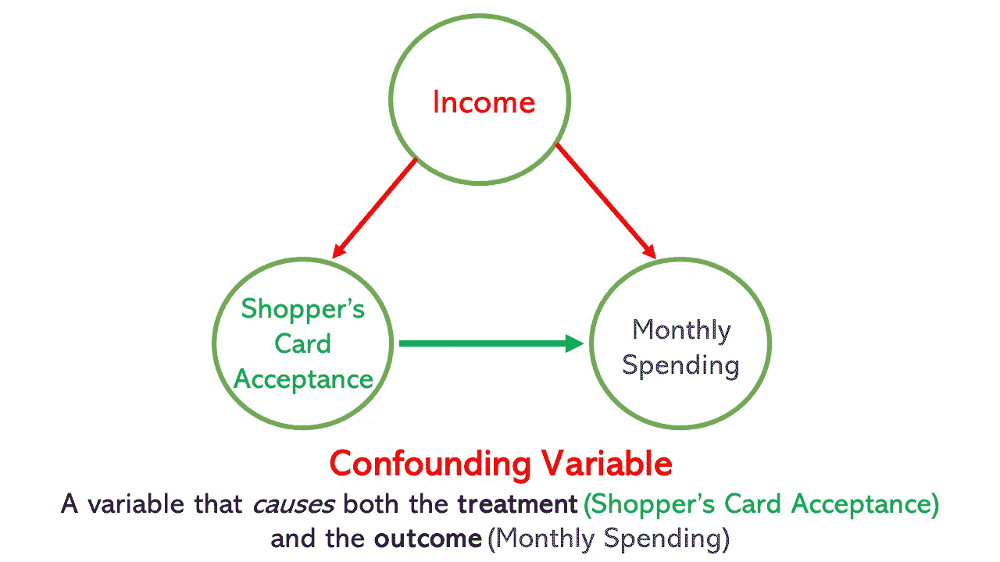
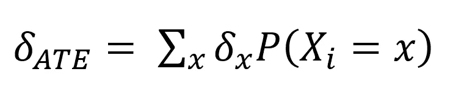
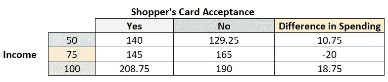
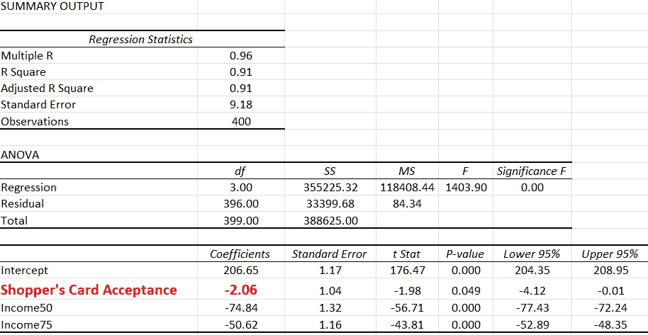
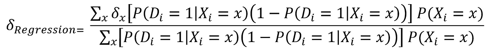
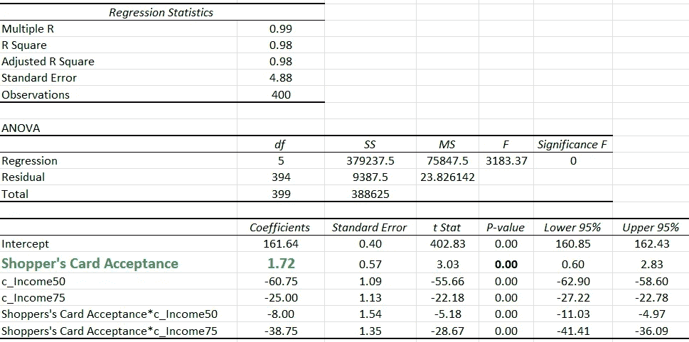
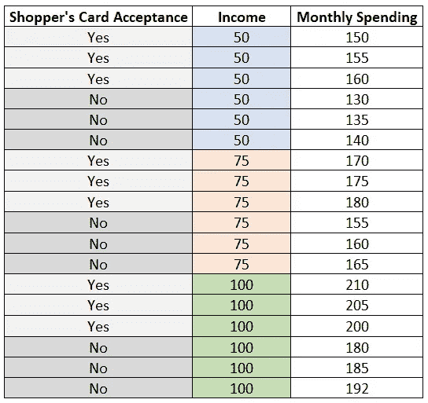

# 解读回归系数:希望我以前就知道

> 原文：<https://towardsdatascience.com/interpreting-regression-coefficient-wish-i-had-known-this-before-177dabb27f58>

## 回归估计量的直观解释


在 [Unsplash](https://unsplash.com?utm_source=medium&utm_medium=referral) 上由 [Samia Liamani](https://unsplash.com/es/@mialiamani?utm_source=medium&utm_medium=referral) 拍摄的照片

如果你学过应用计量经济学/统计学/数据科学的入门课程，你必须熟悉*使用回归估计的线性模型中预测因子系数的解释*。**今天我要分享一个直观的例子来强调这样一个事实——*就像这个作者*——你*(大概)*带着对兴趣系数的误解通过了入门课程/课程。**

** *这篇文章是我上一篇文章的延续，我将使用相同的玩具示例(不同的数字)。万一你错过了，你可以考虑快速浏览一下。然而，阅读是可选的，因为我要重复必要的部分。***

[](/what-does-it-mean-to-control-for-something-in-multiple-regression-744880620988)  

# 假设的例子

上个月，一家连锁杂货店 XYZ 向所有光顾其 ABC 市商店的顾客提供购物卡。有些顾客接受了这张卡，有些则没有。该连锁店在其他 10 个城市有商店，在其他城市引入该卡之前，他们试图了解接受购物卡在影响每月消费方面的效果如何。你被聘为分析师来调查这个问题！

首先，你意识到**购物卡既不是随机提供的，也不是随机接受的**。由于您接受过因果建模培训，因此您担心混淆变量，即*影响治疗(接受购物卡)和结果(每月在商店消费)的因素*。

你对接受卡片的人(治疗组)和不接受卡片的人(对照组)的特征做一些背景研究。仔细探索之后，你发现收入是两个群体唯一的区别。高收入的顾客更有可能接受购物卡；此外，根据你的先验知识，你知道高收入顾客更有可能在商店花费更多。你有信心做出这样的假设:除了收入，这两个群体平均来说是相同的。



让我们看看数据集。为了简单起见，我们假设只有三个收入群体:50k，75k 和 100k。


这个假数据集有 400 个观察值，但您只能关注这 16 个观察值。我将这 16 个观察值复制粘贴了 25 次，使样本量达到 400，这样我就得到统计上显著的结果:D

# **手动估计平均因果效应**

**(Angrist and Pischke，2009)** 在他们著名的计量经济学教材《大多无害计量经济学》中提到了以下关于**平均待遇效应(ATE)的表述:**



** *我在本文中使用术语平均因果效应来指代相同的估计需求(即我试图估计的东西)***

在我们的例子中， *delta_x* 是在 *X_i* **(收入类别)**的每个值下*接受卡*的人和*不接受卡*的人之间的平均月支出的*差。 *P(X_i=x)* 是 *X_i* **的概率质量函数(即三个收入类别中每一个的总回答者比例)**。*

简而言之，你要做以下事情:

1.  在三个收入类别( *X_i* )的每一个中，计算接受卡的人和不接受卡的人之间的平均月支出的差异( *delta_x)* )。
2.  将每个特定收入类别的差异( *delta_x)* 乘以该特定类别中总受访者的比例*P(X _ I = X)*，并将它们相加得到一个估计值。



> **= 10.75 *(5/16)-20 *(6/16)+18.75(5/16)=****1.72****

*太好了！但是，正如我们在上一篇文章中所讨论的，我们更喜欢使用回归来估计平均因果效应，因为我们不仅想得到点估计，还想得到标准误差*(也因为我们很聪明🤓)*。*

# *使用回归估计平均因果效应*

*您使用回归估计以下**传统模型**:*

**月支出= B0+****B1*****购物卡受理+ b2*Income50 +b3*Income75+ e**

*其中购物卡接受度是一个虚拟变量，如果顾客接受该卡，则取值 1，否则取值 0；Income50 是一个虚拟变量，如果客户的收入为 5 万美元，则取值为 1，否则取值为 0；Income75 是一个虚拟变量，如果客户的收入为 7.5 万美元，则取值为 1，否则取值为 0。并且， *e* 是误差项，其包括每月花费的所有其他原因；重要的是，这些其他原因对顾客是否接受购物卡没有任何影响(*因为你假设它只取决于你已经在模型中考虑的收入)。*最后，在这个常规模型中， ***b1*** 是**的**回归估计量**的平均因果效应。***

******* *我会这样解读 B1；否则，在这种特定的环境下使用回归有什么意义呢？*😕 *****

*这是我使用回归估计上述模型时得到的结果:*

**

*天哪！😲*

# *虽然真实的**平均因果效应**为 **1.72，但是**的**回归估计平均因果效应**为 **-2.06，尽管控制了混杂变量！***

*让我们暂时忘记因果关系。*

*让我们假设你正在做一项描述性/相关性研究。在这种情况下，您会得出以下一个或两个结论:*

1.  *在控制收入的情况下，购物卡的接受度与月支出呈显著负相关。*
2.  *在控制收入的情况下，平均来说，接受购物卡的顾客比不接受购物卡的顾客每月花费少 2.06 美元。这种差异在 5%的显著性水平上具有统计显著性**。***

# ***猜猜看！你的(描述性的/** 相关性的**)结论，基于回归估计，将是明显错误的。而且，你的老板——他相信数据驱动的决策——会将这一结论解释为购物卡对每月支出有整体负面影响的证据。🥺***

# *了解回归估计量*

*现在，让我们试着理解为什么回归估计与真正的平均因果效应相差如此之大。*

***(Angrist 和 Pischke，2009)** 提到普通最小二乘(OLS)回归使用**不同的权重**来估计平均因果效应。回归估计量可以表示为:*

**

*** *在我们的案例中，D 是待遇(购物卡接受度)，X 是混杂变量/协变量(收入)****

*让我们使用这个公式，看看我们是否得到与回归**(即-2.06)** 相同的估计值。我们使用以下步骤:*

> ****(1)*** *计算收入类别权重:**

**

> ****(2)*** *计算* **增量 _ 回归 *:****
> 
> ***delta _ Regression***=(10.75 * 0.05+20 * 0.09375+18.75 * 0.05)/(0.05+0.09375+0.05)=****-2.06****

# *很有趣，不是吗？🤔*

*根据 **(Angrist 和 Pischke，2009)，“回归将最大的权重放在治疗状态的条件方差最大的协变量细胞上。”因此，基本上，回归估计器估计一个方差加权平均因果效应**，这是我们不希望看到的** 🥺.在我们的示例中，三种收入类别中购物卡接受度的差异为:***

**

*** *我用的是 VAR。excel 中的 s 函数****

*由于收入等于 75，000 美元的组在购物卡接受度方面的差异最大，因此收入等于 75，000 美元的组中接受购物卡的人与未接受购物卡的人之间的*月支出差异获得了*最高权重*。**

*这种加权的结果是什么？在我们的例子中，5 万美元、7.5 万美元和 10 万美元组的平均因果效应分别为 10.75、-20 和 18.75。在回归估计量中，7.5 万美元组的权重最高，这解释了为什么我们使用回归得到了治疗变量(购物卡接受度)的负系数(尽管真正的平均因果效应是正的)。*

# *有什么补救措施？*

***(和康，2008)** 提到了解决这个问题的办法。它包括以下内容:*

> ****【1】****通过从每个协变量中减去该协变量的样本均值，使所有协变量居中。这可以通过用(X_i - E(X_i))替换向量 X_i 来一次对所有协变量完成。**
> 
> ****【②】****计算治疗变量与各居中协变量的乘积。**

*基于以上所述，在我们的例子中，我们必须估计下面的修正模型:*

**月消费= B0+****B1*****购物卡受理+B2 * c _ income 50+B3 * c _ income 75+B4 *购物卡受理* c _ income 50+b5 *购物卡受理*c_Income75 + e**

*重要的是，c_Income50 和 c_Income75 以样本均值为中心。在这个修正模型中， ***b1*** 是**平均因果效应**的回归估计量。*

*现在，我使用回归估计上述模型，并得到以下结果:*

**

# *令人惊异的🤩我们调整了我们的模型，找到了一种通过回归得到真实平均因果效应的方法！*

# *在 R 中实现它*

*如果你认为如果你有许多协变量，实现居中将是一项艰苦的任务，这里有一些好消息！我们可以使用**margin effects**包在 R 中轻松实现整个过程。代码如下:*

```
*library(dplyr)
library(marginaleffects)
library(readr)**#Import the dataset**
data <- read_csv("[https://raw.githubusercontent.com/vivdas92/Medium-Blogs/main/regression_toy_example_data.csv](https://raw.githubusercontent.com/vivdas92/Medium-Blogs/main/regression_toy_example_data.csv)")**#Estimate the model**
model<-lm(Monthly_Spending~Shoppers_Card+Income50+Income75+Shoppers_Card:Income50+Shoppers_Card:Income75,data=data)
summary(model)**#Average Causal Effect**
marginaleffects(model, variables = "Shoppers_Card") %>%
  summary()*
```

*以下是 R 输出:*

**

# *回归估计量何时估计平均因果效应？*

*从上面的例子中，我们可以得出两个观察结果:*

***(1)** 常规回归估计量估计真实的平均因果效应，如果在每个水平的添加协变量内的**效应( *delta_x* )是相同的(同质处理效应)**。在我们的例子中，如果这三个收入类别的影响都是 10，那么:*

> ***平均因果效应**=*10 * 0.3125+10 * 0.375+10 * 0.3125 =****10****
> 
> ***delta _ Regression***=(10 * 0.05+10 * 0.09375+10 * 0.05)/(0.05+0.09375+0.05)=****10****

*因此，如果你愿意假设加入模型的协变量水平的处理效果是同质的，那么你可以声称传统的回归估计器估计了真正的平均因果效应。*

***(2)** 如果**添加协变量的每个水平内治疗状态的方差相同**，常规回归估计器估计真实的平均因果效应。例如，让我们看看下面的数据集:*

**

*有了这些数据，如果你使用回归估计没有交互作用的传统模型，你得到真实的平均因果效应(18.11)。有趣的是，这里的因果关系在不同的收入类别中并不一致；然而，购物卡接受度的方差在所有三个收入类别中都是相同的(0.3)。*

> ****一般来说，这意味着*如果满足两个条件中的任何一个，常规回归估计量就会估计真实的平均因果效应:***
> 
> ****(1)治疗效果同质性****
> 
> ****(2)协变量水平内治疗状态的等方差****

*我们可以从上面的数据集得到的另一个有趣的观察结果是，它看起来完全像块随机实验数据(或完全平衡的数据)。显然，在这里，收入甚至不是一个混淆因素！为什么？因为这三种收入类别接受购物卡的可能性都是一样的。这意味着，如果你不愿意用相互作用来估计模型，那么你必须找到一种方法，在你的非实验数据集中达到这种平衡。实现平衡分析样本的两种流行方法是(1)倾向得分匹配和(2)逆概率加权。*

# *最后的想法*

*回归一直是分析师工具箱中一个令人惊奇的工具，而且在未来也将继续如此。尽管有这些限制，但如果建模得当，回归可能是许多经验背景下最合适的估计技术(*尤其是当你试图估计做某事的平均因果效应时*)。*

*最后，我要重申几个方法论者多年来推荐的一个要点。✨并不把任何实证方法视为灵丹妙药，而是希望🙏🏽它会像预期的那样自动工作——**在任何分析的开始，问我们自己这两个问题是一个好主意:1)我们试图估计什么，以及 2)我们正在估计我们相信我们正在估计的东西吗？**一旦我们搞清楚了这些问题的答案，就要据此制定分析计划！*

**除非特别注明，所有图片均为作者。这些是来自 MS Excel，MS Word，和 r 的截图。*

**您可以找到编制好的 excel 文件和。本文使用的 csv 文件如下:【https://github.com/vivdas09/Medium-Blogs *

*如果你想阅读我以前关于如何尝试了解未知的的一些帖子，这里有一些建议:*

*[](https://vivdas.medium.com/how-to-explore-the-effect-of-doing-something-1d5f0e70a778)  [](https://medium.datadriveninvestor.com/does-money-buy-happiness-4ad92109c303) [## 金钱能买到幸福吗？

### 探索这个问题的实用教程](https://medium.datadriveninvestor.com/does-money-buy-happiness-4ad92109c303) 

# 参考

安格里斯特博士和皮施克博士(2009 年)。*大多无害的计量经济学:一个经验主义者的伴侣*。普林斯顿大学出版社。

、李俊林、康(2008)。非随机研究的平均因果效应:实践指南和模拟实例。*心理方法*， *13* (4)，279。*