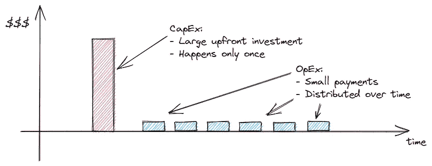
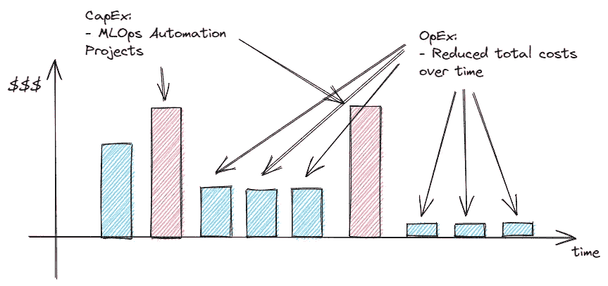
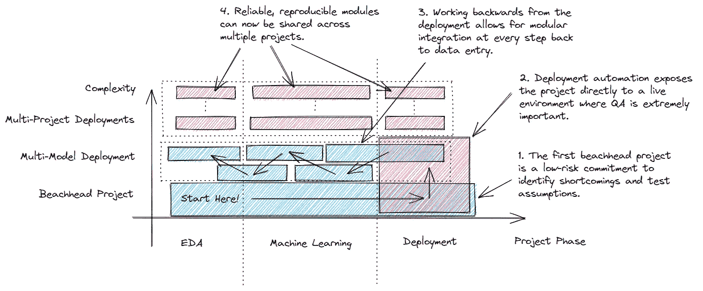

# 解读 MLOps 的业务考虑因素

> 原文：<https://towardsdatascience.com/interpreting-the-business-considerations-of-mlops-f32613c4bcb4>

## 对云迁移的现实限制的评估

照片由来自 Pexels.com[的](https://pexels.com)Kateryna Babaieva 拍摄

让我们想象一下*公司 A* 。*A 公司*是典型的中档行业龙头。他们已经有了一个数据科学团队，一个非常成功的 ML 部署，和一个强大的数据基础设施。

此外，与他们的竞争对手相比，他们已经拥有一些云计算和数据工程方面的专家。他们甚至让他们的领导团队致力于“云优先”战略，但很好地为团队提供了实现该目标的灵活性。他们的 IT 安全和数据隐私团队已经参与确保没有客户 PII 数据会泄漏，所以 ML 团队全权负责他们未来的 ML 部署。

*公司 A* 目前正在寻求通过提高其网络交互的自动化程度来改善其客户关系的质量(包括基于图像和自然语言处理的交互),因此在可预见的未来将会有更多的模型与客户进行交互。由于他们第一个 *WidgetBot* 的成功，ML 团队和管理层都想继续沿着这条路走下去。

他们的主要云提供商 ***Awooz*** 确实为虚拟机提供了 GPU 计算能力。他们最近与 ***Gupson*** 有过不愉快的经历，因此团队在失控的成本、有限的能力和供应商锁定方面有点紧张。

他们不承诺交钥匙 MLOps/AutoML 平台，而是希望尝试构建他们的堆栈，以便他们可以控制正在部署的每个模块，这对于团队成员之间的维护和内部知识转移来说是一个优势。

他们需要考虑:

*   他们应该以什么样的顺序实现管道自动化；
*   他们现有部署的自动化程度应该提高多少；和
*   识别控制成本的机会，以避免意外账单。

***公司 A* 应该如何着手设计其机器学习系统，以在管理运营成本的同时创造最大的客户价值(即，随着时间推移的新模型)？**

# 背景介绍:资本支出和运营支出

资本支出(CapEx)和运营支出(OpEx)是企业两种主要的前瞻性预算机制。资本支出通常用于大规模的资产收购(建筑物和车辆)，而运营支出则与日常开支(如工资和软件订阅)相关。

资本支出和运营支出的比较。(作者。)

第一种允许一次性购买价格，第二种允许随着时间的推移吸收成本。另一方面，第一个需要预算批准来为这样的努力开绿灯，而第二个则蚕食部门的盈利能力。

对于*公司 A* 的情况,“资本支出与运营支出”是评估内部部署与云 IT 基础架构采购的一个很好的代理。他们应该向云提供商租赁节点，还是构建和管理自己的内部设备？

然而，由于云 GPU 实例的定价水平，*公司 A 的*计划运营支出将明显高于其竞争对手。事实上，根据 Cloud-GPUs.com[的说法](https://cloud-gpus.com/)，一个基于 NVIDIA V100 的虚拟机的月成本可以轻松达到 2000 美元。基于 3 年生命周期价值周期的 IT 采购，其投资回收期甚至不到几个月。在这种情况下，为什么还要考虑云呢？

> *侧栏:资本支出与运营支出决策的驱动因素是什么？*
> 
> *尽管有许多因素，但通常来说，购买类似产品的资本支出/运营支出决策可归结为预算可用性和资本成本。预算可用性通常每年签核一次(极少数情况下为季度签核)。*
> 
> *资本成本也类似于公司的内部收益率，是公司向自身借款的利率，代表机会成本。通常，大型和/或公共组织的预算内部收益率为 10%至 15%，具体取决于行业和财务状况。由于这一比率，费用只能通过其净现值(NPV)或净未来值(NFV)进行正确的比较。*
> 
> *随着时间的推移租赁设备*而不是提前*购买*设备*的考虑是，在运营支出情况下*的净现值(此时的感知成本)*低于*总价值(总和)。

# MLOps 的价值

首先，*公司 A* 应该考虑增加向云的迁移吗？他们有一个职能团队，一个坚实的活动管道，以及一些可以简单重复的可靠成功。他们正以高于市场的趋势增长，所以他们显然已经开足了马力。

与其成长阶段相关的主要问题是计算需求将呈线性增长；更多的模型意味着更多的计算，而更多的计算意味着更多的 IT 管理及其相关的资本负担。如果他们坚持购买更多的本地服务器，那么改进他们的产品很可能意味着他们盈利能力的终结。

## 不好，遇到更坏的

如果 IT 收购是糟糕的，那么全面的云参与同样是不健康的。由于数据调查和模型测试的探索性质，研发服务器在计算上是贪得无厌的。它们是复杂的系统，需要建立起来，最终会因为闲置而耗费大量资金。

一些不健康的云实践包括:

*   **永远在线的 GPU 实例。**当培训环境建立起来后，很少会看到团队放弃他们所有的努力。
*   **多个 GPU 实例。**与始终在线的实例类似，大型团队成员之间的资源共享较差，因此在工作时间需要多个实例。
*   **手工安装库。每一个新的实例都需要一个歌舞伎仪式的库装置，只有在一切都设置好之后，项目才能真正开始。**

注意:我是第一个同意实例暂停、作业调度和实例克隆是避免这些问题的可靠方法的人。但我也是第一个警告我的客户这些风险的人，并且在最初的几个项目出问题时小心翼翼地再次提供这些建议。内部沟通通常显示出不清楚的团队成员期望，因此需要自动化。

## **不是“非此即彼”**

在过渡阶段，实际上存在一系列的机会，而不是在两种预算策略中强制做出选择。

随着时间的推移，投资自动化可以降低运营成本。(作者。)

通常，随着部署的模型数量的增长，重新训练、打包和部署它们的成本会线性增长。但是，如果相关的自动化同样增加，以驯服这些额外模型的复杂性，那么预算得到控制，同时价值增加。

# 两全其美:增量迁移

在*公司 A 的*案例中，他们有后知后觉的优势:他们已经有了一个成功的部署。将这第一次成功作为自动化用例的跳板意味着，如果做得正确，每一个未来的模型都将部署得更快、更便宜。

顺序 MLOps 实施策略。(作者。)

在最终迁移到云的过程中，混合云/内部部署提供了成本管理和灵活性的最终平衡。第一次交付时，端到端的功能性(非自动化)管道已经存在。

下一阶段实际上不应该专注于加速数据科学或提高机器学习性能；相反，所有的部署问题都是团队自动化能量应该去的地方。这包括从自动配置虚拟机到从注册表中获取最新型号的所有内容。**关注部署的原因是，在此之前执行的任何自动化都需要重新构建，以适应部署验证和 QA 需求。**

面向客户的产品需要大量的努力来确保质量和可靠性。因此，推理模型的包装是最有可能在这一步被破坏的。

从那里，使用相同的逻辑，自动化前面的步骤，一直到数据科学，这就是你的团队如何在规定的时间内创造最大的价值。

# 鸡肉还是鸡蛋？

虽然宣扬 MLOps 云过渡应侧重于经济高效、可扩展的工作很容易，但我们合作的每个客户都有自己独特的历史和挑战。帮助他们摆脱内部过渡项目是我们最终创造长期价值的方式。

以下是一些我们认为适用于几乎每个团队的一般性建议:

*   最大限度地利用您现有的基础设施。保持云中的预置训练和推理。如果你现场有 GPU，那就好好利用它们。他们是沉没成本，是的，但已经安装和运行。现在还不需要将计算量最大的步骤迁移到云中。
*   **按模块和阶段部署自动化活动，而不是按项目。**跨步骤重用代码越多，未来项目的规模就越大。
*   **尽早构建您的供应自动化脚本。**尽管看起来这应该在以后发生，但这给了你的团队信心，在不损失生产力的情况下尽快取消训练和推理实例。

# 你可能喜欢的其他文章

*   [PyTorch 与 TensorFlow 在基于变压器的 NLP 应用中的对比](/pytorch-vs-tensorflow-for-transformer-based-nlp-applications-b851bdbf229a)
*   [用于批处理的 MLOps:在 GPU 上运行气流](/mlops-for-batch-processing-running-airflow-on-gpus-dc94367869c6)
*   [数据集偏差:制度化歧视还是足够透明？](/dataset-biases-institutionalized-discrimination-or-adequate-transparency-ae4119e2a65c)
*   [AI 如何创造价值？](https://medium.com/@lsci/how-does-artificial-intelligence-create-value-bec14c785b40)
*   [实施企业人工智能战略](/implementing-a-corporate-ai-strategy-a64e641384c8)
*   [离群点感知聚类:超越 K 均值](/outlier-aware-clustering-beyond-k-means-76f7bf8b4899)
*   [深度学习图像分类器的罗夏测试](/rorschach-tests-for-deep-learning-image-classifiers-68c019fcc9a9)

*如果您对本文或我们的 AI 咨询框架有其他问题，请随时通过*[***LinkedIn***](https://www.linkedin.com/in/mnlemay/)**或通过* [***电子邮件***](mailto:matt@lemay.ai) *联系我们。**

*马特。*