# 解读文本分类的 BERT 模型预测

> 原文：<https://towardsdatascience.com/interpreting-the-prediction-of-bert-model-for-text-classification-5ab09f8ef074>

## 如何利用积分梯度解释 BERT 模型的预测


Shane Aldendorff 摄影:[https://www . pexels . com/photo/shallow-focus-of-photography of-the-magnification-of-glass-with-black-frame-924676/](https://www.pexels.com/photo/shallow-focus-photography-of-magnifying-glass-with-black-frame-924676/)

来自 Transformer 或 BERT 的双向编码器表示是一种在 NLP 领域非常流行的语言模型。BERT 实际上是 NLP 的瑞士军刀，因为它的多功能性以及它在许多不同的 NLP 任务中的表现，如文本分类、命名实体识别、问答等。

但是如果我们使用 BERT 来完成一个特定的 NLP 任务，就会有一个问题:它的架构由一个很深的层堆栈组成。出于这个原因，BERT 通常被认为是一个*黑箱*模型，因为它的预测结果不容易解释。

假设我们已经训练了我们的 BERT 模型来对电影评论的情绪进行分类。接下来，我们想用它来预测一个随机的电影评论。


作者图片

伯特模型预测“*这部电影棒极了*”的评论有积极的情绪，这是正确的。然而，之后我们可能会问一些这样的问题:

*   为什么模型预测我们的输入评审是正面评审而不是负面评审？
*   我们的模型发现哪些词在输入评论中最重要，可以归类为正面评论？
*   我们的模型到底有多可靠？

如果我们使用像 BERT 这样的*黑盒*模型，回答上面的问题并不容易。然而，有一种方法可以解释深度学习模型的预测，以便我们可以回答上面的所有问题。我们要用积分梯度来做这个。

# 什么是集成渐变？

集成梯度是一种基于模型输出(预测)相对于输入的梯度来计算深度学习模型的每个特征的属性的方法。这种方法适用于任何用于分类和回归任务的深度学习模型。

举个例子，假设我们有一个文本分类模型，我们想要解释它的预测。利用集成的梯度，最终，我们将获得每个输入单词相对于最终预测的属性分数。我们可以使用这个归因分数来找出哪些单词在我们的模型的最终预测中起着重要作用。

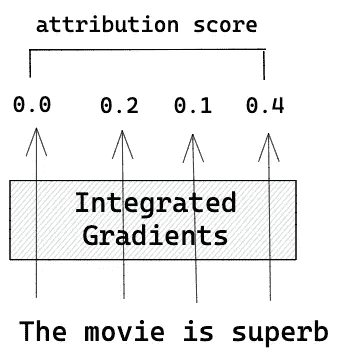

作者图片

要实现集成渐变，我们需要两组输入: ***原始输入*** t 和 ***基线输入*** 。

最初的输入是不言自明的。这只是我们最初的输入。同时，基线特征是一个*‘空’*或*‘中性’*输入。这方面的例子取决于我们的使用情形，例如:

*   **如果我们的输入是一幅图像**:基线输入可以是一幅黑色图像(所有像素都设置为 0)
*   如果我们的输入是一个 text:基线输入可以是一个全零嵌入向量

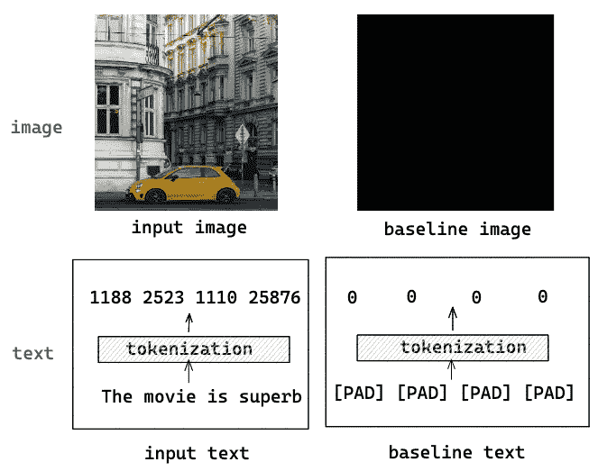

作者图片

基线输入很重要，因为为了找出哪些特征对模型的预测有影响，我们需要比较使用原始输入和使用基线输入时模型预测的变化。

然后，我们逐步对基线输入进行插值以模拟我们的原始输入，同时计算每一步中相对于输入特征的预测梯度。因此，根据以下公式计算积分梯度:

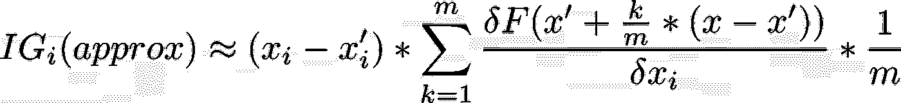

作者图片

```
**where:**
**i** : feature iterator
**x** : original input
**x'**: baseline input
**k** : scaled feature perturbation 
**m** : total number of approximation steps
```

你可能会注意到，上面的等式只是真实积分梯度的近似值。这是因为在实践中，计算真正的积分在数值上并不总是可能的。

近似步骤的总数( ***m*** )越高，近似结果越接近真实的积分梯度。同样，随着缩放特征扰动( ***k*** )越接近 ***m*** 、)基线输入越类似于原始输入。在实际操作中，我们应该事先定义好 ***m*** 的值。

为了更好地理解上述等式的概念，让我们假设我们有一个图像分类模型，因为它更容易可视化。如果我们想用积分梯度来解释它的预测，以下是步骤。：

## **1。插入基线输入**

如前所述，为了实现集成渐变，我们需要两个不同的输入: ***原始输入*** 和 ***基线输入*** 。如果我们的输入是图像，那么原始输入将是我们的原始图像，基线输入将是全黑图像。

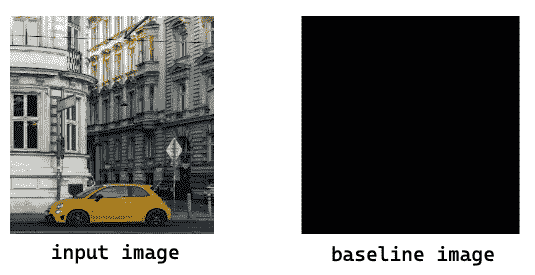

作者图片

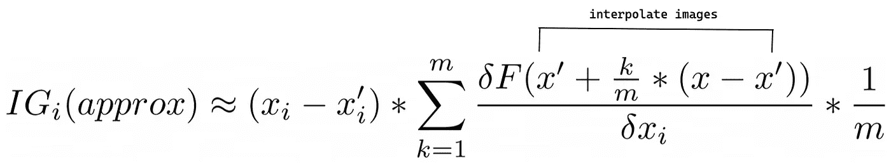

作者图片

然后，该方法将通过基于我们需要预先定义的步骤总数( ***m*** )逐步增加 ***k*** 值来线性插值基线图像。随着 ***k*** 值越接近 ***m*** ，我们的基线图像与输入图像将越相同。

假设我们将总步数设置为 50。随着 ***k*** 值越来越接近 50，我们的基线图像和我们的输入图像将越来越相同。

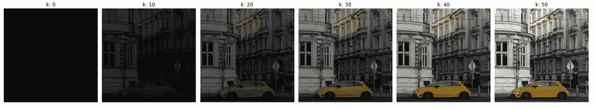

作者图片

## 2.计算梯度

对于每个插值基线图像，该方法将计算模型预测相对于每个输入特征的梯度。

这些梯度测量模型预测相对于输入要素变化的变化，以便最终我们可以估计每个输入要素对模型预测的重要性。

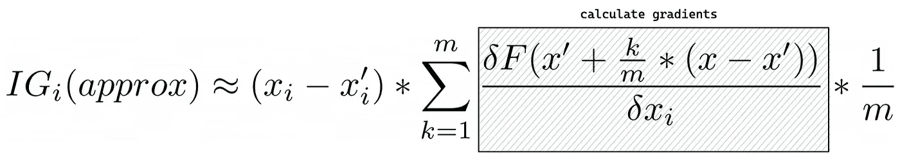

作者图片

## 3.累积梯度

最后，我们用一种叫做黎曼和的近似方法来累积每一步的梯度。我们基本上只是把每一步的梯度相加，然后除以总步数。

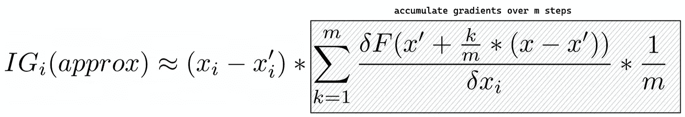

作者图片

经过这一步，我们得到每个特征对模型预测的归属结果。

# BERT 的集成梯度

在本文中，我们将实现集成梯度方法来解释为文本分类用例训练的 BERT 模型的预测。

如果您不熟悉 BERT，并且希望对它的功能和架构有一个基本的了解，请在这里查看我的另一篇文章。

[](/text-classification-with-bert-in-pytorch-887965e5820f)  

简而言之，BERT 架构由堆叠在一起的变压器编码器组成，编码器的数量取决于我们使用的 BERT 模型。

*   BERT 基本模型有 12 层变压器编码器
*   伯特大型模型有 24 层的变压器编码器

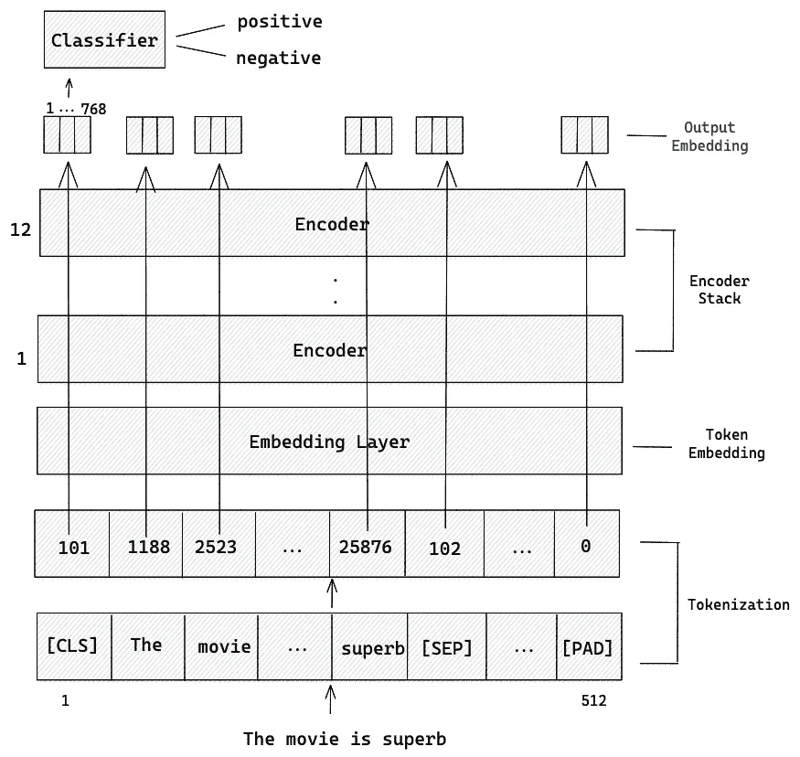

伯特基地建筑插图(作者图片)

当我们想要使用 BERT 模型来预测文本时，我们通常首先做的是对输入文本进行标记。

标记化过程将我们的输入文本分割成称为标记的更小的块，每个标记由一个单词或一个子单词组成。接下来，BERT 模型的特殊令牌如**【CLS】**、**【SEP】**，以及可选的**【PAD】**将被添加到我们的初始令牌中。最后，每个令牌将被转换成其可以被机器学习算法使用的数字表示。

```
from transformers import BertTokenizer

# Instantiate tokenizer
tokenizer = BertTokenizer.from_pretrained('bert-base-cased')

text = 'The movie is superb'

# Tokenize input text
text_ids = tokenizer.encode(text, add_special_tokens=True)

# Print the tokens
print(tokenizer.convert_ids_to_tokens(text_ids))
# Output: ['[CLS]', 'The', 'movie', 'is', 'superb', '[SEP]']

# Print the ids of the tokens
print(text_ids)
# Output: [101, 1109, 2523, 1110, 25876, 102]
```

但是，符号化后的这种数值表示不能用于积分梯度，因为它们是离散的，不能与上一节中描述的插值方法一起使用。因此，我们需要将标记化结果转换成另一种形式。

正如您在上面的 BERT 架构中所看到的，在每个令牌被传递到编码器堆栈之前，需要通过嵌入层将其转换为嵌入。我们将使用每个标记的嵌入作为输入，来计算每个输入对模型预测的贡献。

下面是一个简单的例子，说明如何用 BERT 嵌入令牌。我们将在下一节看到详细的实现。

```
from transformers import BertModel
import torch

# Instantiate BERT model
model = BertModel.from_pretrained('bert-base-cased')

embeddings = model.embeddings(torch.tensor([text_ids]))
print(embeddings.size())
# Output: torch.Size([1, 6, 768]), since there are 6 tokens in text_ids
```

# 用 Captum 实现 BERT 模型的集成梯度

现在我们知道了集成渐变背后的概念，让我们在行动中实现它。作为第一步，我们需要实例化我们的 BERT 模型的架构:

```
from torch import nn

# Class of model architecture
class BertClassifier(nn.Module):

    def __init__(self, dropout=0.5):

        super(BertClassifier, self).__init__()

        self.bert = BertModel.from_pretrained('bert-base-cased')
        self.dropout = nn.Dropout(dropout)
        self.linear = nn.Linear(768, 2)
        self.relu = nn.ReLU()

    def forward(self, input_id, mask = None):

        _, pooled_output = self.bert(input_ids= input_id, attention_mask=mask,return_dict=False)
        dropout_output = self.dropout(pooled_output)
        linear_output = self.linear(dropout_output)
        final_layer = self.relu(linear_output)

        return final_layer
```

该体系结构对应于用于训练 BERT 模型以对电影评论的情感进行分类的体系结构。我们使用预先训练的基于 BERT 的模型，然后在末尾添加一个线性层，该层有两个输出来分类电影情绪是消极的还是积极的。

如果您想继续解释该模型，可以通过以下链接下载经过培训的模型:

```
https://github.com/marcellusruben/bert_captum/raw/main/bert_model.pt
```

现在，让我们加载已训练模型的参数，然后将已训练模型设置为评估模式。

```
model = BertClassifier()
model.load_state_dict(torch.load('bert_model.pt', map_location=torch.device('cpu')))
model.eval()
```

当我们想要使用集成梯度来解释模型的预测时，我们需要指定两件事情:模型的输出和模型的输入。

该模型的输出仅仅是对电影评论的情绪预测。这意味着从模型的最后一层得出的值。为了获得模型的输出，我们可以简单地向前传递。

同时，如前一节所述，模型的输入将是令牌的嵌入。这意味着通过嵌入层后的特征。因此，来自嵌入层的值将是我们模型的输入。

让我们定义模型的输出和输入。

```
# Define model output
def model_output(inputs):
  return model(inputs)[0]

# Define model input
model_input = model.bert.embeddings
```

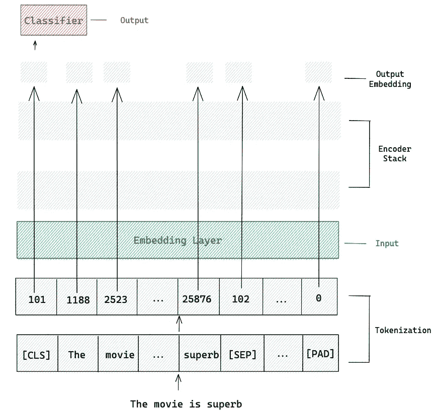

作者图片

现在是我们实现集成渐变的时候了，我们将使用 Captum 来实现这一点。Captum 是一个开源库，用于解释 PyTorch 中内置的机器学习预测。这意味着这个库适用于任何 PyTorch 模型。

目前，Captum 支持三种不同的方法来解释任何 PyTorch 模型的结果:

*   *:评估各特征对模型预测影响的方法*
*   ****层属性*** :评估一层神经元对模型预测影响的方法*
*   ****神经元归因:*** 一种评估每个输入特征对特定神经元激活的影响的方法*

*既然我们要解释每个表征对模型预测的影响，那么我们就需要实现主属性，而积分梯度就是主属性的算法之一。*

*我们实际上只需要一行代码来初始化带有 Captum 的集成梯度算法。然后，我们提供模型的输出和输入作为参数。*

```
*from captum.attr import LayerIntegratedGradients

lig = LayerIntegratedGradients(model_output, model_input)*
```

*如果您还记得上一节，集成渐变的实现需要两件事情:一个是我们的原始输入，另一个是基线输入。*

*因为我们正在处理文本输入，那么我们的原始输入将是每个标记的嵌入。同时，基线输入将是一组填充标记的嵌入，其长度与我们的原始标记相似。让我们创建一个函数来生成这个基线。*

```
*def construct_input_and_baseline(text):

    max_length = 510
    baseline_token_id = tokenizer.pad_token_id 
    sep_token_id = tokenizer.sep_token_id 
    cls_token_id = tokenizer.cls_token_id 

    text_ids = tokenizer.encode(text, max_length=max_length, truncation=True, add_special_tokens=False)

    input_ids = [cls_token_id] + text_ids + [sep_token_id]
    token_list = tokenizer.convert_ids_to_tokens(input_ids)

    baseline_input_ids = [cls_token_id] + [baseline_token_id] * len(text_ids) + [sep_token_id]
    return torch.tensor([input_ids], device='cpu'), torch.tensor([baseline_input_ids], device='cpu'), token_list

text = 'This movie is superb'
input_ids, baseline_input_ids, all_tokens = construct_input_and_baseline(text)

print(f'original text: {input_ids}')
print(f'baseline text: {baseline_input_ids}')

# Output: original text: tensor([[  101,  1109,  2523,  1110, 25876,   102]])
# Output: baseline text: tensor([[101,   0,   0,   0,   0, 102]])*
```

*执行上面的函数后，我们得到三个变量:`input_ids`是标记化的原始输入文本，`baseline_input_ids`是标记化的基线文本，`all_tokens`是原始输入文本中的标记列表。稍后，我们将仅出于可视化目的使用`all_tokens`变量。*

*接下来，我们可以开始解读模型的预测。为此，我们可以使用之前已经初始化的`LayerIntegratedGradients()`类中的`attribute()`方法。我们需要做的就是将原始输入和基线输入的标记化结果作为参数传递。可选地，您可以通过传递`n_steps`变量作为附加参数来指定近似步骤的数量。否则，它将被设置为 50。*

```
*attributions, delta = lig.attribute(inputs= input_ids,
                                    baselines= baseline_input_ids,
                                    return_convergence_delta=True,
                                    internal_batch_size=1
                                    )
print(attributions.size())
# Output: torch.Size([1, 6, 768])*
```

*我们在实现集成梯度后得到两个变量:`attributions`和`delta`。*

*从上一节中，我们已经知道，我们实现的积分梯度法只是一种近似方法，因为计算真正的积分在数值上并不总是可能的。这里我们得到的`delta`变量是近似的和真实的积分梯度之差。我们稍后将仅出于可视化目的使用该变量。*

*同时，`attributions`变量是每个令牌的每个嵌入元素的属性。为了得到每个标记的最终属性，我们需要计算所有嵌入元素的属性平均值。下面的函数就是这样做的。*

```
*def summarize_attributions(attributions):

    attributions = attributions.sum(dim=-1).squeeze(0)
    attributions = attributions / torch.norm(attributions)

    return attributions

attributions_sum = summarize_attributions(attributions)
print(attributions_sum.size())
# Output: torch.Size([6])*
```

*就是这样！上述函数的输出是每个令牌的属性。由于在标记化过程之后我们有六个标记，那么我们也得到六个属性值，每个标记一个值。*

*为了让我们更容易检查结果，我们可以用 Captum 的`VisualizationDataRecord()`类和`visualize_text()`方法来可视化它。*

```
*from captum.attr import visualization as viz

score_vis = viz.VisualizationDataRecord(
                        word_attributions = attributions_sum,
                        pred_prob = torch.max(model(input_ids)[0]),
                        pred_class = torch.argmax(model(input_ids)[0]).numpy(),
                        true_class = 1,
                        attr_class = text,
                        attr_score = attributions_sum.sum(),       
                        raw_input_ids = all_tokens,
                        convergence_score = delta)

viz.visualize_text([score_vis])*
```

*上面调用`VisualizationDataRecord()`类时需要供应的参数很多，我们就一个一个解剖吧。*

*   *`word_attributions`:每个令牌的综合渐变结果*
*   *`pred_prob`:模型预测*
*   *`pred_class`:模型预测的类别*
*   *`true_class`:输入的地面实况标签*
*   *`attr_class`:输入*
*   *`attr_score`:整个代币的 IG 之和*
*   *`raw_input_ids`:令牌列表*
*   *`convergence_score`:近似积分梯度和真实积分梯度的区别*

*一旦我们运行上面的代码片段，我们将得到如下可视化结果:*

*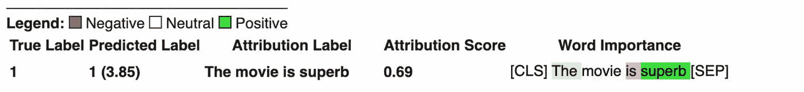*

*作者图片*

*从上面的可视化可以看出，预测的评论是 1(正)，这是正确的。在“*单词重要性*部分，我们可以看到每个单词对模型预测的贡献。*

*对模型预测有积极贡献的标记以绿色突出显示。同时，对模型预测有负面影响的标记以红色突出显示。*

*似乎单词“ *superb* ”最有影响力，这使得我们的 BERT 模型将评论分类为积极的，这是有意义的。让我们将目前为止所做的事情封装到一个函数中，然后解释另一个评论。*

```
*def interpret_text(text, true_class):

    input_ids, baseline_input_ids, all_tokens = construct_input_and_baseline(text)
    attributions, delta = lig.attribute(inputs= input_ids,
                                    baselines= baseline_input_ids,
                                    return_convergence_delta=True,
                                    internal_batch_size=1
                                    )
    attributions_sum = summarize_attributions(attributions)

    score_vis = viz.VisualizationDataRecord(
                        word_attributions = attributions_sum,
                        pred_prob = torch.max(model(input_ids)[0]),
                        pred_class = torch.argmax(model(input_ids)[0]).numpy(),
                        true_class = true_class,
                        attr_class = text,
                        attr_score = attributions_sum.sum(),       
                        raw_input_ids = all_tokens,
                        convergence_score = delta)

    viz.visualize_text([score_vis])*
```

*仅此而已。现在，如果我们想解释一个电影评论，我们可以做的是键入评论，然后调用上面的`interpret_text()`函数。*

```
*text = "It's a heartfelt film about love, loss, and legacy"
true_class = 1
interpret_text(text, true_class)*
```

*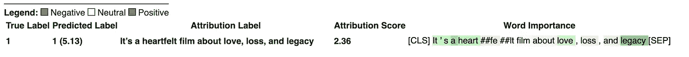*

*作者图片*

*我们的 BERT 模型正确预测了评论情绪，即预测为 1(正面)。从每个令牌的属性中，我们可以看到像'*心*'、*爱*'、*遗产*'这样的词对模型的预测有积极的贡献，而另一方面，'*损失*'这样的词有消极的贡献。*

*现在让我们给我们的模型提供一个负面的评论。*

```
*text = "A noisy, hideous, and viciously cumbersome movie"
true_class = 0
interpret_text(text, true_class)*
```

*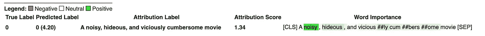*

*作者图片*

*我们的 BERT 模型再次正确预测了电影情绪。从 token attribution 中，我们可以看到像'*吵闹的*'、*狞恶的*'、*恶毒的*'这样的词对模型的预测有积极的贡献，这也是有道理的。*

# *结论*

*在本文中，我们实现了集成梯度来解释文本分类的 BERT 模型的预测。通过这种方法，我们能够找出哪些输入对我们的深度学习模型进行预测是最重要的。因此，它也将为我们提供关于模型可靠性的信息。*

*我希望这篇文章能帮助你开始使用集成渐变。你可以在本笔记本 的 [**中找到本文实现的所有代码。**](https://github.com/marcellusruben/medium-resources/blob/main/BERT_Captum/Bert_captum.ipynb)*