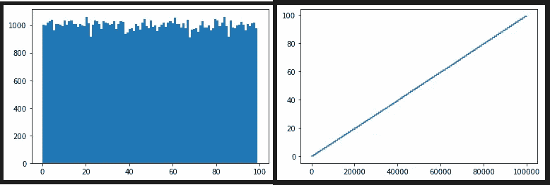

# 面试问题:从文件中随机选择一行

> 原文：<https://towardsdatascience.com/interview-question-select-a-random-line-from-a-file-in-rust-c0a8cddcddfb>

## 一个很酷很有用的算法解释和扩展

卡尔·m·卡迪和克里斯托弗·米克


一只螃蟹从文件中随机选择一行文本——来源:【https://openai.com/dall-e-2/ 

如果我(卡尔)面试你在微软的工作，我可能会问你这个问题:

> 如何从未知长度的文本文件中随机选择一行？

我在微软研究院，在最初的反垃圾邮件团队，在一个办公室机器学习/数据科学小组，都问过这个问题。我们喜欢这个问题，因为它涉及概率、算法和系统问题。

即使已经从微软退休，我们仍然会思考随机线问题。例如，我们最近学习了`[bytecount](https://lib.rs/crates/bytecount)`。这是一个 Rust crate，它使用 SIMD CPU 指令来加速计算文件中的行数。正如我们稍后将描述的，我们对板条箱的了解间接导致了对随机线问题的最先进的解决方案的改进。

我们将这篇文章组织成一系列的问题和提示。如果你愿意，在看到我们的回答之前，你可以试着自己回答问题。

> 在本文中，我们将在 Rust 中给出答案。关于 Python 中的答案，参见本文的 [Python 版。你可能也喜欢阅读这两个版本，作为比较两种语言的一种方式。](/interview-question-select-a-random-line-from-a-file-in-python-4756eac40075)

对于白板面试，我们给了受访者以下建议:

*   请随意提出澄清性问题。(在本文的上下文中，您可以进一步阅读，看看我们是否提供了澄清。)
*   首先从正确的算法开始，即使它可能不是最佳的。如果我们想要一个更好的算法，我们会用后续问题来提示您。
*   不要担心精确的语法。例如，我们不关心你是否记得产生随机数的确切方法。
*   如果你卡住了，我们可以提供一些提示。(还是那句话，在这篇文章的上下文中，读远一点寻找提示。)

让我们从问题开始:

## 问:如何从未知长度的文本文件中随机选择一行？

**答:**我们首先要明确一个“随机线”的含义。我们的意思是文本文件中的每一行都有相等的机会被返回。换句话说，我们希望算法通过均匀分布在这些线中进行选择。

这个要求意味着你**不能**使用这个算法，我们称之为`AlgoRandomSeek`:

*   向文件系统询问文件的长度。
*   随机选择一个文件位置并查找到该位置。
*   在位置附近返回一条线。

**Sub Q:**`AlgoRandomSeek`怎么了？

**Sub A** :虽然该算法可以返回文件中的任何行，但它返回较长行的概率比返回较短行的概率高，因此不会通过均匀分布选择行。

> 旁白:我们喜欢被要求澄清。它将“随机”的日常含义与统计学、数据科学、决策理论和机器学习中使用的技术含义区分开来。

**提示:**如果你在 Rust 中编码，需要快速(但正确地)解决随机线问题，你会怎么做？

我们向 GitHub Copilot 寻求 Python 的解决方案。把它的答案翻译成 Rust 给了我们这个代码。称之为`AlgoReadAll`:

> 旁白:完整的 Rust 项目，包括 Cargo.toml 和`use`语句，见 GitHub 上的项目 [random-line。所有的例子都使用](https://github.com/CarlKCarlK/random-line)[获取数据箱](https://crates.io/crates/fetch-data)根据需要获取样本文件。

这个算法显然是正确且快速的。另外，如果遇到坏文件，它会使用`?`返回一个错误结果。另一个好处是，您可以提到代码在空文件上返回`None`。

不利的一面是，这段代码将整个文件读入内存，因此不能处理大文件。

接下来，让我们询问一个适用于大型文件的解决方案:

## 问:使用很少的内存，如何从未知长度的文本文件中随机选择一行？

**答:**我们首先要澄清“小内存”。对于这个问题，假设您可以存储文件中的任何一行，或者几行，但不是所有的行。

`AlgoTwoPass`用 1 解决问题。计算文件中的行数，2。随机选择一个行索引，3 .返回带有该索引的行。(在本文中，“索引 0”是一个从 0 开始计数的索引。如果一个索引从 1 开始计数，我们称之为“index1”。)

在我的机器上，这将输出:

`1,683 of 146,933: Some(“to gather material for illustrations of the poems of Robert”)`

`AlgoTwoPass`正确。我们还会给这段代码一个奖励:

*   使用带有显式种子的随机数生成器—机器学习和数据科学通常需要再现性，即使是来自随机性。
*   提到它在应用于空文件时返回`None` 。
*   使用`let item = item_result?`检查可能的文件错误。
*   [非常小]用千位分隔符格式化数字。

不是必需的，但有趣的是这个更具功能性的实现:

旁白 1: **背景信息**:这段代码使用 Rust 迭代器。当`*next()*`被应用到 Rust 迭代器时，序列中的下一个值被返回到`Some`中，或者，如果序列是完整的，则返回`None`。表达式`BufReader::new(File::open(&path)?).lines()`返回“行结果”上的迭代器。每一行结果要么是一个字符串(下一行)，要么是一个错误(在试图读取该行时发现)。虽然 Rust 在迭代器上定义了一个`count()`方法，但是我们不应该在这里使用它。为什么？因为`count()`方法不检查错误值。同样，Rust 定义了一个`nth()`方法，该方法增加了一个迭代器 *n* +1 个值。它返回( *n* +1)ᵗʰ值，但忽略任何中间误差值。为了检查来自`.line()`的错误值，上面的回答定义并使用了`try_count`和`try_nth`函数。【感谢 Reddit Rust 社区在这个问题上的[帮助](https://www.reddit.com/r/rust/comments/wyk1l0/can_you_compose_stdiolines_with_stditercount/)。]

旁白 2:我们不会因为某人在`*rng.gen_range*`或`*nth/try_nth*`上犯了一个失误而惩罚他。然而，我们可能会问，如何测试代码来检查这样的错误。

接下来，我们要求一个更快的算法:

## 问:在一遍中，你能从一个未知长度的文本文件中随机选择一行吗？

**答:**根据提示，我们将通过一系列子问题来开发一个算法。

**提示:**递归地想想这个。

**Sub Q:** 把自己放在程序的位置上。如果我们向您保证文件只包含一行，您应该怎么做？

如果文件只包含一行，就输出它。

**子问:**呜呜，我们骗了你。该文件可能只包含一行或两行，但没有其他数量的行。你该怎么办？

**Sub A:** 用概率 0.5，替换我们要输出的结果，用第二行。

**子 Q:** 对不起，我们又说谎了！该文件可能只包含一行、两行或三行。你该怎么办？每条线的入选概率是多少？这怎么能一概而论呢？

用概率⅓，用第三行替换我们要输出的结果。

每行的选择概率为:

*   第一行:1 × × ⅔= ⅓
*   第二行:× ⅔= ⅓
*   三线:⅓= ⅓

所以，概率分布是均匀的。我们可以将此归纳为`AlgoOnePass`:

**说句题外话:**我(Carl)回忆起一位受访者开始通过归纳法证明这个算法的正确性。我可以告诉他们很容易做到这一点，所以我阻止了他们，继续前进。他们获得了奖金。

**奖金 Q:** 我们在面试中从来没有问过这个，但是你能递归地写`AlgoOnePass`吗？

**奖金 A:** 这里是`AlgoOnePassRecurse`:

如果递归超过几千次，Rust 就会崩溃。这段代码使用机箱[尾调用](https://crates.io/crates/tailcall)来避免崩溃。该算法的递归和非递归版本以大约相同的速度运行。该代码因跨结果迭代器通用而获得了额外的好处。另一个好处是，它接受随机数生成器`rng`作为`&mut`，这允许继续使用`rng`。

> 旁白:实际思考一下，一次通过比两次通过重要吗？往往不会。如果你能为一条随机的线等 1 秒，你大概能等 1 到 2 秒。另一方面，有些数据——“流数据”——是不能二次访问的，所以`*AlgoOnePass*`有实用价值。

对`*AlgoOnePass*`的一个简单概括是选择多条随机线，而不仅仅是一条线，我们不会讨论这个。维基百科在其关于[储层采样:简单算法 R](https://en.wikipedia.org/wiki/Reservoir_sampling#Simple:_Algorithm_R) 的文章中描述了(或多或少)`*AlgoOnePass*`和这种概括。

在采访中，这通常是我们说到“从文件中随机抽取一行”的地方。然而，我们最近了解了锈箱`[bytecount](https://lib.rs/crates/bytecount)`。这个`[bytecount](https://lib.rs/crates/bytecount)`机箱使用 SIMD CPU 指令来加速文件中的行数。这让我们再次玩起了这个问题。这导致了一种新的方法和一种改进的算法。新算法不使用`[bytecount](https://lib.rs/crates/bytecount)`。然而，在返回一个随机行的特定情况下，它确实优于维基百科中描述的更一般的 [Optimal: Algorithm L](https://en.wikipedia.org/wiki/Reservoir_sampling#Optimal:_Algorithm_L) 。

> 旁白:我们称之为“新算法”，但它可能早就被发现了。无论如何，我们希望你会对这个算法和它的发展感兴趣。

和以前一样，我们将通过一系列问题和提示来展示新算法。然而，我们从未向受访者提出过这些问题。

## 问:在一次传递中，你能从一个未知长度的文本文件中选择一个随机行，使得随机数发生器的调用比行数 n 少得多吗？

**答:**我们必须澄清“少很多”。我们的意思是对随机数生成器的调用次数小于 O( *n* )【参见[大 O 标注—维基百科](https://en.wikipedia.org/wiki/Big_O_notation)】。换句话说，将通话次数减少一次或一半是不够的。所需调用的随机数应该与 log( *n* )或 sqrt( *n* )成比例增长。

**提示:**首先修改`AlgoOnePass`打印分配给`result`的每一项的索引。称之为“保持指数”。比如说，对 100 万个项目运行代码。

产出:

```
1 2 4 14 38 112 210 914 4,512 5,659 6,242 13,388 917,008
```

这表示当我们以随机种子 0 运行时，第一项被保留为可能的最终随机项。然后是第二项，然后是第四项。然后，直到第 14 个项目，然后是第 38 个项目，才保留任何项目。如果迭代器包含 917，008 到 1，000，000 个条目，那么第 917，008 个条目将是最后一个被保留的条目，也是最后一个随机条目。

keep 指数似乎大致呈指数增长。如果该猜想为真，则保留索引的数量为 O(log *n* )，其中 *n* 是迭代器中项的数量。

**子问题:我们可以直接随机生成 keep 索引序列吗？**

**Sub A:** 是的！我们在一篇简短的在线技术论文中详细介绍了我们的解决方案[Meek & Kadie，[Streaming Random Selection Using the Attenuated Geometric Distribution](https://cm1x.github.io/static/Attenuated_Geometric_Distribution.pdf)，2022]。我们称 keep 指数的分布为“衰减几何分布”。我们证明，如果`index1`是一个 keep 索引号，那么我们可以用以下公式生成下一个索引号:

`let r: f64 = rng.gen();
index1 += ((r * (index1 as f64) / (1.0 — r)).ceil() as usize).max(1);`

其中`rng.gen()`生成 0 .0(含)和 1.0(不含)之间的统一浮点值。额外收获:`(…).max(1)`处理随机生成 0.0 这种非常非常不可能的情况。此外，回想一下我们的约定，即“index1”是从 1 而不是从 0 开始计数的索引。

我们现在可以利用这种洞察力来创造`AlgoOnePassSkip`:

我们可以通过使用代码在 0(包括)和 100(不包括)之间挑选一个数字，100，000 次，来获得一些信心。(我们使用表达式`(0..100).map(Ok::<_, std::io::Error>)`来创建结果值的迭代器，`Ok(0)`，`Ok(1)`，… `Ok(99)`。代码需要结果值。)

如果我们用 Python 绘图，这些图应该看起来是一致的，事实也确实如此:



该算法与 [Optimal: Algorithm L](https://en.wikipedia.org/wiki/Reservoir_sampling#Optimal:_Algorithm_L) (维基百科推荐)在两个重要方面有所不同。

*   `AlgoOnePassSkip`只能选择一个随机项，而算法 L 可以选择任意指定数量的随机项。
*   当只需要一个随机项时，`AlgoOnePassSkip`每个 keep 索引需要一个随机数，而算法 L 需要两个。

因此，对于我们只想要一个随机物品的特殊情况，`AlgoOnePassSkip`使用算法 l 一半数量的随机抽取。

# 摘要

我们已经看到了从未知长度的序列中随机选择一个项目的四种方法。在文本文件的上下文中，第一种解决方案要求文件适合内存。下一个解决方案使用较少的内存，但需要两次通过文件。然后，我们使用概率计算将此减少到一遍。这种一次通过的解决方案需要每行一个随机数。最后一个解决方案需要的随机数比直线少得多。它使用的随机数也是“最优”(更一般)算法的一半。

Rust [rand crate](https://docs.rs/rand/) 用`[seq::IteratorRandom::choose](https://docs.rs/rand/latest/rand/seq/trait.IteratorRandom.html#method.choose)`和相关方法实现相关算法和概括。与`count`和`nth`一样，它不会检查每个迭代结果中的错误。人们可以想象，在未来，一个`try_choose`。此外，它使用更通用的算法 L，而不是新的，在某些情况下稍微更有效的`AlgoOnePassSkip`。

我们的代码都没有使用像`[bytecount](https://lib.rs/crates/bytecount)`这样的系统级方法来加速文件的线性传递。添加系统级优化将是一个有趣的扩展。

*请* [*跟随卡尔上媒*](https://medium.com/@carlmkadie) *。我写的是 Rust 和 Python 的科学编程、机器学习和统计学。我倾向于每月写一篇文章。*