# 进入变压器

> 原文：<https://towardsdatascience.com/into-the-transformer-5ad892e0cee>

## 数据流、参数和维度

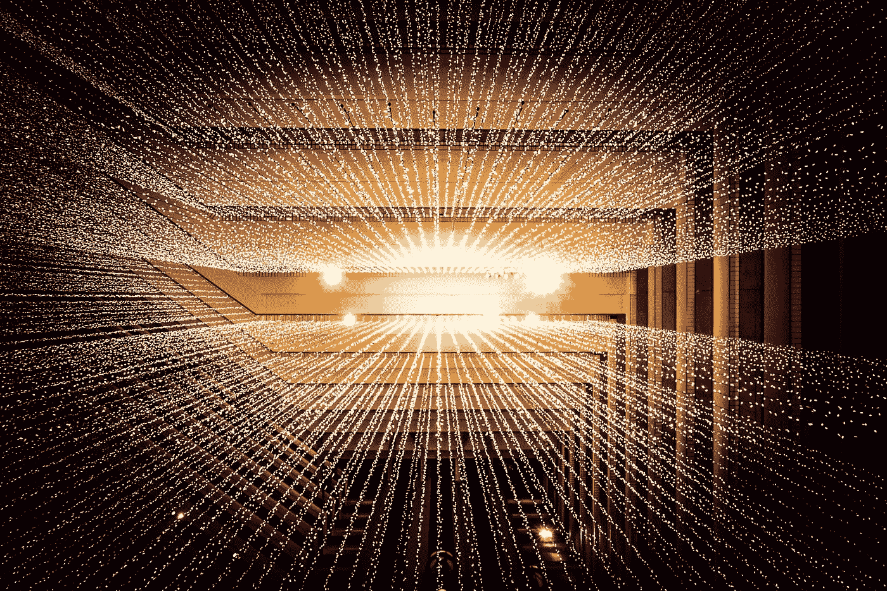

约书亚·索蒂诺在 [Unsplash](https://unsplash.com?utm_source=medium&utm_medium=referral) 上拍摄的照片

# 简介:

Transformer 是谷歌研究人员在 2017 年推出的一种神经网络架构，已被证明是自然语言处理(NLP)领域的最先进技术，随后进入了计算机视觉(CV)。

尽管网上有许多解释其体系结构的资源，但我还没有遇到一种资源明确地谈到数据以矩阵形式流经转换器时的更详细的细节。

因此，本文涵盖了转换器中所有子层的维度(输入、输出和权重)。最后，计算出一个示例变压器模型中涉及的参数总数。

对 Transformer 模型的基本熟悉有助于从本文中获益，但并不是必须的。需要进一步解释变压器基础知识的人，可以看看文末提到的参考资料。

本文组织如下:

1.  [变压器](#3cdc)
2.  [编码器](#e40f)
3.  [解码器](#2cd1)
4.  [外围块](#5180)
5.  [总结](#c3d3)

# **1。变压器:**

变换器由编码器和解码器组成，各重复 N 次(原研重复 6 次)，如图 1 所示。

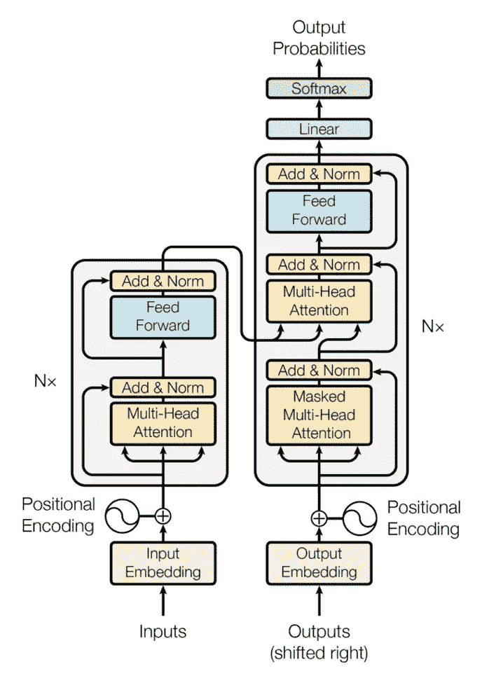

图 1:Transformer——模型架构(来源:注意力是你所需要的)

就机器翻译而言，输入(在编码器端)是来自源语言的单词标记，而输出(在解码器端)是来自目标语言的单词标记。

如图 2 所示，数据从编码器流向解码器*、*。

每个编码器的输出是下一个编码器的输入。最后一个编码器的输出馈入 N 个解码器中的每一个。除了最后一个编码器的输出，每个解码器还接收前一个解码器的输出作为其输入。

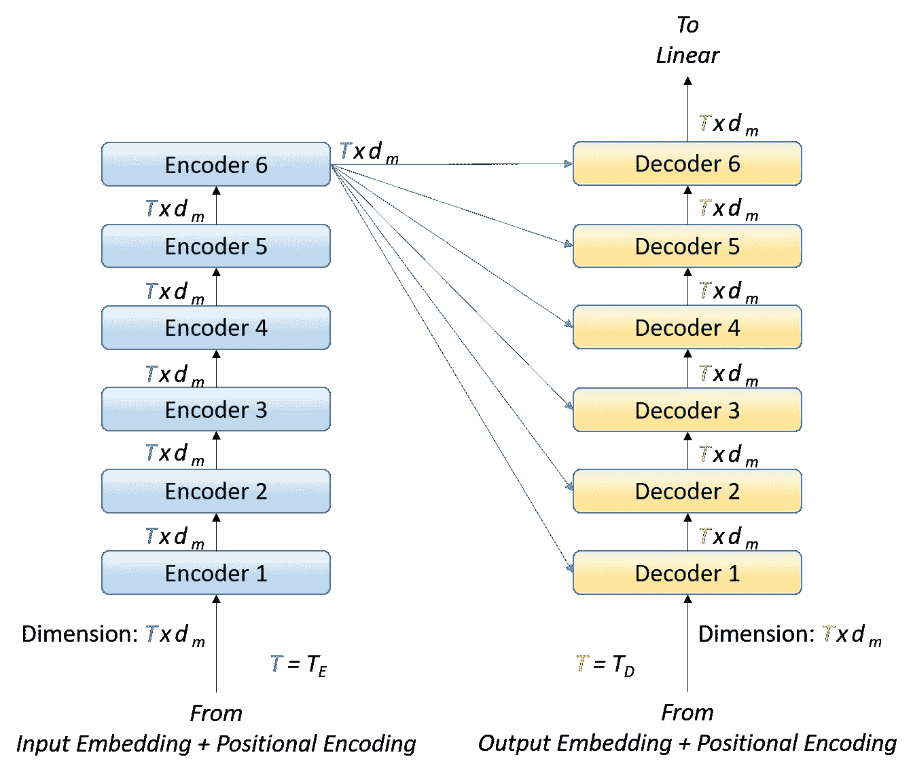

图 2:编码器和解码器层之间的数据流(图片由作者提供)

现在，让我们看看编码器和解码器，看看它们如何通过接受相同维度的输入来产生维度为`*Txdm*`的输出。这里，注意，馈送到编码器和解码器的输入数量(分别为`*TE*`和`*TD*` *、*)可以不同，而每个输入的维度(编码器和解码器)保持相同(即`*1xdm*`)。关于这些尺寸的更多细节将在后面介绍。

这些编码器和解码器层本身包含子层。

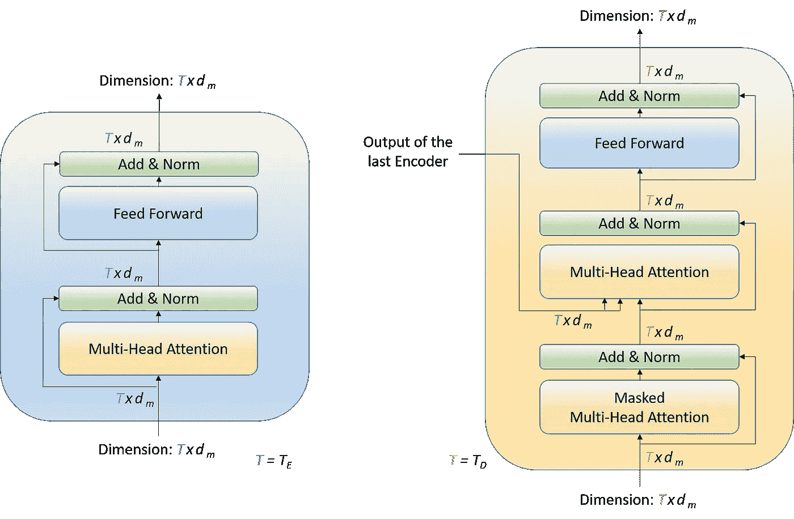

图 3:编码器和解码器(作者图片)

# **2。编码器:**

编码器内部有两个子层。

*   多头注意力
*   正向输送

## **编码器中的多头注意:**

多头注意力是 Transformer 架构中至关重要且计算量最大的模块。该模块将`*T (=TE*)`个大小为`*1xdm*`的向量作为输入(打包成一个大小为`*Txdm*`的矩阵)，并产生一个大小为`*Txdm*`的输出矩阵(一包`*T*`个大小为`*1xdm*`的向量)，如图*图 4* 所示。

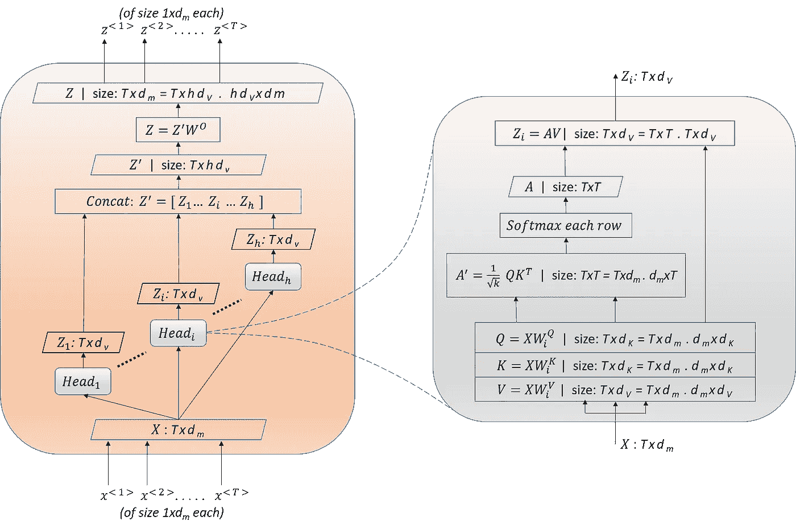

图 4:多头关注(图片由作者提供)

注意头`*Head_i*`接受来自“输入嵌入+位置编码”的输出(或来自先前编码器的输出)作为输入，并通过将输入乘以相应的权重矩阵来产生`*Query*`、`*Key*`和`*Value*`矩阵。

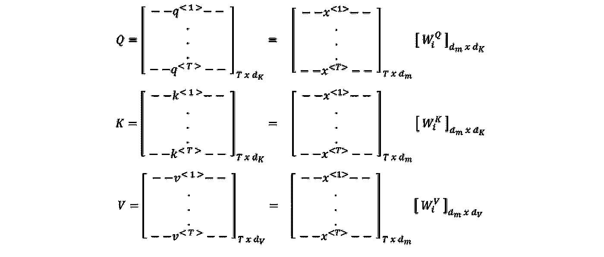

`*q<1>*`、`*k<1>*`、`*v<1>*`分别是`*x<1>*`通过投影矩阵`*wQ*`、`*wK*`、`*wV*`、*、*的投影。类似地，对于位置 2 到 t。

并且两者的尺寸都是`*1xdK*`而尺寸都是`*1xdV*`。

矩阵`*A’*`的元素是每个查询向量`*q<>*`相对于每个关键向量`*k<>*`的比例点积。(相同大小的两个向量 *a* 和 *b* 的点积为`*a.b = abT*`，其中`*bT*`为`*b*`的转置)。

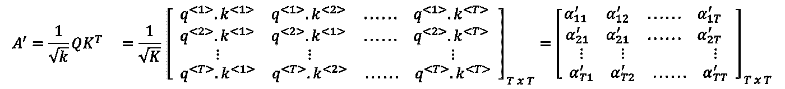

在矩阵`A’`的每一行应用 *Softmax* 得到矩阵`A`。这就是*成比例的点积注意力。*

`*A*`的 row-1 中的元素表示 query-1 对从 1 到 t 的所有键的关注，Row-2 是 query-2 对所有键的关注，以此类推。`*A*`中的每一行总计为 Softmax 的输出)。

`*Head_i*`的输出是矩阵`*A*`和`*V*`的乘积。

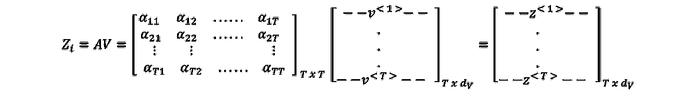

根据矩阵乘法的定义，`*Zi*`的 row-1 是以`*A*`的 row-1 的元素为权重，对`*V*`的所有行进行加权求和。`*Zi*`的 Row-2 是`*V*`所有行的加权和，以`*A*`的 row-2 的元素为权重，以此类推。注意每排`*z<>*`的尺寸与`*v<>*`的尺寸相同。并且`*Zi*`中的行数和`*A*`中的行数一样多。

现在，所有头的输出被连接起来形成`*Z’*`。并乘以`*W⁰*`以产生多头关注子层的最终输出，即`*Z*`。

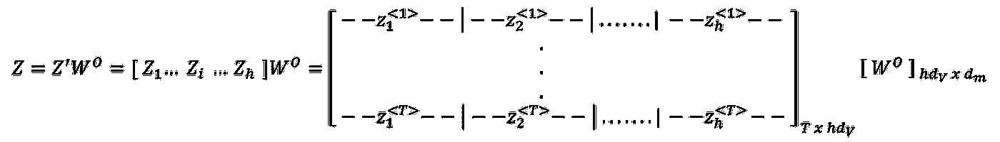

`Z’`中每一行的维数为`*1xhdV*` ( `*h*` 个大小为`*1xdV*`的向量串接而成)。矩阵`*W⁰*`的维度为`*hdVxdm*`，将每一行`Z’`从`*1xhdV*`维度投影到`*1xdm*`。

因此，编码器中的多头关注子层接受大小为`*Txdm*`的输入(每个`*T*`个输入的数量为`*1xdm*`个)，并产生相同大小的输出`*Txdm*`(每个`*T*`个输出的数量为`*1xdm*`)。这也被称为输入-输入注意或编码器自我注意，即输入句子的每个位置注意输入句子本身的所有其他位置。

## 编码器中的前馈网络:

前馈网络接受大小为`*Txdm*`的输入(每个`*T*`个输入的数量为`*1xdm*`个)，并执行以下功能以产生相同大小的输出`*Txdm*`。这里，`*T=TE*`。

该网络执行两次线性变换(通过`*W1*`和`*W2*`)，其间具有 ReLU 非线性。`*W1*`将尺寸`*1xdm*`的每个输入转换成尺寸`*1xdff*`，并将`*1xdff*`转换回另一个`*1xdm*`尺寸。

因此，前馈子层产生与输入维数相同的输出，即`*Txdm*`。

# 3.解码器:

解码器内部有三个子层。

*   掩蔽的多头注意力
*   多头注意力
*   正向输送

## **解码器中屏蔽的多头注意力:**

解码器中的掩蔽多头注意力也称为输出-输出注意力或解码器自我注意力。该模块将`*T (=TD*)`个大小为`*1xdm*`的向量作为输入，并产生一个大小为`*Txdm*`的输出矩阵`*Z*`。这与编码器中的多头注意力子层(参见图 4)相同，除了一个变化——遮罩。此掩码防止查询位置关注未来位置的键，从而保留自回归属性。因此，允许查询`*q<t>*`只关注从`*k<1>*`到`*k<t>*`的键。这是通过在`*A’*`中将禁止的*查询键*组合的位置设置为`*-infinity*`来实现的。

因此，解码器中被屏蔽的多头注意力子层接受大小为`*Txdm*`(每个`*T*`个输入的数量为`*1xdm*`个)的输入，并产生相同大小`*Txdm*` (每个`*T*`个输入的数量为`*1xdm*`个)的输出。

## **解码器中的多头注意力:**

解码器中的多头注意力也称为输入-输出注意力或编码器-解码器注意力。这与编码器中的多头注意力子层(参见图 4)相同，只是它从编码器堆栈接收一个额外的输入(称之为`X*E*`)。该额外输入(大小为`*TExdm*`)用于产生`K`和`V`，而解码器侧的输入(大小为`*TDxdm*`)用于产生`Q`。

相应的，`*A’*`和`A`的尺寸也会变成`*TDxTE*`。这表示来自解码器侧的`*TD*`个令牌中的每一个对来自编码器侧的`*TE*`个令牌中的每一个的关注。

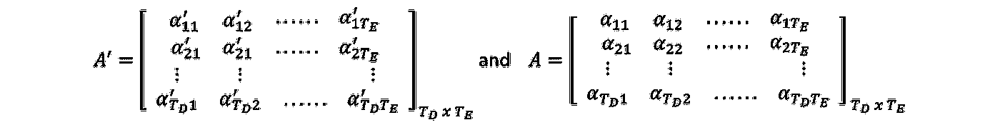

`*Head_i*`的输出尺寸为`*TDxdV*` *。*

## **解码器中的前馈网络:**

解码器中的前馈网络与编码器中的前馈网络相同。这里，`*T=TD*`。

# **4。外围区块:**

变压器模型中的其他外围模块是*输入嵌入、输出嵌入、线性、*和 *Softmax* 模块。输入嵌入(输出嵌入)将输入标记(输出标记)转换成模型维度的向量`*1xdm*`。输入和输出标记是来自输入和输出字典的一键编码。

线性和 Softmax 模块从最后一个解码器获取尺寸为`*1xdm*`的输入，并将其转换为等于输出字典的一键编码的尺寸。这个输出代表概率分布。

*位置编码*既不包含任何可学习的参数，也不通过增加嵌入来改变尺寸。因此，不再进一步解释。

# 5.总结:

具有重复 6 次的编码器-解码器并且在每个子层中具有 8 个注意头的变换器模型具有以下参数矩阵。

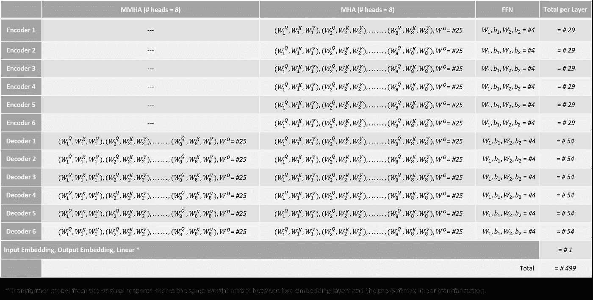

图 5:总参数矩阵(图片由作者提供)

对于具有 N 个编码器-解码器层和`*h*` 注意力头的模型，概括上述内容:

*   每个编码器的参数矩阵数量(MHA+FFN) = `*3h+1 + 4 = 3h+5*`
*   每个解码器的参数矩阵数量(MMHA+MHA+FFN) = `*3h+1 + 3h+1 + 4 = 6h+6*`
*   单个编码器-解码器对的参数矩阵的数量= `*3h+5 + 6h+6 = 9h+11*`
*   模型的参数矩阵总数(NxEnc-Dec+Linear+I . Emb+O . Emb)=`*N(9h+11) + 3*`

考虑到前面给出的所有参数矩阵的维数，模型的参数总数如下:

*   每个编码器的参数数量:

`*MHA: (dmxdK + dmxdK + dmxdV)h + hdVxdm ----- (1)*`

`*FFN: dmxdff + 1xdff + dffxdm + 1xdm ----- (2)*`

*   每个解码器的参数数量:

`*MMHA: (dmxdK + dmxdK + dmxdV)h + hdVxdm ----- (3)*`

`*MHA: (dmxdK + dmxdK + dmxdV)h + hdVxdm ----- (4)*`

`*FFN: dmxdff + 1xdff + dffxdm + 1xdm ----- (5)*`

*   外围模块中的参数数量:

`*Linear + I.Emb + O.Emb: I_dictxdm + O_dictxdm + dmxO_dict -- (6)*`

这里，`*I_dict*` 是机器翻译中的输入语言词典大小，`*O_dict*` 是输出语言词典大小。

*   模型的参数总数= `*N[(1)+(2)+(3)+(4)+(5)]+(6)*`

原变压器研究论文中提到的基础模型(注意是你所需要的)使用尺寸`*dm = 512*`、`*dK = 64*`、`*dV = 64*`、`*dff = 2048*`、`*h = 8*`、`*N = 6*`，共有`*65 million*`个参数。

# 结论:

转换器主要用于构建语言模型，帮助执行各种 NLP 任务，如机器翻译、自动摘要、对话管理、文本到图像的生成等。

几个拥有数十亿参数的大型语言模型，包括最近轰动一时的 ChatGPT，展示了[非凡的对话能力](https://sekharm.medium.com/list/in-conversation-with-ai-7a1d71751872)，都以变形金刚为构建模块。

我希望通过研究这个构件，您能够理解这些大型语言模型最终是如何包含数十亿个参数的。

# 参考资料:

[1] Jay Alammar，[图文并茂的变形金刚](https://jalammar.github.io/illustrated-transformer/)博文，2018。

[2]瓦斯瓦尼等人，[注意力是你所需要的全部](https://proceedings.neurips.cc/paper/2017/file/3f5ee243547dee91fbd053c1c4a845aa-Paper.pdf)，2017。