# 神经网络的有趣特性

> 原文：<https://towardsdatascience.com/intriguing-properties-of-neural-networks-57fef936adc7>

## 神经网络是如何工作的？


莫里茨·金德勒在 [Unsplash](https://unsplash.com?utm_source=medium&utm_medium=referral) 上拍摄的照片

十多年来，神经网络一直是机器学习算法中的佼佼者。他们在不同领域的众多任务中创造了奇迹。然而，关于它们实际上是如何工作的，一直存在疑问。

神经网络可以拟合任何训练数据。它试图通过调整分配给每个输入的权重和随后的中间步骤(隐藏层)来学习输入和输出之间的映射。这种调整是通过监督学习的反向传播自动完成的。因此，很难解释这些权重是如何对映射做出贡献的，并且它还表现出一些反直觉的特性。
T **wo** 这些特性在我们将在本文中讨论的'[神经网络的有趣特性](https://arxiv.org/abs/1312.6199)中有所涉及。虽然它可以追溯到 2014 年，但它仍然是相关的，并丰富了 w.r.t .对神经网络工作的理解。

以下是所述属性:

1.  与经验结果相反，是**而不是**单个神经元(单元)而是**整个向量**对输入的语义信息进行编码。
2.  将**不易察觉的**、**非随机** **噪声**添加到输入中，甚至可以使最先进的深度学习模型对它们进行错误分类，证明该模型对小扰动敏感，并对它们的稳定性提出质疑。

这听起来可能有点模糊和混乱，但是我们将在接下来的章节中更详细地探讨这些。

# 内容

1.  **符号**
2.  **术语**
3.  **神经元 v/s 神经元**
4.  **神经网络的盲点
    →实验结果
    →不稳定性分析**
5.  **结论**
6.  **参考文献**

# **符号**

```
**x ∈ ℝᵐ** is an input image (a vector of real numbers of length m).***I***is the test-set of images.**𝜙(x)** denotesactivations for an entire layer for the given image.**𝜙₁(x), 𝜙₂(x), 𝜙₃(x), ...** denotes activations of individual neurons.**φ(x)**   denotes the output of an entire network of **K** layers.**φ*₁*(x; *W₁*), ..., φ*ₖ*(x; *Wₖ*)** denotes the outputs of individual layers.**φ(x) = φₖ ( φₖ₋₁ (... φ****₁** **( x; *W₁* ); *W₂* ) ...; *Wₖ* )****ρ(x)** ReLU, i.e., **max(0, x)****σ₁** Largest singular value of a matrix
```

# 术语

编号对应于正文中引用这些术语的上标。

1.  **激活:**一个神经元(或一整层)的最终输出，包括激活函数。
2.  **单位:**单个神经元。
3.  **基:**向量空间中的一组向量`**B**`，使得该空间中的每一个向量都可以唯一地表示为`**B**`中向量的一个**线性组合**。例如，在三维欧几里德向量空间中，向量`**{*î, ĵ, k̂*}**` 是基向量，因为该空间中的所有向量都可以表示为线性组合:`***xî + yĵ + zk̂***`。这些也是欧氏向量空间的**标准基**。标准基是一组向量，它们的分量都是`zero`，除了一个等于`1`，即`***ĵ = (0, 1, 0)***`。
4.  **方向:**在这个上下文中是指随机向量`**𝑣**` 会指向某个方向，与这个向量的最大点积会给我们指向`**𝑣**`方向最多的向量。现在，因为据说共享相似特征的图像具有相似的点积值，所以他们说“方向对该特征是敏感的。”
5.  [**非局部泛化**](https://qr.ae/pvA9ml) **:** 神经网络的深层隐藏层本质上是一个对空间进行建模的函数，使得相似的输入更接近于这个潜在空间(例如，具有相似特征的同一类的图像)。神经网络将很好地概括以正确预测附近的输入类别。这叫做**局部泛化**。然而，确实存在一些输入，这些输入可能属于相同的类别，但是由于某些特征使得它们与其他输入不太相似而远离空间中的其他输入(例如，狗的图像可能在附近，但是狗的侧视图可能在空间中远离，尽管它仍然是狗)。神经网络被认为也能够推广这些远距离的输入。这叫做**非局部泛化**。
6.  **框式约束优化:**这是一个唯一的约束是变量上下限(可以是`**±∞**`)的问题。[看到这里](https://math.stackexchange.com/questions/3965637/what-is-box-constrained-mathematical-optimization-problem)。

# 神经元 v/s 神经元

过去的研究表明，特定的神经元对特定的特征做出反应。他们表明，单个神经元的激活对输入具有某种语义意义。为此，他们在图像中寻找相似之处，使同一神经元的激活值最大化:

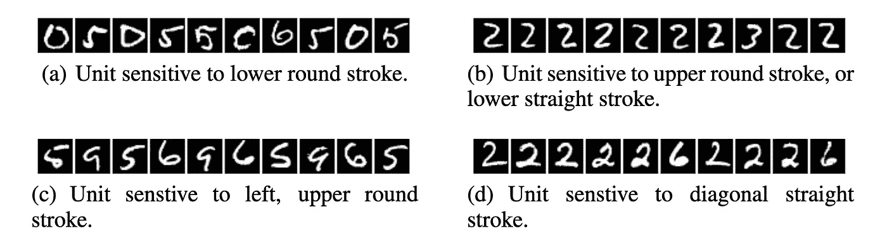

证明过去研究有效性的 MNIST 实验— [Szegedy 等人](https://arxiv.org/abs/1312.6199)

例如，如果你想检查某个`***iᵗʰ***`神经元的激活`**𝜙*ᵢ*(x)**`，

**首先，**您可以在测试图像`***I***` 集合中找到`**𝜙*ᵢ*(x)**` 值最大的图像，使用:

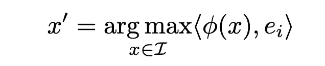

使用单个神经元的激活来寻找语义相关的图像— [赛格迪等人](https://arxiv.org/abs/1312.6199)

基本上，您可以找到所有`***I***` 的`**𝜙*ᵢ*(x)**` 的最大值，然后挑选值接近此最大值的图像。

> ***注意*** *作者使用了*`***⟨*𝜙*(x),* 𝑒*ᵢ⟩***`**的表达方式为激活* `**𝜙*ᵢ*(x)**` *。这里，* `**𝑒*ᵢ***` *是带有* `**iᵗʰ**` *值* `***1***`的一键编码(基)向量。*和尖括号*`***⟨⟩***`**分别代表*`**𝜙*(x)***`**和* `**𝑒*ᵢ***` *的点积。所以我们最终做的是:****

**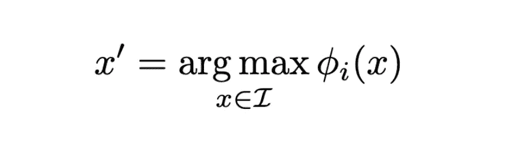**

*****⟨𝜙(x)，𝑒ᵢ⟩ = 𝜙ᵢ(x)*****

****然后，**你可以目视检查这些图像，找出它们之间的相似之处(比如图像有一条对角线的直线)。**

**相反，基于他们的观察，作者表明，只有特定神经元对特定特征做出反应的结论是不正确的。**

> **这就对神经网络将坐标间的变异因素分开的概念提出了质疑。**
> 
> **— [塞格迪等人](https://arxiv.org/abs/1312.6199)**

**他们认为整个激活空间包含了大量的语义信息。为了证明这一点，他们采用了一个随机向量 `**𝑣**` ，而不是一键(标准基)向量`**𝑒**`。即**

**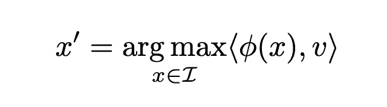**

**使用整个层的激活找到语义相关的图像— [Szegedy 等人](https://arxiv.org/abs/1312.6199)**

**在哪里，**

**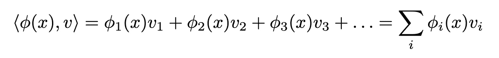**

**所以在这里，不是只有一个`**𝜙*ᵢ*(x)**`，他们考虑所有`**𝜙*ᵢ*(x)**` 的一个**线性组合**，并挑选点积值接近最大值的图像。**

**简而言之，他们证明了给予一层中所有神经元高值的图像在语义特征上也有相似之处。这表明似乎没有对特定特征作出反应的优选神经元或神经元集，但该层作为一个整体编码了大量语义信息:**

**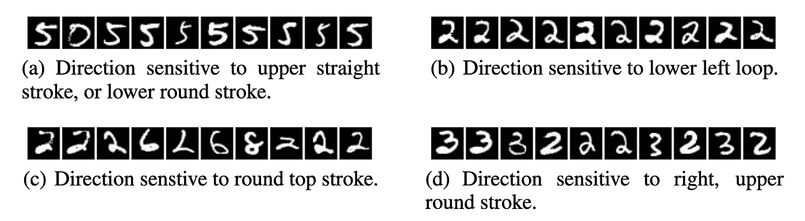**

**MNIST 实验证明层作为一个整体编码语义信息— [Szegedy 等人](https://arxiv.org/abs/1312.6199)**

**如果你仍然困惑，想想如果只有特定的神经元对特定的特征做出反应,`Dropout`会如何工作。**

> **另外，**请注意**经验主义的说法并没有错。有些神经元确实对某些特征比其他的更敏感。但是这些结果并不比用整个层获得的结果更好，因此，可以说神经网络没有在不同的神经元之间分配不同的特征。**

**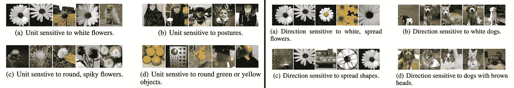**

**ImageNet 上的实验。**左**:演示编码信息的单个神经元；**右图**:展示整个图层编码信息— [Szegedy 等人](https://arxiv.org/abs/1312.6199)**

# **神经网络中的盲点**

**研究表明，神经网络的输入和输出层之间的隐藏层的深度堆栈能够在输入空间上实现**非局部推广** ⁵。因此，这意味着**本地** **generalization⁵** 应该按预期工作。简而言之，对于足够小的半径`**ϵ > 0**`，在给定输入`**x**`附近，满足`**‖r‖ < ϵ**`的输入`**x + r**`将预测正确的类别。**

**该论文的作者认为这一假设不成立，他们通过生成具有难以察觉的小扰动的对立样本来证明这一点，这些小扰动使模型误预测类别。**

**考虑将输入图像`**x ∈ ℝᵐ**`映射到一组标签`**{1 . . . *k*}**` **—** `***f* : ℝᵐ → {1 . . . *k*}**`的神经网络分类器`***f***` 。`***f***`具有由`***lossf* : ℝᵐ × {1 . . . *k*} → ℝ⁺**`表示的损失函数。**

**现在，我们想要找到给出不正确预测`***l***`的最接近`**x**`的图像。设此像为`**x + r**`。所以为了让`**x + r**` 最接近`**x**`，我们需要`**r**`越小越好。因此，我们可以构造一个**框约束优化** ⁶问题:**

**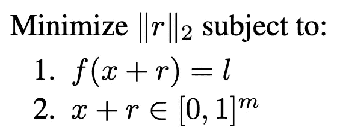**

**对立范例生成问题的形式定义— [Szegedy 等](https://arxiv.org/abs/1312.6199)**

**有可能`**r**`不是唯一的。因此我们将由失真函数`***D(x, l)***`选择的任意`**r**` 表示为`**x + r**`。`***D(x, l)***` 的精确计算是一个难题。因此，作者使用框约束 L-BFGS 近似这一点。**

> **具体地说，我们通过执行线搜索来找到下面问题的极小值`**r**`满足`**f(x + r) = l**`的最小值`**c > 0**`，从而找到`**D(x, l)**`的近似值。**

**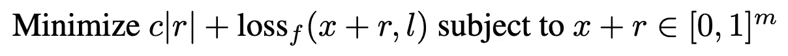**

**近似“硬”优化问题— [Szegedy 等人](https://arxiv.org/abs/1312.6199)**

**不幸的是，这篇论文没有详细说明他们的具体方法。因此，很难围绕这一点获得更多的直觉。**

**L-BFGS 和线搜索超出了本文的范围；我将在以后讨论这些内容。这里有几个解释[【BFGS】](/bfgs-in-a-nutshell-an-introduction-to-quasi-newton-methods-21b0e13ee504)和[线搜索](https://www.youtube.com/watch?v=8tqaXIM6kEE)的好资源。**

**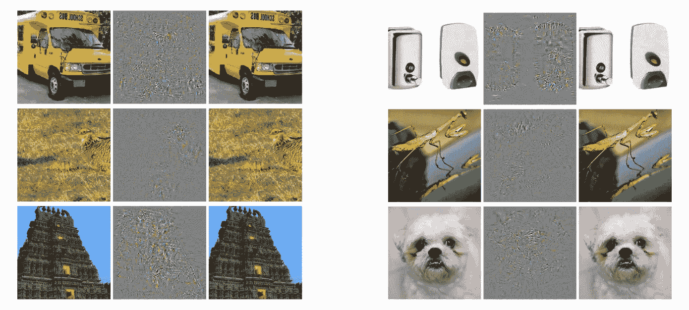**

**为 AlexNet 生成的对抗性示例。**左**:原图；**中心**:添加小扰动(生成图像与原始图像之间的差异，放大)；**右**:被错误分类的反例——[Szegedy 等人](https://arxiv.org/abs/1312.6199)**

**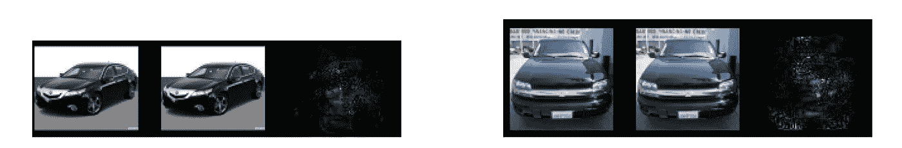**

**为 QuocNet 生成的对抗性示例。**左**:原图；**中心**:被错误分类的反例；**右**:添加了小扰动(生成图像和原始图像之间的差异，放大)——[塞格迪等人](https://arxiv.org/abs/1312.6199)**

## **实验结果**

**有人可能会认为这些错误分类是由于在一组固定的输入上过度拟合模型造成的。为了证明事实并非如此，作者们提出了一些概括实验:**

*   ****跨模型推广**:与用于生成对立样本的模型相比，使用不同的超参数(如层数、正则化或初始权重)从零开始训练的模型会对图像产生明显的错误分类。**

**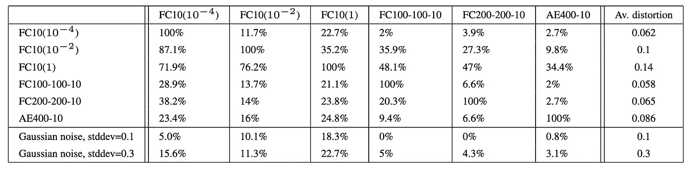**

**第一列表示通过添加最小扰动生成对立示例的模型，使得测试集中的所有示例都被错误分类。最后一列显示了实现误预测所需的原始训练集的平均失真。这些例子被提供给不同的模型(跨列提及)，相应的诱发误差列于上表中— [Szegedy 等人](https://arxiv.org/abs/1312.6199)**

*   ****交叉训练集泛化**:在与用于生成对抗样本的模型完全不同的训练集上训练的模型，会对图像产生明显的错误分类。**

**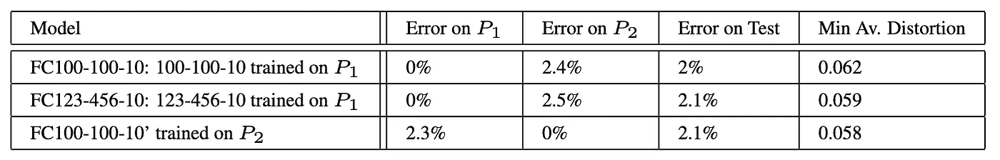**

**用于交叉训练集泛化的原始模型训练细节。MNIST 样本分为两部分——P1 和 P2。最后一列指示测试集中所需的平均最小失真，使得该集中的所有图像被相应的模型错误分类— [Szegedy 等人](https://arxiv.org/abs/1312.6199)**

**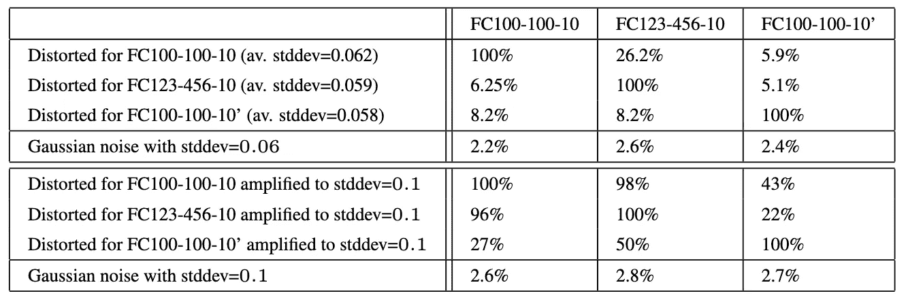**

**针对一个模型生成的对立示例的错误率，并将其提供给在不同训练集上训练的另一个模型(见上表)——[Szegedy 等人](https://arxiv.org/abs/1312.6199)**

## **不稳定性分析**

**从上一节中，我们了解到，尽管已知神经网络可以在局部和非局部点上进行推广，但如果添加正确，它仍然对微小的扰动高度敏感。这就提出了一个关于它们稳定性的问题，也就是说，如果输入的微小变化改变了模型的预测，以至于它变得不正确，那么模型可能根本就不稳定。**

**为了研究这一点，我们将使用 [**Lipschitz 连续性的概念**](https://en.wikipedia.org/wiki/Lipschitz_continuity) **:****

**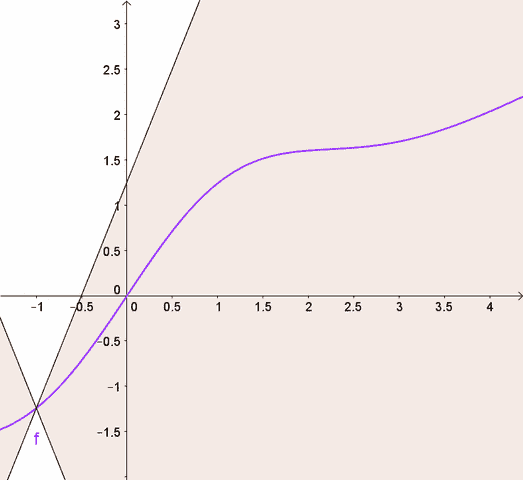**

**对于 Lipschitz 连续函数，我们可以画一个双锥(白色区域),这样如果我们沿着函数移动它的原点，函数就不会进入白色区域— [维基百科](https://en.wikipedia.org/wiki/Lipschitz_continuity)**

**Lipschitz 连续函数的变化速度有限。对于 Lipschitz 连续函数，连接该函数上任意两点的直线的斜率大于一个实数。这个实数称为李普希茨常数:**

**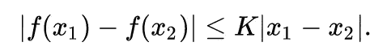**

**这确实非常直观。例如，斜率给出了`***f(x)***` 随`***x***`变化多少的度量。因此，我们可以说，如果斜率以一个小值为界，那么`***x***`中的“小扰动”不会对`***f(x)***`产生大的影响。**

**现在考虑两个函数`***f***`和`***g***`，设`***h***`为`***f***`和`***g***`的组合，即`***h = f ∘ g***`。为此，**

**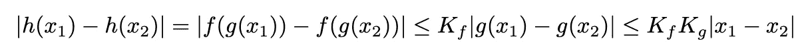**

**因此，对于`***n***`功能的组合，即`***h = f₁ ∘ f₂ ∘ ... ∘ fₙ***`，**

**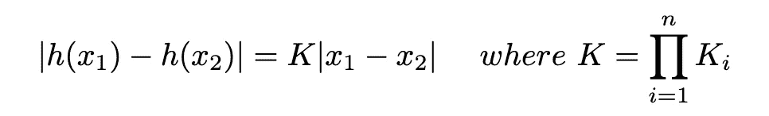**

**同样，在我们的例子中，对于一个`***kᵗʰ***`层，**

**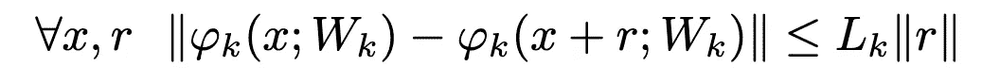**

**其中`***Lₖ***`是`***kᵗʰ***`层的 Lipschitz 常数。所以对于整个`**K**`层的网络，**

**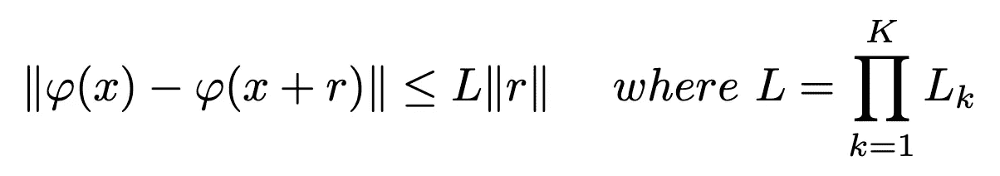**

**接下来，我们想找到我们的神经网络的李普希茨常数。给定上面的表达式，可以有把握地说，我们可以为每一层找到`***L***`，然后取乘积。但是首先，我们需要弄清楚如何找到所有层的`***L***`:**

*   ****为 ReLU (** `**ρ**` **)** :**

**要找到`***Lᵣₑₗᵤ***`，我们需要以下内容:**

```
**Given any differentiable function ***f* : ℝ → ℝ** and points **x, y ∈ ℝ**, if the maximum derivative of ***f***, ***dₘₐₓ* = max{∣*f'*(z)∣ | z ∈ ℝ}** exists, then**∣*f*(x) - *f*(y)∣ ≤ *dₘₐₓ*∣x - y∣**So, ***dₘₐₓ*** is the Lipschitz constant of ***f***. For proof, refer [this link](https://www.duo.uio.no/bitstream/handle/10852/69487/master_mathialo.pdf?sequence=1) (Page 48).**
```

**现在，ReLU 由`***f*(a) = max(0, a)**`定义，即它可以取 2 个值:`**{0, a}**`。对这个 w.r.t. `**a**`求导我们得到— `***f’*(a)**`可以取 2 个值:`**{0, 1}**`。所以`***dₘₐₓ***`是`**1**`，由此，`***Lᵣₑₗᵤ* = 1**`。因此，**

**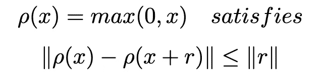**

*   **同样，我们可以证明对于 **max-pooling 层** `**φ(x)**`，**

**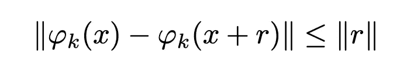**

*   ****为** **密集层**:**

**连续性由下式给出**

**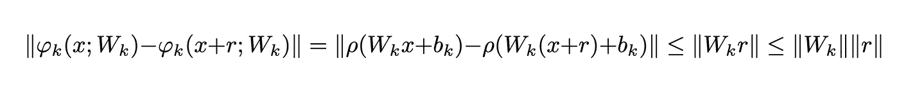**

**由上可知，李普希兹常数是稠密层`**‖*Wₖ*‖**`的**算子范数**。可以证明这个范数是以`***Wₖ***`的最大奇异值为界的。你可以在这里找到证明[(第 44 页)](https://www.duo.uio.no/bitstream/handle/10852/69487/master_mathialo.pdf?sequence=1)。**

**如果你不明白，回想一下对于`***h = f ∘ g***` ***，*** 李普希兹常数的值是`***f***`和`***g***`的李普希兹常数的乘积。所以在这里，我们可以把`**ρ**`乘以它的`***Lᵣₑₗᵤ***` 值，也就是`**1**`。**

*   **类似地，对于**对比度归一化层** `**φ(x)**`，**

**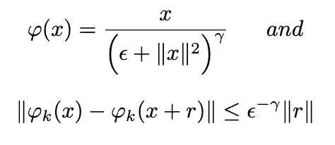**

*   ****对于卷积层:****

> **就我个人而言，我并不觉得这篇论文对此的解释特别直观。根据我的理解，他们已经使用了 Toeplitz 矩阵理论及其与傅立叶分析的联系来寻找卷积层的算子范数的上界。**
> 
> **然而，这只是一篇关于神经网络和不稳定性的介绍性文章，所以我们不会在卷积理论上纠缠太深。相反，我们将研究卷积层的不同解释，我在这里遇到了[(从第 44 页开始)](https://www.duo.uio.no/bitstream/handle/10852/69487/master_mathialo.pdf?sequence=1)。**

**首先，我们现在来看看卷积运算实际上是如何实现的。**

**虽然在图像上滑动内核是直观的，但我们的 python 库在执行矩阵乘法时更加舒适和高效。因此，他们不是滑动内核，而是"**将图像展开**成平坦的张量，用平坦的内核做**矩阵乘法**，并将其"**折叠**"到所需的输出维度。**

**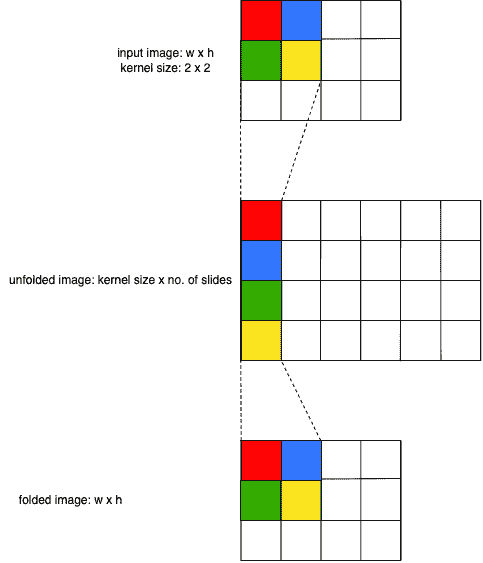**

**展开和折叠操作**

****展开操作**例如，如果一幅图像有 3 个通道，那么展开矩阵的行数将是`3 x kernel size`。展开图像中的列数就是内核幻灯片的数量。另外，请注意展开操作包括相邻幻灯片中的重复像素。**

**相反，**折叠操作** `**F(a)**`采用展开的矩阵，并在给定内核和输出尺寸的情况下构建图像。**

**所以卷积层可以概括为:
`**(w ★ a) = F(WᵀU(a))**` 现在我们知道了矩阵乘法运算的 Lipschitz 常数。让我们试着找到展开和折叠的方法。**

**对于足够小的内核(`**k x k**`)和相对较大的图像，展开操作符最多可以重复像素`**k²**`次。除此之外，它只是重塑了图像矩阵。折叠运算符也是如此，只是它最多在`**k²**`次合并一个给定的像素。因此，我们可以说，不管输入的变化如何，展开/折叠操作的变化都受到恒定内核大小`**k²**`的限制。
让我们来证明这一点:**

**我们用`**1**`通道创建一个任意的`**4 x 4**`张量(图像)。首先，我们打开它，然后折叠它。在这样做的时候，我们检查两个操作的导数。展开和折叠的`***dₘₐₓ***`为`**k²**`。因此，`**U(a)**`和`**F(a)**` 的李普希兹常数受`**k²**`限制。**

**最后，卷积层的连续性由下式给出:**

**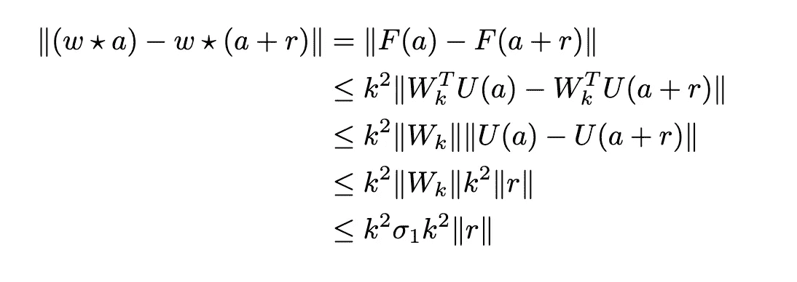**

**我们已经看到，算子范数`**‖*Wₖ*‖**` 以核矩阵`**σ₁**`的最大奇异值为界。**

> ****注意**虽然卷积层的这种解释的想法取自[这篇论文的文章](https://www.duo.uio.no/bitstream/handle/10852/69487/master_mathialo.pdf?sequence=1)，但它没有考虑 matmul 之后的折叠运算符。它也没有解释重复操作是如何给出展开的 Lipschitz 常数的。为了提供更好的直觉，我试图填补这些空白。我很乐意看到和解决任何关于相同的评论。**

**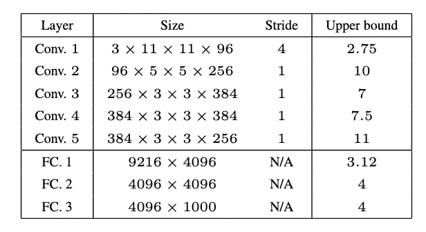**

**来自 [Szegedy 等人](https://arxiv.org/abs/1312.6199)的网络各层的界限**

**可以清楚地看到，所有层的上限值都相当高，表明它们不稳定。**

# **结论**

**在这篇文章中，我们浏览了 [Szegedy 等人的](https://arxiv.org/abs/1312.6199)，并试图对这篇论文涉及的神经网络的各种属性有一个直观的了解。**

**我们发现神经网络在归纳方面可能并不稳定。显而易见，我们应该考虑如何让它们稳定下来。这是一个独立的研究分支，致力于通过正则化各层来推广神经网络，使其成为[收缩](https://en.wikipedia.org/wiki/Contraction_mapping)(基本上是`**0 ≤ *Lₖ* < 1**`的连续性)。**

**我们将在未来尝试触及一些这方面的研究。**

# **参考**

**[](https://arxiv.org/abs/1312.6199) [## 神经网络的有趣特性

### 深度神经网络是高度表达的模型，最近在语音方面取得了最先进的表现…

arxiv.org](https://arxiv.org/abs/1312.6199) [](https://stats.stackexchange.com/questions/371564/intriguing-properties-of-neural-networks) [## 神经网络的有趣特性

### 它可能有助于你研究一个具体的例子。作者通过…表示整个激活层

stats.stackexchange.com](https://stats.stackexchange.com/questions/371564/intriguing-properties-of-neural-networks) 

[https://www . duo . uio . no/bitstream/handle/10852/69487/master _ mathialo . pdf](https://www.duo.uio.no/bitstream/handle/10852/69487/master_mathialo.pdf)

[](https://en.wikipedia.org/wiki/Lipschitz_continuity) [## 李普希茨连续性-维基百科

### 在数学分析中，以德国数学家鲁道夫·李普希茨命名的李普希茨连续性是一种强形式的…

en.wikipedia.org](https://en.wikipedia.org/wiki/Lipschitz_continuity) [](https://www.youtube.com/watch?v=zVDDITt4XEA) [## PyTorch -引擎盖下的卷积(展开/折叠)

### 我将讨论如何使用折叠和展开操作从头开始实现类似卷积的操作。这是如何…

www.youtube.com](https://www.youtube.com/watch?v=zVDDITt4XEA) 

[https://math . Berkeley . edu/~ hutching/teach/54-2017/SVD-notes . pdf](https://math.berkeley.edu/~hutching/teach/54-2017/svd-notes.pdf)

[](https://yeephycho.github.io/2016/08/03/normalizations_in_neural_networks/) [## 神经网络中的标准化

### 在图像处理领域，术语“归一化”有许多其他名称，如对比度拉伸、直方图拉伸等

yeephycho.github.io](https://yeephycho.github.io/2016/08/03/normalizations_in_neural_networks/) [](https://arxiv.org/abs/2006.08391) [## 用 Toeplitz 矩阵理论研究卷积层的 Lipschitz 正则化

### 本文研究卷积神经网络的 Lipschitz 正则化问题。李普希茨正则性是…

arxiv.org](https://arxiv.org/abs/2006.08391)**