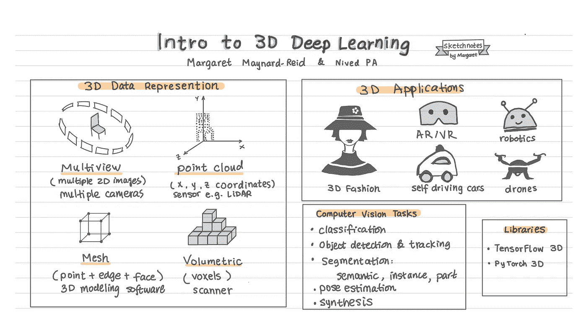
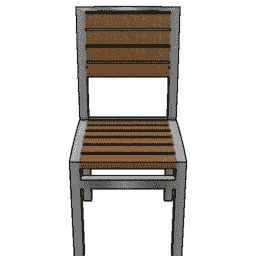
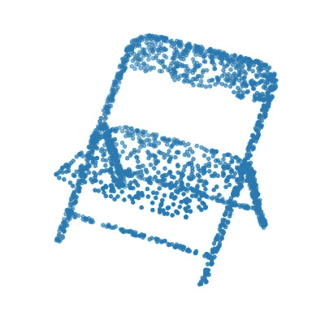
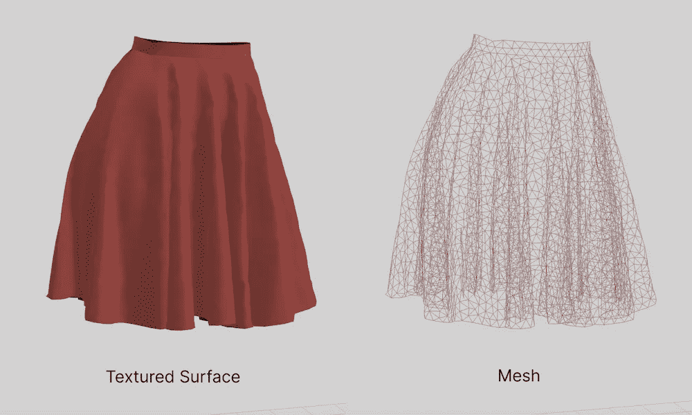
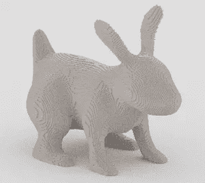
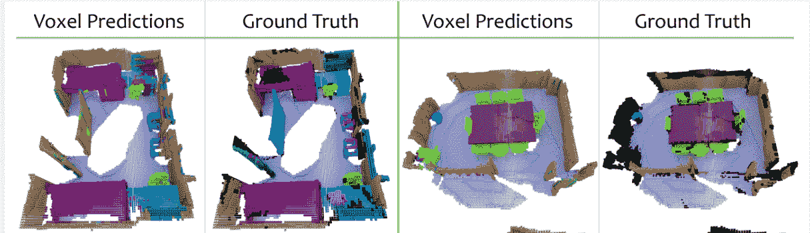
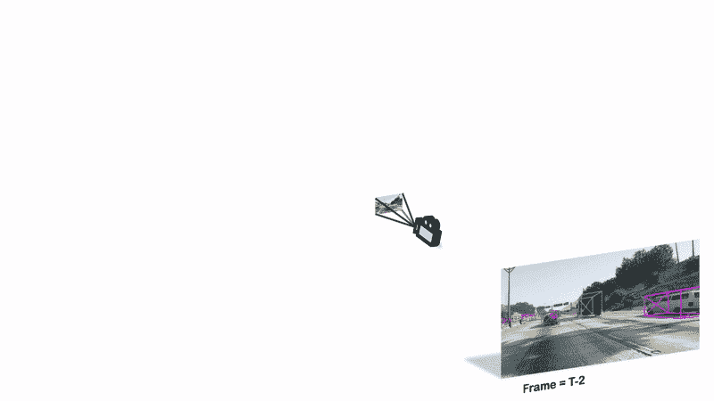
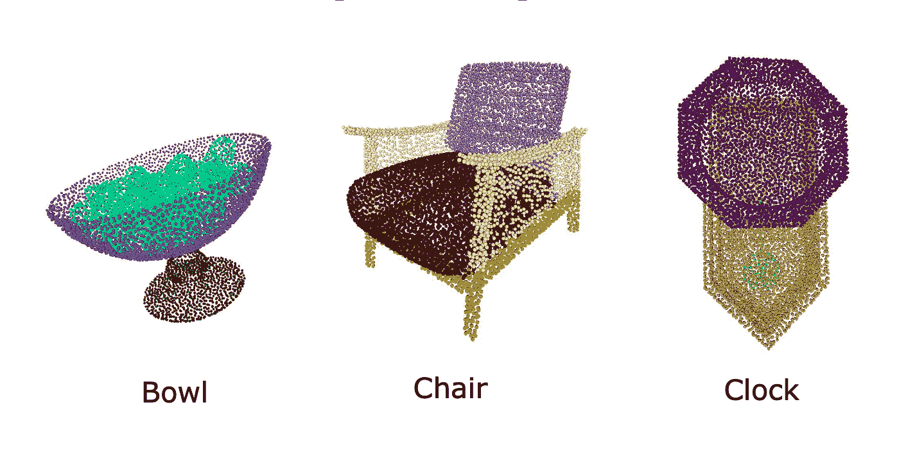
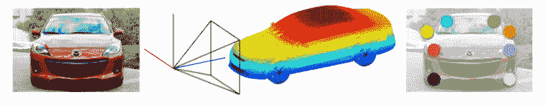

# 3D 深度学习简介

> 原文：<https://towardsdatascience.com/intro-to-3d-deep-learning-e992f7efa6ee>

## 3D 数据表示、视觉任务和学习资源

作者:玛格丽特·梅纳德·里德和 T2

3D 深度学习是一个有趣的领域，具有广泛的现实应用:艺术和设计，自动驾驶汽车，体育，农业，生物，机器人，虚拟现实和增强现实。这篇博客文章介绍了 3D 深度学习:3D 数据表示，计算机视觉任务和学习资源。

作者图片(玛格丽特)

# 3D 数据

数据对于训练机器学习模型来说超级重要。2D 和 3D 深度学习最大的区别之一是数据表示格式。

常规图像通常以 1D 或 2D 阵列表示。另一方面，3D 图像可以有不同的表示格式，这里有一些最流行的格式:多视图、体积、点云、网格和体积显示。让我们来看看用图片说明的每个数据表示。

# 多视图图像

这些可以通过定位从同一物体或场景的不同角度拍摄照片的多个相机来捕捉。这是一把椅子的样子，图片来自 [ShapeNet](https://shapenet.org/) ，这是一个注释丰富的大型形状库，由物体的 3D CAD 模型表示。

ShapeNet 数据集的图像

# 点云

在点云数据集中，每个图像由一组从原始传感器收集的点(x，y，z 坐标)表示。点云数据通常由激光雷达传感器捕获或从网格数据转换而来。

这是来自 [ModelNet10](https://modelnet.cs.princeton.edu/) 数据集的**点云**表示中椅子的样子。

来自 ModelNet 10 数据集的图像

# 网状物

网格是使用 Blender、Autodesk Maya 或 Unreal Engine 等软件进行 3D 建模的典型构件。与点云中每个 3D 对象由**点**组成不同，网格表示由一组点以及这些点(**边**和**面**的关系组成。一种网格是**多边形网格**，其面为三角形或四边形。

作者图片(玛格丽特)

# 体积显示

在体积表示中，每个图像都是实心的，由体素组成:2D 图像中像素的 3D 等价物。

诸如 Blender 之类的 3D 建模软件可以用来对 3D 模型进行体素化，这里是一个体素化兔子的例子:

作者图片(玛格丽特)

体积表示可以通过实时扫描获得，或者从 3D 点云或网格转换而来。这里有一个来自[scan-net.org](http://scan-net.org)的例子，它用语义体素标签对室内场景进行了 RGB-D 扫描。

图片来自 scan-net.org/

# 3D 计算机视觉任务

就像 2D 计算机视觉一样，3D 任务包括图像分类、分割、姿态估计和使用生成模型的图像合成。下面我们将讨论这些任务的几个例子。由于 3D 数据有如此多不同的表现形式，请注意，我们下面提到的例子可能只涉及一些 3D 数据格式。

## 三维图像分类

图像分类在 2D 和三维计算机视觉中都是一个很好解决的问题。

3D 数据分类涉及识别场景中存在的单个 3D 或多个 3D 对象的任务。它将使我们能够通过捕捉物体的形状、大小、方向等来识别物体。这在处理增强现实(AR)、自动驾驶汽车和机器人等现实应用时至关重要。

该任务类似于 2D 图像分类，不同之处在于模型架构。 [VoxNet](https://www.dimatura.net/publications/voxnet_maturana_scherer_iros15.pdf) (2015)是利用 3D CNNs 进行单个 3D 对象检测的最初作品之一。它接受 3D 体积数据或 2D 帧序列作为输入，并应用 3D 内核进行卷积运算。3D CNNs 是学习体数据表示的强大模型。最近的工作，如 [SampleNet](http://openaccess.thecvf.com/content_CVPR_2020/papers/Lang_SampleNet_Differentiable_Point_Cloud_Sampling_CVPR_2020_paper.pdf) (2020)介绍了采样点云的技术，其中包括代表视觉场景的点，从而提高分类性能以及其他任务，如 3D 重建。

这里有一个 Keras.io 上学习 3D 图像分类的很棒的教程:[用 PointNet 进行点云分类](https://keras.io/examples/vision/pointnet/)。

## 3D 对象检测和跟踪

3D 中的对象检测和跟踪类似于 2D 中的任务，但是具有额外的挑战。3D 对象检测任务我们处理体素或点。

3D 物体检测和跟踪在自动驾驶汽车中非常有用。我们可以使用 RGB 图像、点云数据或来自相机和传感器(激光雷达)点云的融合数据输入来训练 3D 对象检测和跟踪。

对象检测和跟踪也可以用于增强现实，以将虚拟项目叠加到现实世界场景中。

图片来自论文:单目准密集三维物体跟踪

## 三维图像分割

与 2D 图像分割任务一样，3D 图像分割也包括语义、实例和部分分割。

图片来自纸张:PID-Net 零件分割

根据 3D 数据表示，不同的技术被用于分割任务。用于分割的一些流行的 3D 数据集包括 ScanNet、ShapeNet 和 Semantic3D。

3D 分割的一些应用包括使用无人机进行场景分析、3D 地图重建和医疗诊断。有趣的是，语义分割也有助于深度估计。

## 三维姿态估计

3D 姿态估计是涉及从作为输入给出的 2D 图像预测 3D 对象的实际空间定位的过程。一旦我们获得 2D 图像中物体的三维旋转和平移等信息，我们就可以将它转换到三维空间。这个问题在机器人领域非常活跃。一个机器人也许能够用照相机看到各种各样的物体，但是仅仅看到一个物体并不足以真正抓住它。

为了解决这个问题，通常为每个对象检测、识别和跟踪许多被称为关键点的重要特征。解决这个问题的早期工作之一是由 Shubham Tulsiani 等人 (2015)完成的，他们引入了一种基于 CNN 的方法，用于从 2D 图像中可靠地预测对象的视点和关键点。

(左)2D 汽车图像(中)使用视点(右)关键点位置表示 2D 汽车的姿态来自纸张的图像:视点和关键点

3D 姿态估计的其他重要应用包括增强现实和时尚虚拟试穿。

## 三维图像重建

3D 图像重建涉及从关键点、分割、深度图和表示 3D 模型知识的其他形式的数据中理解图像的 3D 结构和方向的任务。随着数据的丰富，基于深度学习的技术在解决这个问题方面也很受欢迎。这些作品基于不同的模型，如 CNN，RNNs，Transformers，VAEs 和 GANs。

**多视图重建**

这是一项使用代表场景的 2D 图像集合来重建物体的 3D 视图的任务。基于这种技术的深度学习模型从图像中提取有用的信息，并探索不同视图之间的关系。

**单视图重建**

在单视图重建中，使用单个 2D 图像来完成对象的 3D 视图。这是一项复杂得多的任务，需要模型仅从表示物体单个视图的图像中推断几何结构和视觉特征，如纹理和阴影。然而，该领域已经有许多研究，例如 [GAN2Shape](https://openreview.net/pdf?id=FGqiDsBUKL0) 、 [PHORUM](https://arxiv.org/abs/2204.08906) 已经证明成功地生成了具有精确颜色、纹理和阴影表示的真实感 3D 结构。

**用 NeRF 进行三维重建**

NeRF 使用单个连续的 5D 坐标作为输入来探索 3D 重建的任务。坐标表示空间位置和观察方向。它输出给定位置的体积密度和视图相关的 RGB 颜色。这最小化了在渲染先前用于 3d 重建任务的多个图像时引入的误差。

这个概念是论文引入的:将场景表示为神经辐射场进行视图合成[【Project】](http://www.matthewtancik.com/nerf)[【Paper】](https://arxiv.org/abs/2003.08934)[【Code】](https://github.com/bmild/nerf)。这里还有一个关于 https://keras.io/examples/vision/nerf/的很棒的教程。

# 学习资源

我们想分享一些帮助我们学习 3D 深度学习的学习资源。

[Keras.io](https://keras.io/) 有几个上面提到的 3D 深度学习教程。

[如何表现 3D 数据](/how-to-represent-3d-data-66a0f6376afb)是一篇关于 3D 数据表现的很好的帖子，有更多的细节。[加州大学圣地亚哥分校 SU 实验室的 3D 深度学习教程](https://youtu.be/vfL6uJYFrp4)提供了 3D 深度学习的一个很好的概述。GitHub repo [3D 机器学习](https://github.com/timzhang642/3D-Machine-Learning#material_synthesis)收集了 3D 数据集、模型和论文等。

有两个 3D 深度学习库: [TensorFlow 3D](https://github.com/google-research/google-research/tree/master/tf3d) 和 [PyTorch3D](https://pytorch3d.org/) 。这篇博文[用 TensorFlow 3D 理解 3D 场景](http://ai.googleblog.com/2021/02/3d-scene-understanding-with-tensorflow.html)详细介绍了 TensorFlow 3D 模型。而这些优秀的 [PyTorch3D 教程](https://pytorch3d.org/tutorials/)都有 Colab 笔记本，你可以亲自动手探索。

# 摘要

这篇文章提供了 3D 深度学习的概述:基本术语，3D 数据表示和各种 3D 计算机视觉任务。我们已经分享了一些学习资源，您可能会发现这些资源对开始 3D 深度学习有所帮助。

关于作者——玛格丽特·梅纳德·里德是一名 ML 工程师、艺术家和有抱负的 3D 时装设计师。Nived PA 是阿姆里塔大学计算机工程专业的本科生。