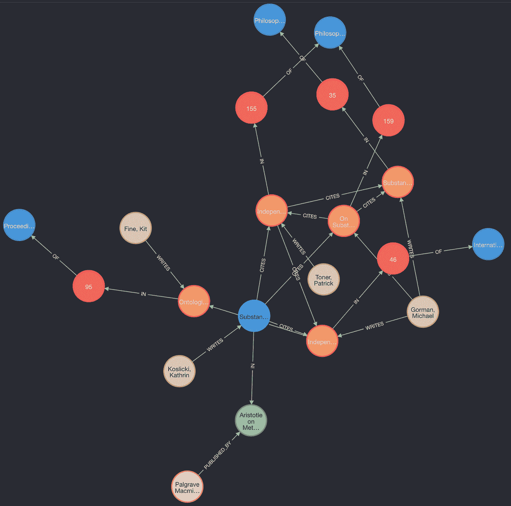
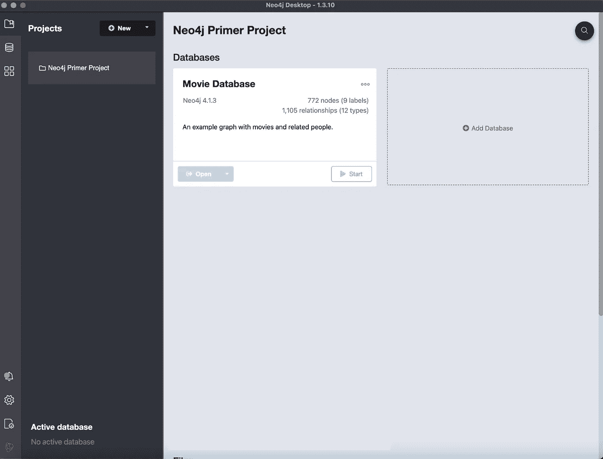
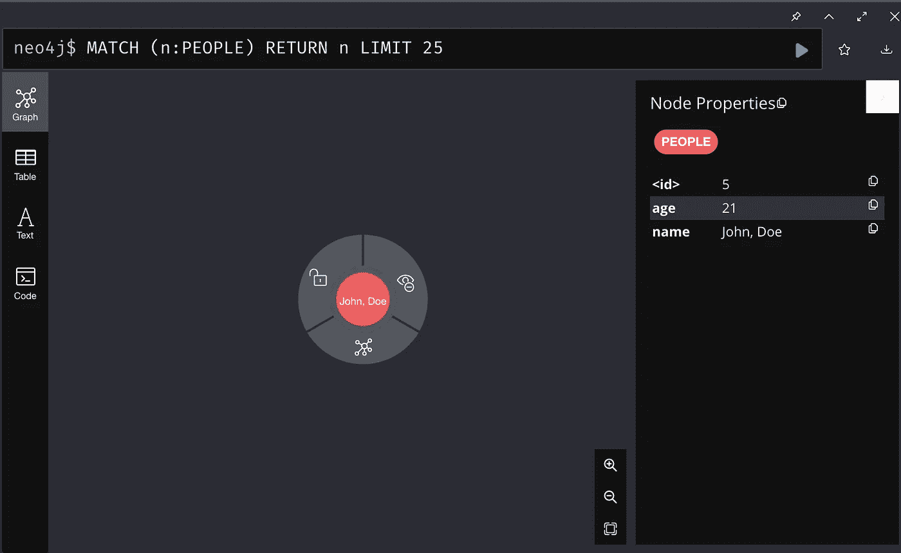
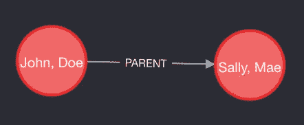
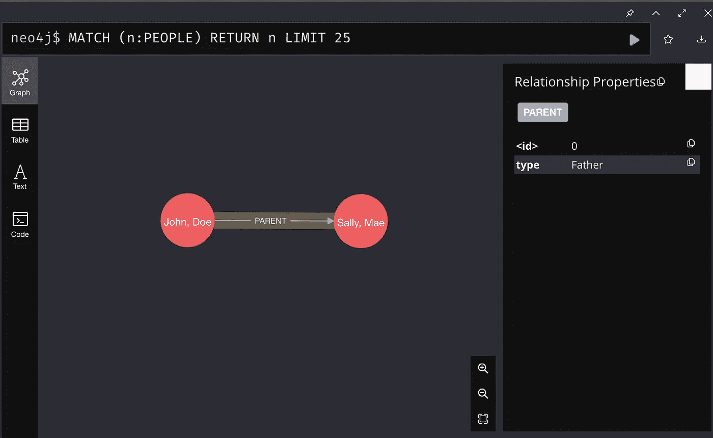
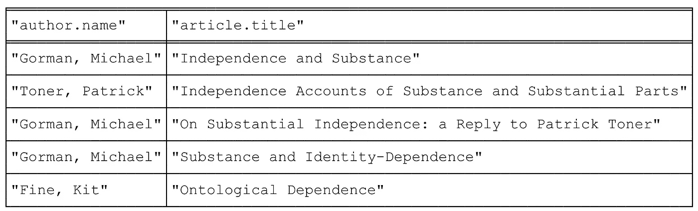
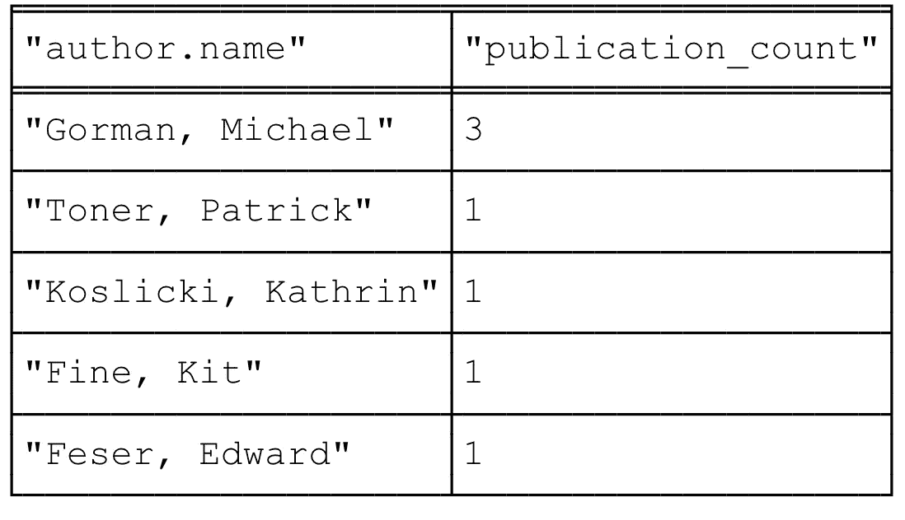
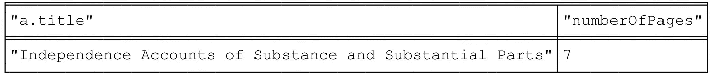
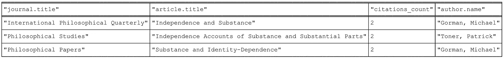

# Neo4j 简介:图形数据库

> 原文：<https://towardsdatascience.com/intro-to-neo4j-a-graph-database-19958be6c52f>

## 了解图形数据库 Neo4j 并编写练习查询



作者图片

**Neo4j 是什么？**

Neo4j 是一个图形数据库，以节点和关系的形式存储数据。这不同于更传统的关系数据库，后者将数据存储为表格。

使用 Neo4j 的好处是，它使用本机图形存储、针对速度优化的可扩展架构，并且它是 ACID 兼容的，这有助于保持基于关系的查询的可预测性。与 MySQL 相比，Neo4j 在图形遍历方面要快得多。

**设置**

要下载 Neo4j，请点击[此处](https://neo4j.com/download-center/#community)，并按照下载说明进行操作。请务必下载社区版。

下载后，打开应用程序，它将看起来像下面的图片。电影数据库是预加载的，可以用来练习查询。对于本教程，单击旁边的添加数据库按钮，然后按创建本地数据库。然后，将数据库的名称改为 Practice，设置任意密码，并按 create。最后，按 start 启动数据库，然后按 open。



作者图片

**什么是节点？**

节点是 Neo4j 中表示实体的结构类型。Neo4j 中的每个节点都有一个惟一的 ID。节点也有标签和属性图。Neo4j 中的节点用括号()表示。下面的例子将讨论各种类型的节点以及如何创建它们。

空括号用于创建空节点。运行下面的语句在 Neo4j 中创建一个空节点。

```
CREATE ()
```

为了确保已经创建了节点，将弹出如下所示的消息。


作者图片

带有任何字母数字值的括号也表示一个空节点。字母数字值用作空节点的变量。变量只能在一条语句中使用，在其他语句中没有意义。

```
CREATE (a)
```

在变量后添加冒号允许添加节点标签。这可以被认为是节点的类型。与 SQL 相比，具有相同标签的所有节点可以被认为是同一个表的一部分。此外，在图形中，具有相同标签的所有节点将具有相同的颜色。

```
CREATE(a:Person)
```

该命令运行后将能够看到当前的可视化图形。单击左侧边栏的顶部图标(在下图中以绿色显示)。然后点击*(3)按钮，下面用红色标出，显示整个图表。点击旁边的 PEOPLE 按钮将显示所有带有 PEOPLE 标签的节点。


作者图片

定义节点后，可以以键-值对的形式添加属性。在此示例中，节点的属性是 name，对于此节点，名称是 John，Doe。

```
CREATE (a:PEOPLE{name:”John, Doe”})
```

可以在每个节点的花括号内添加多个属性。要查看每个节点的属性，将鼠标悬停在它上面，右侧会弹出一个侧边栏，如下图所示。

```
CREATE (a:PEOPLE{name:”John, Doe”, age:21})
```



作者图片

**什么是关系？**

关系用于连接成对的节点。有两种关系，直接的和直接的。无向关系用 2 条虚线表示。有向节点用箭头→或←表示。

无向关系用于匹配查询，不能用于 create 语句。当关系的方向不重要时，它们用于查找节点之间的关系。

对于有向关系，它们可以简单到只使用箭头来连接节点。

```
CREATE (a:PEOPLE{name:”John, Doe”}) →(b:PEOPLE{name:”Sally, Mae”})
```

或者

```
CREATE (a:PEOPLE{name:”John, Doe”})←(b:PEOPLE{name:”Sally, Mae”})
```

可以将括号添加到关系中以包括细节。在下面的例子中，变量[p]的用法与节点中的变量相同。

```
CREATE (a:PEOPLE{name:”John, Doe”})-[p]->(b:PEOPLE{name:”Sally, Mae”})
```

可以将标签添加到与节点标签相似的关系中。下面的关系显示了通过父关系相关的节点“人员”。无名氏是莎莉·梅的父母。

```
CREATE (a:PEOPLE{name:”John, Doe”})-[p:PARENT]->(b:PEOPLE{name:”Sally, Mae”})
```



以上查询的输出(图片由作者提供)

属性可以添加到关系中。这些等同于节点中的属性。在本例中，它显示 John Doe 是 Sally Mae 的父亲。要查看某个关系的属性，请单击该关系并查看右侧的侧边栏。

```
CREATE (a:PEOPLE{name:'John, Doe'})-[p:PARENT{type:'Father'}]->(b:PEOPLE{name:'Sally, Mae'})
```



作者图片

一条语句可以创建多个关系。

```
CREATE (a:PEOPLE{name:'Jane, Doe'})-[p:PARENT{type:'Mother'}]->(b:PEOPLE{name:'Freddy, Mae'})-[g:PARENT{type:'Father'}]-> (c:PEOPLE{name: 'Jill, Smith'})
```

上面的关系是用 CREATE 语句创建的，因为节点还不存在，所以需要同时创建节点和关系。如果节点已经存在，那么需要使用匹配语句。

**比赛声明**

匹配语句用于搜索模式。第一个用途是在现有节点之间创建关系。在这种情况下，它需要与 WHERE 子句成对出现。首先要匹配的节点需要定义它们的类型。在这个例子中，第一个节点需要是作者，第二个节点需要是书。然后，从每个节点获取特定属性必须在 WHERE 子句中。在作者下面的例子中，node 的名字必须是“Feser，Edward ”, node 的书名必须是“亚里士多德论方法和形而上学”。当选择属性来定义特定节点时，请确保它对于您想要的节点是唯一的。

```
CREATE (a:Author{name:'Feser, Edward'}), (b:Book{title:'Aristotle on Method and Metaphysics');MATCH (a:Author),(b:Book) WHERE a.name = 'Feser, Edward' and b.title='Aristotle on Method and Metaphysics' CREATE (a)-[:EDITS]->(b);
```

最简单形式的匹配语句可用于检索特定节点。

```
MATCH (n:Book) WHERE n.title='Aristotle on Method and Metaphysics' and n.year=2013 RETURN n;
```

Match 语句也可以用来返回具有相同标签的所有节点。

```
MATCH (a:Author) RETURN a;
```

为了构建上面的查询，还可以使用 match 语句找到一组具有特定关系的节点。基本上，图中的任何模式都可以用 match 语句找到。

**练习查询**

为了练习上面讨论的内容，创建一个新的数据库，并在 Neo4j 中运行链接到此处的语句来创建数据库。预期的输出显示在每个提示符下。

1.  对于每个作者，列出他们的名字和文章标题(不包括章节或书籍)。



2.列出作者的姓名和各自发表的文章(文章、章节和书籍)数量。



3.列出 10 页或更少的文章的标题和页数。注意:pp 属性是一个列表。您可以使用括号来访问列表元素(例如 pp[0])



4.列出文章标题、发表文章的期刊标题，以及被引用两次或更多次的文章的作者姓名



**答案**

```
MATCH (n:Author)-[r:WRITES]->(x:Article) RETURN n.name,x.title;
```

2.

```
MATCH (n:Author)-[:WRITES]->(r) RETURN n.name, count(*) UNION MATCH (n:Author)-[:EDITS]->(r) RETURN n.name, count(*);
```

3.

```
MATCH (n:Article)-[a:IN]->(i:Issue) WHERE (a.pp[1] - a.pp[0]+1 ) <= 10 RETURN n.title, a.pp[1] - a.pp[0] +1;
```

4.

```
MATCH (a)-[:CITES]->(b) With b, count(b.title) as publication_count WHERE publication_count>=2 With b.title as bt  , publication_count MATCH (au:Author)-[:WRITES]-> (a:Article)-[:IN]->(:Issue)-[:OF]->(j:Journal) WHERE bt = a.title Return j.title, a.title, au.name,publication_count;
```

图形数据库正被广泛用于社交网络的欺诈检测。Neo4j 在图形数据库中越来越受欢迎。由于其高性能、最大和最活跃的图形社区以及生产应用程序，它从其他图形数据库中脱颖而出。

有关 Neo4j 的任何其他问题或附加练习查询，请联系。此外，查看 [Neo4j 网站](https://neo4j.com/)获取更多资源。