# Microsoft Power BI —从数据建模到令人惊叹的报告

> 原文：<https://towardsdatascience.com/intro-to-power-bi-from-data-modelling-to-stunning-reports-b34aac43d8a1>

## 这个可视化工具能为你做什么？

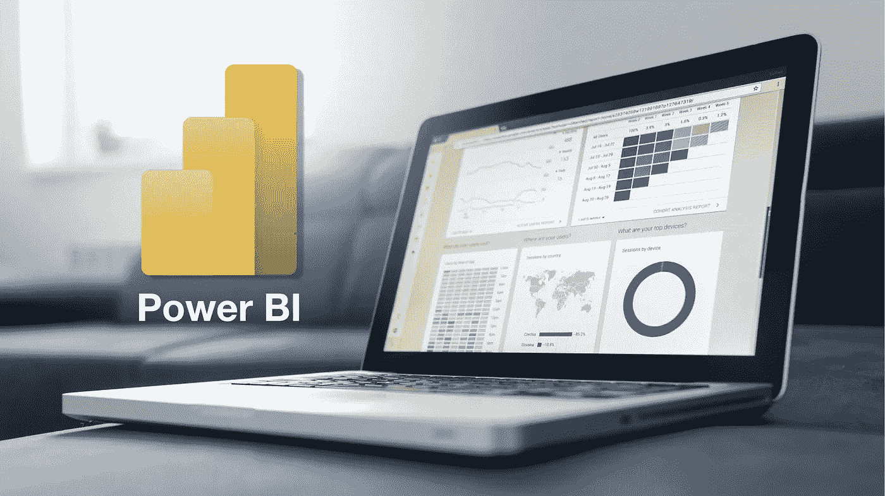

图片由[卢卡斯·布拉塞克](https://unsplash.com/@goumbik)在 [Unsplash](https://unsplash.com/) 上拍摄，作者进行了增强。

什么是 Power BI？能代替好 ol' **微软 Excel** 吗？

还是他们一起工作更好？

创造惊人的观想有多容易？

Power BI 对 ETL 和数据建模也有好处吗？

我们将在这篇演示文章中回答这些问题。提供数据！

**数据科学新手？**

查看我的文章，关于[](/predict-house-prices-with-machine-learning-5b475db4e1e)**[**分类**](/will-your-employee-leave-a-machine-learning-model-8484c2a6663e) 、流行的 [**绩效指标**](/popular-machine-learning-performance-metrics-a2c33408f29)**——以及人工智能如何被用于[](https://medium.com/swlh/math-modelling-and-machine-learning-for-covid-19-646efcbe024e)**，机器学习与传统的 [**数学模型**](https://medium.com/swlh/differential-equations-versus-machine-learning-78c3c0615055) ，以及如何 [**企业**](/jupyter-notebooks-versus-dataiku-dss-for-data-science-e02264a753ca)******

****加入 Medium [这里](https://col-jung.medium.com/membership)并获得**无限制访问**互联网上最好的数据科学文章。****

# ****Excel 与 Power BI****

****Excel 适合小型特别分析。它非常适合直接输入数据、组织数据和进行一些简单的可视化。****

****Power BI 是一款符合行业标准的商业智能和可视化工具，为企业提供易于创建的可视化仪表盘和报告。这些可行的见解让老板们能够快速做出明智的决策。****

****许多用户协同利用 Excel 和 Power BI。****

****将销售数据导出到 Excel 文件中，执行一些基本检查和分析，然后将。 *xslx* 进入 Power BI 创建一些漂亮的交互报表。****

****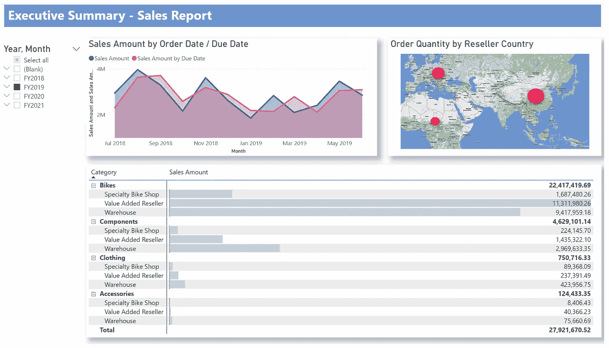****

****从 Excel 文件到炫酷的商务智能仪表盘！作者图片****

# ****微软的“动力平台”****

****Power BI 属于微软的 **Power Platform** 应用套件，其中包括 *PowerApps* (无需代码构建应用)和 *Power Automate* (业务流程自动化)。****

****总之，您可以构建一些强大的工作流。可能性是无限的。****

********

****微软“Power Platform”生态系统中的热门应用。作者图片****

****例如，您的公司是否拥有一些同事经常需要访问的数据？你是通过。无尽的电子邮件和手动流程？****

****构建一个 *PowerApp* 应用程序，作为同事的前端。不需要编码技能。****

****然后创建一个 *Power Automate* 流程，每当有人需要文件时，它会自动向你发送一个微软团队的 *Approvals* 请求。****

****所有的电子文书工作都被推送到一个 *SharePoint* 列表中，该列表可以输入到 *Power BI* 中进行按需分析和跟踪。****

****恭喜您，您已经将数小时的琐碎任务简化为只需几分钟的自动化工作流程，并在交互式 Power BI 仪表盘的支持下随时进行报告。****

****微软的 Power 平台和更广泛的微软 365 应用生态系统能够简化您的工作生活，不需要任何编码技能。****

****聪明地工作，而不是努力。****

****利用技术每天为您节省时间。让它成为一种习惯。****

****在一年中积累这些储蓄，这就是你如何成为一个在下午 5 点准时下班的生产率怪兽。****

# ****数据分析师的 Power BI 之旅****

****Power BI 中的典型工作流是什么样的？****

****业务分析师和数据科学家应该对这一系列步骤很熟悉。****

****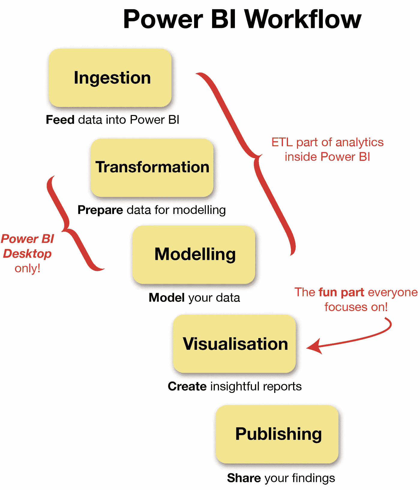****

****作者图片****

****你将要****

*   ****将数据输入 Power BI(摄取)****
*   ****清理并准备用于分析(转换和建模)****
*   ****发现见解(可视化)并与同事分享。****

****请注意，Power BI 有 3 个版本:****

*   *****Power BI Desktop* (电脑上的本地应用)****
*   *****电力 BI 服务*(基于浏览器)****
*   *****电力匕移动。*****

****转换和建模步骤仅在*桌面*版本上可用。我将使用 *Power BI Desktop* ，这样我们可以端到端地演示整个工作流程。太好了！****

# ****我们开始吧！****

****想跟着去吗？****

****我将使用流行的 **AdventureWorks** 数据集，你可以在这里下载:[AdventureWorks sales . xlsx](https://github.com/microsoft/powerbi-desktop-samples/blob/main/AdventureWorks%20Sales%20Sample/AdventureWorks%20Sales.xlsx)。****

****假设你的老板想知道以下问题的答案:****

*   ****一年中的哪一天销售额最高？****
*   ****AdventureWorks 在哪些国家取得了最大的成功？****
*   ****公司应该继续投资于哪些产品类别？****

****不容易回答，只是在 Excel 中争论——这是 Power BI 的魔力真正闪耀的地方。我们开始吧。****

****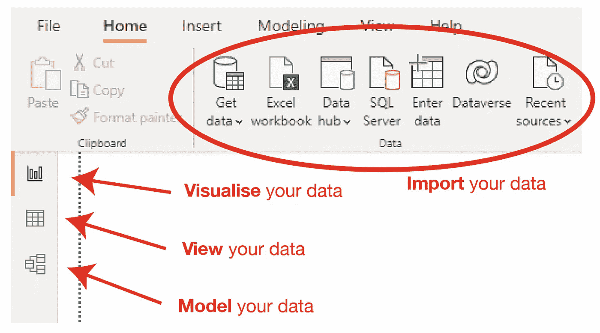****

****作者图片****

## ****1.摄取****

****打开 Power BI 并导入您的 Excel 电子表格。****

****浏览并选择您需要的列/字段，然后单击 **Load** …****

****等等！也许我们想对数据做进一步的修改？让我们点击**转换数据**。****

****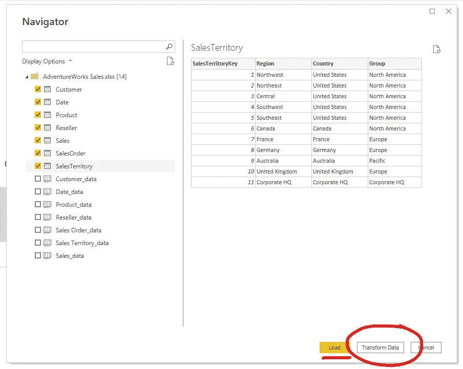****

****数据导航。作者图片****

****快速提示:Power BI 可以连接*很多*数据源。****

****SQL Server？没问题。****

****传统的数据仓库呢？ *Teradata* 还是 *Oracle* ？你很棒。****

****使用大数据和/或云？你可以直接从微软的 *Dataverse* 、 *Azure Cloud* 或 *Synapse Analytics* 中抽取。****

****聪明的数据工程师甚至可能已经将 Power BI 直接连接到您组织的 *Hadoop* 大数据湖。精彩！****

## ****2.转型(仅限 Power BI 台式机)****

****这是您使用 Power BI 的 **Power 查询编辑器**来处理数据的地方。(你也可以在 Excel 中做很多这样的事情。)****

****简单转换的一个例子包括修改列/字段的数据类型。这里，**邮政编码**作为*整数*或*文本*会更好吗？通过点击几个按钮来决定。轻松点。****

****根据您的业务需求进行更改。****

****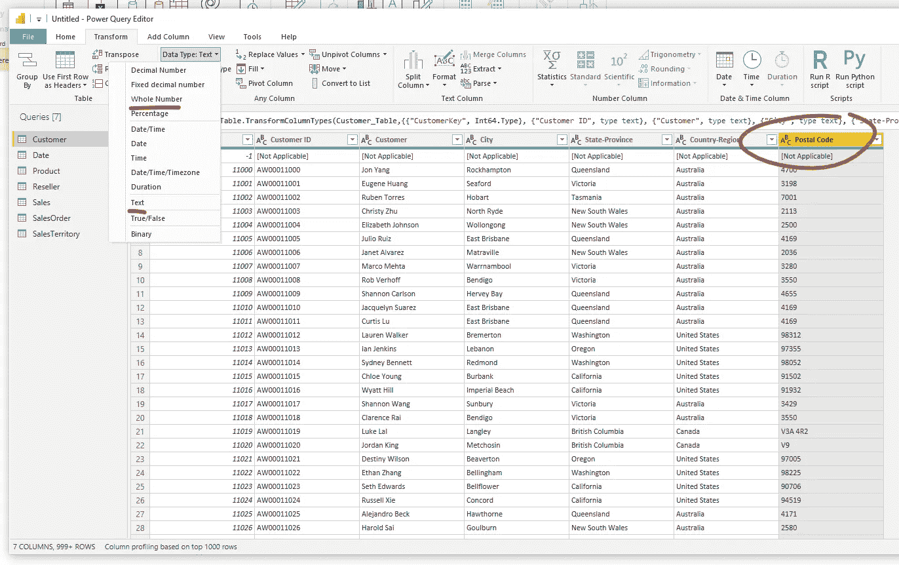****

****超级查询编辑器。作者图片****

****一旦你满意了，就该对数据建模了。****

## ****3.建模(仅限 Power BI 台式机)****

****你的数据之间有什么关系？****

****在不同的表之间建立链接，以便以后可以连接它们。****

****您也可以在这里创建更多的字段。这包括精心设计定制的*措施*来提供有针对性的见解。很快会有更多。****

****这是我们建模前的数据。****

****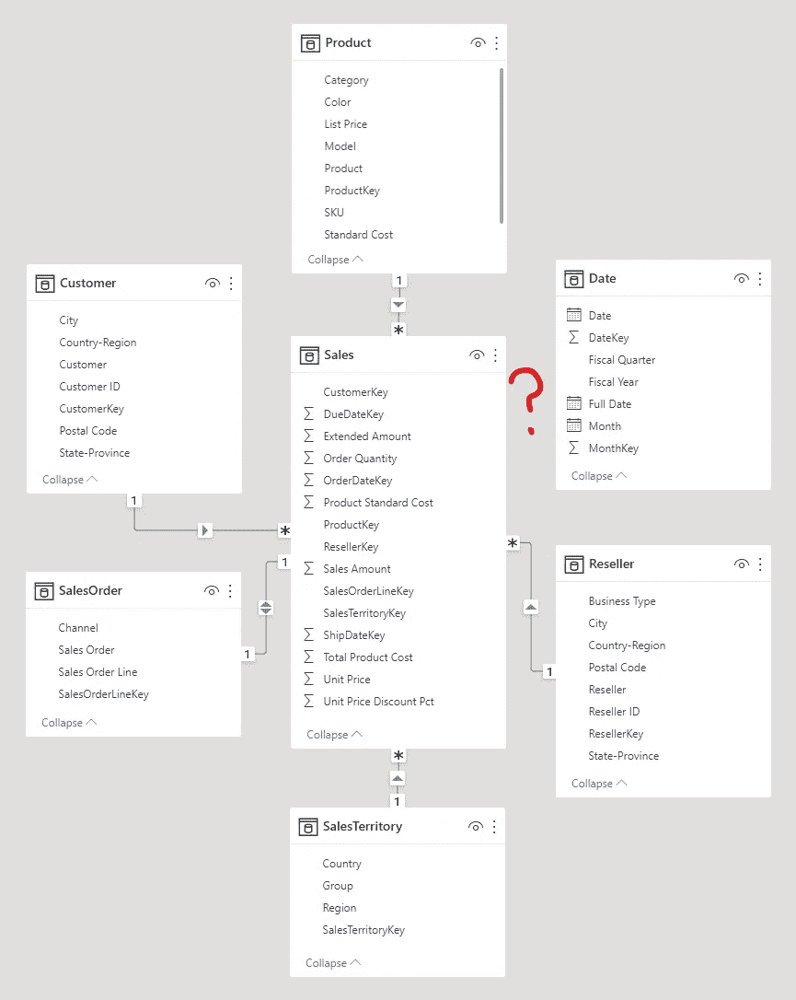****

****建模前的数据。作者图片****

****数据模型采用了一个**星型模式**，其中一个集中的**事实表**(存储关于销售的度量)与每个**维度表**(存储关于 *AdventureWorks* 客户、产品、经销商等的信息)直接相关。****

****请立即注意，日期维度表是独立的，与我的其他数据无关！哎呦。****

****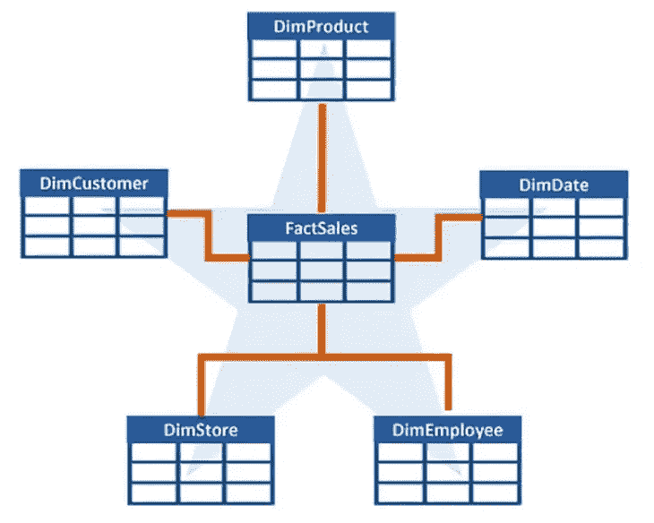****

****典型的星型模式。图片鸣谢:微软 DP-500 [公训](https://learn.microsoft.com/en-us/certifications/exams/dp-500)****

****使用 Power BI 的 GUI 界面，我能够对我们的数据模型进行一系列修改:****

*   ****将日期表与销售表相关联。唷！****
*   ****为每个维度表创建一组**层次列**。例如，产品可以分为**类别**、**子类别**和**型号**。客户可以按照他们的**国家**、**州**、**城市**和**邮政编码**来组织。之后我可以使用这些新的专栏来更深入地挖掘我的观想！****
*   ****隐藏所有用于表连接但对分析无用的'*键*列。****
*   ****重命名几张桌子，因为…我觉得很烦躁。****

****想做一些比点击按钮更个性化的事情吗？****

****您可以在 **DAX** (数据分析表达式)中编写自定义度量，这对于 Excel 公式大师来说看起来很熟悉。****

****例如，我用下面的 DAX 代码创建了一个新的度量标准**截止日期**的销售额。****

```
**Sales Amount by Due Date = CALCULATE(SUM(Sales[Sales Amount]), USERELATIONSHIP(Sales[DueDateKey],'Date'[DateKey])**
```

****我们最终的数据模型如下所示:****

****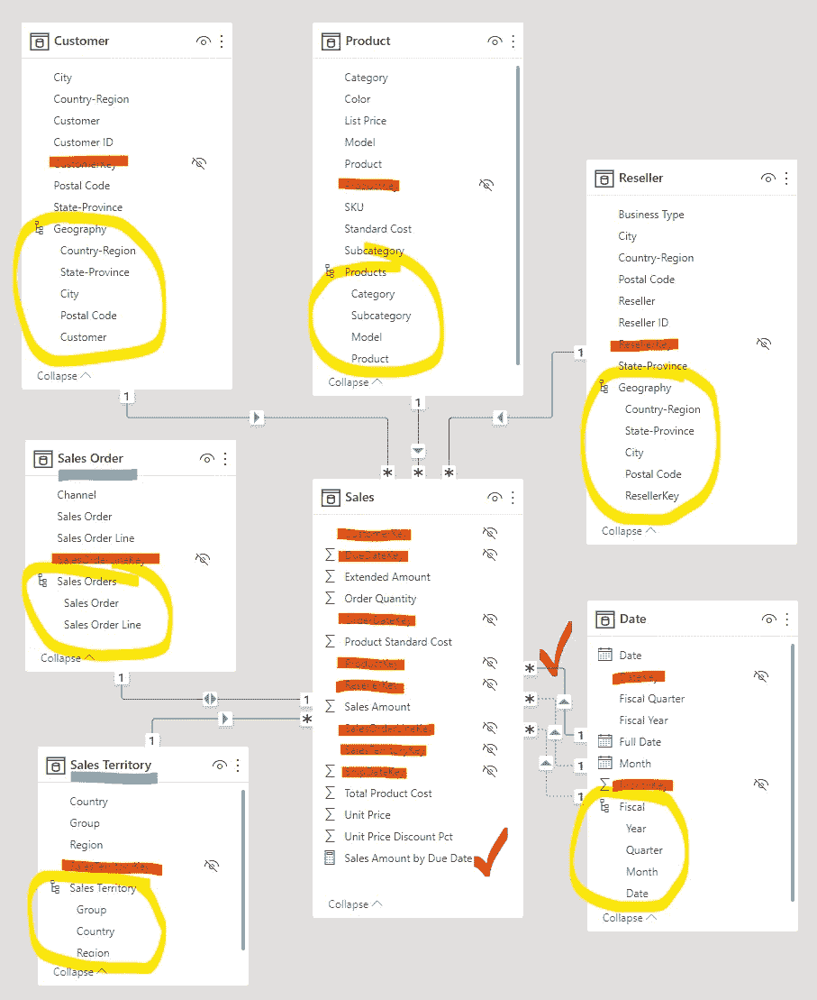****

****建模后的数据。作者图片****

****现在，我已经准备好了大家都知道的 Power BI 部分——漂亮的交互式仪表盘！****

## ****4.(英)可视化(= visualization)****

****这是 Power BI(以及 Tableau 等竞争对手)真正闪光的地方。****

****在右侧的**可视化**和**字段**面板之间拖放东西，以在几秒钟内制作交互式图形。****

****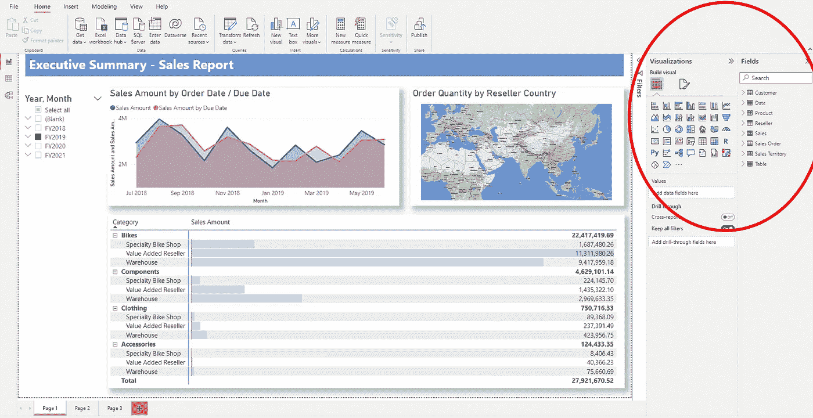****

****漂亮的报告和仪表板。作者图片****

****我上面的仪表板包含 3 个视觉效果:****

*   ****面积图****
*   ****地图****
*   ****矩阵。****

****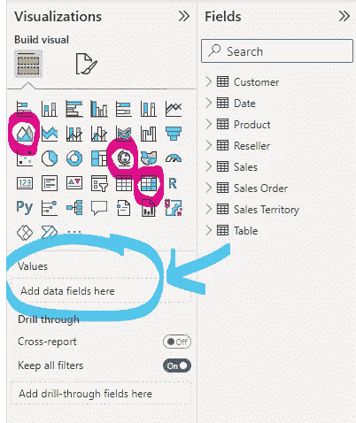****

****拖放右边的窗格。作者图片****

****例如，以面积图为例，它提供了 AdventureWorks 一段时间内的销售信息。****

****我首先将度量值 **Sales Amount** 拖到我的视图的 Y 轴上。****

****然后，我将**月份**字段拖到 X 轴上。(请记住，我们之前在建模过程中创建了这个基于层次结构的字段！如果我们没有做到这一点，我们就只能细化到财政年度。哎呦！)****

****友情提示:你可以随时返回并修改你的数据模型来创建你可视化所需要的东西。数据分析不是线性的！****

****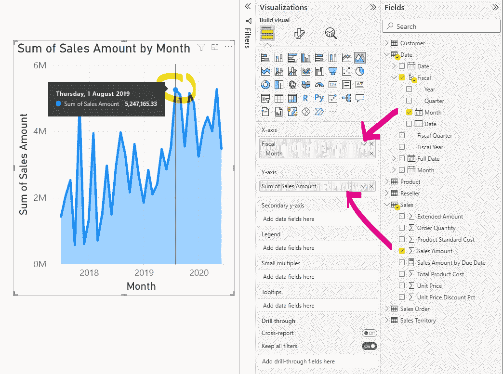****

****创作我的第一个视觉作品。作者图片****

****我还在同一个图表上添加了自定义度量(来自 DAX) **截止到期日**的销售额，并将其编码为红色(见下文)。****

******别忘了所有的图都是交互的！******

****这是现代商业智能可视化工具的强大功能。****

****例如，我可以从我们的仓库中挖掘自行车销售的数据。所有其他视觉效果及其相应的数据将立即更新，以反映我的选择。非常有用！****

****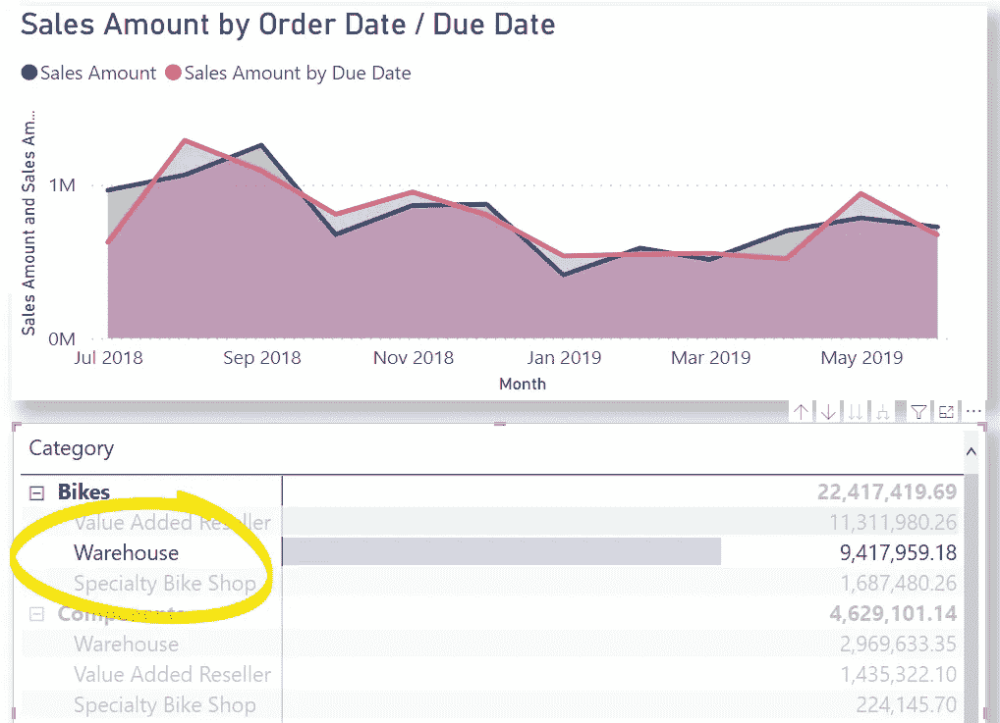****

****按特定细分市场深入分析销售数据。作者图片****

****或者，我可以跳到某个特定日期，了解整个企业的情况。同样，所有的视觉效果都会立即更新。****

****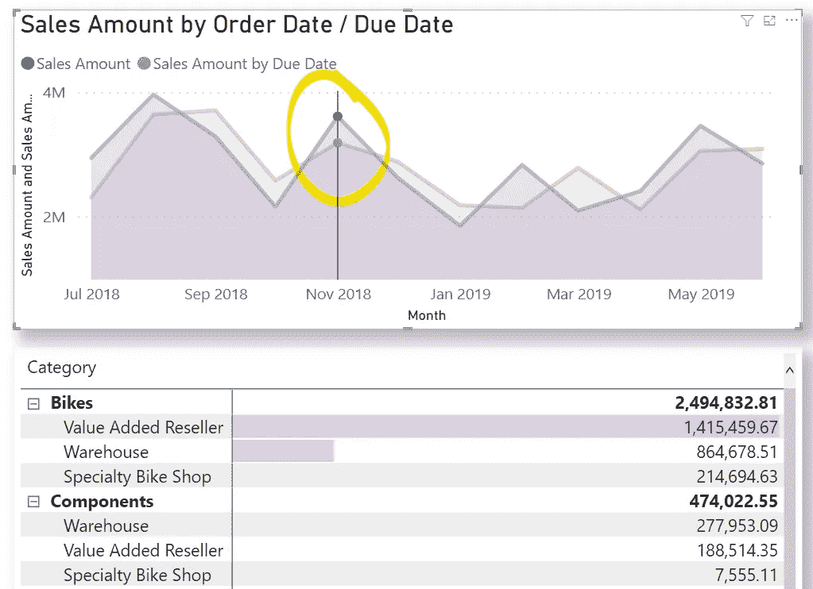****

****按特定日期钻研销售数据。作者图片****

****如果你正在向管理层提交一份报告，而管理层正在现场盘问你更多的细节，或者向听众讲述一个数据故事，而听众突然想挖掘一些更细粒度的见解，那么这是一个强大的东西。****

****这种触手可及的定制复杂数据洞察力的能力类似于二十年前的*魔法*。****

## ****5.出版****

****得到了一些疯狂的见解，想与同事分享？****

****你可以用几种方法做到这一点。****

****例如，您可以将仪表板保存为 Power BI。 ***pbix*** 文件并通过电子邮件发送，或者发布到 *Power BI 服务*上，使其在整个微软 365 云网络中可用。****

# ****最后的话****

****Power BI 和 Tableau 等企业 BI 工具使任何人都能够创建令人惊叹的报告和仪表板，而无需具备编码经验。****

****如果您在一家利用微软生态系统的公司工作，您将有机会使用 Power BI，以及其更广泛的 **Power Platform** 应用套件，允许您创建和自动化工作流，并为您自己、您的同事，当然还有您的经理制作强大的可视化报告。****

****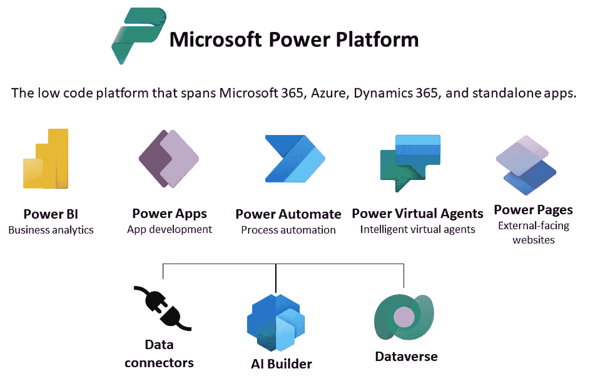****

****微软动力平台。来源:[微软数据世界](https://learn.microsoft.com/en-us/power-apps/maker/data-platform/data-platform-intro)****

****商业软件已经走过了漫长的道路。****

****渴望详细了解这个演示吗？下载[数据](https://github.com/microsoft/powerbi-desktop-samples/blob/main/AdventureWorks%20Sales%20Sample/AdventureWorks%20Sales.xlsx)，Power BI 的试用版，并遵循此处的详细指南[。](https://learn.microsoft.com/en-us/power-bi/create-reports/desktop-dimensional-model-report)****

****在 YouTube 和 Twitter 上关注我。****

# ******无限制媒体访问******

****提升你的知识和技能到一个新的水平。****

****[加入 Medium](https://col-jung.medium.com/membership) 享受**无限制访问**互联网上的**最佳分析&数据科学文章**。你可以在这里加入[来支持我和其他顶级作家。](https://col-jung.medium.com/membership)****

# ******我的数据科学文章******

*   ****微分方程与机器学习— [此处](https://medium.com/swlh/differential-equations-versus-machine-learning-78c3c0615055)****
*   ****新冠肺炎的数学建模与机器学习— [此处](https://medium.com/swlh/math-modelling-and-machine-learning-for-covid-19-646efcbe024e)****
*   ****回归预测房价— [此处](/predict-house-prices-with-machine-learning-5b475db4e1e)****
*   ****分类预测员工流失— [此处](/will-your-employee-leave-a-machine-learning-model-8484c2a6663ea)****
*   ****流行的机器学习性能指标— [此处](/popular-machine-learning-performance-metrics-a2c33408f29)****
*   ****Jupyter 笔记本与 Dataiku DSS — [此处](/jupyter-notebooks-versus-dataiku-dss-for-data-science-e02264a753ca)****
*   ****Power BI —从数据建模到令人惊叹的报告— [此处](/intro-to-power-bi-from-data-modelling-to-stunning-reports-b34aac43d8a1)****