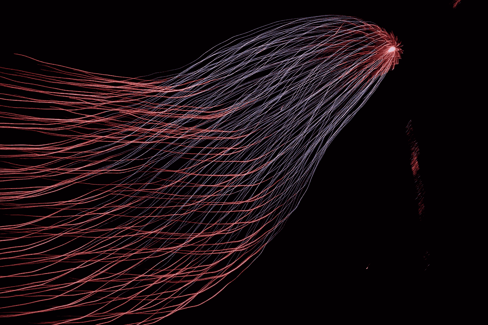
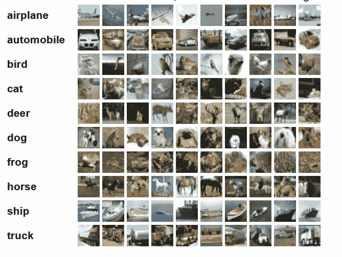
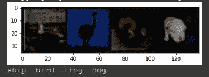
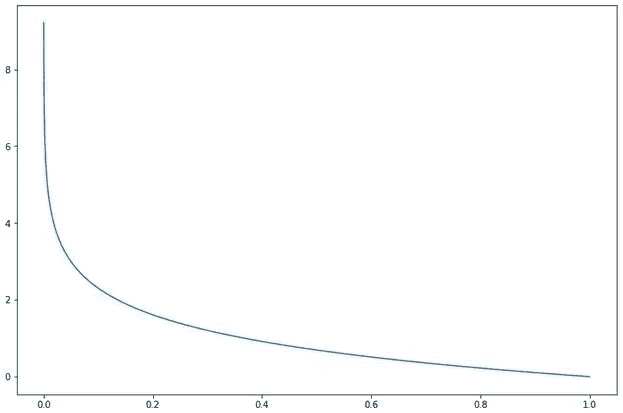
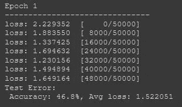
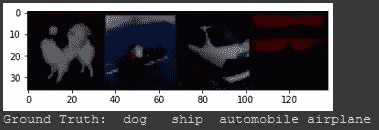

# PyTorch 简介:第 1 部分

> 原文：<https://towardsdatascience.com/intro-to-pytorch-part-1-663574fb9675>

## PyTorch 图书馆简介



亨特·哈里特在 [Unsplash](https://unsplash.com/s/photos/machine-learning?utm_source=unsplash&utm_medium=referral&utm_content=creditCopyText) 上的照片

# 介绍介绍

PyTorch 基于 Torch 库，是最受机器学习从业者欢迎的深度学习框架之一。PyTorch 受欢迎的一些原因是它的易用性、动态计算图，以及它比 Tensorflow 等其他框架更“Pythonic 化”的事实。

在本教程中，我们将检查 PyTorch 的基本组件，然后使用 CIFAR10 数据集完成一个图像分类任务。因为 PyTorch 加载了大量的特性，并且有大量的方法来应用它们，所以这显然不是全面的。这篇文章的目的是介绍这个包以及您将使用的一些组件，并提供一些资源以便您可以继续您的旅程。

# 张量

PyTorch 的核心组件是**张量**数据结构。如果您熟悉 NumPy(如果您不熟悉，请查看我在[关于数据科学](/intermediate-python-numpy-cec1c192b8e6)中的文章), PyTorch tensors 类似于 NumPy ndarrays，主要区别在于它们支持 CUDA，并且构建为在硬件加速器上运行，如 GPU。张量拥有的另一个重要特征是，它们针对[自动微分](https://pytorch.org/tutorials/beginner/basics/autogradqs_tutorial.html)进行了优化，这是被称为**反向传播**的神经网络训练算法的基础。这两个优化对于深度学习至关重要:

*   深度学习通常包含的大量数据、特征和训练迭代需要 GPU 的大规模并行架构在合理的时间内进行训练
*   通过反向传播的训练需要有效和精确的区分

> PyTorch 还支持分布式计算，将训练过程扩展到单台机器之外！

说了这么多，我们再来看看张量 API！

# 与张量一起动手

> **注意**:如果您想继续这里的内容，请先跳到设置部分，这样您就可以用 Colab 编写代码了

我们可以从 **Python 列表**中自然地创建张量:

这也自然地适用于 **Numpy ndArrays** :

就像在 NumPy(和 Tensorflow)中一样，我们可以用随机值、全 1 或全 0 初始化张量。只需提供`shape`(如果您想要指定数据类型，则提供`dtype`):

别忘了张量不一定是二维的！

一个新的张量可以从现有的张量中产生。因此，如果我们愿意，我们可以创建一个新的零张量，它具有与我们创建的`A_tensor`相同的属性(形状和数据类型):

或者您可能想要随机的浮点值:

想要张量的属性吗？

创建张量是好的，但是真正的乐趣开始于我们可以开始操作它们和应用数学运算的时候。已经内置了大量简洁的张量运算，所以我们肯定没有时间一一介绍。相反，我会给你一个[链接，让你更详细地查看它们](https://pytorch.org/docs/stable/torch.html)，并且只列出几个:

*   矩阵乘法
*   计算特征向量和特征值
*   整理
*   索引、切片、连接
*   海明窗(不确定这是什么，但是听起来很酷！！)

# 数据集和数据加载器模块

## 资料组

像 Tensorflow 一样，PyTorch 的包中包含了许多数据集(包括[文本](https://pytorch.org/text/stable/datasets.html)、[图像](https://pytorch.org/vision/stable/datasets.html)和[音频](https://pytorch.org/audio/stable/datasets.html)数据集)。本教程的深度学习部分将使用这些内置图像数据集之一:`CIFAR10`。这些数据集非常常见，并在 ML 社区中被广泛记录，因此它们非常适合于原型和基准模型，因为您可以将您的模型的性能与其他人用他们的模型实现的性能进行比较。

这样，如果数据集有标注或分类，您可以快速查看这些标注或分类的列表:

显然，作为机器学习实践者，内置数据集并不是你需要的全部。尽管这个过程比仅仅导入一个数据集更复杂，但是用 PyTorch 创建自己的数据集是相当容易和灵活的。这已经超出了本文的范围，但是我将在不久的将来发布一个创建数据集的深入指南。

# 数据加载器

遍历数据集将逐个遍历每个样本，因此 PyTorch 为我们提供了 DataLoader 模块，可以轻松地在我们的数据集中创建迷你批处理。`DataLoader`允许我们指定`batch_size`以及混洗数据:

因此，在你的深度学习工作流程中，你会希望通过迷你批处理中的`DataLoader`将你的数据输入到你的模型中进行训练。

教程的深度学习部分将演示如何使用`DataLoader`并将其输入神经网络。

在我们进入深度学习之前，最后一个重要的功能是设置设备。当您想要在 GPU 上训练时，您可以检查是否有 GPU 可供 PyTorch 使用:

PyTorch 默认为 CPU，因此即使手头有 GPU，您仍然需要指定要使用 GPU 进行训练。如果你确定你的 GPU 是可用的，你可以使用。to(“cuda”)在您的张量和模型上。否则，您可以考虑将设备变量设置为任何可用的设备:

如果你使用 Google Colab，你将可以免费使用 GPU(除非你想订阅)。说到 Colab，让我们继续进行分类任务的设置！

# 设置

在本教程中，我们将使用 Google Colab。Colab 一直是我所有机器学习项目的首选，因为在我看来，没有比它更简单的设置了。显然，一些项目将需要不同的设置，但对于较小的项目和教程，你真的不能击败 Colab 的免费 GPU 访问和环境，其中已经包括像 PyTorch，NumPy，Scikit-Learn 这样的软件包。

首先，导航到 [Google Colab](https://colab.research.google.com) 页面，用你的 Google 账户登录。`File > New notebook`。将顶部的笔记本名称更改为`pytorchIntro.ipynb`，或者您喜欢的其他名称。默认情况下，Colab 不会给你一个 GPU 访问的实例，所以你必须指定你想要使用的 GPU:在顶部，转到`Runtime > Change runtime type > Hardware accelerator > Select "GPU" > Save`。现在你有一个 GPU 来训练你的模型！

> 如果您对将要使用的 GPU 感到好奇，请键入`!nvidia-smi`并通过点击该行左侧的 Play 按钮或按 Shift+Enter 来执行该行。如果您想要的只是 GPU 设备，也可以运行`!nvidia-smi -L`:

```
GPU 0: Tesla T4 (UUID: GPU-7619bc40-f58c-a507-3911-58907fbd2721)
```

现在您已经有了 Colab，并且有一个 GPU 准备好训练您的模型，让我们来看看代码。

# 进口

将这些导入添加到第一行，并执行该行。这些是我们将使用的主要 PyTorch 模块，以及一些支持导入。当我们使用它们的时候，我们会更详细地讨论它们。

# 资料组

# [CIFAR-10 数据集](https://www.cs.toronto.edu/~kriz/cifar.html)

该数据集由 60，000 幅 32x32 彩色图像组成，所有图像都被标记为 10 个类别中的一个。训练集是 50，000 幅图像，而测试集是 10，000 幅图像。

这是一个很好的来自家庭资源的数据集的可视化:



*来源:*[*https://www.cs.toronto.edu/~kriz/cifar.html*](https://www.cs.toronto.edu/~kriz/cifar.html)

这个项目的目标是建立一个模型，可以准确地将图像分类为 10 种分类之一。

# 加载数据集

所以我们从 torchvision 导入了 CIFAR10，现在我们需要下载实际的数据集，并准备将其加载到神经网络中。

首先，由于我们应该在将图像提供给模型之前对它们进行归一化，所以我们将定义一个`transform`函数，并在创建训练和测试数据变量时使用`torchvision.transforms.Normalize`到[归一化](https://en.wikipedia.org/wiki/Normalization_(image_processing))我们所有的图像。`Normalize`方法将期望的**平均值**和**标准偏差**作为参数，由于这些是彩色图像，因此应该为每个(R、G、B)颜色通道提供一个值。

我们将这里的值设置为 0.5，因为我们希望图像数据的值接近 0，但是还有其他更精确的归一化方法。

现在我们可以在 transform 参数中使用我们的 transform 函数，这样 PyTorch 就会将它应用到整个数据集。

既然我们已经下载并规范化了数据集，我们可以使用 PyTorch DataLoader 准备好将它提供给神经网络，在这里我们可以定义`batch_size`。

`DataLoader`是可迭代的，所以让我们通过检查一次迭代的维度来看看`train_dataloader`:

这里 X 是图像，y 是标签。我们设置了`batch_size = 4`,所以通过我们的`train_dataloader`的每一次迭代都是 4 个 32×32 图像和它们的 4 个相应标签的小批量。

现在让我们看看数据集中的一些例子。



现在我们可以看到一些图像和它们相应的标签。通常，您会希望在继续进行模型构建之前进行更彻底的数据探索和分析，但是由于这只是 PyTorch 的一个介绍，我们将继续构建和训练模型。

# 定义基础模型

让我们建立一个神经网络。

首先，我们将定义我们的模型类，并将其命名为`NeuralNetwork`。我们的模型将是 PyTorch [nn 的子类。模块](https://pytorch.org/docs/stable/generated/torch.nn.Module.html)，它是 PyTorch 中所有神经网络模块的基类。

因为我们的数据集中有彩色图像，所以每个图像的形状是`(3, 32, 32)`，3 个 RGB 颜色通道中的每一个都是 32×32 的张量。由于我们的初始模型将由完全连接的层组成，我们将需要 [nn。Flatten()](https://pytorch.org/docs/stable/generated/torch.nn.Flatten.html) 我们输入图像数据。我们的展平方法将输出一个具有 3072 (32 x 32 x 3)个节点的线性层。`nn.Linear()`分别以输入神经元的数量和输出神经元的数量作为自变量(`nn.Linear(1024 in, 512 out)`)。从这里您可以添加`Linear`层和`ReLU`层到您的心满意足！我们模型的输出是 10 个 logits，对应于我们数据集中的 10 个类。

在我们定义了模型的结构之后，我们将定义向前传递的顺序。由于我们的模型是一个简单的序列模型，我们的`forward`方法将非常简单。`forward`方法将从输入`Tensors`计算输出`Tensor`。

如果你愿意，你可以简单地打印出定义好的`model`，这样你就可以得到一个结构的概要。

# 损失函数和优化器

由于这是一个分类问题，我们将使用交叉熵损失函数。提醒一下，当模型输出介于 0 和 1 之间的预测概率值时，交叉熵计算对数损失。因此，当预测的概率偏离真实值时，损失会迅速增加(如果预测更有把握，错误的预测会受到更多惩罚)。下图显示了预测值越来越接近真实值时损失函数的行为。



*图:y 轴代表损失，x 轴是真值为 1 时的预测值。可以看到，随着预测值趋近于 1，损耗趋近于 0。预测值越接近 0，损失值越高。*

有了 PyTorch，我们只需使用`CrossEntropyLoss()`。对于其他 ML 任务，如果更合适，可以使用不同的[损失函数](https://pytorch.org/docs/stable/nn.html#loss-functions)。对于我们的优化算法，我们将使用随机梯度下降，这是在 [torch.optim 包](https://pytorch.org/docs/stable/optim.html)中实现的，以及其他优化器，如 Adam 和 RMSprop。我们只需要传递我们模型的参数，以及学习率`lr`。如果您想在模型优化中使用动量或重量衰减，您可以将其传递给`SGD()`优化器以及`momentum`和`weight_decay`参数(都默认为 0)。

# 定义训练循环

这里我们定义了我们的`train()`函数，在训练过程中我们将传递`train_dataloader`、`model`、`loss_fn`和`optimizer`作为参数。`size`变量是整个训练数据集的长度(50k)。在下一行，`model.train()`是一个 PyTorch `nn.Module`方法，它将模型设置为训练模式，启用您在训练期间想要的某些行为(例如，退出、批量规范等。).相比之下(当我们定义测试函数时你会看到)，如果你想测试你的模型性能，你可以使用`model.eval()`。接下来，我们将遍历每个小批量，指定我们希望使用带有`to(device)`的 GPU。我们将小批量输入到模型中，计算损耗，然后反向传播。

# 反向传播和训练进度输出

对于反向投影步骤，我们需要首先运行`optimizer.zero_grad()`。这将在开始反向投影之前将梯度设置为零，因为我们不想在后续过程中累积梯度(这种行为在某些情况下可能是需要的，例如 RNNs，您需要累积梯度)。`loss.backward()`使用损失来计算梯度，然后我们使用`optimizer.step()`来更新权重。最后，我们可以打印出训练过程的更新，输出每 2000 个训练样本后计算出的损失。

# 定义测试方法

在训练模型之前，让我们实现测试函数，这样我们可以在每个历元之后评估我们的模型，并在测试集上输出准确度。测试方法的最大区别是，我们使用`model.eval()`将模型设置为测试模式，而`torch.no_grad()`将禁用梯度计算，因为我们在测试期间不使用反向传播。最后，我们计算了测试集的平均损失和总体精度。

# 训练我们的模型

现在我们已经加载并预处理了数据集，构建了神经网络，定义了损失函数/优化器/训练循环…我们准备好训练了！指定您想要训练模型的`epochs`的数量。每个历元将经历一个`train`循环，每 2000 个样本输出一次进度，然后在测试集上`test`模型，在每个历元后输出测试集上的精度和损耗。



*这是每个训练时段的输出结果*

# 保存和加载模型

训练完成后，如果您想保存您的模型用于推理，请使用`torch.save()`。将`model.state_dict()`作为第一个参数传递；这只是一个 Python 字典对象，它将层映射到它们各自的学习参数(权重和偏差)。对于第二个参数，命名您保存的模型(使用`.pth`或`.pt`扩展保存 PyTorch 模型是常见的约定)。如果您希望将此参数保存在特定位置，也可以为其指定完整路径。

当你想加载你的模型进行推理时，用`torch.load()`抓取你保存的模型，用`load_state_dict`映射学习到的参数。

# 评估模型

您可以遍历`test_dataloader`来检查带有标签的图像样本。



然后将其与我们模型的预测标签进行比较，以预览其性能:

所以我们可以看到，我们的模型似乎在学习分类！让我们看看我们模型的性能数字。

**53%** 的准确率不是最先进的，但是比随机猜测或者只预测一类要好得多，所以我们的模型肯定学到了一些！:)

接下来，我们可以快速检查它在分类每个类时的表现:

所以现在我们对模型的性能有了更好的了解:猫和鸟的图像对网络来说更难分类。

# 未完待续…

显然，像我们在本教程中构建的全连接网络通常不用于图像分类。在本教程的第 2 部分，我们将更多地关注 PyTorch 中的性能优化:

*   使用细胞神经网络进行图像分类
*   超参数调谐
*   数据扩充
*   迁移学习

我希望你喜欢，并学到了一点。如果你想了解更多，PyTorch 有一些优秀的[文档](https://pytorch.org/docs/stable/index.html)，所以我鼓励你去看看！感谢阅读！


*PyTorch 挺牛逼的:)*