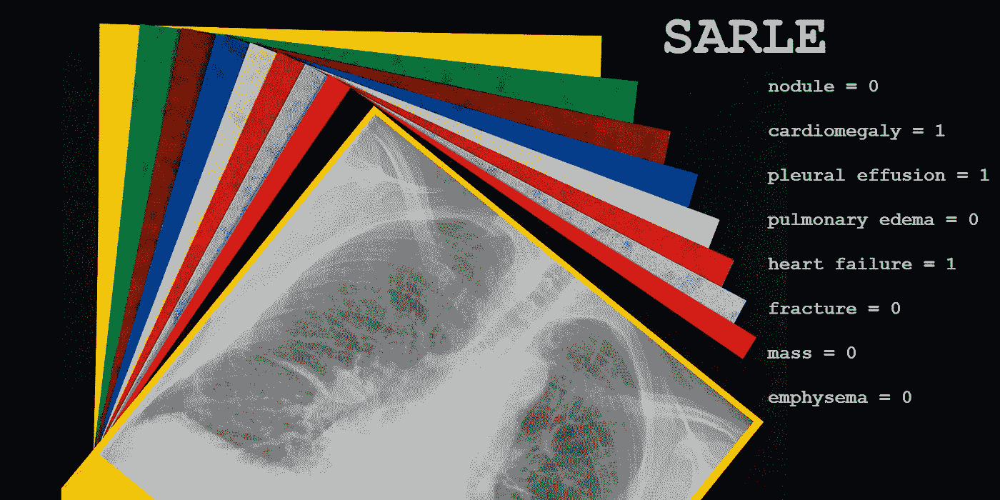
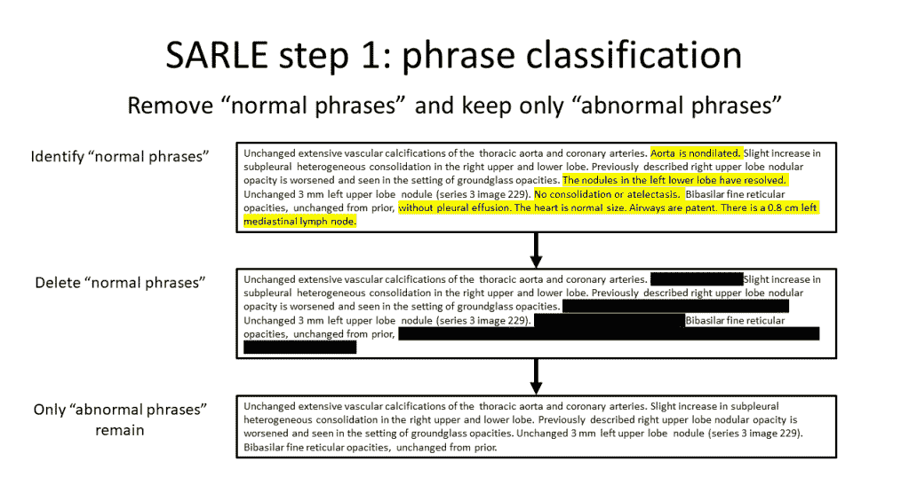
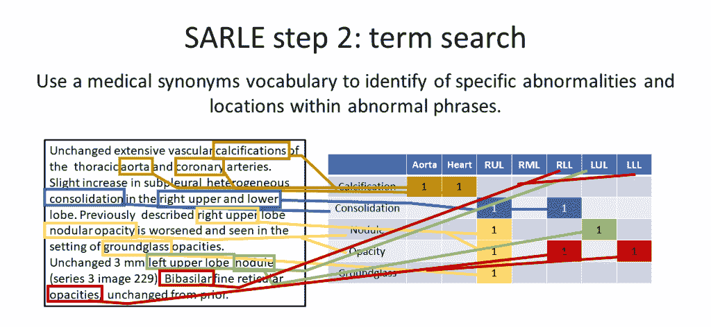
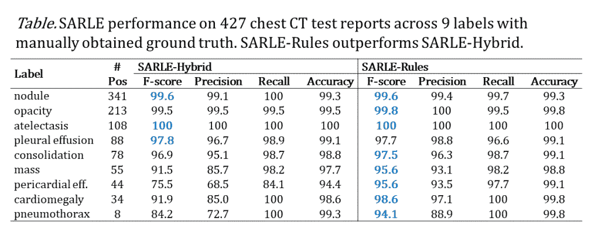
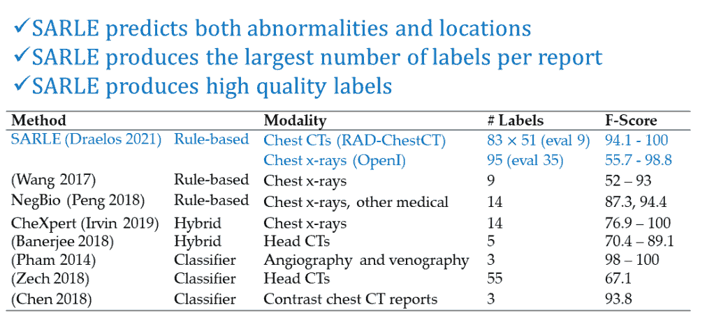

# 放射学标签提取语句分析简介(SARLE)

> 原文：<https://towardsdatascience.com/intro-to-sentence-analysis-for-radiology-label-extraction-sarle-4274fe77870>

## SARLE 是一种可定制的技术，用于从自由文本放射学报告中自动提取结构化异常和位置标签

特色图片由这张来自维基百科(CC BY-SA 3.0)的[纸质图片](https://en.wikipedia.org/wiki/Paper#/media/File:Coloured,_textured_craft_card.jpg)和这张来自维基百科(Creative Commons 1.0)的[胸透图片](https://commons.wikimedia.org/wiki/File:Chest_radiograph_of_a_lung_with_Kerley_B_lines.jpg)组成。

指定异常存在与否的分类标签对于[在放射图像上训练计算机视觉模型](https://glassboxmedicine.com/2020/08/04/chest-ct-scan-machine-learning-in-5-minutes/)是必要的。然而，手动获得这些分类标签是耗时的，并且限制了最终数据集的大小以及可以考虑的异常的数量。在这篇文章中，我们将概述一种易于定制的技术，SARLE，用于从医院数据库中每个放射学图像附带的自由文本报告中自动提取结构化异常和位置标签。

# **什么是放射学报告？**

每次给病人成像时，放射科医生都会解读图像，并写一份总结正常和异常发现的报告。胸部 x 光报告的摘录可能是这样的:“右肺有一个结节。左肺没问题。有心脏扩大而无心包积液。”

# **什么是放射学标签提取？**

放射学标签提取是从自由文本放射学报告中获取二元异常标签的过程。这比仅仅识别是否提到异常更复杂，因为放射科医生通常会特别注意到不存在的异常或相对于先前图像已经解决的异常。例如，“毛玻璃样阴影已消失”，“胸腔管已取出”，或“左肺上叶结节不再被识别”。

# **为什么放射标签提取困难**

放射学标签提取是困难的，原因有几个:

(1)如前所述，一些异常被包括在报告中是因为它们存在，而其他异常被记录是因为它们不存在，这意味着需要否定/正常检测；

(2)存在数百种可能的异常，并且它们中的许多具有同义词或几种不同的描述方式(例如，增大的心脏= =心脏增大，胸膜积液= =胸膜腔中的液体)，

(3)有许多描述性修饰术语(例如，指示纹理、一般尺寸、测量尺寸、相对于先前图像的尺寸、严重性等)，并且这些描述符中的一些可以是正常或异常之间的差异。例如，“淋巴结病”或肿大的淋巴结由大于 1 厘米的大小来确定。淋巴结病可被描述为“淋巴结病”、“腺病”、“肿大的淋巴结”，或简单地用一个测量值，“1.7 厘米纵隔淋巴结”或“右腋窝 22 毫米淋巴结”。有时会提到边界增大的淋巴结(例如，“9 mm 淋巴结”)，其他时候会提到曾经很大但现在正常的淋巴结(例如，“以前 1.1 cm 的淋巴结现在测量为 0.3 cm”)。

(4)如果您对异常的解剖位置感兴趣，某些解剖位置也有同义词(例如，“左上叶= =左上叶”)，并且一些位置仅由异常的性质暗示(例如，肺炎根据定义是肺部感染，心脏肥大根据定义是心脏增大)。

# **为什么放射学标签提取比处理其他种类的自然语言更容易**

另一方面，放射学标签提取的某些方面使得它比自然语言上的一般摘要任务更容易。放射学笔记专注于相对狭窄的主题，这限制了所使用的短语的种类(相对于，比如说，一本小说或一本诗集)，放射学笔记通常具有良好的语法、拼写和句子结构。

# **为什么放射学标签提取在计算机视觉中有用**

计算机视觉模型在数据越多的情况下表现越好。他们还需要结构化标签进行训练，无论是存在/不存在标签的二进制向量来训练[分类模型](https://glassboxmedicine.com/2019/05/26/classification-sigmoid-vs-softmax/)，还是像素级追踪(分割图)来训练[分割模型](https://glassboxmedicine.com/2020/01/21/segmentation-u-net-mask-r-cnn-and-medical-applications/)。让我们考虑一下最容易获得的标签类型:分类标签。如果我们想要建立一个分类器数据集，包括 100，000 张[胸部 x 光片](https://glassboxmedicine.com/2019/05/11/automated-chest-x-ray-interpretation/)中的 50 种不同异常，我们将需要一名放射科医师手动记录 5，000，000 个标签。按每个标签一秒钟计算，就是 1388 个小时，相当于 173 个每天八小时的非常非常乏味的工作，为一种成像设备生成一个数据集。因此，人们对自动放射学标签提取非常感兴趣，它可以从现有的自由文本报告中自动生成我们需要的分类标签，而手动工作要少得多。

# **放射学标签提取方法**

有不同的方法对标签提取方法进行分类:

方法:两种主要的方法是基于规则的和基于机器学习的。我记得对在这个大规模语言神经网络时代任何人都会使用规则的想法嗤之以鼻，但事实证明，规则可以很好地用于放射学标签提取，因为放射学笔记组织良好，并专注于有限的主题。

输入数据:方法的输入可以是一个完整的注释、一个完整的句子或一个短语。

考虑的标签:该方法可以只考虑一个、几个或多个异常标签。该方法甚至可以根本不考虑异常标记，例如，它可以只关注解剖位置。或者，该方法可以考虑异常和位置(例如 SARLE)。

本文的附录表 B2 中总结了放射标签提取方法的几个例子。

图片作者。SARLE 徽标包括名词项目中的知识共享图标:[计算机](https://thenounproject.com/term/medical/879529/)、[报告](https://thenounproject.com/term/medical/959388/)和[表格](https://thenounproject.com/search/?q=table&i=250445)。

# **SARLE:用于放射标签提取的句子分析**

SARLE 是一个[公开可用的](https://github.com/rachellea/sarle-labeler)高性能、易于定制的 Python 框架，用于放射学标签提取。它快速、易用、易于适应新类型的放射报告或新标签集，并且具有最小的依赖性。核心逻辑是不到 300 行的 Python 代码。它也是唯一一个提取异常和位置的放射学标签提取框架(据我所知):为每个异常提供一个相应的位置，这意味着标签输出实际上是一个位置 x 异常矩阵，而不是一个异常向量。

萨勒有两个步骤:

在第一步中，句子分类器区分正常句子(描述正常发现或没有异常)和异常句子(描述异常发现的存在)。所有正常的句子都被丢弃。SARLE 有两种变体:在 SARLE-Hybrid 中，机器学习分类器执行句子分类，在 SARLE-Rules 中，基于规则的方法执行句子分类。

第二步是术语搜索。所有异常的句子都被输入到一个术语搜索中，该搜索使用医学同义词来识别异常和解剖位置的提及。因为只剩下不正常的句子，任何提到不正常的地方都表明它存在。

作者图片

作者图片

从放射学报告中提取的 83 种异常情况如下所示:

**肺** (22):气房疾病、空气潴留、误吸、肺不张、支气管壁增厚、支气管扩张、细支气管扩张、细支气管炎、支气管炎、实变、肺气肿、血胸、间质性肺病、肺切除术、粘液堵塞、胸腔积液、浸润、胸膜增厚、肺炎、肺炎、气胸、肺水肿、散在结节、间隔增厚、结核

**肺型** (5):带状或线状、毛玻璃、蜂窝状、网状、树芽状

**一般** (47):关节炎、动脉粥样硬化、动脉瘤、乳房植入物、乳房手术、钙化、癌症、导管或端口、空洞、夹伤、充血、囊肿、碎片、畸形、密度、扩张或扩张、膨胀、纤维化、骨折、肉芽肿、五金件、疝气、感染、炎症、病变、透亮、淋巴结病、肿块、结节、结节> 1 cm、混浊、斑块、手术后疤痕、散在钙化、分泌物、软组织、缝钉、支架、缝合、移植、胸管、气管导管、胃肠管(包括

**心脏** (9): cabg(冠状动脉旁路移植术)、心脏肥大、冠状动脉疾病、心力衰竭、心脏瓣膜置换术、起搏器或除颤器、心包积液、心包增厚、胸骨切开术

SARLE 提取的 51 个位置是:

*   **肺:**左上叶、舌、左下叶、右上叶、右中叶、右下叶、右肺、左肺、肺间质、小叶中心、胸膜下、气道。
*   **心脏:**心脏，二尖瓣，主动脉瓣，三尖瓣，肺动脉瓣。
*   **大血管:**主动脉、上腔静脉、下腔静脉、肺动脉、肺静脉。
*   **一般:**右、左、前、后、上、下、内、外侧。
*   **腹部:**腹部、食道、胃、肠、肝、胆、肾、肾上腺、脾、胰。
*   **其他:**甲状腺、乳腺、腋窝、胸壁、肋骨、脊柱、骨骼、纵隔、膈、肺门。

# **性能**

使用手动获得的基础事实，对 9 个标签的 427 个胸部 CT 报告分析了 SARLE 的性能。如下表所示，SARLE 实现了高性能:

按作者分类的表格

总体而言，SARLE-Rules(使用规则进行句子分类)优于 SARLE-Hybrid(使用机器学习进行句子分类)。这很可能是因为 SARLE-Rules 在技术上执行短语级分类，即它能够识别正常或异常句子的子部分，而不是在整个句子级别实现的 SARLE-Hybrid。这对于既提到正常发现又提到异常发现的句子特别有效，例如“有心脏增大但没有心包积液。”

顺便提一下，SARLE 的术语搜索步骤包括一些复杂的规则，用于处理依赖于测量的异常，如前面提到的淋巴结病示例。

# **萨勒码**

萨勒代码在此公开:[https://github.com/rachellea/sarle-labeler](https://github.com/rachellea/sarle-labeler)

代码是结构化的，因此很容易使 SARLE 适应您自己的数据集、您自己的异常和您自己的解剖位置。

脚本 demo.py 包括一个关于真实数据和虚假数据的 SARLE 演示:

*   真实数据:SARLE 在胸透报告的 OpenI 数据集上演示。
*   假数据:SARLE 在一些手工制作的假数据的小数据框上演示，以简单的方式演示数据格式。

SARLE 接收熊猫数据帧作为输入。存储库的 README 和 demo.py 中提供了有关其格式的详细信息。

要自定义 SARLE 检测到的异常，您可以直接编辑词汇文件:

*   src/vocab/vocabular _ CT . py
*   src/vocab/vocabulary_cxr.py

如果您想自定义 SARLE 的位置，您可以在:

*   src/vocab/vocabulary _ locations . py

# **论文**

要了解更多关于 SARLE 的细节，或者引用 SARLE 的话，你可以看看这篇论文:“[基于机器学习的大规模胸部计算机断层扫描量多异常预测](https://arxiv.org/abs/2002.04752?context=cs.CV)”

# **总结**

SARLE 是一个用于放射学标签提取的高性能框架，以 Python 代码的形式公开提供，具有最小的依赖性。很容易适应新的数据集，并根据您自己的异常和感兴趣位置列表对其进行定制。如果您对在自己的数据集上部署 SARLE 有任何问题，请随时通过这个[联系页面](https://glassboxmedicine.com/contact/)联系我！

*原载于 2022 年 7 月 21 日 http://glassboxmedicine.com**[*。*](https://glassboxmedicine.com/2022/07/21/intro-to-sentence-analysis-for-radiology-label-extraction-sarle/)*