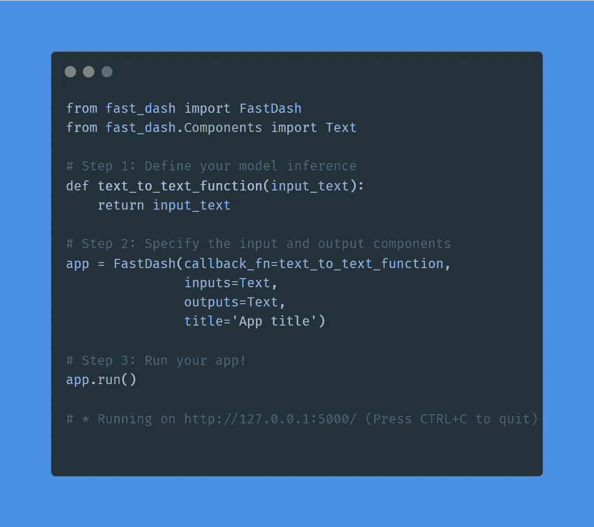
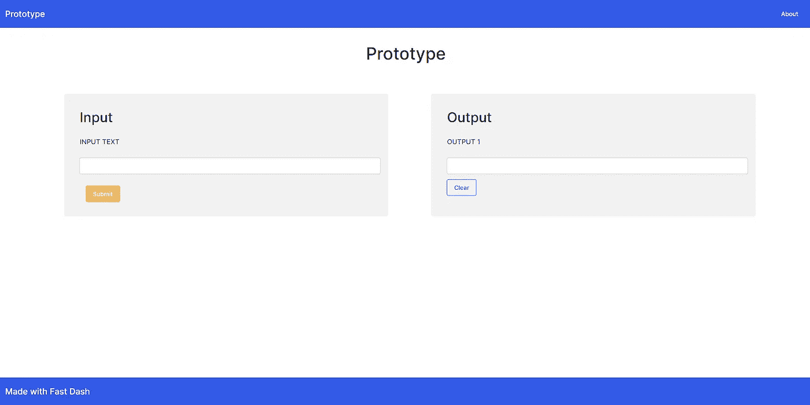
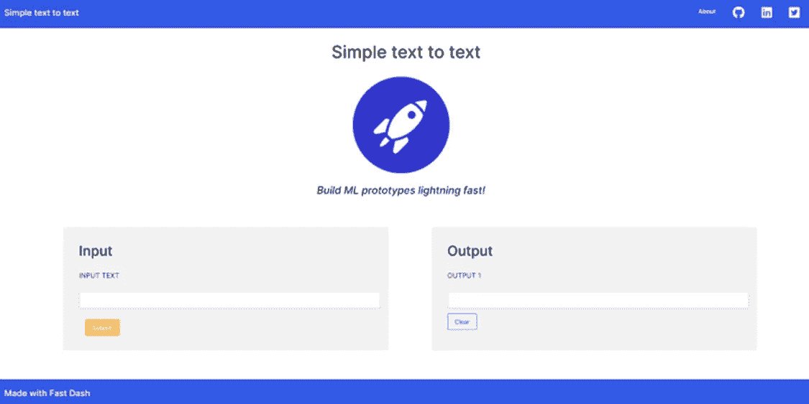
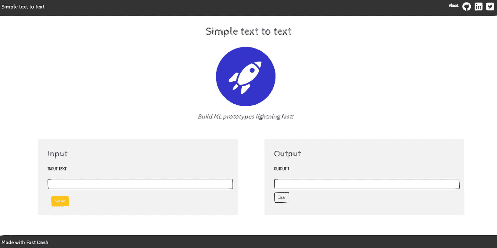
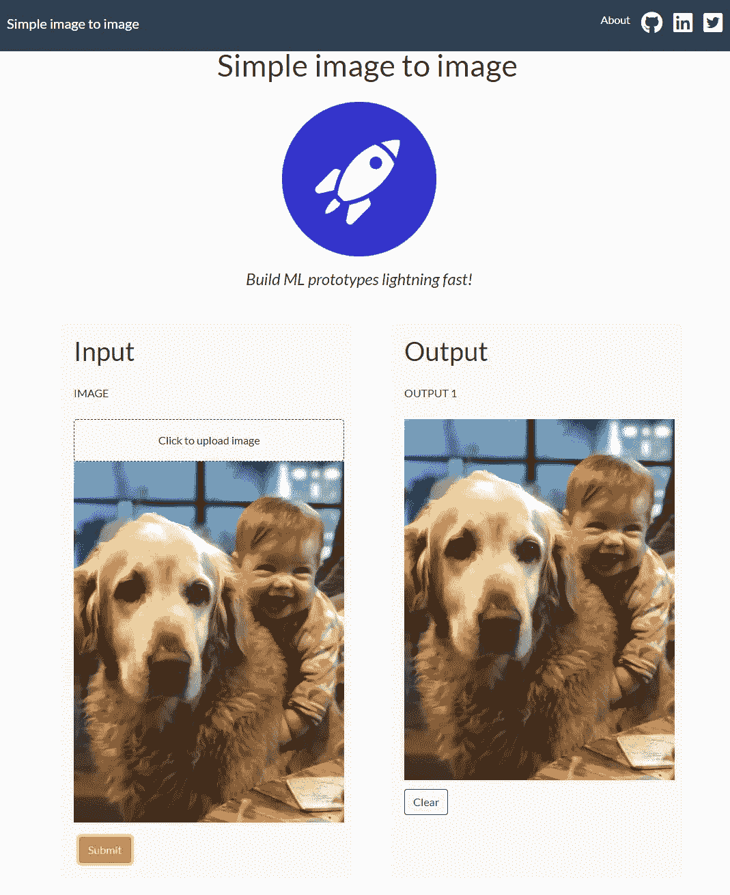
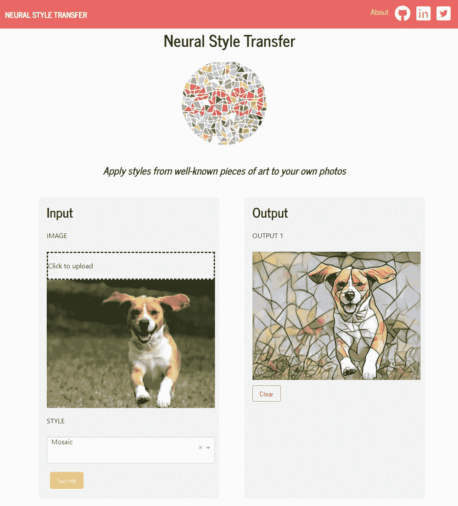
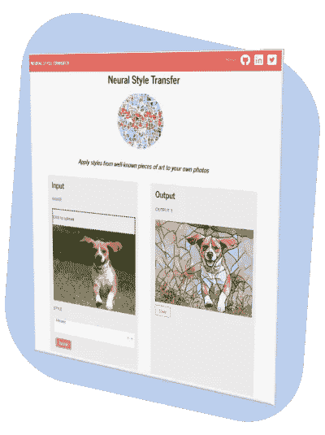

# 介绍 Fast Dash——一个快速开发 ML 原型的框架

> 原文：<https://towardsdatascience.com/introducing-fast-dash-a-framework-for-rapid-development-of-ml-prototypes-88379e3e6047>

## Fast Dash 使机器学习 web 应用程序的原型制作和部署速度快如闪电！


作者图片

# TL；速度三角形定位法(dead reckoning)

Fast Dash 使机器学习 web 应用的原型化变得轻而易举。使用 Fast Dash，数据科学家可以用不到十行代码为他们的模型构建一个用户界面。

下面是构建一个简单的文本到文本模型原型的简单方法:



由作者使用 https://carbon.now.sh/[生成](https://carbon.now.sh/)

这是结果:


一个简单的文本到文本的网络应用程序。作者图片

要安装快速仪表板，

```
*pip install fast-dash*
```

**主要特点:**

*   多个同时输入和输出组件。
*   支持所有 Dash 组件—文本、音频、视频、图像。
*   高度可定制和可扩展。
*   快速构建和迭代。
*   详细的[文档](https://docs.fastdash.app)。
*   开源且免费使用。

**资源**

网址:[https://fastdash.app/](https://fastdash.app/)

文件:[https://docs.fastdash.app/](https://docs.fastdash.app/)

源代码:[https://github.com/dkedar7/fast_dash](https://github.com/dkedar7/fast_dash)/

请继续阅读，了解 Dash 的工作速度、主要用途、开发计划以及您可以做出的贡献。

# 如何使用

让我们看看如何使用 Fast Dash 开发一个简单的文本到文本的原型。我们的简单函数将一些文本作为参数，并返回相同的文本。Fast Dash 可以通过三个简单的步骤将此功能部署为原型:

1.  **定义你的推理函数**。

推理函数或回调函数是一个将一个或多个输入值作为参数并输出一个或多个值的函数。输入和输出可以是任何有效的 Python 数据类型。在我们简单的文本到文本示例函数中，我们有一个输入和一个输出。我们的推理函数看起来像这样:

```
def text_to_text(input_text):
    return input_text
```

**2。选择您的输入输出组件并初始化应用程序。**

快速仪表板在`fast_dash.Components`子模块中提供了一个`Text`组件。让我们把它作为输入和输出部分。使用这些细节，让我们也初始化我们的应用程序。

```
from fast_dash import FastDash
from fast_dash.Components import Textapp = FastDash(callback_fn=text_to_text,
               inputs=Text
               outputs=Text)
```

**3。部署！**

这是最简单的一步。运行应用程序即可。

```
app.run()
```

构建一个简单的原型只需要 6 行代码。下面是完整的代码:

```
from fast_dash import FastDash
from fast_dash.Components import Text# 1\. Inference function
def text_to_text(input_text):
    return input_text# 2\. Define components and initialize app
app = FastDash(callback_fn=text_to_text, inputs=Text, outputs=Text)# 3\. Deploy!
app.run()
```

结果是一个好看的应用程序！



作者图片

**设计你的应用**

Fast Dash 还允许设置额外的设计选项——标题、图标、副标题和社交品牌。因此，让我们更改第 2 步代码，添加这些细节:

```
...
app = FastDash(callback_fn=text_to_text, 
               inputs=Text, 
               outputs=Text,
               **title**='Simple text to text',
               **title_image_path**='[https://tinyurl.com/mr44nn5y'](https://tinyurl.com/mr44nn5y'),
               **subheader**='Build ML prototypes lightning fast!',
               **github_url**='[https://github.com/dkedar7/fast_dash/'](https://github.com/dkedar7/fast_dash/'),
               **linkedin_url**='[https://linkedin.com/in/dkedar7/'](https://linkedin.com/in/dkedar7/'),
               **twitter_url**='[https://twitter.com/dkedar7/'](https://twitter.com/dkedar7/'))app.run()
```



作者图片

而且我们还可以从各种[主题](https://bootswatch.com/)中选择！这里有一个我最喜欢的主题的例子，它让我们的应用看起来很粗略:

```
...
app = FastDash(callback_fn=text_to_text, 
               inputs=Text, 
               outputs=Text,
               title='Simple text to text',
               title_image_path='[https://tinyurl.com/mr44nn5y'](https://tinyurl.com/mr44nn5y'),
               subheader='Build ML prototypes lightning fast!',
               github_url='[https://github.com/dkedar7/fast_dash/'](https://github.com/dkedar7/fast_dash/'),
               linkedin_url='[https://linkedin.com/in/dkedar7/'](https://linkedin.com/in/dkedar7/'),
               twitter_url='[https://twitter.com/dkedar7/'](https://twitter.com/dkedar7/'),
               **theme='SKETCHY'**)app.run()
```



作者图片

快速仪表板组件是`FastComponent`的对象。到目前为止，我们只使用了`Text`组件。但是快速破折号允许将任何破折号组件转换成 T2！

这还不是全部。因为我已经安装了 Google Cloud CLI，所以我可以简单地从这些示例的根目录运行`gcloud run deploy`，并将我的 Fast Dash 应用程序部署到 Google Cloud！

# 更多的例子

1.  **简单图像到图像原型**

下面是一个简单的图像到图像代码的输出(输出按原样显示上传的图像):



作者图片

只需要这段代码:

```
from fast_dash import FastDash
from fast_dash.Components import Image, UploadImage# 1\. Inference function
def image_to_image(image):
    return image# 2\. Define components and initialize app
app = FastDash(callback_fn=image_to_image, 
               inputs=UploadImage, 
               outputs=Image,
               title='Simple image to image',
               title_image_path='[https://tinyurl.com/mr44nn5y'](https://tinyurl.com/mr44nn5y'),
               subheader='Build ML prototypes lightning fast!',
               github_url='[https://github.com/dkedar7/fast_dash/'](https://github.com/dkedar7/fast_dash/'),
               linkedin_url='[https://linkedin.com/in/dkedar7/'](https://linkedin.com/in/dkedar7/'),
               twitter_url='[https://twitter.com/dkedar7/'](https://twitter.com/dkedar7/'),
               theme='FLATLY')# 3\. Deploy!
app.run()
```

**2。使用附加组件**

我们可以通过借用[本教程](https://github.com/pytorch/examples/tree/main/fast_neural_style)的代码来构建一个神经风格转移原型。这段代码中的新组件是一个下拉菜单。Fast Dash 可以用一行代码将其转换成一个`FastComponent`。这款应用的源代码可在[这里](https://github.com/dkedar7/fast_dash/tree/main/examples/Neural%20style%20transfer)获得。



作者图片

**3。分子 3d 浏览器**

此外，Dash 还附带了一个奇妙的 Dash 生物库，可以轻松渲染 3D 生物分子。一旦我们将这些 DashBio 组件转换为 FastComponents，我们就有了一个快速简单的原型！点击查看源代码[。这个例子的灵感来自于](https://github.com/dkedar7/fast_dash/tree/main/examples) [Dash 应用程序库](https://dash.gallery/dash-molecule-3d-viewer/)的一个教程。


作者图片

# 将来的

Fast Dash 对于日常使用情况非常出色，但截至 2022 年 4 月，它仍处于开发的早期阶段。请在 [GitHub](https://github.com/dkedar7/fast_dash/blob/main/CONTRIBUTING.md) 上分享任何反馈、错误或功能请求。我也很想听听你打算如何使用它以及你的经历。您的反馈将使 Fast Dash 更有用。

Fast Dash 是为原型打造的，不要与[概念验证或 MVP](https://skelia.com/articles/mvp-vs-poc-vs-prototype-company-really-need/) 混淆。一些计划的开发工作将允许用户从许多不同的布局选项、表格数据组件和地理空间应用程序中进行选择。加入这里的列表[，了解主要更新。](https://fastdash.app/)


加入社区:[https://fastdash.app/.](https://fastdash.app/.)作者图片

# **动机**

让利益相关者能够轻松、广泛地访问他们的机器学习模型，是数据科学家今天面临的最大挑战。可访问性是获得反馈的关键，这允许快速迭代和开发。

利益相关者和领域专家也倾向于[不信任模型](https://arxiv.org/abs/1906.02569)，如果他们没有参与模型开发过程的话。

此外，数据科学家构建和部署 web 应用程序的能力决定了他们的工作会被广泛采用。毫无疑问，部署洞察力已经成为一项基本技能。

Fast Dash 是我帮助数据科学家在不编写大量代码的情况下实现其见解的尝试。因为它抽象了编写 UI 代码的需要，所以我们只需要指定需要在输入和输出组件中显示的数据类型。

[今天加入榜单](https://fastdash.app/)和`pip install fast-dash`！



作者图片