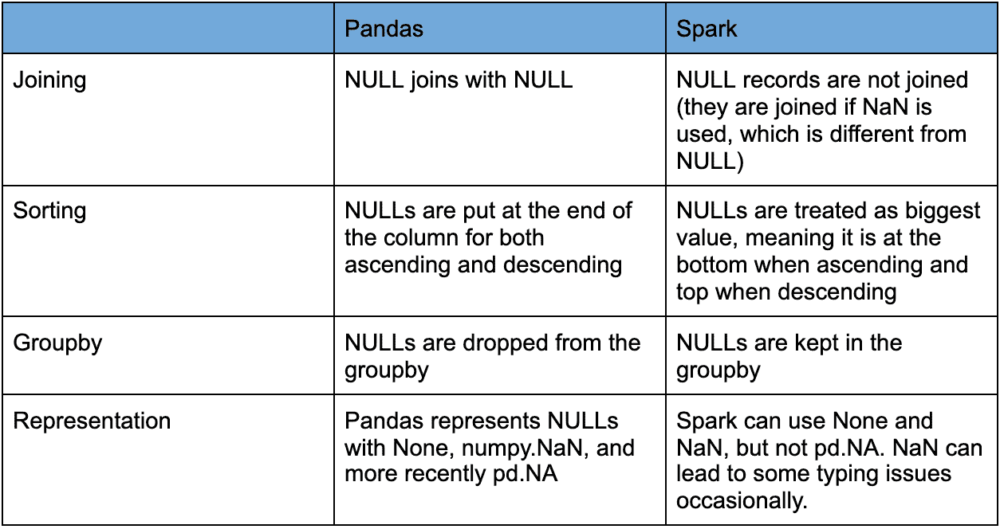
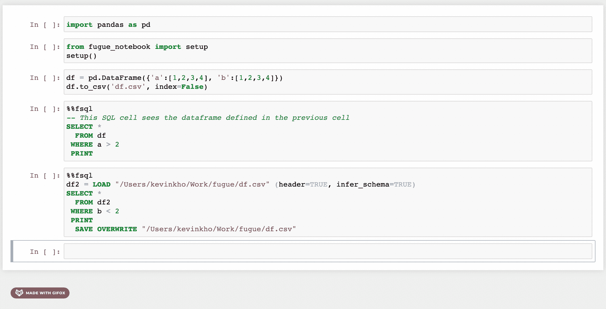
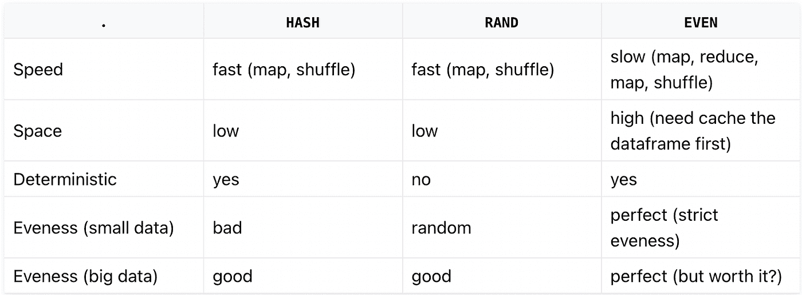

# 介绍神游—减少 PySpark 显影剂的摩擦

> 原文：<https://towardsdatascience.com/introducing-fugue-reducing-pyspark-developer-friction-a702230455de>

## 提高开发人员的工作效率，降低大数据项目的成本

*这篇文章的最初版本发表在 James Le 的博客* [*这里*](https://jameskle.com/writes/fugue) *。它已经更新，包括新的赋格功能。*


塞萨尔·卡里瓦里诺·阿拉贡在 [Unsplash](https://unsplash.com?utm_source=medium&utm_medium=referral) 上的照片

# 赋格的动机

数据从业者通常从使用 Pandas 或 SQL 开始。处理的数据量迟早会超出熊猫的处理能力，分布式计算就变得必不可少。Spark 就是这样一个工具，它是一个流行的分布式计算框架，能够在一个机器集群上处理内存中的大量数据。虽然 Spark 引擎在扩展数据管道方面非常强大，但新用户，甚至是有经验的用户，在使用 Spark 时都会面临许多陷阱。

预计最初的困难是必须学习一个全新的框架。Spark 和 Pandas 的语法和用法很不一样。将项目从 Pandas 迁移到 Spark 的用户经常会发现自己要重新编写大部分代码，即使是完全相同的应用程序逻辑。更糟糕的是，一些在 Pandas 中微不足道的操作在 Spark 中变得更加困难，并且需要一段时间才能实现。

**这种差异的一个简单例子是获取每组数据的中位数。**在熊猫身上，得到各组的中位数是不需要三思的。不过在 Spark 上，操作并不简单。我们在下面的代码片段中比较了两个框架的语法:

熊猫对星火的分组中位数

这种语法差异是因为在分布式设置中计算中值的开销很大。属于一个组的所有数据都需要移动到同一台机器上。因此，在获得中位数之前，需要对数据进行洗牌和排序。为了降低计算成本，可以用指定的容差获得近似的中值。在上面的代码片段中，20 是精度，意味着相对误差可能是 1/20，或 5%。指定容差允许用户平衡精度和速度。

除了语法上的差异，**分布式环境中还有一些重要的概念(比如分区、混排、持久化和惰性评估)**Pandas 用户最初并没有意识到。这些概念需要大量的时间来学习和掌握，这使得很难充分利用火花发动机。

[Fugue](https://github.com/fugue-project/fugue) ，一个开源的抽象层，提供了从单机到分布式计算设置的无缝过渡。使用 Fugue，用户可以用原生 Python、Pandas 或 SQL 编写他们的逻辑，然后将其带到 Spark(或 Dask)引擎执行。这意味着**用户甚至不需要学习 Spark 语法就可以使用 Spark。**


图片作者:神游 logo

本文将讨论 Spark 用户面临的棘手问题以及 Fugue 如何解决这些问题。**神游是几年来对如何改善 Spark 开发者体验的质疑的直接结果。**除了为 Spark 中的编码提供更简单的接口，使用抽象层还带来了更多实实在在的好处。在这里，我们将展示如何赋格:

*   处理不同计算框架(Pandas、Spark 和 Dask)之间的不一致行为
*   允许跨熊猫大小和 Spark 大小的数据重用代码
*   极大地加快了测试速度，降低了项目总成本
*   让新用户使用 Spark 更快地提高工作效率
*   提供能够处理端到端工作流的 SQL 界面

# 熊猫和火花之间的矛盾

*大小数据能否有一个统一的接口？*

过渡到 Spark 的 Pandas 用户经常会遇到不一致的行为。首先，Pandas 允许混合列类型。这意味着字符串和数字可以在同一列中混合使用。在 Spark 中，模式是严格执行的，不允许混合类型的列。这是因为 Pandas 在执行操作时可以看到所有的数据，而 Spark 在保存不同部分数据的几台机器上执行操作。这意味着如果没有严格执行模式，Spark 很容易让不同的分区表现不同。

熊猫和 Spark 对空值的处理也不同。下表总结了空值的默认处理方式



熊猫大战火花中的空处理

这是使用 Fugue 作为抽象层的第一个好处。让熊猫代码在 Spark 上运行是一回事，但让代码在计算引擎之间给出一致的结果是一个非常乏味的过程。在很多情况下，必须编写额外的代码来获得相同的结果。神游照顾到了一致性，在熊猫和 Spark 之间建立了一致的桥梁。Fugue 被设计成与 Spark 和 SQL 一致，因为这保证了代码在分布式设置中会像预期的那样工作。**用户不应该花时间担心特定于框架的行为。**

# 逻辑和执行的分离

*为什么我需要在开始一个数据项目之前选择一个框架？*

使用 Pandas 和 Spark 的一个难点是逻辑与接口紧密耦合。这是不切实际的，因为它要求数据从业者在项目开始时选择他们要用什么来编码。这里有两个场景，是同一个问题的两面。

1.  一个用户在熊猫里面编码，然后数据变得太大。为了解决这个问题，必须升级底层硬件以支持执行(垂直扩展)。
2.  一个用户在 Spark 中编码，期望数据很大，但是它从来没有增长到需要 Spark 的大小。由于 Spark 开销，代码和测试的运行速度比实际速度要慢。

在这两种情况下，用户最终都使用了错误的工具。如果逻辑和执行分离，这些场景是可以避免的。**使用 Fugue 作为抽象层允许用户编写一个与 Pandas 和 Spark 都兼容的代码库**。然后可以在运行时通过传递执行引擎来指定执行。为了演示这一点，让我们来看看使用 Fugue 最简单的方法，即`transform()`函数。

对于这个例子，我们有一个包含列`id`和`value`的数据帧。我们想通过将`value`映射到`mapping`中相应的食物来创建一个名为`food`的列。

我们问题的简单设置

熊猫对此有一个简单的方法。我们可以创建一个熊猫函数来调用它。

使用熊猫来执行地图操作

不用编辑熊猫函数，我们可以用 Fugue 的`transform()`函数把它带到 Spark。这个函数可以接受 Pandas 数据帧或 Spark 数据帧，如果使用 Spark 引擎，它将返回 Spark 数据帧。

用赋格变换移植一个函数到 Spark

注意我们需要调用`.show()`,因为 Spark 的求值是延迟的。输出如下所示。

```
+---+-----+------+
| id|value|  food|
+---+-----+------+
|  0|    A| Apple|
|  1|    B|Banana|
|  2|    C|Carrot|
+---+-----+------+
```

在这个场景中，我们不需要编辑最初的基于 Pandas 的函数。`transform()`函数负责将执行移植到 Spark，因为我们提供了一个`spark_session`作为引擎。如果没有指定`engine`，则使用默认的基于 Pandas 的执行引擎。Pandas 用户可能不习惯显式定义模式，但这是分布式计算的一个要求。

但实际上，熊猫并不总是最容易表达逻辑的方式。因此，通过灵活处理不同的输入和输出类型，Fugue 还支持使用原生 Python 函数。下面是我们的`map_letter_to_food()`函数的三种不同实现。它们都与 Fugue `transform()`函数兼容，可以在 Pandas、Spark 和 Dask 引擎上使用相同的语法。

我们函数的不同实现，都与赋格兼容

注意所有的逻辑都是在`map_letter_to_food()`函数中定义的。然后执行被推迟到我们指定引擎的`transform()`调用。**用户只需要关心以他们喜欢的方式定义他们的逻辑。然后，Fugue 会把它带到指定的执行引擎。**

Spark 提供了`pandas_udf`作为在 Spark 上执行 Pandas 功能的方式，而 Fugue 则提供了一个更简单的模式接口。模式管理最终会在 Spark 中产生大量[样板代码。这里，模式以一个最小的字符串传递给`transform()`，保留原来的函数定义不变。此外，如果用户指定，Fugue 可以使用 pandas_udf，在这种情况下使用 Fugue 的**开销不到一秒**，正如在基准测试](https://fugue-tutorials.readthedocs.io/tutorials/beginner/introduction.html#optional-spark-equivalent-of-transform)中看到的[。](https://fugue-tutorials.readthedocs.io/tutorials/appendix/fugue_spark_benchmark.html)

在更实际的层面上，对于数据科学团队来说，拥有包含用于清理和转换数据的特定业务逻辑的共享库是非常常见的。目前，该逻辑必须实现两次——一次用于熊猫规模的项目，另一次用于 Spark 规模的项目。通过使用 Fugue，**相同的功能可以在 Pandas 和 Spark 引擎上使用，而无需任何代码更改。**

这也是**面向未来的代码**。如果有一天，你决定要使用 Dask 引擎呢？如果你想使用光线引擎呢？使用 Fugue 作为抽象层可以让您无缝迁移，因为这只是在运行时指定执行引擎的问题。另一方面，使用 Spark API 编写代码会自动锁定该框架的代码库。如果用户想的话，Fugue 的极简界面有意地使其易于离线。

# 提高火花的可测试性

*我们如何加快大数据项目的开发迭代和测试？*

在 Spark 中测试代码是乏味的。目前有两种方法用于开发 Spark 应用程序。Databricks 上的用户可以使用`databricks-connect` Python 库，它取代了 PySpark 的本地安装。每当调用`pyspark`时，执行计划都在本地编译，然后在配置好的集群上执行。这意味着**简单的测试和代码更改需要启动后端集群**。这需要一段时间，也非常昂贵。

第二种方法是在本地开发，然后使用 spark-submit 工具打包代码，并通过 SSH 在集群上运行。这个过程需要更多的工作和时间。对于进行测试驱动开发的团队来说，整个测试套件可能需要很长时间来测试。即使所有的测试都在本地完成，Spark 与 Pandas 相比仍然运行缓慢，因为需要设置 JVM 环境。对数据帧操作上的值的断言需要一个`collect()`或`toPandas()`调用，与基于 Pandas 的评估相比，这将花费大量时间。

因为在运行时选择执行引擎，我们可以在测试期间对较小的数据使用基于 Pandas 的引擎，然后将 Spark 引擎用于生产。**测试变得更快更便宜，因为代码与 Spark** 解耦，这意味着 Spark 运行时不必为每个小代码测试而加速。在用 Pandas 进行本地测试之后，同样的代码可以被带到 Spark 执行引擎中进行扩展。

Fugue 保证的一致性确保了在默认引擎上运行和在 Spark 执行引擎上运行提供相同的结果。这种分离极大地加快了开发周期，并使大数据项目的成本大大降低，因为可以避免代价高昂的错误。测试时间通常从几分钟减少到几秒钟。

Fugue 的用户也受益于不得不编写更少的测试。在我们上面的`transform()`例子中，只有原始函数需要被测试。用户也可以测试`transform()`，不过已经在赋格级别上重重测试过了。相比之下，使用 PySpark 方法将需要 1 或 2 个助手函数，然后也必须进行测试。与`transform()`等价的 PySpark 代码片段可以在[这里](https://fugue-tutorials.readthedocs.io/tutorials/beginner/introduction.html#optional-spark-equivalent-of-transform)找到。

# 减少代价高昂的错误

*怎样才能减少分布式计算初学者面临的摩擦？*

许多 Spark 用户并不知道在 Spark 中重新计算数据是非常容易的。分布式计算框架延迟评估代码，这意味着计算图(或 DAG)被构造，然后在执行一个动作以具体化一个结果时被执行。动作是像打印或保存数据帧这样的操作。

在下面的计算图中，针对运行 C、D 和 e 的操作重新计算 B。这意味着它被计算三次。如果 B 的一次运行需要一个小时，我们就不必要地给工作流程增加了两个小时。


作者图片:DAG 示例

有经验的 Spark 用户会知道 B 应该被持久化以避免重新计算。然而，**不太熟悉懒求值的人往往会遭受不必要的重算**。在极端情况下，当操作不确定时，这种懒惰的评估和重新计算会导致意外的行为。最明显的例子是 B 中包含随机数的列。如果 B 没有被持久化，那么 C、D 和 E 的随机数列将被重新计算，得到不同的结果。

为了解决这个问题，神游在工作流程层面也有优化。之前我们展示了单一功能的 Fugue 的`transform()`界面。Fugue 还支持通过使用`FugueWorkflow()`构建完整的工作流，如下所示。这是整个工作流的引擎无关的 DAG 表示。`FugueWorkflow()`可以像前面显示的`transform()`功能一样接受一个引擎，将其移植到 Spark 或 Dask。

富格工作流示例

通过分析构建的计算图(DAG)的依赖关系，Fugue 可以灵活地持久存储将被多个操作重用的数据帧。为了更好地控制，Fugue 还为用户提供了一个接口来保存数据帧。

通过这个 DAG，Fugue 还可以执行允许代码快速失败验证(比如模式和分区)。如果模式与未来的操作不匹配，Fugue 会识别出来，并立即出错。许多 Spark 用户经常花费大量金钱和时间在集群上运行代码，几个小时后才发现它失败了。**拥有 Fugue 的 DAG 编译过程有助于用户避免代价高昂的错误**。

# SQL 接口

*如何将 SQL 提升为计算工作流的一级语法？*

Spark 的创新之一是 SparkSQL 中的 SQL 接口。SparkSQL 接口非常适合喜欢 SQL 的人描述他们的计算逻辑。不幸的是，它不允许用户利用 Spark 提供的所有功能，因为它紧密地基于 ANSI SQL。它还是第二类接口，通常在主要基于 Python 的代码之间调用。

Fugue 有一个基于 SparkSQL 实现的 SQL 接口，但是增加了一些增强功能。首先，有一些额外的关键字，如 BROADCAST、PERSIST、PREPARTITION 和 PRESORT，允许用户明确地利用 Spark 的分布式计算操作。还支持通过 TRANSFORM 关键字将 Python 函数与 FugueSQL 一起使用(等等)。添加了加载和保存等更多关键字，以支持端到端工作流。下面相当于我们之前的`FugueWorkflow`。

FugueSQL 示例

现在，大量 SQL 用户可以在 Spark 引擎上使用 FugueSQL 加载数据、执行转换和保存结果。SQL 爱好者可以在类似 SQL 的界面中表达他们的端到端计算逻辑。一个缺点是 ANSI SQL 只允许一个 select 语句，而 FugueSQL 允许多个。FugueSQL 允许将变量赋值为临时表，这是一种比通用表表达式(cte)更友好的语法。欲了解更多信息，请查看 [FugueSQL 文档](https://fugue-tutorials.readthedocs.io/en/latest/tutorials/fugue_sql/index.html)。

这个 FugueSQL 接口建立在抽象层之上，使它与 Pandas、Spark、Dask 和 BlazingSQL 兼容。**它是一等公民，提供与 Fugue Python API** 相同的灵活性和好处。

还有一个带有语法高亮的笔记本扩展，允许用户调用 *%%fsql* 单元格魔术。欲了解更多信息，请参阅本文。请注意，语法突出显示目前仅适用于经典的 Jupyter 笔记本，不适用于 JupyterLab。它在 [Kaggle 环境](https://www.kaggle.com/kvnkho/fugue-workshop)中也工作得很好，利用了 Kaggle 内核中的多个内核。



作者图片:Jupyter 笔记本赋格扩展演示

# 分割

*对于某些用例，是否有更好的方法来划分数据？*

Spark 默认使用散列分区。对于少量的键，这很容易导致不均匀的分区。这看起来没什么大不了的，但是如果每个键需要一个小时来运行，那么不均衡的分区可能会使一个作业需要多花几个小时来运行。棘手的是，即使不编写大量代码，Spark 上的分区也无法实现。

Fugue 允许用户在默认散列分区、随机分区或均匀分区之间进行选择。**这些划分策略中的每一种都非常适合不同的用例**。下面是何时使用每种方法的表格摘要。



作者图片:赋格中不同的分割策略

均匀分区对于需要大量计算的较小数据特别有用。当数据不对称时，一些分区最终会比其他分区包含更多的数据。因此，执行时间取决于数据量最大的分区的完成时间。通过为每个分区强制相同数量的元素，可以减少执行时间。更多信息，请查看[分区文档](https://fugue-tutorials.readthedocs.io/en/latest/tutorials/advanced/partition.html)。

在下面的代码中，我们得到了包含最高值 *col2* 的五行。预排序在数据分区时应用。`transform()`函数也可以接受一个`partition`策略。

赋格上的分区操作示例

# 神游 vs 考拉 vs 摩丁


作者图片:考拉、摩丁、赋格

Fugue 经常被拿来与考拉和摩丁相比较，作为单核计算到分布式计算之间的桥梁。考拉是 Spark 的熊猫接口，摩丁是 Dask 和 Ray 的熊猫接口。很难比较这两个项目，因为目标不同，但主要的区别是**这两个框架认为 Pandas 可以成为分布式计算的语法，而 Fugue 认为 native Python 和 SQL 应该是，但也支持 Pandas 的用法**。

一开始，当来自熊猫时，转换到考拉或摩丁可能看起来容易得多。一些用户错误地期望熊猫`import`语句可以被修改，并且代码将在分布式设置上完美地工作。在很多情况下，这种承诺好得难以置信，因为这需要库的接口与 Pandas API 完全同步，而这几乎是不可能的。例如，滚动操作的[的考拉实现没有熊猫 API 提供的窗口类型。](https://koalas.readthedocs.io/en/latest/reference/api/databricks.koalas.DataFrame.rolling.html?highlight=rolling#databricks.koalas.DataFrame.rolling)

但是在分布式环境中，与 Pandas API 完全对等并不总是有意义的。例如，一个转置操作可以在 Pandas 中工作，但是当数据分布在不同的机器上时，它的开销非常大。在极端的情况下，应用程序必须做出极端的妥协才能让这个 import 语句发挥作用。如果一个操作在 Modin API 中不存在，架构[默认使用熊猫](https://modin.readthedocs.io/en/latest/supported_apis/index.html#defaulting-to-pandas)，它将所有的数据收集到一台机器上。这很容易使收集所有数据的机器过载，这些数据以前分散在多个工作人员中。

神游避免使用 Pandas 作为分布式计算操作的语法也有哲学上的原因。考拉和摩丁在语法中增加了词汇，比如持久化和广播操作来控制工人之间数据移动。但是这里的错位是熊猫的基本语法不能很好地翻译成分布式场景。索引对熊猫的工作流程非常重要。在一个典型的脚本中，会使用大量的`reset_index()`和`set_index()`调用。执行 groupby 操作时，会自动设置索引。该索引保留了一个全局顺序，允许使用`iloc`方法。一些操作甚至在连接条件中使用索引。在分布式设置中，顺序是无法保证的，因为跟踪顺序通常会产生不必要的计算开销。

# 性能-生产率权衡和神游

在代码性能和开发人员生产力之间总是有一个折衷。性能优化需要深入的特定于引擎的技巧，这些技巧很难编码和维护。另一方面，优化开发人员的生产力意味着尽可能快地生产出解决方案，而不用担心代码性能。**为了迭代速度和可维护性的显著提高，Fugue 牺牲了一点性能。**通过专注于在分区级别定义逻辑，用户通常会发现他们的代码变得更加清晰，并且**大数据问题变得小而易管理。**

虽然在 Spark 上使用 Pandas 和自定义函数曾经较慢，但由于 Spark 引擎的改进(Apache Arrow 的使用)，它的性能越来越好。Fugue 应用转换的效率损失非常小，用户经常看到在分布式设置中通过更有效地处理数据而获得的代码加速。事实上，Fugue 将许多代码转录为 Spark 代码，这意味着在许多情况下唯一改变的是界面。

# 结论

在本文中，我们讨论了使用 Spark 的难点，包括可测试性、与 Pandas 的不一致性以及缺乏健壮的 SQL 接口。我们展示了一个更友好的界面来使用 Spark。神游不与火花发动机竞争；神游使它更容易使用。通过使用 Fugue，用户通常会看到大数据项目更快的迭代，从而减少交付时间和项目成本。

使用神游是非侵入性的，没有任何依赖性。逻辑可以用原生 Python 代码或者熊猫来定义，然后移植到 Spark。 **Fugue 相信适应用户**，所以他们可以专注于定义他们的逻辑，而不是担心它的执行。尽管本文没有涉及，但 Fugue 也提供了使用本机 Spark 代码或 Spark 配置的方法。**它不限制对底层框架的访问。**

# 联系我们

如果你想了解更多关于赋格的知识，讨论你的 Spark 痛点，甚至纠正本文中提到的一些错误，我们很乐意听到你的意见！此外，如果您希望我们向您的团队、聚会或会议做演示，请随时联系我们。

*   邮箱: [hello@fugue.ai](mailto:hello@fugue.ai)
*   松弛:[加入这里](http://slack.fugue.ai)

# 资源

赋格的附加资源:

1.  [赋格教程](https://fugue-tutorials.readthedocs.io/en/latest/)
2.  [赋格回购](https://github.com/fugue-project/fugue)
3.  [赋格会议演示列表](https://fugue-tutorials.readthedocs.io/tutorials/resources.html) (PyCon，PyData，KubeCon 等。)

抽象层打开了许多更具体的应用程序。到目前为止，我们已经介绍了[验证](https://www.youtube.com/watch?v=2AdvBgjO_3Q&t=2s)、[调优](https://github.com/fugue-project/tune)和 [SQL 接口](https://fugue-tutorials.readthedocs.io/en/latest/tutorials/fugue_sql/index.html#)。