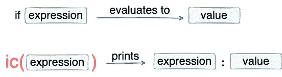

# 冰淇淋介绍:不要再使用 Print()调试 Python 代码了

> 原文：<https://towardsdatascience.com/introducing-icecream-never-use-print-to-debug-your-python-code-again-d8f2e5719f8a>

## 为什么我停止使用 print()语句进行调试，为什么您也应该这样做

照片由 [bryn beatson](https://unsplash.com/@brynbeatson?utm_source=medium&utm_medium=referral) 在 [Unsplash](https://unsplash.com?utm_source=medium&utm_medium=referral) 上拍摄

# 动机

编程时出错几乎是不可避免的。事实上，可以这么说，程序员花了大量的时间进行调试，以使他们的代码没有错误。

在调试时，使用`print()`语句来理解管道的流程并发现意外行为无疑是最广泛采用的方法。

然而，使用`print()`有许多注意事项，例如:

*   Print 语句通常用于向用户显示输出。如果程序员使用`print()`进行调试，在调试结束后，程序员应该注意只删除那些用于调试的特定`print()`语句。
*   通常，在调试过程中，您可能会一个接一个地打印多个变量。在这种情况下，程序员必须手动格式化输出以增强其可读性。

上面，我们打印了两个变量。虽然这里我们知道第一个变量是`var_1`，第二个是`var_2`，但是随着变量数量的增加，可能需要您在代码和输出之间来回查看，以找出哪个输出对应于哪个变量。

当然，我们可以打印更多的细节，如下所示，但这只是增加你的工作。

*   有时，程序员也可能对打印行号、函数名及其输入等感兴趣。，这增加了编写长/多`print()`语句的复杂性。
*   在大多数情况下，代码库不仅限于一个文件。相反，有多个文件组成了管道。在这种情况下，人们可能会对在调试期间显示文件名感兴趣，这对于`print()`来说可能是一个麻烦。

以上原因使得`print()`，至少对我来说，是调试的最差选择。

谢天谢地，Python 中有一个很好的选择。

介绍[冰淇淋](https://github.com/gruns/icecream)🍦！

# 冰淇淋

IceCream 是一个 Python 库，它用最少的代码使调试变得轻松易读。

它的流行特性包括打印表达式、变量名、函数名、行号、文件名等等——我们将在这篇博客中讨论。

## 安装冰淇淋

您可以使用`pip`安装`icecream`库。

## 进口冰淇淋

使用这个库的标准惯例是导入`ic`模块，如下所示:

# 冰淇淋入门

使用冰淇淋库就像打印语句一样简单。你需要把`print()`换成`ic()`。就是这样。

注意区别！`ic()`不仅打印值，还打印传递的变量名。

冰淇淋不仅仅是一个变量。相反，您可以在函数、类等上使用它。

多酷啊！它打印方法的名称(`func`)、传递的参数(`3`)和输出(`6`)。

在`ic()`方法中的每一个`expression`都会和`expression`的`value`一起打印出来，如下图所示。

冰淇淋打印表达式及其值(图片由作者提供)

使用 IceCream 进行调试也可以应用于常见的 Python 数据结构。下面显示了一个 Python 字典的示例。

# 检查执行情况

很多时候，程序员使用`print()`来显示有意义的(有时是随机的)语句，以确定程序的流程。如下所示:

冰淇淋也能让你摆脱那些奇怪的陈述。

只要叫`ic()`就完事了。它将打印文件名、行号和其他细节(如函数名，如果有的话)以及时间。简单。

# 在整个项目中使用冰淇淋

接下来，您可能想知道是否需要在每个 python 文件中导入库？当然不是！

为了使这些方法在所有项目文件中可用，从根文件中的`icecream`导入`install`模块，如下所示:

通过`install`，`ic()`在项目范围内可用。

# 添加自定义前缀

如果你注意到上面的话，`ic()`语句的输出以“`ic|`开始。这是冰淇淋提供的默认前缀。

但是，如果出于某种原因，您希望用自定义前缀替换它，您也可以这样做。这是通过在`ic.configureOutput()`方法中指定`prefix`参数来实现的，如下所示:

# 调试后删除冰淇淋语句

调试完代码后，您可能希望删除所有不必要的调试语句。

由于`ic()`语句在语法上不同于`print()`，您可以在您的编辑器中搜索模式“`ic(`，并删除这些语句，如下所示:

从代码中删除 ic()语句(Gif by author)

或者，您可以使用`ic.disable()`停止`ic()`打印。如果您希望再次使用它们，请使用`ic.enable()`。

# 结论

用`print()`语句进行调试是一种混乱且不优雅的方法。将输出映射到其对应的调试语句是令人困惑的。此外，它需要额外的手动格式化来理解输出。

如上所述，Python 中的冰淇淋库是一个很好的替代品。它用最少的代码使调试变得轻松易读。

点击阅读更多关于冰淇淋的信息。

感谢阅读！

[🚀**订阅数据科学每日剂量。在这里，我分享关于数据科学的优雅技巧和诀窍，一天一个技巧。每天在你的收件箱里收到这些提示。**](https://avichawla.substack.com/)

[🧑‍💻**成为数据科学专家！获取包含 450 多个熊猫、NumPy 和 SQL 问题的免费数据科学掌握工具包。**](https://subscribepage.io/450q)

✉️ [**注册我的电子邮件列表**](https://medium.com/subscribe/@avi_chawla) 不要错过另一篇关于数据科学指南、技巧和提示、机器学习、SQL、Python 等的文章。Medium 会将我的下一篇文章直接发送到你的收件箱。

我喜欢探索、实验和撰写关于数据科学概念和工具的文章。你可以在 [LinkedIn](https://www.linkedin.com/in/avi-chawla/) 上和我联系。