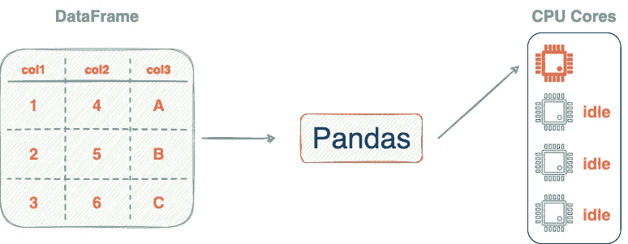
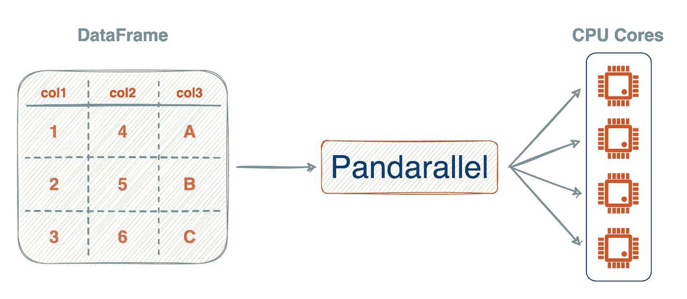
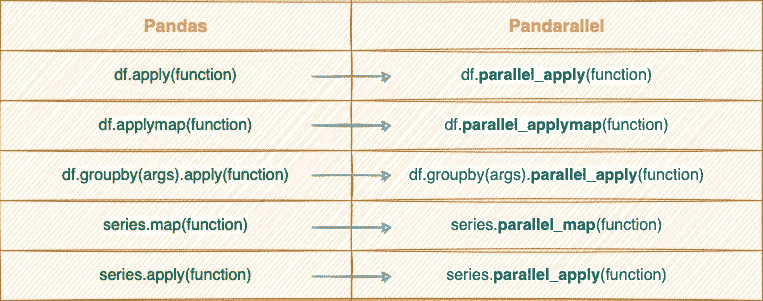
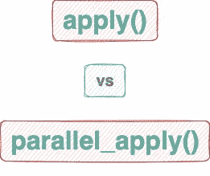
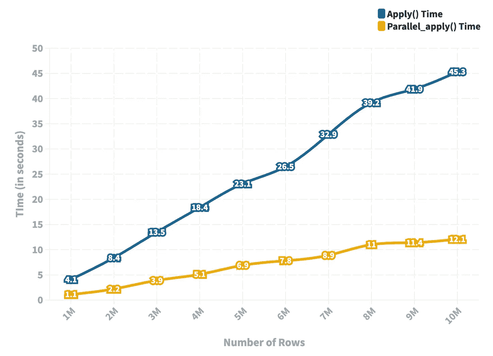

# 介绍 Pandarallel:再也不要在熊猫身上使用 Apply 方法

> 原文：<https://towardsdatascience.com/introducing-pandarallel-never-use-the-apply-method-in-pandas-again-7f3ff74fbe8e>

## 为什么我在 Pandas 中停止使用 Apply()，为什么你也应该这样做。

照片由 [Alain Pham](https://unsplash.com/@alain_pham?utm_source=medium&utm_medium=referral) 在 [Unsplash](https://unsplash.com?utm_source=medium&utm_medium=referral) 上拍摄

Pandas 库具有直观、优雅、初学者友好的 API，是 Python 中最好的表格数据处理库之一。

如今，几乎所有处理表格数据集的数据科学家都求助于熊猫来完成各种数据科学任务。

虽然 API 提供了圆滑的设计和广泛的功能，但是有许多限制使得 Pandas 在一些数据驱动的情况下不适用(或者效率低)。

我在下面的博客中谈到了五个令人担忧的局限性:

</5-things-i-wish-the-pandas-library-could-do-e9017c127779>  

综上所述，**Pandas 几乎所有的限制都源于其单核计算框架**。

换句话说，即使您的 CPU 有多个可用(或空闲)的内核，Pandas 也总是依赖于单个内核，这抑制了它的性能。

熊猫的单核计算框架(图片由作者提供)

有人可能想知道我们什么时候能在熊猫身上看到这些更新。但老实说，我们没有任何线索，因为没有任何来自熊猫的官方更新。

目前，严酷的现实是大多数用户照原样使用熊猫，即效率低下。

令人欣慰的是，在过去几年中，熊猫以外的许多开发者已经开始着手这个问题。

因此，我们今天有一些工具可供我们使用，让我们利用熊猫的多核，使它更有效。

我将在这篇文章中讨论的一个工具就是**panda parallel**！

我们开始吧🚀！

# 介绍 Pandarallel(熊猫+水货)

[Pandarallel](https://nalepae.github.io/pandarallel/) 是一个开源的 python 库，允许你将 Pandas 的操作并行化到所有可用的 CPU 内核上。这可以通过修改一行代码来实现。

Pandarallel 的多核计算框架(图片由作者提供)

此外，`pandarallel`还提供了很酷的进度条(就像我们用 [tqdm](https://github.com/tqdm/tqdm) 得到的一样)来估计剩余的计算量。

目前支持的方法有`apply()`、`applymap()`、`groupby()`、`map()`和`rolling()`。

## 安装 Pandarallel

您可以使用以下命令通过`pip`安装 Pandarallel:

## 导入 Pandarallel

下一步是导入库并初始化它:

正如在输出中看到的，`initialize()`设置了执行我们的作业的工人数量，在本例中是`4`。

你可以在这里阅读更多关于初始化[的内容。](https://nalepae.github.io/pandarallel/user_guide/)

此外，你还应该导入熊猫图书馆。

# 熊猫到熊猫

如上所述，从 Pandas 到 Pandarallel 的转换非常简单，只需要修改一行代码。

其中一些如下所示:

熊猫行动到潘达拉尔(图片由作者提供)。更多阅读:[https://nalepae.github.io/pandarallel/](https://nalepae.github.io/pandarallel/)

关键是把`apply`换成`parallel_apply`，把`map`换成`parallel_map`。

# 实验

接下来我们来对比一下熊猫的`apply()`和 Pandarallel 的`parallel_apply()`的表现。

Apply() vs Parallel_apply()(图片由作者提供)

由于 Pandarallel 利用了所有可用的内核，理想情况下，我们应该期望后者的性能优于前者。

让我们看看这是不是真的。

## 实验装置

在这个实验中，我创建了一个包含可变行和五列的虚拟数据帧。

更具体地说，我改变了从`1 Million`到`10 Million`的行数，并绘制了`apply()`和`parallel_apply()`的性能图。

这个实验中的函数定义如下，它返回一行的和:

为了消除随机性，我用特定的行数**重复了十次**的实验。

这个实验的代码如下所示:

## 结果

接下来，我们来看结果。

Apply() vs Parallel_apply()的实验结果(图片由作者提供)

*   蓝色线图描述了`apply()`方法的运行时间，黄色线图代表了`parallel_apply()`方法的运行时间。
*   我们将行数从 100 万改变到 1000 万，并注意到两种方法的运行时间与行数成正相关。
*   然而，`parallel_apply()`方法在运行时间上比传统的`apply()`方法有了显著的改进。
*   随着行数的增加，两种方法的运行时间之间的差异也会增加。这表明您应该始终使用`parallel_apply()`将函数应用于数据帧，尤其是在较大数据集的情况下。

# 结论

总之，在这篇文章中，我们在一组虚拟数据帧上比较了熊猫的`apply()`和 Pandarallel 的`parallel_apply()`方法的性能。

实验结果表明，就运行时间而言，使用`parallel_apply()`方法比`apply()`方法更有效——提供高达 **4 到 5** 倍的性能提升。

你可以在这里找到这篇文章的代码。

感谢阅读！

[🚀**订阅数据科学每日剂量。在这里，我分享关于数据科学的优雅技巧和诀窍，一天一个技巧。每天在你的收件箱里收到这些提示。**](https://avichawla.substack.com/)

[🧑‍💻**成为数据科学专家！获取包含 450 多个熊猫、NumPy 和 SQL 问题的免费数据科学掌握工具包。**](https://subscribepage.io/450q)

✉️ [**注册我的电子邮件列表**](https://medium.com/subscribe/@avi_chawla) 不要错过另一篇关于数据科学指南、技巧和提示、机器学习、SQL、Python 等的文章。Medium 会将我的下一篇文章直接发送到你的收件箱。

我喜欢探索、试验和撰写关于数据科学概念和工具的文章。你可以在 [LinkedIn](https://www.linkedin.com/in/avi-chawla/) 上和我联系。