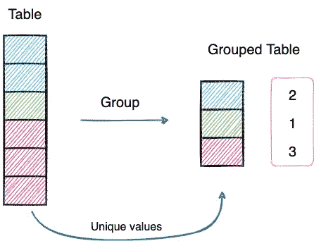
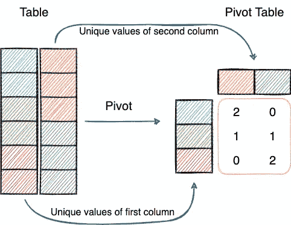
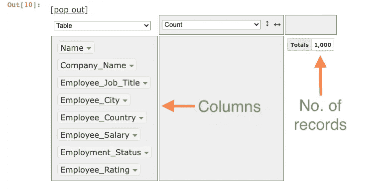
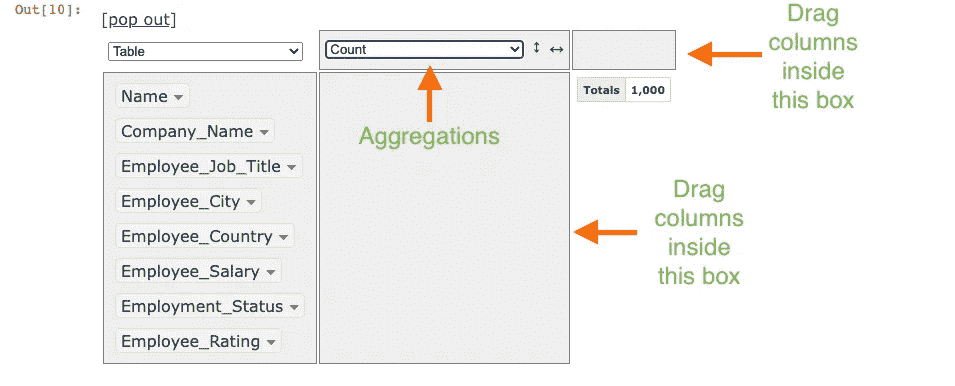
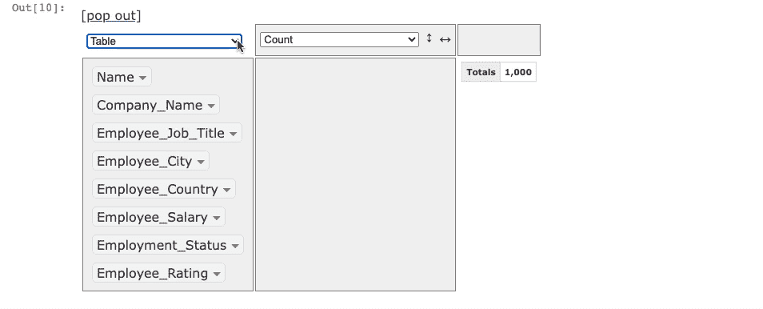
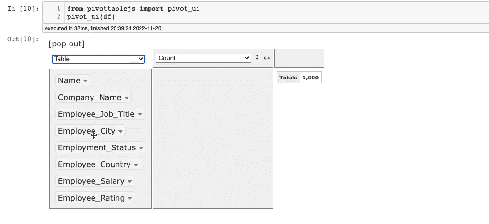
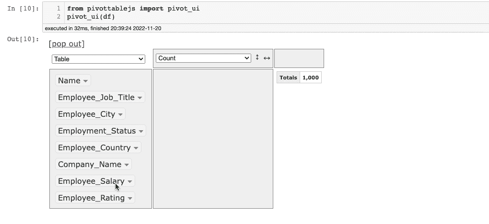
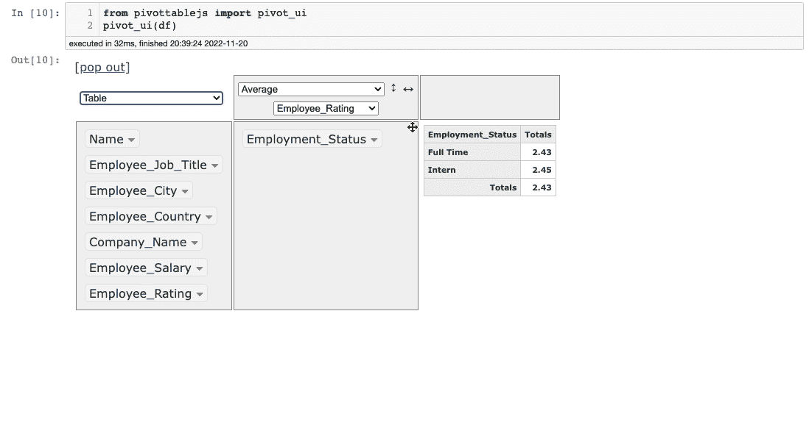
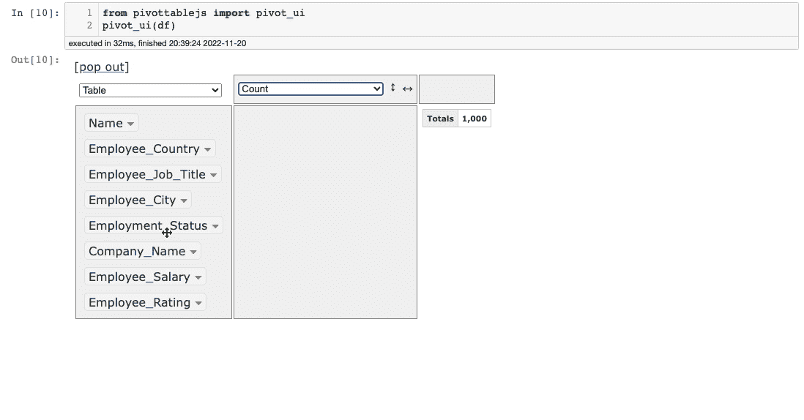

# PivotUI 简介:不要再使用 Pandas 来分组和透视数据

> 原文：<https://towardsdatascience.com/introducing-pivotui-never-use-pandas-to-groupby-and-pivot-your-data-again-ed0fcf95b6ed>

## 为每个人简化数据分析

照片由[威廉·费尔克](https://unsplash.com/@gndclouds?utm_source=medium&utm_medium=referral)在 [Unsplash](https://unsplash.com?utm_source=medium&utm_medium=referral) 上拍摄

# 动机

透视和分组操作是每个典型的表格数据分析过程的基础。`pivot_table()`和`groupby()`方法是熊猫最常用的[方法之一。](/the-only-30-methods-you-should-master-to-become-a-pandas-pro-749795084bb2)

分组主要用于理解分类数据，使您可以计算数据中单个组的统计数据。

分组的表示(作者的图像)

另一方面，数据透视表允许您将数据交叉制表，以便进行精细分析。

数据透视表的表示(图片由作者提供)

首先，我很欣赏数据透视表的重要性。然而，很多时候，我发现熊猫的旋转(特别是)有点吓人。我相信你们中的许多人会对此产生共鸣。

对于来自 Excel 的人来说，它提供了一个光滑而直观的 UI 来生成数据透视表，过渡到 Pandas 并不像人们预期的那样顺利。

此外，在许多数据分析任务中，事情通常不会停留在数据的旋转或分组上。许多人经常对创建图表感兴趣，以使它们更容易理解，这增加了编写更多代码的工作量。

如果我们有一个初学者友好的优雅的用户界面来对熊猫数据帧执行这些操作，就像我们在 Excel 中做的那样，那不是很好吗？

PivotTableJS 简介🚀！

# PivotTableJS

顾名思义，PivotTableJS 是一个用于创建数据透视表(以及分组表)的 Javascript 库。

它的终极卖点是可以用在 Jupyter 笔记本上([阅读更多](https://github.com/nicolaskruchten/jupyter_pivottablejs))，不用写任何代码。因此，您可以编写代码(在任何需要的地方)，修改数据，并立即将其提交给 PivotTableJS。

此外，其拖放功能和直观的布局使执行聚合、创建数据透视表和绘制交互式图表的任务变得轻松快捷。

## 安装 PivotTableJS

要使用`pip`安装 PivotTableJS，请在终端中键入以下命令。

或者，您也可以`conda`:

# 入门指南

## 加载数据集

当然，第一步是使用 Pandas 加载数据集。

出于演示目的，我将使用一个包含虚假员工信息的[虚拟数据集](https://deepnote.com/workspace/avi-chawla-695b-aee6f4ef-2d50-4fb6-9ef2-20ee1022995a/project/Untitled-project-70faf7a3-5b64-419e-b276-d92faf9b9bcb/%2Femployee_dataset.csv)，它是我使用 [Faker](https://faker.readthedocs.io/) 创建的。

## 调用 PivotUI

将数据集作为 Pandas DataFrame ( `df`)加载后，从`pivottablejs`库中导入`pivot_ui`方法。

在此之后，Jupyter 的输出面板中将出现以下窗口。

这些列显示在界面最左侧的面板中。默认显示计算区域的记录数(此处`1,000`)。

pivot_ui()方法的输出(图片来自作者)

您可以将列拖到两个空框中，以执行`groupby`和`pivot`操作，并从`aggregations`下拉列表中选择适当的聚合。

pivot_ui()方法的输出(图片来自作者)

最后，除了 aggregations 下拉列表，您还可以看到另一个下拉列表(当前显示的是`Table`)。这用于选择输出格式:

更改输出格式(Gif by Author)

接下来，让我们了解如何使用该工具执行`groupby`和`pivot`。

# 使用 PivotTableJS 分组

若要对单个(或多个)列执行分组，请将它们拖到聚合下面的空白区域。

例如，假设我们想要在`Employee_Status`列上分组。下面演示了这一点:

PivotTableJS 中的分组(Gif by Author)

就这么简单。

这里默认的聚合是组的大小(`Count`)。您可以更改这一点，并使用所需的聚合方法对您选择的任何列执行该操作。

假设我们想要找到`Employee_Status`列中每个值的平均值`Employee_Rating`。下面演示了这一点:

更改 PivotTableJS 中分组的聚合(Gif by Author)

事情不止于此。您也可以更改输出格式。

在上面的演示中，我们希望将分组在`Employee_Status`列上的平均值`Employee_Rating`显示为条形图。您可以这样做:

在 PivotTableJS 中绘制分组结果(Gif by Author)

很酷，不是吗？

想象一下，用代码做同样的事情要花多少时间。这是快速和不费力的。

# 使用 PivotTableJS 的数据透视表

与 GroupBy 类似，使用 PivotTableJS 生成数据透视表也相当简单。

只需要一个额外的步骤。在 groupby 示例中，我们只将列拖到一个空面板上。

然而，由于数据透视表的行和列都来源于表中的值，我们也应该拖动一个标题行。

例如，假设您想要显示包含`Employee_Status`和`Employee_City`列的数据透视表。这可以通过以下方式完成:

在 PivotTableJS 中创建数据透视表(Gif by Author)

您可能已经注意到了，这一次，我们还将一列拖到了上面的面板，这创建了一个数据透视表，而不是一个分组。

其余的事情与上一节中讨论的一样。

您可以从`aggregation`下拉列表中更改聚合，并选择另一列。

此外，为了更好地理解，您还可以将数据表示为图表。

# 结论

说到这里，我们就到此为止了。我希望你学到了新东西。

我相信，这个不可思议的工具将在执行一些典型的数据分析任务时为您节省大量时间。

**觉得这个提示有意思？**

如果你想了解更多关于数据科学和 Python 的优雅技巧和诀窍，我每天都会在 LinkedIn 上发布一个信息丰富的提示。

你可以在 [**我的 LinkedIn 帖子存档**](https://www.linkedin.com/in/avi-chawla/recent-activity/shares/) 中找到我发布的所有提示。可以在 [LinkedIn](https://www.linkedin.com/in/avi-chawla/) 上关注我，看看以后所有的帖子。

或者，您也可以通过电子邮件订阅以下内容:

[🚀**订阅数据科学每日一剂。在这里，我分享关于数据科学的优雅技巧和诀窍，一天一个技巧。每天在你的收件箱里收到这些提示。**](https://avichawla.substack.com/)

[🧑‍💻**成为数据科学专家！获取包含 450 多个熊猫、NumPy 和 SQL 问题的免费数据科学掌握工具包。**](https://subscribepage.io/450q)

感谢阅读！