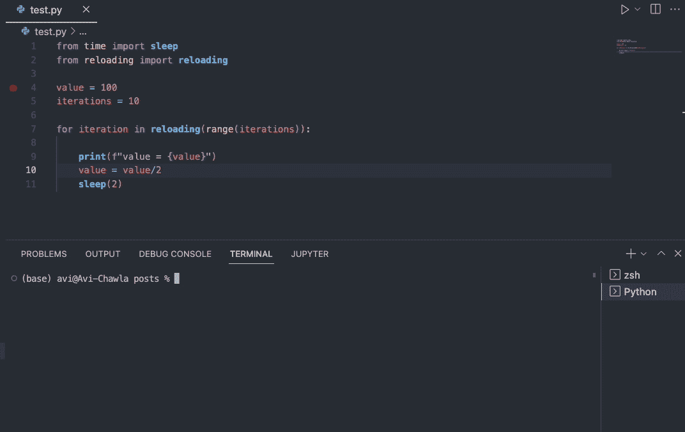
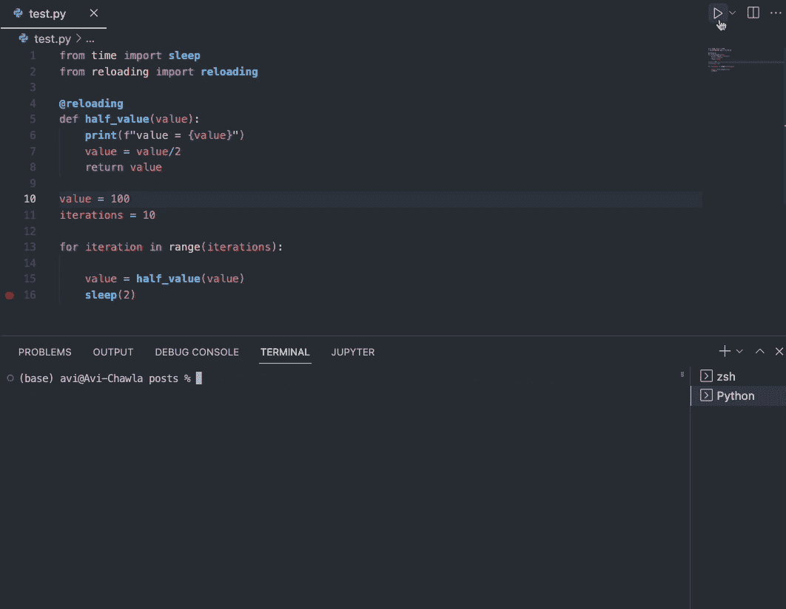

# 重载介绍:永远不要再次运行 Python 代码来打印更多的细节

> 原文：<https://towardsdatascience.com/introducing-reloading-never-re-run-your-python-code-again-to-print-more-details-374bee33473d>

## 在运行时修改代码，节省工作时间


照片由[布拉德在](https://unsplash.com/@bradneathery?utm_source=medium&utm_medium=referral) [Unsplash](https://unsplash.com?utm_source=medium&utm_medium=referral) 上整理

# 动机

在运行 Python 脚本时，我经常发现自己忘记打印所有必要的细节来跟踪管道的进度。

这通常在训练机器学习模型中观察到。大多数情况下，人们(包括我)经常忘记:

1.  添加必要的日志详细信息。
2.  打印基本的培训细节/指标，如准确度、误差、精确度等。
3.  在每个`k`时期后保存模型，等等。

我相信你也去过那里。

当然，问题不仅仅局限于机器学习。许多人在其他领域也面临着同样的问题，比如 **Web 报废**，人们在运行他们的代码后意识到他们应该丢弃更多的细节，等等。

别无选择，人们必须不情愿地停止代码，添加必要的细节并再次重新运行代码。如果您的管道已经运行了几个小时，这可能会令人非常沮丧。

但是如果我告诉你有一个巧妙的技巧呢？换句话说，在不丢失当前进度的情况下，对已经运行的代码进行更改实际上是可能的。

这就是我将在这篇博客中探讨的内容。

我们开始吧🚀！

# 再装

[重载](https://github.com/julvo/reloading)顾名思义，是一个 Python 库，允许你在每次迭代之前从源码中重载一个循环(或者函数)。

因此，您可以修改已经运行的代码并向其添加更多细节，而不会丢失任何当前进度。是不是很酷？

要安装它，请使用以下命令:

```
pip install reloading
```

## 重新加载循环

假设您有一个循环，它取一个初始值，并在每次迭代后减半。

但是，我们错误地忘记了在这个循环中打印迭代号，现在想修改它。

当然，没有重装，你别无选择，只能重新运行。

但是，如果您想在每次迭代之前重新加载`for`循环的主体，请用`reloading`包装迭代器，如下所示:

现在，您可以在运行时修改代码。下面显示了一个演示:



重装演示(作者 Gif)

如上所述，我们修改了`for`循环的主体。因此，我们可以在输出面板中看到新的细节，同时保持当前的进度。

## 重新加载函数

与重新加载循环类似，您也可以在每次迭代后重新加载函数体。考虑下面的函数`half_value`:

要重新加载函数体，用`reloading`装饰器装饰它。如下所示:

现在，您可以在运行时修改函数。下面显示了一个演示:



重装演示(作者 Gif)

完美！

# 结论

说到这里，我们就到此为止了。我希望你学到了新东西。

我相信这个技巧会在运行一些高运行时间代码时为你节省大量时间，比如训练机器学习模型。

**觉得这个提示有趣吗？**

如果你想了解更多关于数据科学和 Python 的优雅技巧和诀窍，我每天都会在 LinkedIn 上发布一个信息丰富的提示。

你可以在 [**我的 LinkedIn 帖子存档**](https://www.linkedin.com/in/avi-chawla/recent-activity/shares/) 中找到我发布的所有提示。你可以在 [LinkedIn](https://www.linkedin.com/in/avi-chawla/) 上关注我，看看以后所有的帖子。

或者，您也可以通过电子邮件接收:

[🚀**订阅数据科学每日一剂。在这里，我分享关于数据科学的优雅技巧和诀窍，一天一个技巧。每天在你的收件箱里收到这些提示。**](https://avichawla.substack.com/)

[🧑‍💻**成为数据科学专家！获取包含 450 多个熊猫、NumPy 和 SQL 问题的免费数据科学掌握工具包。**](https://subscribepage.io/450q)

[**获取机器学习领域排名前 1%的研究论文、新闻、报道、推文的每周汇总。**](https://alphasignal.ai/?referrer=Chawla)

我喜欢探索、实验和撰写关于数据科学概念和工具的文章。你可以在 LinkedIn 上和我联系。

感谢阅读！