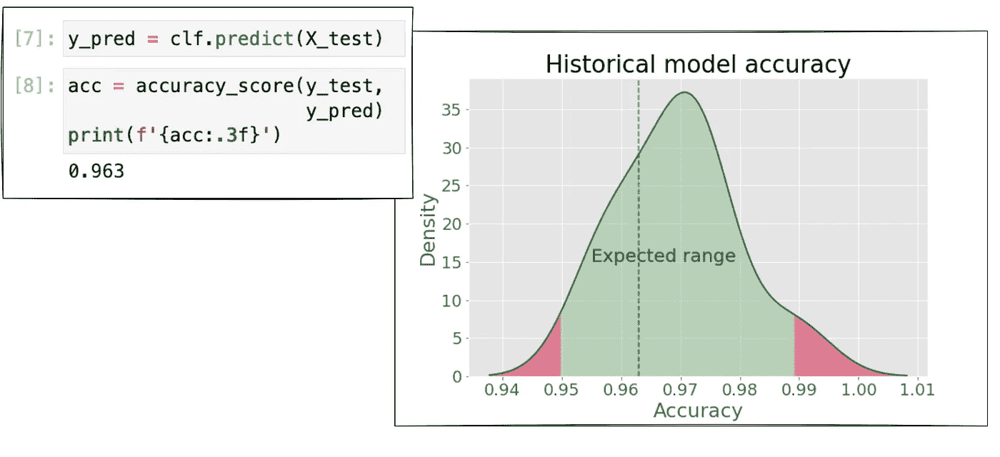
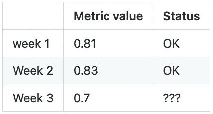
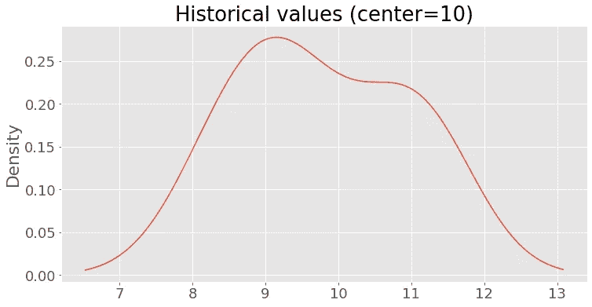
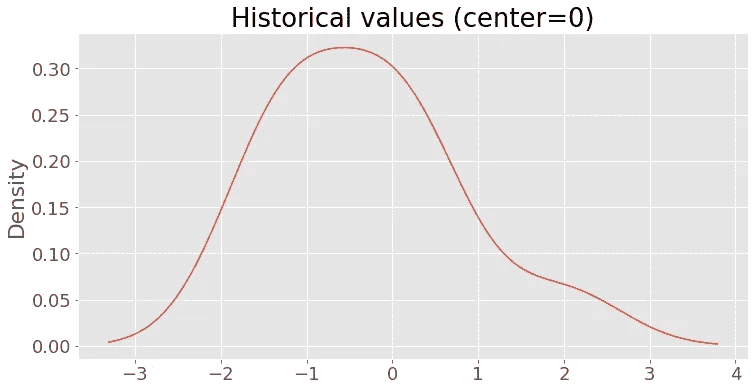
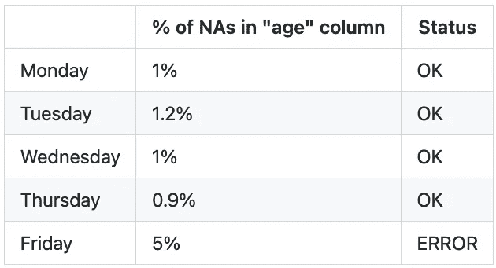
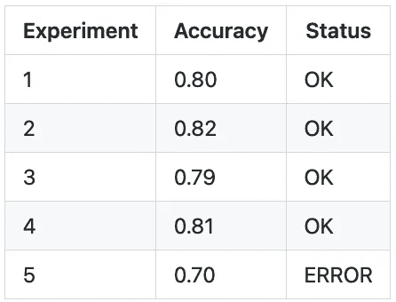

# Jupyter 笔记本电脑快照测试简介

> 原文：<https://towardsdatascience.com/introducing-snapshot-testing-for-jupyter-notebooks-896512971df8>

## 数据科学软件工程

## nbsnapshot 是一个开源软件包，它可以对笔记本的输出进行基准测试，以自动检测问题



图片作者。

> 如果您想了解我的最新内容。**跟我上** [**中**](https://medium.com/@edublancas) **或** [**推特**](https://twitter.com/edublancas) **。**感谢阅读！

# 动机

当在 Jupyter 笔记本上分析数据时，我会无意识地记住“经验法则”来确定我的结果是否正确。例如，我可能会打印一些汇总统计数据，如果这些数据与我过去看到的相差太多，我就会对这些数据产生怀疑。对于更复杂的分析，我经常创建诊断图(例如直方图)，并在新数据到达时检查它们。

我做这种半手工测试已经很多年了，在与其他数据科学家交谈时，我意识到这很常见；然而，没有工具可以简化这个过程。所以我开始问自己，我们是否可以自动化这个测试过程。在与一名前端开发人员交谈时，我清楚地知道了解决方案，他向我介绍了[快照测试](https://jestjs.io/docs/snapshot-testing)的想法。

想象一个前端开发人员使用 HTML、CSS 和 Javascript 创作 UI。开发人员如何测试用户界面是否正确？你可以说一些用户界面比其他的更好(如果它们更容易使用的话)，但是正确性的论点在这里并不适用。所以我们最好的办法是使用我们以前的实现作为基准。例如，如果按钮的位置发生了意外变化，我们可能会引发错误。

我们可以将同样的想法应用于笔记本测试。假设您有一个笔记本，它清理输入数据集，计算一些指标(例如，给定列上 NAs 的百分比)，然后存储清理后的数据集以供进一步分析:

假设我们今天运行这个笔记本。然后，一个星期过去了，我们运行笔记本并获得相同的结果。然后，两个星期过去了，我们运行笔记本，并意识到我们的指标看起来与前两个值非常不同。



第三周的结果与前两周相差太多。

我们不知道原因是什么，但我们知道发生了一些事情。因此，我们继续分析这种情况:可能是输入数据发生了变化，也可能是我们的代码包含了一些错误。不管那是什么，很高兴我们发现了这个，这样我们就可以进一步调查了。

快照测试旨在促进这一过程:我们将自动对笔记本电脑的输出进行基准测试，以检测潜在的问题。

# 介绍`nbsnapshot`

据我们所知， [nbsnapshot](https://github.com/ploomber/nbsnapshot) 是 Jupyter 笔记本的第一个快照测试实现，我们很高兴发布它！

> 通过主演 [GitHub 库来表示你的支持！](https://github.com/ploomber/nbsnapshot)谢谢！

想法很简单，每次我们运行我们的笔记本，我们记录我们想要基准的输出。然后，一旦我们有了至少两个历史记录，我们就开始将新值与历史值进行比较。最后，如果新值偏离(默认情况下，它使用三个标准差作为阈值)记录的值，我们会显示一个错误。让我们来看一个完整的例子。

首先，让我们导入几个包，并声明我们将使用的两个函数:

下载笔记本样本:

让我们创建一个假的历史文件来模拟我们运行一个笔记本(只有一个单元格)10 次。为了生成一个假输出，我们从以`10`(和`1`的标准偏差)为中心的正态分布中提取值:

**控制台输出:(1/1):**



让我们运行示例笔记本(`constant.ipynb`)。这个笔记本只有一个打印数字`10`的单元格。因为这个数字在我们的假历史的界限内，所以测试通过:

**控制台输出:(1/1):**

```
Testing: 'metric' - OK!
```

现在，让我们改写现有的历史，并用从以`0`为中心的正态分布中抽取的数字来替换它:

**控制台输出:(1/1):**



重新运行笔记本。这一次，笔记本里的数值(`10`)偏离历史记录太多。因此，测试失败:

**控制台输出:(1/1):**

```
Testing 'metric' - FAIL! Value is too high (10), expected one between -4.17 and 3.92
```

就是这样！这种简单的方法让我们无需额外的努力就能检测出笔记本中的问题！

# 用例

这里有两个重要的用例，其中快照测试非常有用。

**监测数据质量**

假设你有一个笔记本，每周都要接收数据。您可以使用快照测试来衡量所接收数据的质量，如果质量突然下降，就抛出一个错误。例如，您可能有一个在名为`age`的列中打印 NAs 百分比的单元格:



nbsnapshot 将在星期五抛出一个错误，因为该值是意外的。

在上表中可以看到，从周一到周四，NAs 的百分比与`1%`有一点偏离，但是到了周五，却暴涨到了`5%`，一定是发生了什么事情。

另一个示例测试是计算`age`列中具有负值的观察值的数量。该测试将允许您检测诸如`-2`或`-10`之类的损坏值何时进入笔记本。

**监控模特训练表现**

假设您有一个笔记本，它使用一个训练数据集作为输入，并输出一个训练好的模型。如果模型性能指标(例如准确性)突然下降，您可以使用快照测试来抛出一个错误。快照测试可以帮助您检测诸如损坏的数据、模型错误配置或数据泄漏等问题。

例如，假设您一直在训练模型，突然，模型精度下降了:



由于性能显著下降，nbsnapshot 将在第五次实验时抛出错误。

了解这种突然的变化将允许你进一步调查，找出发生了什么。

# 使用快照测试进行持续集成

为了有效地测试，我们建议您以持续集成的方式实现快照测试；这意味着无论何时修改源代码都要运行测试。例如，您可以使用 [GitHub Actions](https://github.com/features/actions) 并在每次提交项目时运行以下命令:

每当您将更改推送到您的存储库时，这个命令将运行测试。

# 考虑

`nbsnapshot`支持查看同一笔记本中的多个单元格；然而，考虑到您进行的测试越多，由于[假阳性](https://en.wikipedia.org/wiki/Multiple_comparisons_problem)而导致任何检查失败的可能性就越大。所以我们建议只测试几个基本的指标。在输出具有确定性的情况下，您可以根据需要检查任意多个像元。

快照测试需要手动更新历史结果。例如，假设您一直在训练一个模型，并且在最近十次实验中，历史精度一直在 0.80 左右；然后，你意识到那些实验有数据泄漏。修复问题后，精度下降到 0.70。因此，如果您运行快照测试，它将会失败。但是，在这种情况下，错误出现在历史记录中，因此您应该删除它们并用新值 0.70 替换它们。进行这种清理需要额外的努力，但是从长远来看，快照测试节省的时间是值得的。

# 结束语

在这篇博文中，我们介绍了 Jupyter 笔记本的快照测试，这个简单的想法可以极大地改善数据科学家的工作流程。请给 [nbsnapshot](https://github.com/ploomber/nbsnapshot) 一个尝试。该库是新的，所以如果您有任何功能需求，请告诉我们！nbsnapshot 的完美补充是 [Ploomber](https://github.com/ploomber/ploomber) ，我们的开源框架用于编排基于笔记本的管道。

> 嗨！我叫爱德华多！我喜欢写所有关于数据科学的东西，并为开源项目做贡献。如果您想了解我的最新内容。**跟我上** [**中**](https://medium.com/@edublancas) **或** [**碎碎念**](https://twitter.com/edublancas) **。**感谢阅读！

*原载于*[*ploomber . io*](https://ploomber.io/blog/snapshot-testing/)