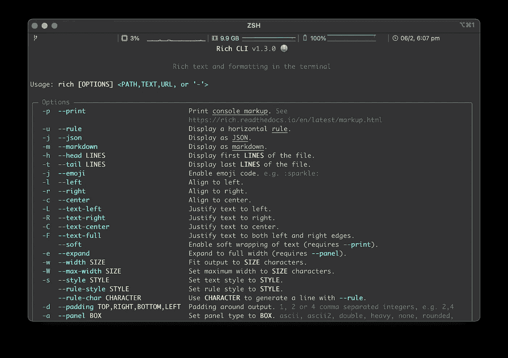
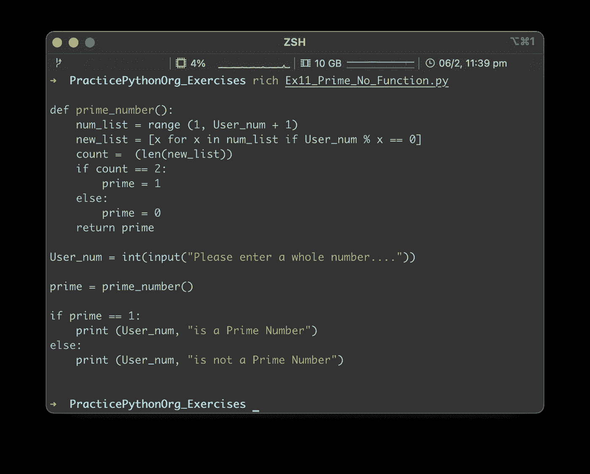
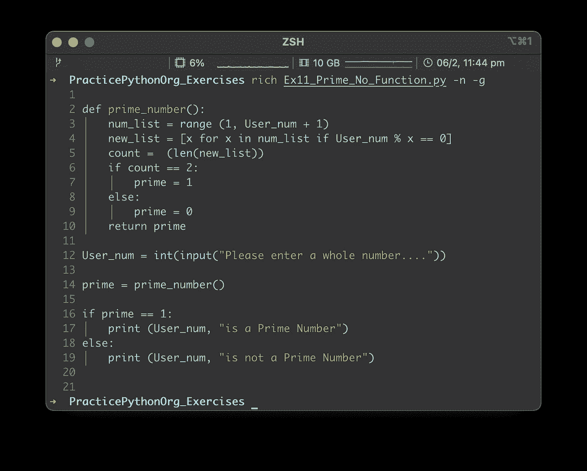
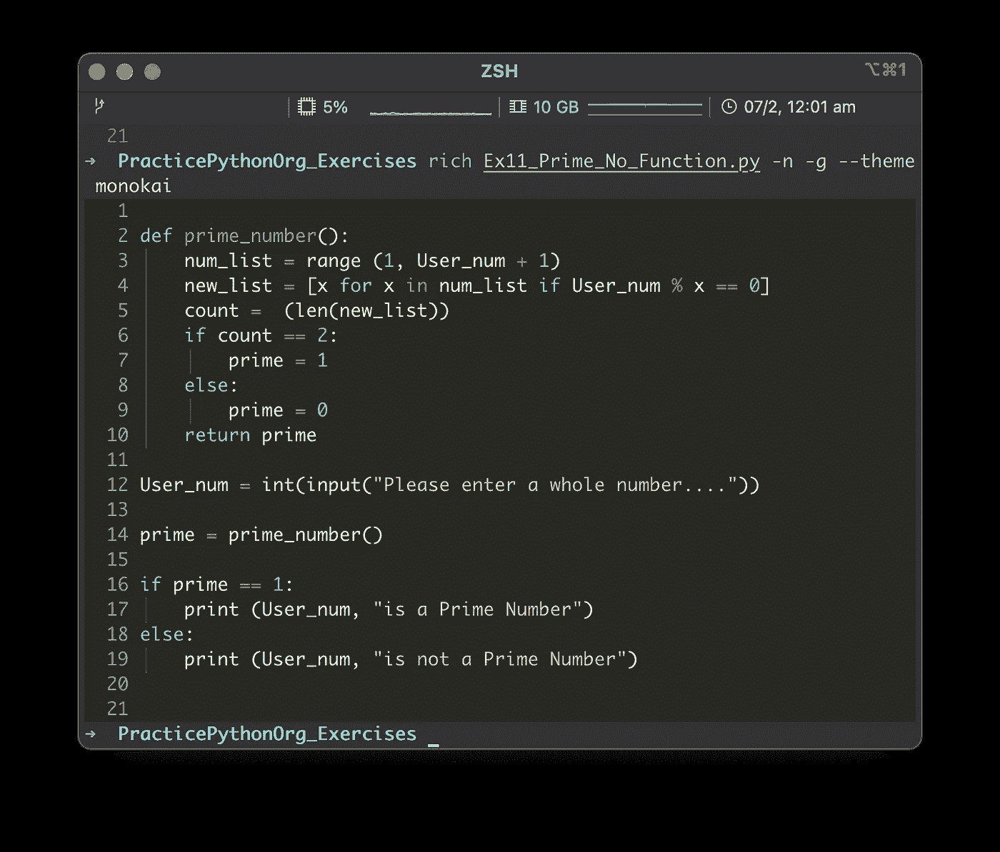
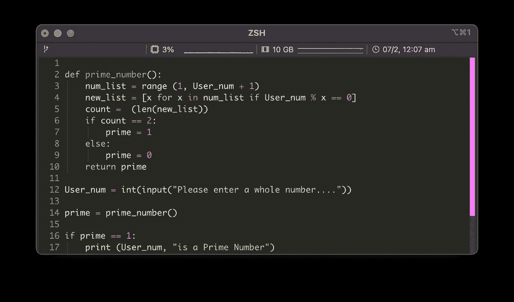
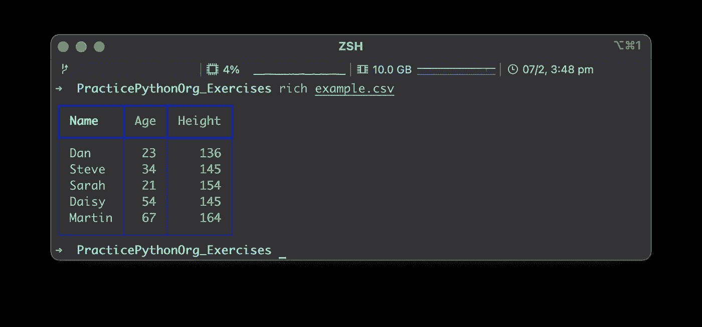

# 介绍 Rich CLI 工具:在终端中查看文件将不再一样

> 原文：<https://towardsdatascience.com/introducing-the-rich-cli-tool-viewing-files-in-the-terminal-will-never-be-the-same-again-80e7c5af5b5f>

现在你可以超越用 iTerm2 和 oh-my-zsh 来推销你的终端了。Rich CLI 将允许您在命令行上查看文件的方式上添加一个全新的维度。通过提供一个添加颜色和格式的工具包，Rich CLI 不仅将 CSV 文件转换成漂亮的表格，使您的编码脚本看起来就像在您选择的 IDE 中一样，并为 Markdown 和 JSON 文件提供特殊的格式，而且它还允许您自己格式化您在命令行上输入的文本**。**



Rich_CLI

Rich CLI 由 Will McGugan 创建，可在 Mac OS、Linux 和 Windows 上使用。Will 也是名为 [Rich](https://github.com/Textualize/rich) 的 Python 库和名为 [Textual](https://github.com/Textualize/textual) 的 Python 框架的创建者。丰富的 Python 库使 Python 程序员能够向终端呈现丰富的文本输出，并且已经被各种主流 Python 项目所采用。Rich CLI 的发布为命令行带来了丰富的 Python 库功能。

> "你再也不会使用内置的猫，头或尾命令了！"

# 丰富的 CLI —安装

只需使用`pip install`命令，就可以将丰富的 CLI 工具安装到特定的目录或虚拟环境中…

```
python -m pip install rich-cli
```

但是，如果您希望能够在您的计算机上全局使用 Rich CLI(我相信一旦您开始使用它，您将希望能够在任何地方使用它！)那么我会推荐用 pipx 安装。

随 pipx 安装的工具和软件包存储在一个全局虚拟环境中，您可以通过命令行、所有全局目录和所有虚拟环境访问该环境。

</python-how-to-create-a-clean-learning-environment-with-pyenv-pyenv-virtualenv-pipx-ed17fbd9b790>  

要在 Mac 上安装 pipx，请在您的终端中运行以下命令。

```
brew install pipx
pipx ensurepath
```

然后使用 pipX 安装、升级或卸载软件包和工具，您只需使用`pipx install`、`pipx upgrade`和`pipx uninstall`，就像使用 pip 管理您的库一样。要安装 Rich CLI，只需使用以下命令。

```
pipx install rich-cli
```

# 丰富的 CLI —功能

Rich CLI 使用起来非常简单，开箱即可对各种文件类型进行漂亮的格式化(无需应用任何选项)。简单地使用`Rich`命令，后跟你选择的文件的路径，你会惊讶于你在终端上看到的输出。

```
rich Ex11_Prime_No_Function.py` 
```



不应用选项的基本丰富输出

工具包提供了许多选项，您可以根据自己的喜好定制输出。我将简单地突出下面几个我最喜欢的，这样你就能感受到它的能力。要获得所有可用选项和参数的列表，只需在终端中键入`rich --help`即可调用内置的帮助功能。

## 行号和参考线

在终端中查看代码文件的一个重要特性是能够添加行号和缩进指南。这可以通过添加选项`-n`的行号和`-g`的引导线轻松实现。

```
rich Ex11_Prime_No_Function.py -n -g
```



带行号和参考线的 Python 脚本

## 主题

Rich CLI 甚至允许您设置一些将应用于显示文件的常见主题。可以为单个文件设置主题

```
rich Ex11_Prime_No_Function.py --theme monokai
```

或者在环境变量中设置为默认设置

```
RICH_THEME=monokai
rich Ex11_Prime_No_Function.py
```



带行号和指南的 Monokai 主题

在[Pygments.org](https://pygments.org/styles/)网站上的[风格](https://pygments.org/styles/)版块有大量主题可供选择。

## 寻呼机

如果文件中的行数太多，无法在标准终端窗口中轻松查看，那么您可以使用`--pager`选项在内置的寻呼机应用程序中打开文件，在该应用程序中，可以使用光标键或滚动条浏览文件。



说明滚动条的寻呼机应用程序

## CSV 文件作为表格

丰富的 CLI 将显示 CSV 或 TSV 文件的内容在一个非常清晰，易于阅读的表格。当与上面说明的分页选项`--pager`结合使用时，您可以轻松地上下滚动来查看包含的数据集。



CSV 文件的列表显示

上面的例子几乎没有触及丰富的 CLI 功能的表面。其他一些值得一提的关键特性是:

*   `-— head xx`或`—-tail xx`允许您指定从文件开头或结尾开始的行数，以应用所选格式显示。
*   特定的 JSON 和 MARKDOWN 格式
*   特定文本块宽度、对齐方式和对齐方式
*   由用户定义的符号构建的彩色标尺
*   丰富的印刷、面板和衬垫
*   从以 HTTP/HTTPS 开头的 URL 直接从互联网上读取文件
*   将格式化的输出(所有命令/选项)写入 HTML 文件

有关提供的所有命令/选项的完整详细信息，以及代码示例和示例输出图像，请参考 [Rich CLI GitHub repo](https://github.com/Textualize/rich-cli) 中构造良好的 [README.md](https://github.com/Textualize/rich-cli/blob/main/README.md) 文件。

我真的鼓励你尝试 Rich CLI，如果你是 Python 开发者，那么你也应该看看 Rich 和 Textual。这三个项目仍在积极维护，并定期添加新功能。

我当然迫不及待地想看到在不久的将来，这些伟大的工具包中会添加哪些令人惊叹的新功能。

# 参考

如果您希望进一步研究我在本文中提到的工具，那么您可以通过下面的链接来研究它们的全部特性集…..

1.  【https://github.com/Textualize/rich-cli 
2.  [https://github.com/Textualize/rich](https://github.com/Textualize/rich)
3.  [https://github.com/Textualize/textual](https://github.com/Textualize/textual)
4.  [https://github.com/pipxproject/pipx](https://github.com/pipxproject/pipx)