# 怀特异方差一致性估计量介绍

> 原文：<https://towardsdatascience.com/introducing-the-whites-heteroskedasticity-consistent-estimator-821beee28516>

## HC 估计量的介绍，以及它在面对异方差时建立回归模型的重要性

在本文中，我们将讨论统计建模中的两个基本主题，即协方差矩阵和异方差。

[协方差矩阵](/an-illustrated-guide-to-the-variance-covariance-matrices-used-in-regression-analysis-3eb5a5dd2cff)是统计推断的工作马。它们用于确定回归系数是否具有统计显著性(即不同于零)，并用于构建每个系数的置信区间。为了完成这项工作，他们做了一些重要的假设。这些假设中的主要假设是模型的误差是同方差的，即它们具有恒定的方差，并且误差不是自相关的。

在实践中，有可能假设误差的非自相关性，特别是在横截面数据中(但不是在时间序列设置中)。

不幸的是，误差的同质性假设通常是不成立的。幸运的是，面对非恒定方差，即异方差回归误差，有办法建立回归系数的协方差矩阵(从而进行可靠的统计推断)。

在本文中，我们将研究一种被称为**怀特异方差一致性估计器**(以其创造者[哈尔伯特怀特](https://en.wikipedia.org/wiki/Halbert_White)命名)的技术，其中我们将构建一个对异方差回归误差稳健的回归系数协方差矩阵。

本文是以下两部分系列的第 1 部分:

**第 1 部分:介绍 White 的异方差一致性估计量**
[第 2 部分:使用 Python 和 Statsmodels 的 White 异方差一致性估计量教程](/a-tutorial-on-whites-heteroskedasticity-consistent-estimator-using-python-and-statsmodels-7d38789150d1)

在第 1 部分中，我们将探讨 HC 估计量的理论，而在第 2 部分中，我们将通过一个基于 Python 的教程来介绍如何使用它来进行对异方差稳健的统计推断。

考虑回归模型的以下一般形式:

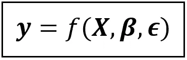

**y** 作为回归变量的函数 ***X*** ，系数**和误差***(图片由作者提供)***

**在这个模型中，我们将响应变量 ***y*** 表示为回归变量矩阵 ***X*** 、系数 ***β*** 和回归误差 ***ϵ*** 的某个未指定函数。如果这个模型有 ***k*** 个回归系数包括截距，那么对于一个大小为 *n* ， ***y*** 的数据集是一个大小为*【n×1】*， ***X*** 的矩阵*【n×k】*， ***β*** 是**

**该模型的线性形式由两个回归变量和一个截距组成，可表示如下:**

****

**包含 2 个回归变量和截距的线性模型(图片由作者提供)**

**这里， ***1*** ，***x****_ 2*，***x****_ 3*是大小为*【n×1】*的列向量，其中 ***1*** 只是一个 1s 的列向量。对于数据集中任何给定的行 *i* ,上述模型可以表示如下:**

**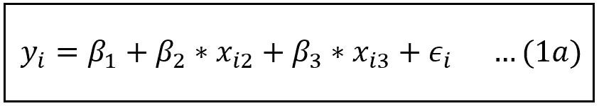**

**数据集中第 I 行的线性模型(图片由作者提供)**

**实际上，将等式(1)或(1a)简洁地表达如下是有用的:**

****

**线性模型(图片由作者提供)**

**或者在其全矩阵中荣耀如下(在我们的例子中，k=3):**

****

**矩阵形式的线性模型(图片由作者提供)**

***β_1，β_2，…β_k* 代表样本为整个总体时对应的系数的真实总体水平值。**

**但是对于所有实际情况，样本数据集是来自总体的某个大小为 *n* 的随机子集。当线性模型被训练为“拟合”该样本数据集时，我们得到拟合模型的以下等式:**

**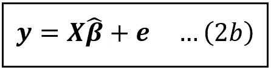**

**拟合线性模型的方程(图片由作者提供)**

**在这里， ***y*** 和 ***X*** 的含义和以前一样。但是***β****_ cap*是系数 *β_1_cap，β_2_cap，…β_k_cap* 的拟合值的向量， ***e*** 是拟合模型的残差的向量。注意回归模型的误差项**(****y****—****xβ****)*)和残差项***e****=(****y***)***

***由于在不同的样本上拟合模型，每个大小为 *n，*的样本每次将产生一组不同的系数值，拟合的系数 *β_1_cap，β_2_cap，…β_k_cap* 可被视为随机变量。拟合值 *β_1_cap，β_2_cap，…β_k_cap* 各有一个平均值，可以表示为相应的真实总体值 *β_1，β_2，…β_k* ，并且它们在该平均值附近有一个方差。***

***回归模型拟合系数的协方差矩阵包含拟合系数的方差，以及拟合系数之间的协方差。下面是包含 *k* 个回归变量(包括截距)的模型的矩阵图:***

******

***拟合回归系数的协方差矩阵(图片由作者提供)***

***协方差矩阵是大小为*【k x k】*的方阵。该矩阵中位置 *(i，j)* 处的元素包含第*个*和第*个*个拟合系数的协方差。沿着主对角线的值是 *k* 拟合系数的方差，而非对角线元素包含拟合系数之间的协方差。主对角线元素的平方根是拟合系数的标准误差。矩阵围绕主对角线对称。***

> ***回归系数的协方差矩阵用于确定模型的系数是否具有统计显著性，并计算每个系数的置信区间。***

***对于形式为***y****=****xβ****+****【ϵ***(其形成统计建模的主干)的线性模型，协方差矩阵的公式在其内包含另一个协方差矩阵，即模型的误差项***【ϵ***的协方差矩阵。误差的协方差矩阵也是一个方阵。对于大小为 *n* 的数据集，该矩阵的大小为*【n×n】*，其结构如下:***

***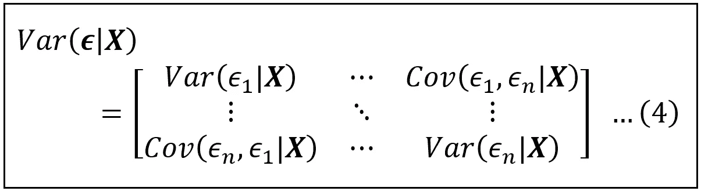***

***回归模型误差的协方差矩阵(图片由作者提供)***

***顺便提一下，注意这两个矩阵都包含[条件方差和协方差](/understanding-conditional-variance-and-conditional-covariance-8b661067fc18)，它们以回归矩阵 ***X*** 为条件。***

***正如拟合系数一样，每个误差*ϵ_i**都是具有均值和方差的随机变量。如果模型的误差是同方差的(常数方差)，那么对于数据集中的每一行 *i* ， *Var(ϵ_i)* 是某个常数σ。另外，如果误差不是自相关的，那么对于每对误差 *ϵ_i* 和 *ϵ_j* 其中 *i！= j* ， *Cov(ϵ_i，ϵ_j)=0* 。因此，如果模型的误差是同伦的和不相关的，上述矩阵简化为相当简单的形式如下:****

***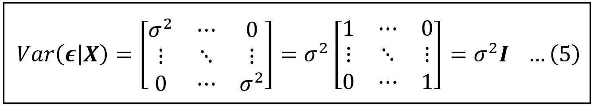***

***当误差为同方差且非自相关时，回归模型误差的协方差矩阵(图片由作者提供)***

***其中 ***I*** 是大小为*【n×n】*的单位矩阵。单位矩阵是标量数 1 的等价矩阵。 ***I*** 的主对角线元素全为 1，其余元素为零。而正如数字 1 一样，*(****I****)^n =****I***与 ***I*** 的逆也是 ***I*** 。***

***在线性模型中，当模型的误差为同方差且非自相关时，拟合回归系数的协方差矩阵具有以下简单明了的形式，其[推导在我关于协方差矩阵的文章](/a-deep-dive-into-the-variance-covariance-matrices-of-classical-linear-regression-models-4322b2cdc8e6)中有所介绍:***

******

***模型误差为**同伦齐次**和**非自相关**时拟合回归系数的协方差矩阵公式(图片由作者提供)***

***上式中，**T5【XT7*'*是**X的转置。转置类似于通过交换行和列在侧面旋转 ***X*** 。由于*有维度*【n X k】*，*有维度*【k X n】*。***X****'****X***的乘积是两个大小分别为*【k X n】**【n X k】*的矩阵的乘积，因此它是一个大小为*【k X k】*的方阵。上标为 *-1* 的倒数也是*【k x k】*的大小。最后，我们用系数 *σ* 对倒数进行缩放，该系数是所有误差项的恒定方差。*********

***等式(6)表明，为了计算拟合系数的协方差矩阵，必须访问 ***X*** 和 *σ。虽然实验者完全可以接触到 w****x***，但是回归模型的误差项 ***ϵ*** 是一个本质上不可观测的变量，其方差 *σ也是如此。*实验者所能做的最好的事情就是计算*拟合*模型的残差 ***e*** ，并用它们作为 ***ϵ*** 的代理。幸运的是，可以证明残差的方差 *s* 形成了模型误差方差 *σ* 的无偏估计，并且在残差已知的情况下， *s* 很容易计算。因此，在实践中，我们使用以下公式来估计拟合系数的方差:***

******

***当模型误差为**同方差**和**非自相关**时，拟合回归系数的估计协方差矩阵的公式(图片由作者提供)***

***不幸的是，现实很少是简单的。虽然我们通常可以假设误差项的非自相关性，特别是在横截面数据集中，但误差的异方差性在横截面和时间序列数据集中是非常常见的。***

***当误差项异方差时，误差的协方差矩阵如下所示:***

***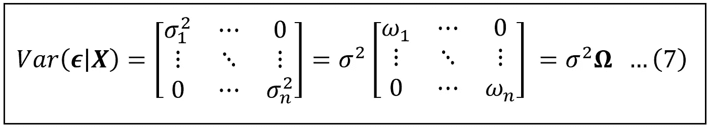***

***当模型误差为**异方差**和非自相关时，回归模型误差的协方差矩阵(图片由作者提供)***

***在这个矩阵中，σ只是我们从矩阵中提取出来的一个普通比例因子，因此每个 *ω_i=σ _i/σ。*很容易看出，当误差为同方差时， *σ _i=σ* 对于所有 *i* 和 *ω_i=1* 对于所有 *i* 和***ω****=****I***，恒等式矩阵。***

***顺便提一下，一些统计文本使用***ω***来表示误差的协方差矩阵，该协方差矩阵是*异方差和自相关的。****

***无论哪种方式，当协方差误差的矩阵不是 *σ* ***I*** ，而是*σ****ω***时，拟合回归系数的协方差矩阵失去了等式(6)或(6a)给出的简单形式，而是呈现如下所示的不祥形式:***

***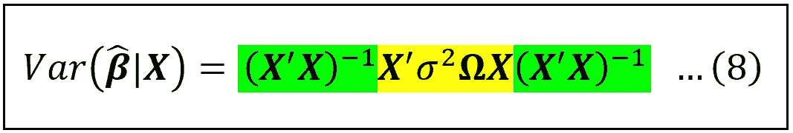***

***模型误差异方差时估计系数协方差矩阵的公式(图片由作者提供)***

***如果你好奇 Eq (8)是怎么推导出来的，我在文末已经提到了它的推导。***

***现在，我们需要了解面对异方差误差，如何使用等式(8)最佳地估计拟合系数的方差。***

***等式(8)由三段组成(分别用绿色、黄色和绿色着色)。由于 ***X*** 矩阵对于实验者来说是完全可访问的，所以术语*和(***x’x***)^(-1)是容易计算的，因此可以计算绿色块。问题出在*ω和方差因子σ ***，*** 两者都是不可观测的，因为它们涉及回归模型的误差项***【ϵ***。因此，等式中心的黄色部分无法计算。*****

***回想一下，当误差是同方差且非自相关时，我们可以使用残差的方差 s ***I*** 来估计σ ***I*** 。同样，在这种情况下我们需要一种方法来估计(σ***【ω】***这将使黄色位可计算。***

***这就是由 Halbert White 在 1980 年提出的估计量发挥作用的地方。怀特提出了一种估算等式(8)核心的黄色项*(****X****‘σ****ωX****)*的方法。具体来说，他证明了以下几点:***

***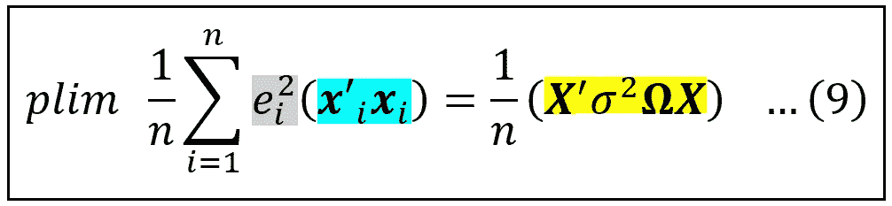***

***哈尔伯特·怀特在他 1980 年的论文中证明的身份(图片由作者提供)***

***等式(9)值得解释一下。方程(9)左 h 上的 *plim* 算子代表**概率极限**。简而言之，当数据集 *n* 趋向于无穷大时，通过对等式(9) [**的 L.H.S .求和计算的随机变量以概率**](https://en.wikipedia.org/wiki/Convergence_of_random_variables#Convergence_in_probability) 收敛于 R.H.S .上的随机变量。理解“依概率收敛”的一个简单方法是想象两个随机变量 **A** 和 **B** 。如果 **A** 在概率上收敛于 **B** ，则意味着随着 *n* (数据样本的大小)的增加， **A** 的概率分布变得越来越像概率分布 **B** ，并且随着 *n* 趋于无穷大，它变得(几乎)等同于 **B** 的概率分布。因此，当 *n* 变得任意大时， **A** 的属性变得与 **B** 的属性无法区分。***

***等式(9)的 L.H.S .上的和以及 R.H.S .上的项是随机变量的事实可以推导如下:***

***让我们看看方程(9)的 R.H.S。每次随机选择大小为 *n、* ***X*** 的样本时，回归矩阵很可能会呈现不同的一组值。这使得 ***X*** 矩阵成为具有某种(未知)概率分布的随机变量。等式(9)的 R.H.S .项，即，***(X****【σ****ωX)/n***，是*的函数，这使得它成为具有某种概率分布的随机变量。****

****现在我们来看看 L.H.S .上的 L.H.S .我们有术语***X****’_ I*和 ***x*** *_i* 分别是第 I 行***×第*** 和第 I 行的转置。两者都是随机变量，原因与 ***X*** 和***X****’*都是随机变量一样。因此，lhs 上的整个比例求和也是具有某种概率分布的随机变量。****

***让我们检查 lhs 上的总和:***

***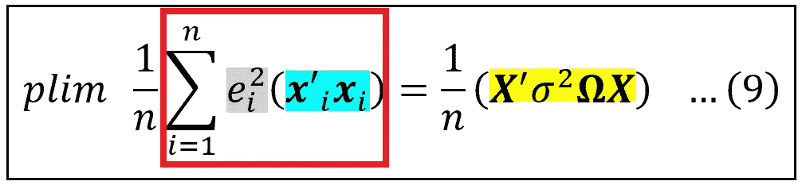***

***(图片由作者提供)***

******X****_ I*是 ***X*** 的第 I 行，所以它的一个大小为*【1 X k】*的行向量， ***x*** *'_i，*它的转置大小为*【k X 1】*。因此他们的矩阵乘积是一个*【k X k】*方阵，它包含了第 I 行 ***X*** 的协方差。我们用第 I 行的剩余误差的平方来缩放这个矩阵。求和对 *n* 个这样的*【k x k】*矩阵进行求和，每个矩阵由来自拟合模型的相应残差平方进行缩放。求和的结果是一个大小为*【k x k】*的方阵:***

***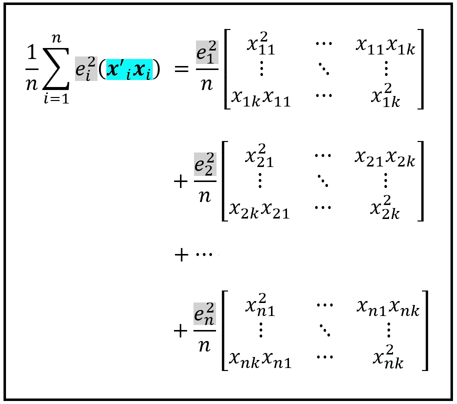***

***将等式(9)的 L.H.S .计算为 n 个大小为[k x k]的矩阵的缩放求和(图片由作者提供)***

***现在让我们看看等式(9)的均方根值:***

***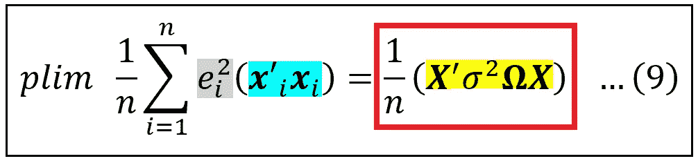***

***(图片由作者提供)***

******X*** 是大小为*【n X k】*的回归矩阵，使其转置大小为*【k X n】*的***X****’*。 *σ* 是标量。***ω***尺寸*【n x n】*。从左到右，***X 'ω***的尺寸为*【k X n】*。而*(****X 'ω****)****X***则是尺寸*【k X k】****。*** 因此，R.H.S .也是一个大小为 *[k x k]* 的平方矩阵，与标量 *σ /n.* 成比例***

***有了这个估计，我们再来看看面对异方差误差时拟合系数的协方差公式:***

******

***模型误差异方差时估计系数协方差矩阵的公式(图片由作者提供)***

***多亏了 White 博士，我们现在有了一种方法来估计等式(8)中心的黄色项，如下所示:***

***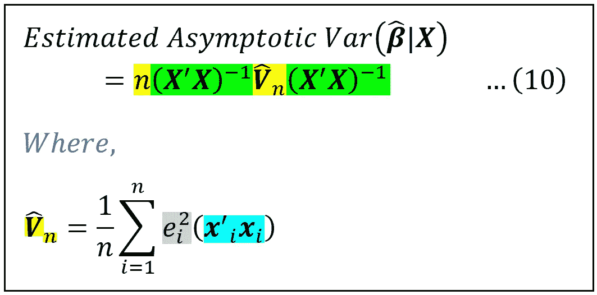***

***怀特的异方差一致性估计量(图片由作者提供)***

***等式(10)被称为**怀特的异方差一致性(HC)估计量**。它为回归建模者提供了一种面对异方差误差时估计拟合回归系数的渐近协方差矩阵的方法。“渐近”一词意味着，严格地说，估计量只对无限大的数据集有效。更多关于这个事实在下面。***

***在使用它时，我们应该记住它的以下两个限制:***

***回想一下，这个估计量是基于一个恒等式，这个恒等式只有在数据集变得任意大时才有效，也就是说，在技术上是 n → ∞。在实际设置中，这一限制使得该估计器仅对于非常大的数据集特别有效。对于较小的数据集(称为小样本)，比如说当 *n* 小于或等于几百个数据点时，怀特的 HC 估计器往往会低估拟合系数的方差，使它们看起来比实际更相关。小样本中的这种低估通常可以通过将等式(10)除以*(n-k)*来纠正，如 MacKinnon 和 White 在他们 1985 年的论文中所示(参见文章末尾的论文链接)。***

***White 的 HC 估计量的第二个潜在问题是，它假设回归模型的误差中几乎没有自相关。这一假设使其仅适用于横截面和面板数据集，并使其特别不适用于通常包含延伸到过去几个时期的自相关的时间序列数据集。***

***总之，White 的异方差一致性估计量提供了一种强有力的方法来估计拟合系数的协方差矩阵，从而在异方差面前进行一致的统计推断。***

# ***系数估计的协方差矩阵的推导***

***我们从线性模型开始:***

***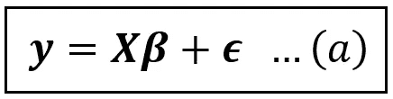***

***线性模型的方程(图片由作者提供)***

******β*** 的最小二乘估计产生以下估计量:***

******

****的 OLS 估计器(图片由作者提供)****

****将(b)中的 ***y*** 替换为***xβ****+****【ϵ】***并重新排列术语得出如下推导结果:****

****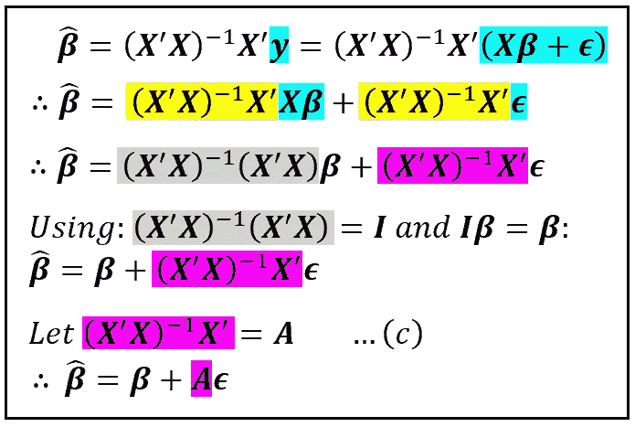****

****(图片由作者提供)****

****随机变量的方差是其均值减去后的值的平方的期望值:*Var(****X****)= E[(****X****——****X****【均值】]。*系数估计值的均值***β****_ cap*简单来说就是总体值 ***β*** 。因此，我们继续进行如下推导:****

****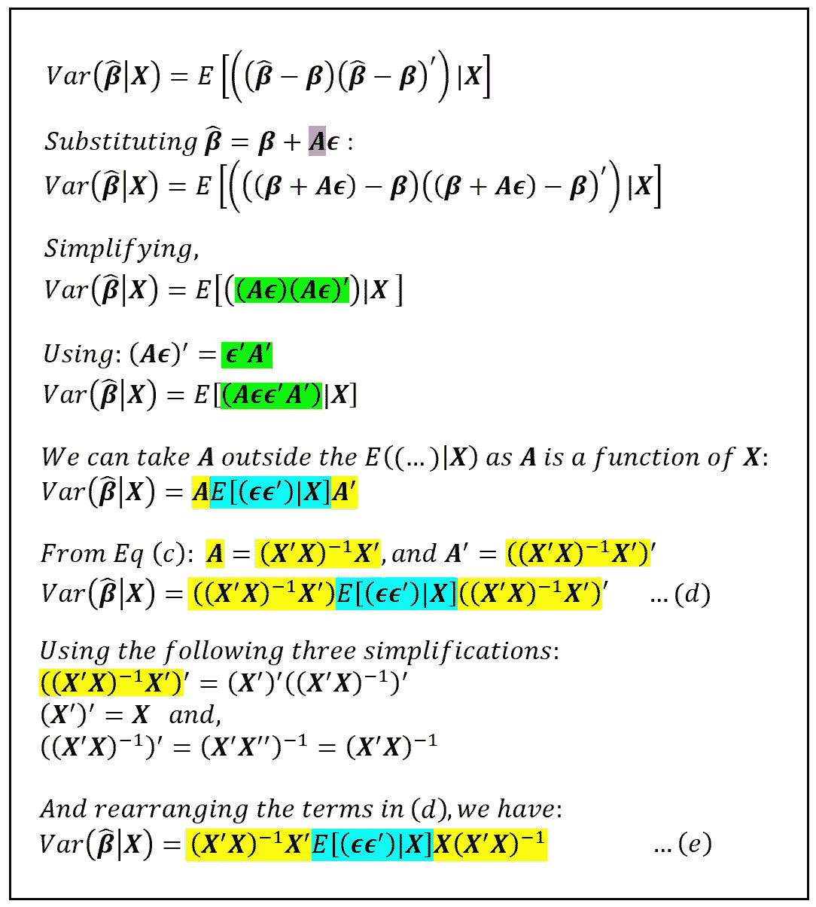****

****拟合回归模型的系数估计方差的推导(图片由作者提供)****

****等式(e)中间的蓝色项是回归模型误差的协方差，取决于 ***X*** 。我们知道误差的协方差矩阵可以表示为*σ****ω***。因此，当模型误差异方差时，用*∑****ω***替换等式(c)中的蓝色期望值，得到估计系数的协方差矩阵的公式:****

****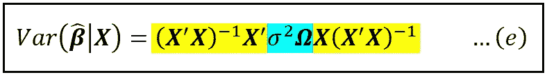****

****模型误差异方差时估计系数协方差矩阵的公式(图片由作者提供)****

****在我下周的文章中，我们将通过 Python 和 Statsmodels 来浏览如何使用 White 的异方差一致性估计的教程。敬请期待！****

# ****参考文献、引文和版权****

## ****报纸****

****怀特，哈尔波特。"异方差一致性协方差矩阵估计和异方差的直接检验."*计量经济学*，第 48 卷，第 4 期，1980 年，第 817–38 页。JSTOR ，[https://doi.org/10.2307/1912934.](https://doi.org/10.2307/1912934.)2022 年 9 月 25 日访问。[PDF 下载链接 ](http://www-2.rotman.utoronto.ca/~kan/3032/pdf/GeneralizedMethodOfMoments/White_Econometrica_1980.pdf)****

****James G MacKinnon，Halbert White，具有改进的有限样本性质的一些异方差一致性协方差矩阵估计量，*计量经济学杂志，第 29 卷，第 3 期，1985 年，第 305-325 页，ISSN 0304-4076*，[https://doi . org/10.1016/0304-4076(85)90158-7。](https://doi.org/10.1016/0304-4076(85)90158-7.)([https://www . science direct . com/science/article/pii/0304407685901587](https://www.sciencedirect.com/science/article/pii/0304407685901587))[**PDF 下载链接**](https://www.econstor.eu/bitstream/10419/189084/1/qed_wp_0537.pdf)****

## ****形象****

****本文中所有图片的版权归 [CC-BY-NC-SA](https://creativecommons.org/licenses/by-nc-sa/4.0/) 所有，除非图片下面提到了不同的来源和版权。****

*****如果你喜欢这篇文章，请关注我的*[***Sachin Date***](https://timeseriesreasoning.medium.com)*获取关于回归、时间序列分析和预测主题的提示、操作方法和编程建议。*****