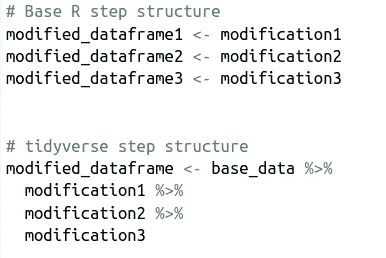
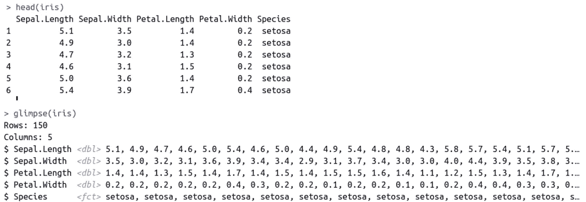
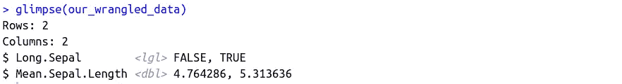
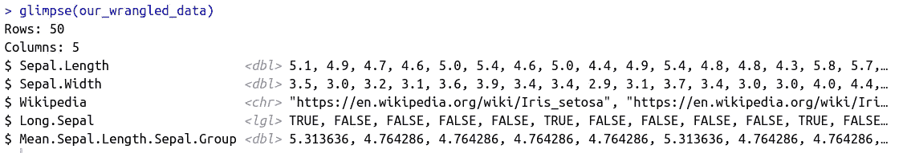

# tidyverse 简介——为数据分析师解决 R

> 原文：<https://towardsdatascience.com/introducing-tidyverse-the-solution-for-data-analysts-struggling-with-r-e48f502f57c5>

## tidyverse 库包提供了一种简单的“类似 SQL 的方式”在 R


r 不需要很难。图片来自 [Pixabay](https://pixabay.com/sv/)

> 我刚刚开始了计算机科学的大学学习，并渴望通过 R 学习数据分析的秘密。在计算了几个月的统计问题的答案后，令我失望的是，我意识到如果不查阅课程 R 手册，我仍然只能编写几行代码。所有的方括号、逗号和美元符号在我的脑海里混为一谈，甚至连过滤数据框中的行这样简单的任务都感觉远非简单明了。
> 
> 我开始认为 R 和我并不兼容，并决定每当我需要分析数据时就求助于 python 和 pandas。

你也很难理解 R 吗？如果是这样，我有好消息告诉你。使用 R 有一种更简单、更直观的方法:tidyverse 库！它不仅仅是另一套工具。这是 r 中完全不同的数据分析方式。

> 我第一次真正接触 tidyverse 是在我开始为现在的雇主工作的时候。他们在 R 中完成了大部分高级分析。当我承认我的 R 技能很差时，我很惊讶地听到我的同事回答说没关系，因为他们反正用 tidyverse！

# 介绍 tidyverse

[tidyverse](https://www.tidyverse.org/) 是一个 R 包集合，是专门为数据分析师和科学家的需求而开发的。该集合包括许多不同类型场景的逻辑，例如，时间智能、数据争论和字符串操作。

软件包中包含的功能设计得尽可能直观易用，并且只需要最少的调整。一个例子是管道，即。**%>%**-符号。管道的功能是将不同的数据争论步骤链接在一起，而不必将每个步骤的结果保存到不同的变量中。这使得代码更加整洁，编写速度更快。看看下面伪代码在逻辑上的区别。



base R 与 tidyverse 中数据争论步骤的链接

另一个例子是常见数据框修改函数的类似 SQL 的命名。要过滤数据框中的行，可以使用 **filter** 函数，要选择特定的列，可以使用 **select** 函数。

另一个很好的例子是**扫视**函数。Glimpse 的主要优点是它可以垂直打印列名。相比之下，**头**——检查数据的基本 R 函数——水平打印它们。使用**glow，**所有的列名将适合打印区域，不管有多少。



Base R 的头部功能 vs tidyverse 的一瞥功能

# 与 tidyverse 的数据争论

了解 tidyverse 好处的最好方法之一是尝试一些基本的数据角力练习；选择一些列，过滤一些行并操作一些值。让我们用内置的 [*虹膜*数据集](https://www.statology.org/iris-dataset-r/)来试试这些东西。

在开始争论之前，下载并加载 tidyverse。这可能需要几分钟时间。

```
install.packages("tidyverse")
library(tidyverse)
```

## 创建新数据:[三表](https://tibble.tidyverse.org/reference/tribble.html)

iris 数据集非常有限，只有关于花的种类和尺寸的信息。让我们通过链接到每个物种的维基百科页面来丰富数据。我们可以通过使用三重函数创建新的数据框来实现这一点。

列名前用 **~** 标记，每列内容用逗号分隔。

```
iris_wikipedia <- tribble(
  ~ Species,
  ~ Wikipedia,
  'setosa',
  '[https://en.wikipedia.org/wiki/Iris_setosa'](https://en.wikipedia.org/wiki/Iris_setosa'),
  'versicolor',
  '[https://en.wikipedia.org/wiki/Iris_versicolor'](https://en.wikipedia.org/wiki/Iris_versicolor'),
  'virginica',
  '[https://en.wikipedia.org/wiki/Iris_virginica'](https://en.wikipedia.org/wiki/Iris_virginica')
)
```

## 结合其他数据:[加入](https://dplyr.tidyverse.org/reference/mutate-joins.html)

现在，当我们有了维基百科的数据，我们可以用一个连接把它和虹膜数据集结合起来。tidyverse 提供了几种类型的连接，但是我们选择左连接。*物种*列将作为连接中的一个键，我们必须确保两个数据集中的数据类型相同。在 *iris* 数据集中，数据类型是 factor，而在 *iris_wikipedia 中是 character。*

让我们用 mutate 函数改变后者的数据类型(下面将进一步介绍这个函数)。

```
iris_wikipedia <- tribble(
  ~ Species,
  ~ Wikipedia,
  'setosa',
  '[https://en.wikipedia.org/wiki/Iris_setosa'](https://en.wikipedia.org/wiki/Iris_setosa'),
  'versicolor',
  '[https://en.wikipedia.org/wiki/Iris_versicolor'](https://en.wikipedia.org/wiki/Iris_versicolor'),
  'virginica',
  '[https://en.wikipedia.org/wiki/Iris_virginica'](https://en.wikipedia.org/wiki/Iris_virginica')
) **%>%
  mutate(Species = as.factor(Species))**
```

在定义了原始的*虹膜数据集*作为我们的起点之后，我们取它，并借助 tidyverse 的管道函数将其发送给 left_join 函数。**如果数据集包含具有相同名称和数据类型的列，只需将新数据集的名称提供给 left_join** 。如果列名不同，则通过参数`by = [c](https://rdrr.io/r/base/c.html)("column_name_in_base_dataset" = "column_name_in_new_dataset")`将键作为分配给**的向量提供**

```
our_wrangled_data <- iris %>%
  left_join(iris_wikipedia) 
```

## 过滤行:[过滤](https://dplyr.tidyverse.org/reference/filter.html)

假设我们只想在分析中包括“圣淘沙”这个物种。我们通过将上一步的输出通过管道传输到**过滤器**函数来实现。注意，这里使用了两个等号。不等于被定义为！=.

```
our_wrangled_data <- iris %>%
  left_join(iris_wikipedia) **%>% 
  filter(Species == "setosa")**
```

## 选择列:[选择](https://dplyr.tidyverse.org/reference/select.html)

我们只对 sepal 和维基百科相关的数据感兴趣，因此只选择那些栏目。select 函数既可以用来选择我们想要的列，也可以用来选择我们不想要的列。在后一种情况下，我们只需在列名前添加一个减号:select(-unwanted_column_name)。

```
our_wrangled_data <- iris %>%
  left_join(iris_wikipedia) %>% 
  filter(Species == "setosa") **%>%
  select(Sepal.Length, Sepal.Width, Wikipedia)**
```

## 创建新列或修改现有列: [mutate](https://dplyr.tidyverse.org/reference/mutate.html)

函数 mutate 既可以用于**更改现有列**的内容，也可以用于**创建具有指定逻辑的新列。**

在本例中，我们创建了新的列 *Long。Sepal* 如果行的 *Sepal，则获得布尔值 true。长度*比所有刚毛萼片长度的平均值长。如果我们将新列命名为*萼片。长度*，它会覆盖现有的*萼片。长度*列。这是我们在加入之前对 *iris_wikipedia* 的*物种*栏目所做的。

```
our_wrangled_data <- iris %>%
  left_join(iris_wikipedia) %>% 
  filter(Species == "setosa") %>%
  select(Sepal.Length, Sepal.Width, Wikipedia) **%>%
  mutate(Long.Sepal = if_else(Sepal.Length > mean(Sepal.Length),
                              TRUE,
                              FALSE))**
```

## 按具体栏目分组: [group_by](https://dplyr.tidyverse.org/reference/group_by.html) & [总结](https://dplyr.tidyverse.org/reference/summarise.html)

在 tidyverse 中，group_by 既可用于创建一个**汇总数据帧**(SQL 中的 group by)，也可用于创建一个**汇总列**，同时保留原始数据帧(SQL 中的[窗口函数](/a-guide-to-advanced-sql-window-functions-f63f2642cbf9))。在前一种情况下，group_by 与 summarise 一起使用。在后一种情况下，它通常与 mutate 和 ungroup 一起使用，后者会移除 group_by 环境，因此可能的后续函数会应用于整个数据框，而不仅仅是分组的数据。

两个版本都试试吧。我们从基本分组开始，以便概括平均信息*萼片。长度*为基于其*长度的观察值。萼片*状态。

```
our_wrangled_data <- iris %>%
  left_join(iris_wikipedia) %>% 
  filter(Species == "setosa") %>%
  select(Sepal.Length, Sepal.Width, Wikipedia) %>%
  mutate(Long.Sepal = if_else(Sepal.Length > mean(Sepal.Length),
                              TRUE,
                              FALSE)) **%>%**
  **group_by(Long.Sepal) %>%
  summarise(Mean.Sepal.Length = mean(Sepal.Length))**
```

我们得到以下输出:



将我们的数据框分组后输出

为了获得相同的聚合平均值信息，但保留数据帧结构，在使用 group_by 函数后，我们使用 mutate 【T0，】创建一个新列。这创建了与 summarise 函数相同的方法，但是行数保持不变。

由于这是最后一步，所以不需要取消**和**的组合。然而，为了防止我们以后添加更多的转换步骤，现在就把它包含进来是个好主意，这样以后就不会忘记了。

```
our_wrangled_data <- iris %>%
  left_join(iris_wikipedia) %>% 
  filter(Species == "setosa") %>%
  select(Sepal.Length, Sepal.Width, Wikipedia) %>%
  mutate(Long.Sepal = if_else(Sepal.Length > mean(Sepal.Length),
                              TRUE,
                              FALSE)) **%>%
  group_by(Long.Sepal) %>%
  mutate(Mean.Sepal.Length.Sepal.Group = mean(Sepal.Length)) %>% 
  ungroup()**
```

输出如下所示:



创建分组列后的输出

# 结论

在这些和相关函数的帮助下，我估计我完成了 70 %的数据争论。缺少的一个主要东西是数据导入。我主要使用的是[雪花](https://community.snowflake.com/s/article/How-To-Connect-Snowflake-with-R-RStudio-using-RODBC-driver-on-Windows-MacOS-Linux)和 [Azure 存储](https://cran.r-project.org/web/packages/AzureStor/vignettes/intro.html)连接器，但是对于大多数广泛使用的数据存储解决方案来说，R 连接器是存在的。