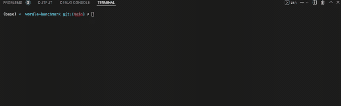

# Wordle 基准测试简介

> 原文：<https://towardsdatascience.com/introducing-wordle-benchmark-423f4f6d38a3>

## 一个用于评估人工智能/人工智能代理的 Python 框架

你喜欢沃尔多吗？我喜欢沃尔多。我想看看我是否能教我的电脑玩一个像样的游戏，但我找不到一个给我的解决方案评分的好方法。

我组装了一个 Python 包来玩 Wordle 游戏，并为 Wordle“代理人”跟踪游戏统计数据:为玩 Wordle 而编写的 Python 软件。

基本 Wordle 游戏演示

# 入门指南

让我们浏览一下安装 wordle-benchmark 的步骤。

## 来自皮普

最简单的选择是 pip 安装。

## 来自 git

如果您想安装一个尚未在 PyPi 中反映的版本，您可以使用 pip 直接从 repo 安装。

## 从本地克隆

如果你想贡献源代码，你需要在本地安装。

为了调用脚本，需求文件中反映了一些额外的依赖关系。

# 样本使用

想自己写个 Wordle 代理看看能玩的多好？让我们探索一下与 wordle-benchmark 包交互的基本逻辑。我将详细介绍这个[脚本](https://github.com/peterbbryan/wordle-benchmark/blob/main/scripts/sample_agent_definition.py)的步骤。

一个“代理人”玩一个“游戏”并提交“猜词”来猜测“目标词”。“字典”存储所有有效的“猜测词”或“目标词”。您可以使用“目标词”列表运行多个“游戏”,并使用“基准测试”获得汇总统计数据

代理只需要实现一个抽象签名“play”

它以一个游戏作为论据，这个游戏包括你需要的所有信息，比如你已经猜了多少次，你匹配了哪些黑/黄/绿字母，字典中哪些单词仍然是可能的，等等。

为了演示这个实现，让我们以一个基本代理为例，它总是在第一轮预测“crane ”,并在随后的每一轮中猜测仍然可能出现的最常见的单词。

现在，我们可以根据单词列表对其进行评估，以计算其表现如何的统计数据。

现在我们来评价一下！

这个代理只是一个简单的例子！我等不及要看你做的特工了！

# 结论

Wordle-benchmark 提供了一个简单的界面来试验 Wordle 的 AI/ML 解决方案。这是一个相对简单的游戏，是一个很好的学习练习。试试看，让我知道你想到了什么！

如果你发现任何错误，让我知道！请随意投稿。留言或评论，如果你想出了有趣的 Wordle 代理！