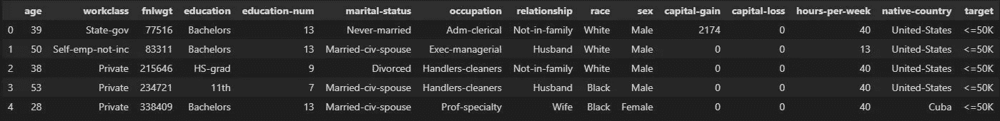
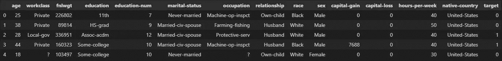
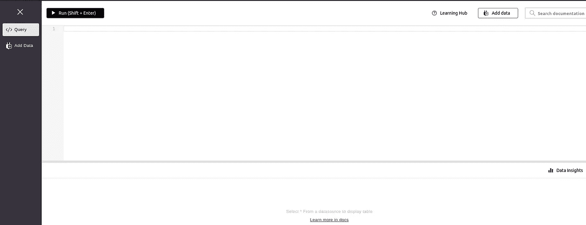
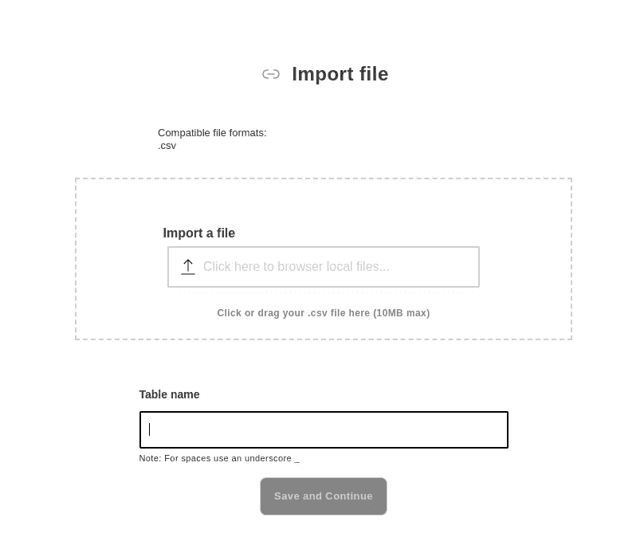
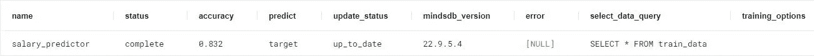
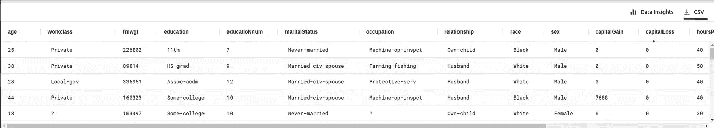
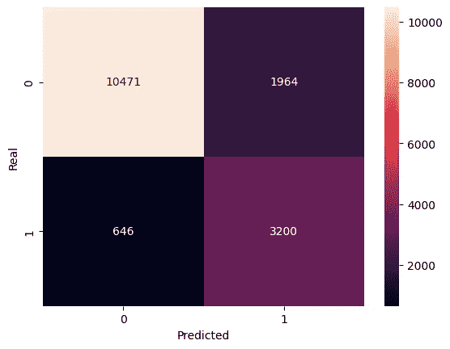

# 人工智能表简介

> 原文：<https://towardsdatascience.com/introduction-to-ai-tables-a719251e1a58>

## 使用 MindsDB 将 ML 集成到数据库中


在 [Unsplash](http://unsplash.com/) 上由 [Hitesh Choudhary](https://unsplash.com/@hiteshchoudhary) 拍摄的照片

在这篇文章中，我们将涉及人工智能表的主题。如今，机器学习是一个很好的工具。我们可以将它应用于许多不同的任务，从图像识别到自然语言处理。

然而，ML 模型在现实世界中最重要的一个用例是对我们已经存储在数据库中的表格数据进行预测。那么，如果我们可以直接将这个模型应用到桌子上呢？这就是人工智能桌子。

# 人工智能表

人工智能表将机器学习模型直接集成为数据库中的虚拟表。这允许我们创建可以用 SQL 语句查询的预测器。

通过这样做，我们简化了很多 ML 生命周期，因为许多操作都是在数据库内部完成的，我们不需要在数据库之外的地方处理数据。

但是，为了更好地理解它们是如何工作的，在本文中，我们将制作一个完整的示例，说明如何使用直接在数据库中训练的模型来创建、训练和预测。

为此，我们将使用一个名为 [MindsDB](https://mindsdb.com/) 的工具。MindsDB 是一个数据库内的 ML 工具，它帮助我们扩展 SQL 语言，以便可以创建、查询和维护 ML 模型，就像它们是数据库表一样。让我们看看它的实际效果。

# 示例:人口普查收入预测

本例中使用的所有代码都可以在这个[库](https://github.com/Psancs05/Medium/tree/master/AITables)中找到。

## 数据

对于这个例子，我们将使用“人口普查收入”数据集。目标是根据人口普查数据预测一个人的收入是否超过 5 万美元/年。数据集可以在这个[链接](https://archive.ics.uci.edu/ml/datasets/Adult)中找到，从 [UCI ML 库](https://archive.ics.uci.edu/ml/index.php)中提取。

下载的文件包含 3 个文件:

*   成人数据:包含 32561 条用于训练的人口普查数据记录的文件。
*   成人测试:包含 16281 条测试用人口普查数据记录的文件。
*   成人名称:包含数据集描述、信息、许可证等的文件。

数据上的每条记录由 14 列组成，在这里我们可以找到诸如*年龄*、*工作类别*、*教育程度*等属性。最后一列对应于*目标*列，年薪是否超过 50K 美元。

## 数据预处理

我们将对数据进行一些预处理，使整个过程更容易理解。首先，让我们看看使用 *pandas* 库的原始数据集。

```
Shape: (32561, 15)
```



df 的前 5 行，按作者

每列的名称列表可以在 *aduls.name* 文件中找到，同时还有数据集的其他信息。

正如我们所见，我们有一个普通的*熊猫*数据框架，其中有一些分类数据和一些数字数据。我们可以处理分类数据、标准化值、清理数据集等。但是这个模型将按原样处理数据，并且因为这篇文章的目的是解释 *AI 表*的概念，我们现在将数据留下。

我们要更改的唯一一列是最后一列。我们将用值' *< =50K* '和' *< 50K* '分别代替 0 和 1，只是为了让问题看起来像一个正常的分类问题。

这是我们需要在数据集中做的所有预处理。现在我们可以将数据帧导出到一个 *csv* 文件中。我们很快就会需要它。

该文件名为' *data.csv'* ，我们不会在新文件中保留索引列。

对于测试集，我们将做同样的事情。我们将保留最后一列，因为在进行预测时，我们将使用预测值创建一个全新的列。然后，我们将使用该列和“目标”列来获取关于模型性能的指标。

```
Shape: (16281, 15)
```



测试数据的前 5 行，按作者

在这种情况下，当加载 *dataframe* 时，我们需要使用*skip prows*属性，因为测试集的第一行本身不是记录。

现在我们也可以将*数据帧*保存在一个 csv 文件中。我们将它命名为' *test.csv'* 。

# MindsDB

是时候拿出人工智能表，创建我们的预测模型了。在本文中，我们将使用 MindsDB cloud，但是您可以将它安装在您的系统上。你可以在他们的文档中找到所有的信息。

首先，我们需要一个帐户并登录到云中。



[MindsDB 云](http://cloud.mindsdb.com)

我们将有一个编辑器来进行普通的 SQL 查询。现在我们必须导入我们在最后一步中生成的数据。为此，请转到“添加数据”页面，选择“文件”选项卡，然后转到“导入文件”。



导入文件页面

这里我们要导入之前生成的两个 csv 文件( *data.csv* 和 *test.csv* )。我们将把它们分别命名为“训练数据”和“测试测试”。

导入文件后，我们可以通过在编辑器中运行以下查询来检查它们是否被正确上传。

```
Tables_in_files
-------------------
test_data
train_data
```

我们可以看到两个表现在都在云中。从现在开始，我们将使用 SQL 查询来与数据交互。例如，我们可以使用以下 SQL 命令检查训练数据的前 10 条记录。

## 创建预测器

现在我们已经加载了数据，是时候创建一个预测器了。我们将使用' *create predictor* 语句。

*   *salary_predictor* 是预测者的名字。
*   *文件*是上传文件的默认表名。
*   *目标*是我们要预测的列的名称。

这个查询将为我们的数据创建一个预测器。现在必须根据数据训练预测器。我们可以用下面的查询来检查它的状态。

我们创建的所有预测值都将存储在 *mindsdb.predictors* 表中。

查询的输出如下所示。


我们可以注意到它正处于训练阶段，还有关于预测器的其他数据。

完成培训过程大约需要 5-10 分钟。完成后，我们可以再次运行前面的查询来查看结果。



我们现在可以看到，状态为'*完成*，精度为 0.832。这意味着我们的预测器在训练数据中有大约 83%的准确性。

就是这样！我们已经使用 SQL 查询直接在表中训练了一个模型。现在我们可以用测试数据测试预测器。

## 做预测

MindsDB 给了我们两种可能的预测方法。第一个是运行一个 SQL 查询，查询参数中有一个新记录。如果我们想要预测准时的新数据，这是完美的。

另一种方法是对我们数据库中的大量数据进行批量预测。这是我们的场景，因为我们有一个包含新记录的完整文件( *test_data* ),一个接一个地进行会花费很长时间。

我们可以使用以下查询对一组数据进行预测。

通过 *SELECT* 语句，我们将使用数据中所有可用的记录字段。然后，我们将使用*JOIN*语句，使用我们刚刚训练的模型进行预测。最后，我们将使用预测生成一个名为' *predicted_salary* '的新列。

如果我们运行该查询，它将输出一个新的 dataframe，其中包含一个额外的预测列。让我们用 python 来评估这个模型。在输出上方的右侧，有一个将结果导出到一个*中的按钮。csv* 文件。我在图中用绿色标出了它。



点击它，它将下载查询的结果。我将把文件名改为' *predictions.csv* '，这样下面的代码将使用这个名称。现在让我们用*熊猫*来检验模型的性能。记住，基于训练过程，预测器的准确度大约是 83%。

我们将使用 *seaborn* 来可视化结果，使用 *confusion_matrix* 来生成模型的指标。

```
(16281, 16)
```

现在我们打开文件，检查输出形状有 16 列，比原来的*数据帧*多了一列。请记住，这是因为该数据有一个额外的列用于预测标签。

让我们使用我们感兴趣的列，并计算混淆矩阵。

现在，我们有了数组格式的指标，让我们为它们创建一个可视化。



作者对混淆模型的度量

我们还可以看看指标。

```
Precision: 0.8420587052673905
Recall: 0.9418907978771252
F1: 0.8891813858695653
```

正如我们所观察到的，测试集中的精度约为 84%，非常接近预测指标给出的精度。

记住所有的代码都在这个[库](https://github.com/Psancs05/Medium/tree/master/AITables)里。

## 结论

所以本教程到此为止。我们已经看到什么是人工智能表，我们运行一个例子来看看它是如何工作的。但这并不是这个工具能做出的所有可能性。我在这里链接了 MindsDB 的官方文档，所以你可以看看所有其他的可能性。

我建议你用你的数据集试试这个，或者尝试做一个新的实验。此外，您可以创建回归模型，而不是分类模型。我留给你们的另一个想法是提高这个模型的性能。您可以尝试清理和处理训练数据，并检查预测器是否改善了其度量。这可能是一个有趣的挑战！

我希望你发现这个教程是有用的。如果你有任何进一步的问题，随时留下评论。下次见！👋🏻​​