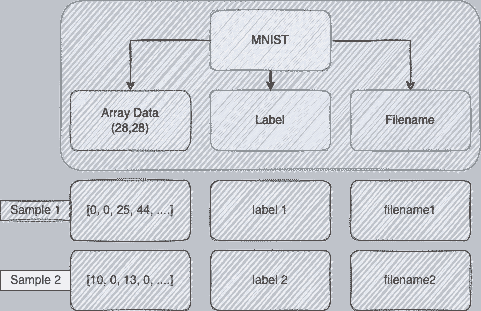

# 数据版本控制简介

> 原文：<https://towardsdatascience.com/introduction-to-data-version-control-5c4a83276b9>

## PYTHON |数据|编程

# 数据版本控制简介

## 使用 Hangar 在 Python 中实现自己的 DVC 的分步指南


雅罗斯拉夫·穆齐琴科在 [Unsplash](https://unsplash.com?utm_source=medium&utm_medium=referral) 上拍摄的照片

# 什么是数据版本控制(DVC)？

任何生产级系统都需要某种版本控制。当前真相的唯一来源。任何持续更新的资源，尤其是由多个用户同时更新的资源，都需要某种审计线索来跟踪所有的更改。

在软件工程中，对此的解决方案是 [Git](https://git-scm.com/) 。如果你在生活中写过代码，那么你可能对 Git 的美妙之处很熟悉。Git 允许我们提交变更，从一个源创建不同的分支，并将我们的分支合并回原始分支，等等。

除了数据集，DVC 完全是同样的范例。看，当不同的用户在相同的数据集上进行不同的实验时，实时数据系统不断地接收更新的数据点。这就导致了同一个数据集的多个版本，绝对不是单一的真实来源。

此外，在机器学习环境中，我们还会在同一数据集的不同版本上训练同一“模型”的多个版本(例如，模型重新训练以包括较新的数据点)。如果没有适当的审核和版本控制，这将会创建一个数据集和实验的复杂网络。我们绝对不希望这样！

因此，DVC 是一个通过记录特定数据集的变化来跟踪数据集的系统。有多种免费和付费的 DVC 解决方案。我最近发现了[机库](https://github.com/tensorwerk/hangar-py)，一个完全开源的 Python DVC 包。让我们看看它能做什么，好吗？

# 使用机库

hangar 包是一个纯 Python 实现，可以通过 pip 获得。它的核心功能也与 git 紧密相关，这对学习曲线有很大帮助。我们也可以选择通过命令行或使用其专用的 Python 客户端与 hangar 交互。

一些可用的功能包括:

*   ***检出*** *—切换到新的分支或参考点*
*   ***提交*** *—将当前变更添加到当前分支*
*   ***分支*** *—创建一个指向特定提交的引用点*
*   ***合并****——合并一个分支到另一个分支的变更*
*   ***diff*** *—比较两个分支之间的变化*
*   ***推送*** *—上传本地版本到远程仓库*
*   ***拉/取*** *—从远程存储库更新数据集的本地版本*
*   ***日志*** *—显示提交历史*

> 注意:远程存储库是当前事实的唯一来源。

这里要注意的积极的一点是，Hangar 不是构建在 git 之上的，而是模拟了 git 的功能。这使得它更快。

我们可以使用以下方式通过 pip 安装 hangar:

```
pip install hangar
```

安装好 Hangar 之后，我们就可以直接把包导入 Python 了。

我们需要做的第一件事就是创建一个数据仓库。我们可以从 Hangar 包中导入 Repository 类，并用它来定义我们的存储库。

如果这是我们第一次使用一个特定的存储库，我们还必须使用`init()`函数初始化它。

在我们继续我们的数据版本化例子之前，让我们首先讨论 Hangar 背后的方法论。

# 接近机库

Hangar 背后的主要学习曲线是理解与软件包交互的最佳方式。机库包括四个主要部分:

## 仓库

我们可以将存储库视为我们的项目仓库。存储库本质上是所执行的提交的集合和历史。

理想情况下，每个项目都有自己的存储库。例如，如果我们有两个主要任务—预测手写数字和预测欺诈—我们也分别创建两个存储库。

## 数据集

这个很简单。数据集就是，你猜对了，我们的数据集。但是数据集到底是什么呢？我们拿泰坦尼克号数据集来类比一下。数据集由什么组成？

是个别样品吗？是被监控的变量吗？这就是我们可以发挥创造力的地方。Hangar 将数据集描述为列的集合。我们接下来会讨论这个问题。

## 专栏

该列可以是我们喜欢的任何数据属性或特性。它可以是要素数组、标签数组、要素名称数组，甚至是唯一标识符数组。但是，列数组中的每一项都应该对应于数据集中的一个样本。目前，支持的列类型有:

*   添加字节列—字节
*   add_ndarray_column —数组
*   add_str_column —字符串

例如，如果我们有一个 28x28 图像的数据集，我们将选择一个数组列(每个样本的形状都是 28x28)来表示实际的数字数据。我们可以用字节或字符串列来存储它的标签，用字符串列来存储图像文件名。



作者图片

当然，以上只是如何构建数据集的指南。你正在处理的数据类型，以及要做的实验类型，都会影响到机库的构建策略。例如，也可以选择一个专用的列用于训练数据，另一个用于验证数据。

列应该是数据样本的集合。我们从一个空集合开始，随着样本的增加，集合索引增加。

## 数据

最后是数据。一旦我们确定了哪些列，相应地处理数据就变成了一个相对简单的任务。数据本身只是数字。它没有任何直接意义，也没有任何结构。

这样一来，让我们继续我们例子的其余部分。

假设我们有一个表格分类数据集— `df` —我们将简单地将整个数据集以字节的形式存储在一列中。

我们首先创建一个 WriterCheckout。WriterCheckout 对象允许我们启用一个特定的分支(在我们的例子中，我们只有一个分支:主分支)的写访问权限(也就是说，能够向活动分支写入和提交更改)。我们使用`master = repo.checkout(write=True)`来实现这一点。

然后，我们可以通过调用`add_bytes_column`命令 Hangar 创建一个名为“*数据*的字节列。因为这是我们第一次提交，所以我们的列仍然是空的。对于第一次提交，我们可以在索引 0 处提交数据。因为我们将列指定为 bytes 对象，所以我们必须首先将数据转换为 bytes 对象。我们最终可以调用`commit`函数来提交并保存我们的更改。下面，我们展示一个我们刚刚讨论过的代码示例。

> 注意:为了避免冲突，Hangar 不允许一个以上的 WriterCheckouts 循环使用。因此，当不使用 WriterCheckout 时，一定要关闭它。如果一个写锁已经在循环中，我们只能以只读模式签出。

如果我们想在同一个列中添加另一个提交，我们遵循相同的过程，但是改为提交到`master['data'][1]`，对于将来的提交以此类推。每个提交还将绑定一个散列键。

## 机库中的分支

当我们想要在特定点获得数据的副本以在其上运行定制实验而不实际改变它时，分支变得特别有用。我们可以分支，在我们确认我们的处理是正确的之后，我们也有能力合并回主流。典型的分支流程如下所示:

```
Create Branch -> Checkout Branch -> Make Changes -> Commit -> Merge
```

我们可以使用`repo.create_branch(name='test')`创建分支，合并如下:

```
master.merge(message='message for merge', dev_branch='test')
```

Hangar 中的每个提交都有一个哈希键。我们可以使用该散列来精确定位分支点:

```
test_branch2 = repo.create_branch(name='test2', base_commit=<SOME_HASH_KEY>)
```

通过调用`repo.log()`，我们可以获得当前分支及其最新提交的日志摘要。日志示例如下所示:

```
* a=cf94cf8b4c5758c885c6b84d58c4fbe22f379510 (test2): added new test branch
* a=a8fe61916764b873f13c80a14ce4fda610b74df9 (test) (master): Base Dataset
```

我们可以得到分支之间的差异和冲突如下:

`repo.diff('master', 'test2')`

# 结束语

在这篇文章中，我们介绍了作为 Python 中 DVC 开源解决方案的机库包。这就是机库提供的所有东西吗？肯定不是！我们介绍了基础知识，并发现了如何开始使用 Hangar。和往常一样，我强烈建议你仔细阅读他们的[文档](https://hangar-py.readthedocs.io/en/stable/readme.html)，并使用你自己的用例进行实践。

你喜欢这篇文章吗？如果是的话，也许你可以考虑成为会员来支持我和你其他喜欢的作家。

<https://david-farrugia.medium.com/membership>  

**想给我买杯咖啡吗？**

<https://paypal.me/itsdavidfarrugia?country.x=MT&locale.x=en_US>  

# 想联系吗？

我很想听听你对这个话题的想法，或者其他什么。如果你想联系我，请给我发电子邮件至 davidfarrugia53@gmail.com*。*

*Linkedin — [Twitter](https://twitter.com/davidfarrugia53)*