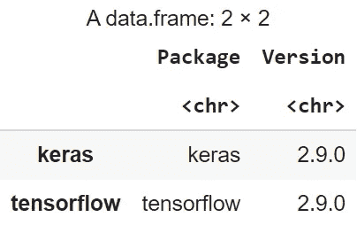
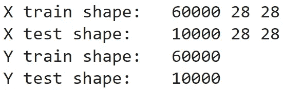
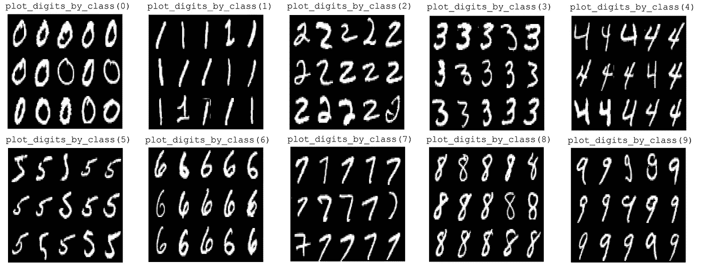
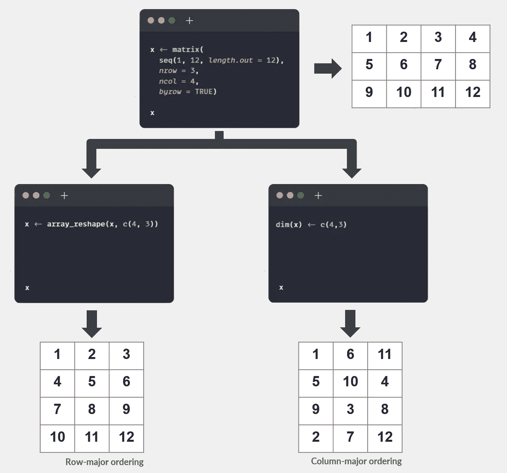
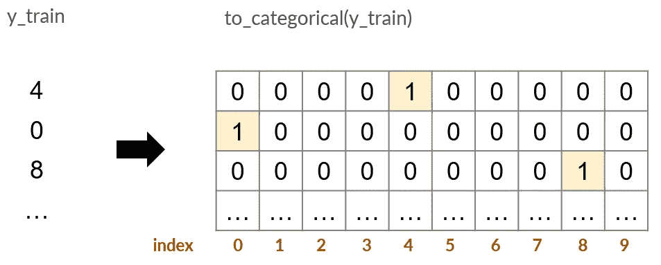
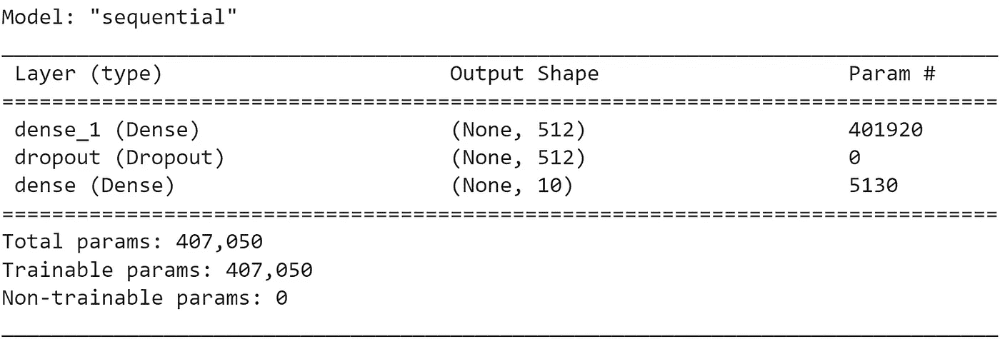
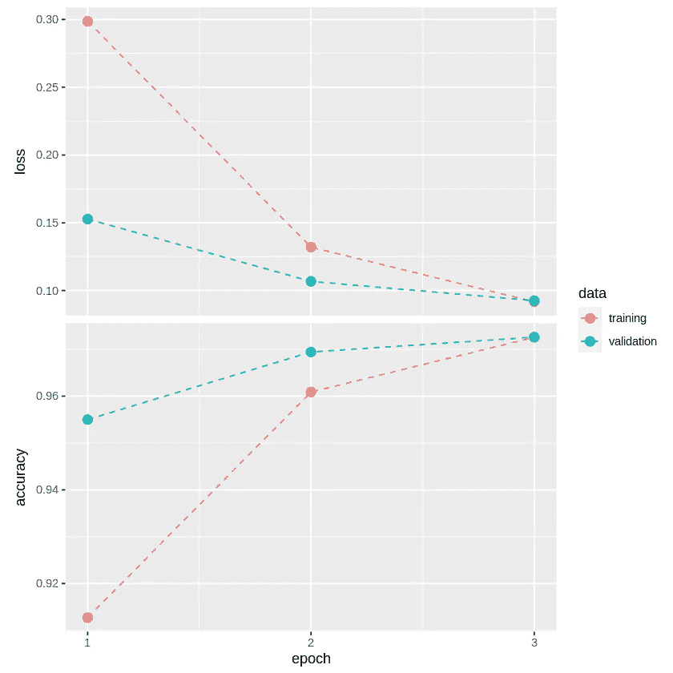
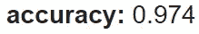
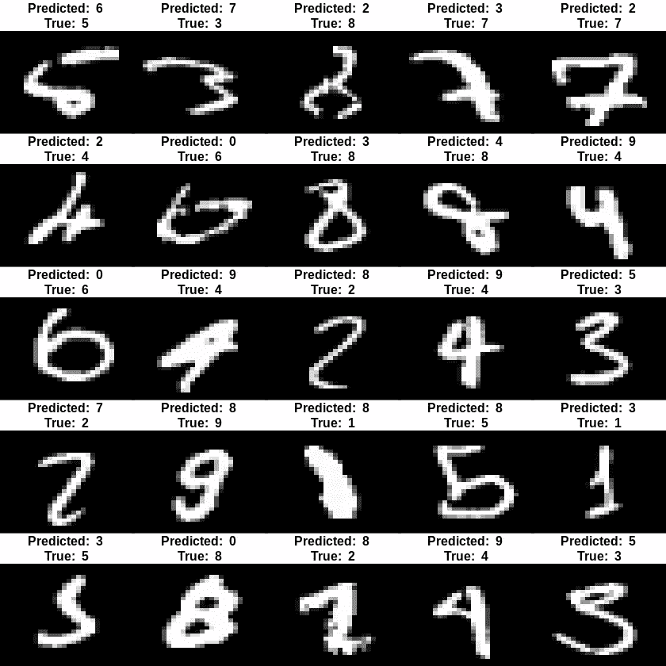

# 用 R 中的 Keras 介绍深度学习

> 原文：<https://towardsdatascience.com/introduction-to-deep-learning-with-keras-in-r-81bafd903a7a>

## 循序渐进的教程


从意大利特伦蒂诺-上阿迪杰的圣维吉尔里奥山看出去。图片作者。

# 目录

1.  [简介](#88a1)
2.  [环境设置](#f8ca)
3.  [数据集](#f750)
4.  [预处理](#369a)
5.  [构建神经网络](#5988)
    5.1 [定义图层](#39a7)
    5.2 [编译](#ccbb)
    5.3 [拟合](#338a)
6.  [测试设备性能](#c794)
7.  [结论](#a2b4)
8.  [参考文献](#a62a)

# 1.介绍

对于数据科学来说，R 和 Python 都是有用和流行的工具。然而，当涉及到深度学习时，最常见的是找到 Python 的教程和指南，而不是 r。

这篇文章提供了一个简单的 R 语言深度学习的例子。它的目的是分享一个实用的介绍给 R 从业者，使用 Keras。

# 2.环境设置

在这个例子中，我们分享了可以很容易地复制并粘贴到 Google Colab 上的代码片段。

Colab 允许任何人通过浏览器用 Python 或 R 编写代码来创建笔记本，完全免费。

我们可以通过这个链接在 Colab 中创建新的 R 笔记本。从那里，我们安装 Keras 如下:

```
install.packages("keras")
```

尽管为了简单起见，我们使用了 Colab，但是本地安装过程也同样简单。我们现在可以导入所需的库:

```
library(tidyverse)
library(keras)
```

*注* : `install.packages("keras")`也安装 TensorFlow。可以从已安装的软件包列表中查看 Keras 和 TensorFlow 的可用版本:



图片作者。

# 3.资料组

我们的目的是对手写数字图像进行分类。对于这个例子，我们使用了机器学习社区的经典 MNIST⁴数据集。

数据集具有以下特征:

*   60，000 幅训练图像和 10，000 幅测试图像。
*   尺寸为 28 x 28 像素的图像。
*   10 个类别(数字从 0 到 9)。
*   灰度图像:像素值介于 0(黑色)和 255(白色)之间。

神经网络需要**张量**形式的数据。张量是具有任意维数(D)的代数对象。例如，我们可以把向量看作 1D 张量，把矩阵看作 2D 张量。

在图像的情况下，我们需要一个向量空间来表达:

*   图像数量(N)
*   图像高度(H)
*   图像宽度(W)
*   颜色通道(C)，也称为颜色深度。

因此，在深度学习任务中，图像通常被表示为具有形状的 4D 张量:N x H x W x C

在灰度图像的情况下，每个样本的颜色通道是一个单一的数字(从 0 到 255)。因此，可以省略通道轴或使其等于 1。

让我们从 Keras(在 Apache 2.0 License⁵下)导入 MNIST 数据集，并验证训练和测试图像的形状:



作为 3D 张量的训练和测试图像(X)。颜色通道轴被省略(灰度)。图片作者。

将输入观测值表示为张量适用于任何数据类型。例如，具有 300 行(样本)和 8 列(特征)的 csv 文件形式的表格数据可以被视为形状为 300 x 8 的 2D 张量。

我们可以通过相应的标签来看一些样品:



对每个类别 x(从 0 到 9)调用 plot_digits_by_class(x)得到的手写数字样本。

# 4.预处理

由于颜色值在[0，255]区间内，我们可以**将它们缩放到[0，1]区间内。此外，我们可以通过**将**图像从 2D 28 x 28 展平到 1D 784(28 x 28)来重塑输入，而不会丢失信息:**

*注意* : Keras(和其他公共库一样)希望通过在**行主排序**(来自 C 语言)中填充新轴来重塑数组。这就是`array_reshape()`的行为**。** R 修炼者可能更熟悉`dim<-()` 处理矩阵形状。尽管如此，`dim<-()`在**列中填充新轴-主要排序**(来自 Fortran 语言):



array _ shape vs dim

The labels must be converted from a vector with integers (each integer representing a category) into a matrix with binary values and columns equal to the number of categories:



Image by author.

# 5\. Building the neural network

## 5.1 Define the layers

The cornerstone of a neural network is the *图层。*我们可以将该层想象成一个模块，它提取对最终目标有用的输入数据的表示。

我们可以通过顺序堆叠层来构建神经网络。Keras 允许通过利用`keras_model_sequential`来做到这一点。在本例中，我们创建了一个由三层组成的网络:

*   产生 512 个单位的输出空间的完全连接(或密集)层。
*   一个辍学层要在训练期间"*随机地退出*20%的神经元。简而言之，该技术旨在提高模型的泛化能力。
*   一个输出 10 个单位的最终密集层和一个 *softmax* 激活功能。该层返回每个类别的概率分数数组，每个分数是当前图像表示 0、1、2…直到 9:

我们可以按如下方式检查模型的结构:

```
model %>%
  summary()
```



图片作者。

## 5.2 编译

在编译步骤中，我们需要定义:

*   *损失函数* :
    -损失函数必须提供模型误差的合理估计。
    -网络试图在训练期间最小化该功能。
*   *优化器* :
    -它指定模型的权重在训练期间如何更新。
    -它利用了损失函数的梯度。
*   *指标* :
    -在训练过程中要监控的一组指标。

## 5.3 合身

拟合模型意味着在训练期间找到一组最小化损失函数的参数。

输入数据不会作为一个整体进行处理。该模型批量迭代训练数据，每个数据的大小为`batch_size`。对所有训练数据的迭代被称为`epoch`。在拟合模型时，我们必须声明历元数。在每个时期之后，网络更新其权重以最小化损失。



培训过程中的指标。图片作者。

# 6.测试集性能

在训练一个估计器之后，评估它在样本外数据上的表现是一个好的实践。我们可以在测试集上测量准确度(正确分类的手写数字的比例):



图片作者。

让我们看看一些分类错误的数字:



分类错误的数字。图片作者。

# 7.结论

在这篇文章中，我们在 Keras 中创建了一个简单的神经网络，同时分享了对深度学习概念的介绍。特别是，我们使用了 R 语言，它通常不像 Python 那样在深度学习教程或指南中常见。

值得注意的是，两个最流行的深度学习框架 Torch 和 TensorFlow 也支持 R。

您可以在此找到更多信息和示例:

*   ⁶的张量流
*   ⁷的火炬
*   Francois Chollet，J.J. Allaire，“深度学习与 R ”，曼宁，2018⁸.

# 8.参考

[1]https://colab.research.google.com

[2][https://colab.research.google.com/notebook#create=true&语言=r](https://colab.research.google.com/notebook#create=true&language=r)

[https://tensorflow.rstudio.com/install/](https://tensorflow.rstudio.com/install/)

[https://en.wikipedia.org/wiki/MNIST_database](https://en.wikipedia.org/wiki/MNIST_database)

[5][https://github.com/keras-team/keras/blob/master/LICENSE](https://github.com/keras-team/keras/blob/master/LICENSE)

[6]https://tensorflow.rstudio.com/

[7]https://torch.mlverse.org/

[https://www.manning.com/books/deep-learning-with-r](https://www.manning.com/books/deep-learning-with-r)