# 嵌入、聚类和相似性介绍

> 原文：<https://towardsdatascience.com/introduction-to-embedding-clustering-and-similarity-11dd80b00061>

## [对潜在空间的广泛介绍](https://towardsdatascience.com/tagged/image-autoencoder)

## 近距离观察 ML 和潜在空间的关键元素

照片由[贾维尔·阿莱格·巴罗斯](https://unsplash.com/@soymeraki?utm_source=medium&utm_medium=referral)在 [Unsplash](https://unsplash.com?utm_source=medium&utm_medium=referral) 上拍摄

在这篇文章中，我们将对嵌入、相似性和聚类做一个总体介绍，这些是大多数 ML 的基础，也是理解潜在空间的关键。在计算机中将现实世界表示为数据的过程被称为*嵌入*，在现实世界可以被分析并用于应用程序之前，这是必要的。相似性发现真实世界中的嵌入彼此之间有多相似，并支持产品推荐等应用。聚类识别真实世界嵌入中的组，并实现诸如识别哪些书是关于相同主题的应用。

目录:

*   1.1 嵌入
*   1.2 相似性
*   1.3 集群
*   1.4 K 均值聚类
*   1.5 结论

## 1.1 嵌入

计算机可以表现和分析现实世界发生的事情。示例可能包括表示一本书并在以后阅读时使用的文本，或者表示可以在线与其他人共享的绘图的图像。

在计算机中表示某物的过程叫做嵌入。计算机只知道数字，因此必须如此表示嵌入。嵌入从询问我们希望表达什么以及如何表达的问题开始。一本书可以是一个例子，通过用数码相机拍摄其页面的图像来询问关于其颜色的问题。这种相机有许多微小的传感器，每个传感器都会询问它看到什么颜色，并将该颜色转换成数字。这些传感器将相机看到的东西分成小方块，每个方块是一个传感器和颜色——传感器越多，分辨率越高。

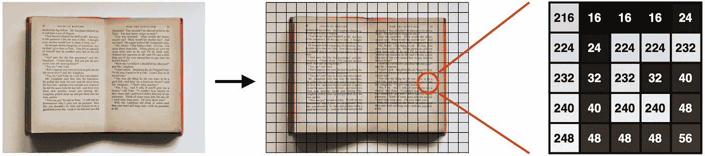

图 1.1 —将图像转化为数字的过程。由[杰斯·贝利](https://unsplash.com/photos/gL2jT6xHYOY)在 [Unsplash](https://unsplash.com?utm_source=medium&utm_medium=referral) 上拍摄的图书照片

嵌入一本书需要很多数字。一个“G”需要 5x5=25 个数字，一个 48 个字符的句子需要 25x48=1.200，一页 28 行需要 1.200*28=33.600，一整本 250 页的书需要 33.600*250=8.400.000 个数字——这是一个很大的数字！

拍照时，我们要求的不仅仅是书的内容；我们还要求看看它看起来怎么样，书的状态，照明条件，以及它离相机有多远。我们不经常需要关于一本书的这么多细节；好的一面是，我们可以用其中一些来换取更少的数字。我们可以询问书的内容。数字和字母通常采用一种称为 [ASCII](https://en.wikipedia.org/wiki/ASCII) 的格式，其中数字介于 48 和 122 之间，计算机知道 48 是“0”，71 是大写的“g”。使用 ASCII 意味着一个字符是 1 个数字，一个句子是 1x48=48 个数字，一页是 48*28=1344 个数字，一本书是 1433*250=336.000 个数字。

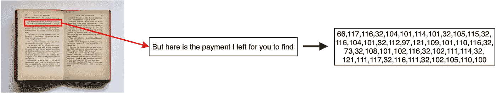

图 1.2 —一本书上的一个句子转换成了 ASCII 码。由[杰斯·贝利](https://unsplash.com/photos/gL2jT6xHYOY)在 [Unsplash](https://unsplash.com?utm_source=medium&utm_medium=referral) 上拍摄的图书照片

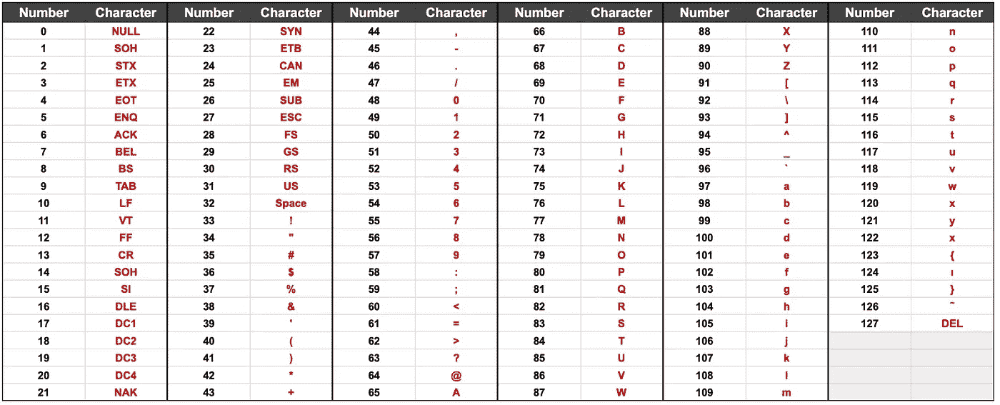

图 1.3 —计算机通常如何存储字符(数字和字母)的 ASCII 表

我们可以用更少的数字来表示这本书。也许这本书的内容并不重要，重要的是它的内容。一本书的内容可以用幻想、传记、恐怖和非小说等体裁来表现。让我们把流派的数量提高到一个很高的数量，比如说有 256 种不同的流派。如果是给定的流派，我们可以用 1(真)来表示这本书，如果不是，用 0(假)来表示。这本书现在可以只用 256 位或 32 个数字(每个数字 8 位)来表示，无论大小！这是嵌入信息和大小之间的权衡。

图 1.4 —用流派表示的书。1(真)表示这本书是给定的流派，0(假)表示不是。

不同的应用需要不同的嵌入。推荐新书时更容易使用流派，因为我们可以寻找与我们喜欢的书具有相同流派的书籍。但是我们需要阅读书籍的内容和首页的图像来查看它的外观。

一个好的嵌入要求我们知道应用程序需要什么信息，以及将信息转换成数字的方法。就像书的例子一样，应用程序的不同部分需要不同的表示。

## 1.2 相似性和矢量化

相似性的目标是找到相似的嵌入。一个例子是使用相似性向用户推荐与他们已经阅读过的书籍相似的书籍。

但是什么是相似呢？相似性基于嵌入(也称为测量、样本或点)，这些嵌入可以绘制到一个坐标系中，也称为维度空间(或简称为*空间*)。当把一个嵌入放到一个坐标系中时，我们称它为一个点。下面是一个将四本书设定到 2D 坐标系的例子。

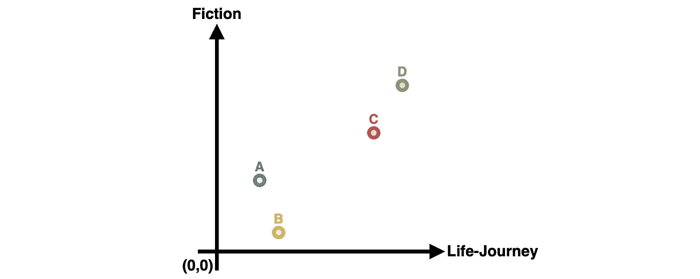

图 1.5——四本书被放置在一个 2D 坐标系中，这个坐标系基于它们所包含的小说和生活经历

如果点在空间上靠得更近，它们就更相似。书籍也是如此；两本都是非虚构的书(A 点和 B 点)比一本是虚构的和一本不是虚构的书(A 点和 C 点)更相似。相似性是两点之间的距离。图 1.6 显示 L1 < L2 which means that A and B are more similar than A and C.

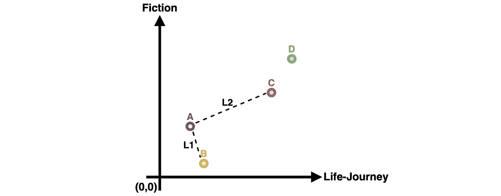

Figure 1.6 — Distance between A and B (i.e. L1) and between A and C (i.e. L2). A and B are closer than A and C as L1 < L2.

In practice, vectorizing the points allow us to calculate the distance (i.e., similarity) between them. Vectorization requires only points originating from (0,0). E.g., points (2,3) = vector [2, 3].

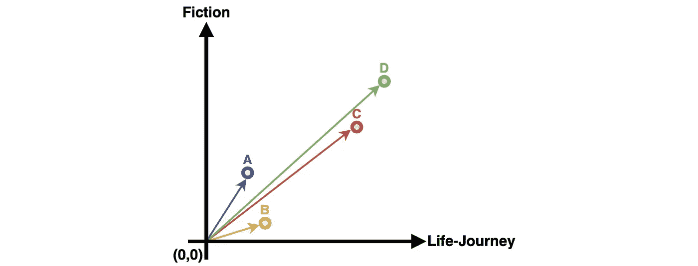

Figure 1.7 — Points can be converted to vectors by assuming they start in (0, 0)

The distance is the length of the vector traveling between the two points, called the Euclidean distance. Finding the vector between two points only requires subtraction of their vectors.

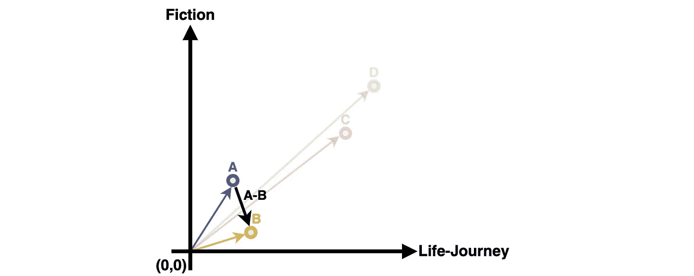

Figure 1.8 — Euclidean similarity is the distance between two points

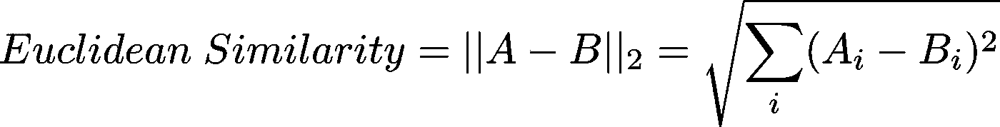

Equation 1.1 — Formula for calculating the euclidean similarity score

In Python, the euclidean similarity is calculated by creating two vectors with *Numpy* ，减去它们，取范数。

代码 1.1 —使用等式 1.1 计算两本书之间的欧几里得相似性

确定相似性的另一种方法是余弦相似性，它着眼于向量之间的角度，而不是它们端点之间的距离。这个想法是，概念/特性之间的比率比它们对这些特性的优先程度更重要。A 点更侧重于小说，B 点侧重于人生旅程——即使它们在欧几里得空间中彼此接近，它们的概念/特征也有很大不同。

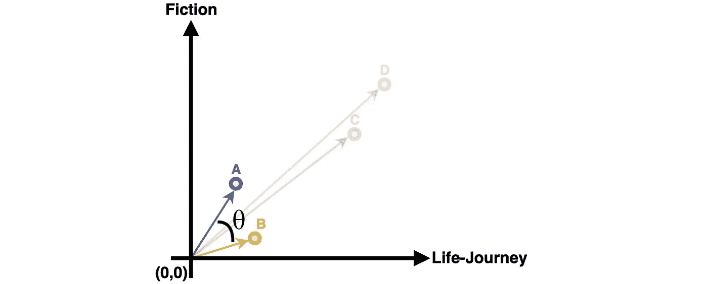

图 1.9-余弦相似度是两个向量之间的角度

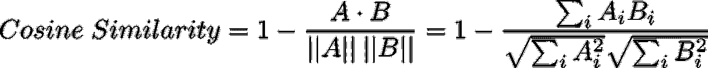

等式 1.2-计算余弦相似性得分的公式

在 Python 中，余弦相似性是通过用 *Numpy* 创建两个向量，并使用 *Scipy* 找到两者之间的余弦来计算的。

代码 1.2 —使用等式 1.2 计算两本书之间的余弦相似度

我们可以使用欧几里德相似度和余弦相似度；它们执行不同的行为，设计者的任务是找出最适合应用的行为。

## 1.3 集群

聚类是一种帮助我们在数据中找到组的技术。一个例子可能是根据我们喜欢阅读的群体/流派推荐新书。直观上，一个组由相似的对象组成，它的对象越近，它就变得越简洁。任务是确定哪些点最相似，以及如何将它们组合成适当数量的组。聚类方法使用相似性公式来评估点之间的相似性；在下图中，我们通过使用点之间的欧几里得相似性并组合最接近的点来创建两个组。对这两个群体的分析表明，我们的初级阅读包括学校书籍和幻想(没有迹象表明我们是否喜欢阅读学校书籍或只是因为我们需要而阅读它们)。

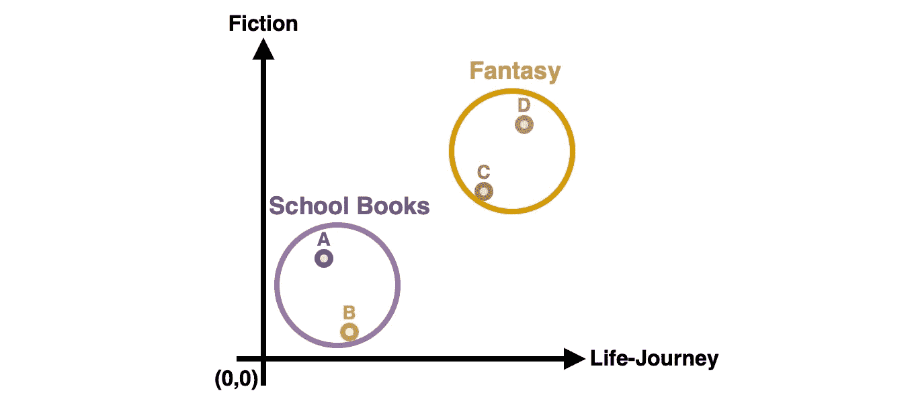

图 1.10-通过寻找密切相关的点对，可以创建两个组。

组数是一个超参数，也就是说事先定义组数的不是计算机，而是人。选择适当数量的集群(即组)至关重要。但是如何选择适当数量的集群呢？图 1.11 分析了一个、两个和四个聚类的数据，以显示变量的影响。

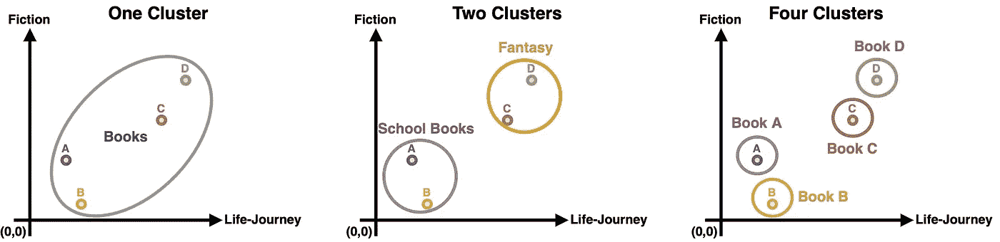

图 1.11 —向数据中添加一个、两个和四个聚类所提供的信息。一个和四个聚类只提供我们已经拥有的信息，而两个聚类帮助我们了解用户阅读什么样的书籍。

选择一个聚类告诉我们，我们喜欢书，这可能不是很有帮助，因为我们正在制作一个关于分析书籍偏好的应用程序。四个聚类显示我们喜欢书 A、B、C 和 D，但在同一组中对推荐新书贡献很小。两个集群更适合这个场景，因为它们提供了学校和幻想书籍是我们阅读最多的信息。对于所有应用来说，没有完美的集群数量——如果我们读了更多类似下面例子的书会怎么样？两个或四个小组合适吗？

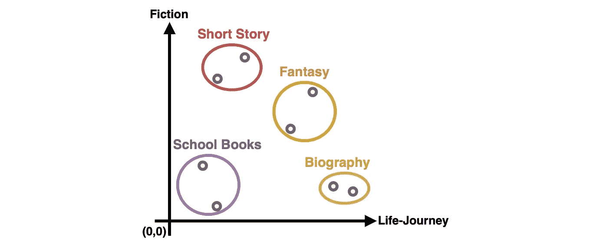

图 1.12 —上例中的四个集群太多，无法提取有用的信息。在本例中，需要四个集群来正确理解数据。没有完美的集群数量，都是特定于应用程序的。

常用的两种聚类方法是 [*k-means 聚类*](https://www.youtube.com/watch?v=4b5d3muPQmA) 和 [*层次聚类*](https://www.youtube.com/watch?v=OcoE7JlbXvY&t) 。在 K-均值聚类中，定义了“K”个聚类，并在数据中找到它们，就像上面的例子一样。在分层聚类中，我们定义了一个阈值，并使用它通过确定聚类的不同程度来确定聚类的数量。层次聚类通常是通过将最接近的点组合成越来越大的聚类(自下而上)或通过建立单个聚类并将其拆分直到它们足够明显(自上而下)来实现的。

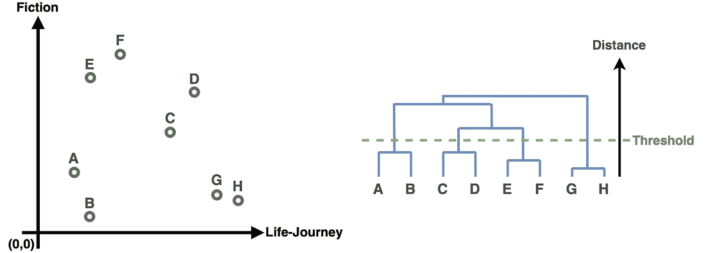

图 1.13-(左)坐标系统中绘制的点。(右)最接近的点被组合成一个聚类，创建一个可用于未来组合的新点。该过程继续，直到组之间的距离超过预定阈值。

使用集群有两种主要方式。第一是看现有数据中存在哪些组，第二是找新点属于哪个组。我们可以使用第一种方法来查找书籍组，并用流派标记每一组。之后，我们可以拿一本新书，用第二种方法，通过看它最接近哪一组来分类这本书属于哪一个流派。确定新点的组是分类任务的基础，其中我们使用现有数据来估计类/组。

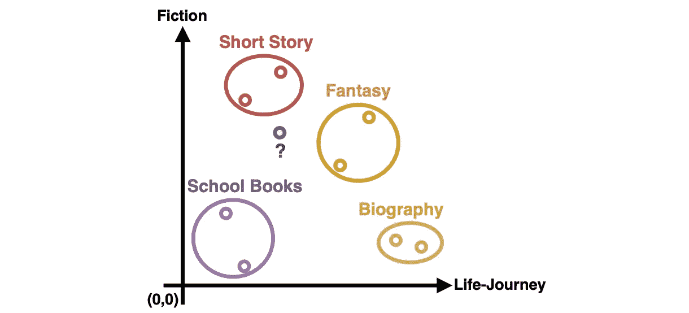

图 1.14-新点属于哪个组取决于它最接近该点的组

这篇博文的剩余部分更详细地解释了 K-means 聚类，并提供了一个实际的实现。在此处[更详细地解释了分层聚类。](https://www.javatpoint.com/hierarchical-clustering-in-machine-learning)

## 1.4 K 均值聚类

K-均值聚类中的“K”定义了聚类的数量。K=2 意味着必须在数据中找到两个聚类，K=4 意味着必须在数据中找到四个聚类。“均值”定义了每个聚类如何成为其组的均值，将其置于其组的中心。

一个聚类通过在相同的空间中放置一个新点来表示一部分数据。新点现在可以表示该部分数据。

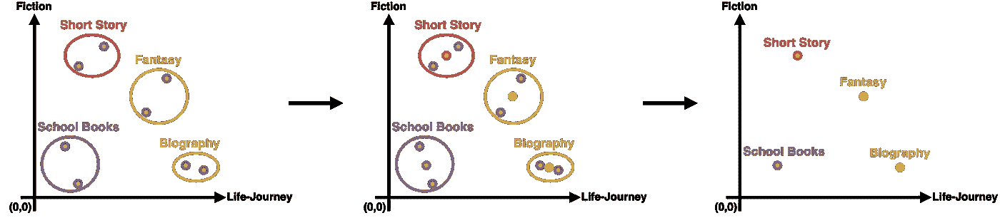

图 1.15 —将聚类作为代表部分数据的新数据点放入空间

K-means 的目标是为每个聚类找到最佳位置。放置一个集群并不像上面那样简单，每个集群都在一个彩色圆圈的中心。现实中没有这样的圆圈，只有如下所示的点。代码 1.3 用 Python 定义了图 1.16 中的点，并在示例中用于说明如何实现 K-means。

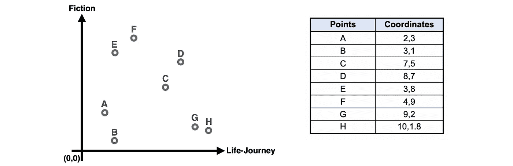

图 1.16-组不是用颜色或圆圈表示的。它更像是放置在坐标系中的无色点(对人类而言)或表格中的点(对计算机而言)。

代码 1.3-从图 1.16 的表格中定义数据点

寻找 K-聚类的第一步是在空间中随机放置 K-点。使用随机点可能看起来违反直觉，因为为什么不将它们均匀地分布在空间中呢？主要原因是所有数据看起来都不一样，这通常会导致等距点不在实际组的中心。如果一切顺利，我们希望在数据中找到真实的组。k-均值聚类不能确保我们找到最佳的可能聚类，只能确保我们找到接近我们的点的最佳聚类。随机点不能确保良好的表示，但是如果多次进行，在某个点随机放置的点很有可能会产生良好的结果。使用等间距的点将每次给出相同的聚类，或者如果系统地搜索，计算量太大。

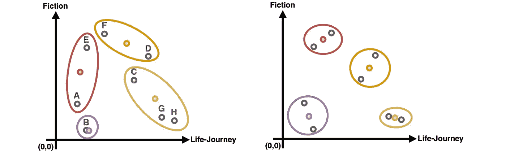

图 1.17-聚类的不同开始位置会产生不同的结果

所以，我们在空间中随机放置点。没有理由将它们放在现有数据点的最小值和最大值之外，所以在两者之间。

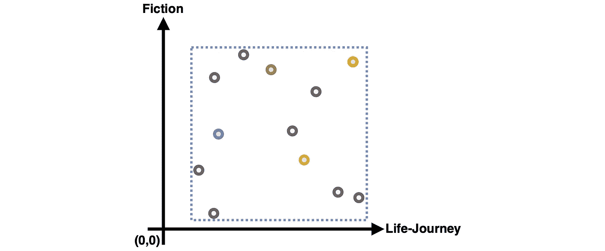

图 1.18-随机生成的聚类点是在现有点的范围内生成的

代码 1.4 —为 n 簇生成随机起始位置。图 1.18 中的原理用于在数据点定义的范围内产生点。

下一步是在集群之间分发每个原始数据点。一个数据点属于最能代表它的聚类。最佳表示是与数据点最相似的聚类，并使用相似性试探法进行测量。在这个例子中，我们将使用欧几里得。

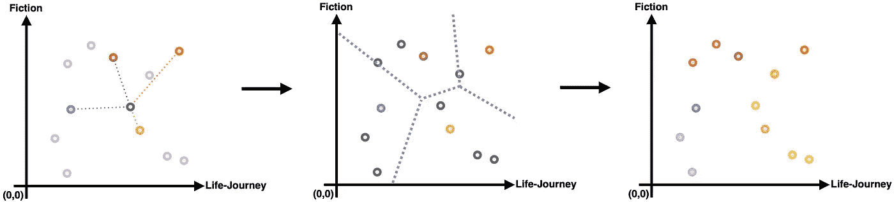

图 1.19-通过计算每个点与每个点的距离并选择最近的一个点来确定每个点与哪个聚类最相似。欧几里德距离被用作启发法。

代码 1.5-计算每个数据点最接近的聚类。

分发数据点之后的下一步是 K-means 聚类的“均值”部分。“平均值”指的是一个聚类应该是它所代表的数据点的平均值。聚类可能不是分布后的平均值，因为它们仅代表最接近的数据点。因此，有必要移动每个聚类，将其位置更改为其数据点的平均值。

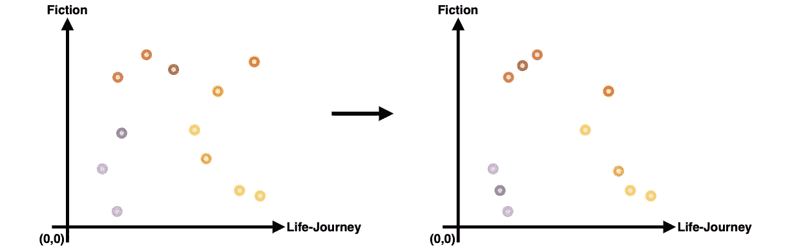

图 1.20 —每个聚类都被更新为最接近它的数据点的“平均值”。

等式 1.3-计算聚类 j 平均值的公式，聚类 j 中的点距离聚类 j 最近。

代码 1.5-计算每个聚类的新位置，作为最接近它的数据点的平均值。等式 1.3 用于计算单个聚类的平均值。

一个聚类在它的新位置上可能更靠近其他数据点。需要再次计算分布，以确保每个聚类代表正确的数据点。

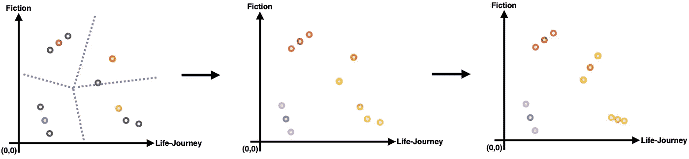

图 1.21-重新计算哪个点属于哪个聚类，并将聚类移动到它们的新均值。

代码 1.5 —所用函数的完整实现可以在 [git-repository](https://github.com/Gronne/Introduction-to-auto-encoders) 中找到

k 均值聚类是一个迭代过程。这意味着我们无法在一次计算中找到每个集群的最佳位置。需要计算多次，每次都越来越接近正确的地方。这个迭代过程继续进行，直到集群不再移动或者低于阈值。阈值确保该过程不会无限期地继续下去。

通过改变启发式算法(例如，余弦相似性而不是欧几里德相似性)或者改变聚类如何表示其数据点组(例如， [medoids](https://en.wikipedia.org/wiki/K-medoids) 而不是均值)，很容易产生新的聚类算法。

为了让事情变得简单， *SKLearn* 发布了一个健壮的 K 均值聚类实现:

代码 1.6 — Sk-learn 有自己的 K 均值聚类实现，比第 1 章介绍的简单方法更好更快。

## 1.5 结论

我们现在已经学完了第一章，以及对嵌入、相似性和聚类的介绍。

第一部分是关于**嵌入**并解释了如何在计算机中表现真实世界，以及为什么问正确的问题对应用程序至关重要。一些应用程序甚至需要同一现实世界事件的多种表示(例如，书)。任务是确定哪种表示为应用程序提供最佳格式。

第二部分是关于**相似性**，展示了如何通过使用两个现实世界事件之间的距离来计算它们之间的相似性。存在计算相似性(例如，欧几里德距离和余弦相似性)的不同方式，每种方式导致不同的行为。选择一个为应用程序提供正确行为的方法是至关重要的。相似性的一个用例是推荐与用户喜欢的书相似的书。

最后一节是关于**聚类**的，展示了相似的点如何经常组合在一起，以及这些组代表了底层结构。书籍形成自然的流派或主题组(例如，科幻和传记)。找到正确的组数至关重要；太少或太多的组将为应用程序提供误导性的知识。

[**第 2 章**](/introduction-to-image-embedding-and-accuracy-53473e8965f) 着眼于更复杂的应用，其中相似性和聚类确定图像正在搬运的动物。第二章建立了一种方法来衡量 ML 的表现，并发现第一章的方法对图像嵌入无效。第 3 章介绍了第 2 章中发现的弱点和优点，并探讨了改进 ML 的方法。

## 参考

[1]乔希·斯塔默， [StatQuest: K 均值聚类](https://www.youtube.com/watch?v=4b5d3muPQmA) (2018)，Youtube.com

[2]亚历山大·伊赫勒，[聚类(2):层次凝聚聚类](https://www.youtube.com/watch?v=OcoE7JlbXvY) (2015)，Youtube.com

所有图片和代码，除非另有说明，均为作者所有。

感谢你阅读这本关于潜在空间的书！当分享我们的想法时，我们学得最好，所以请分享一个评论，无论是一个问题，新的见解，还是一个分歧。任何建议和改进都非常感谢！

*如果你喜欢这本书，并且对机器学习和数据科学的新见解感兴趣，请注册中级会员，以便完全访问我的内容。关注我，以便在我发布新章节或帖子时收到电子邮件。*

  

## 书籍章节

简介:[进入图像嵌入和潜在空间](/an-extensive-introduction-to-image-embedding-and-auto-encoders-0-6-5c5d9a18fcaa)

第 1 章:[嵌入、聚类和相似性介绍](/introduction-to-embedding-clustering-and-similarity-11dd80b00061)

第 2 章:[图像嵌入和精度介绍](/introduction-to-image-embedding-and-accuracy-53473e8965f)