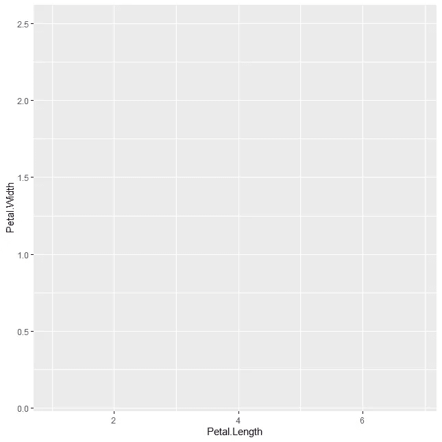
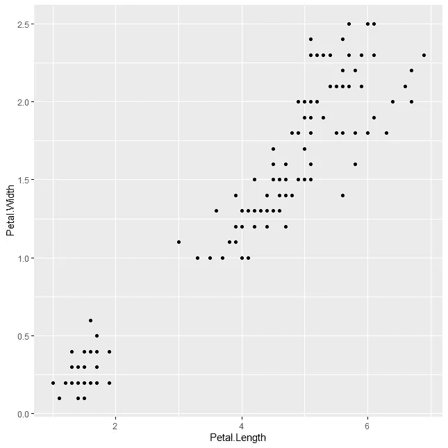
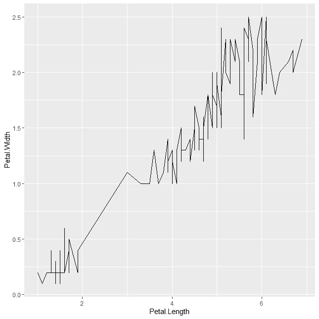
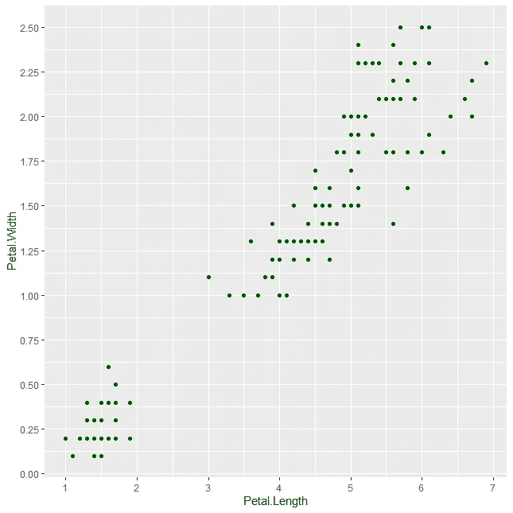

# R 中的 ggplot2 简介

> 原文：<https://towardsdatascience.com/introduction-to-ggplot2-in-r-73242b99889>

## 让我们了解一下 GGplot2，R 中最著名的库之一，是如何工作的


照片由 Launde Morel @unsplash.com 提供

*【免责声明:此帖子包含一些我的 Udemy 课程的附属链接】*

*ggplot2* ，一个开源的数据可视化包，是最著名的 R 库之一。15 年前首次发布，它被认为是 R 编程语言中最灵活、最方便的可视化库之一。这是基于 R 的绘图能力的巨大升级，因为它在构建绘图时支持几个扩展，非常灵活和可调整。

如果你以前从未使用过面向代码的可视化库，那么使用 *ggplot2* 可能会有点困难。首先，它是以模块化的方式构建的，您可以通过使用串联添加元素来堆叠几个函数。第二，它包含了大量可以在每个模块中更改的调整和参数，这一开始可能会有点混乱。

尽管如此，我相信只要你学会了基础知识，你就能立刻构建出很多很酷的情节！在这篇文章中，我的目标是给你一个使用 *ggplot2 构建 R 图的指南。*我们将了解构成 *ggplot2* 图的主要组件，并学习如何用 R 代码调整它们。开始吧！

# 基地

如我所说， *ggplot2* 是一个“模块化”库，大多数图包含以下层:

*   映射数据和轴的绘图*基础*。
*   你想做的*式的剧情*。
*   你可能想在你的情节中包含的特定附加组件。

当我想在 *ggplot2* 中构建一些东西时，我总是试图将我的“心智情节”映射到这三种成分上。从第一个开始，*基础*说明:

*   我们要绘制的数据集是什么？
*   我们如何将变量映射到不同的轴上；

举个实际例子，让我们加载著名的`iris`数据集来构建我们的第一个图:

```
library(ggplot2)
iris_df <- iris
```

我将`iris`存储在`iris_df`中，只是为了让这个对象作为环境中的静态数据帧。为了构建我们的 *ggplot2* 库，我们可以结合使用`ggplot2`函数和`data`和`mapping`参数:

```
ggplot(
  data = iris_df,
  mapping = aes(x = Petal.Length, y= Petal.Width)
)
```

这些论点有什么用？让我们来分解一下:

*   `data`说明我们将用来填充绘图的数据集。
*   `mapping`依赖于`aes`函数将 x 和 y 列映射到它们各自的轴上。在我们的例子中，`Petal.Length`将成为 *x* ，而`Petal.Width`将成为 *y* 。

当我们执行上面的代码时，会弹出以下窗口:



iris 数据集示例图—作者提供的图片

使用`ggplot`功能，我们奠定了绘图的基础，并绘制了`x`和`y`轴。**`**ggplot2**`**的一个重要部分是它只适合二维绘图——如果你需要做三维绘图，勾选**[](https://plotly.com/r/)****。******

***在`mapping`参数中，我们传递的变量将代替`x`和`y`轴。请注意，R 已经将两个轴限定为数据中可用的最大值和最小值。例如，如果我们检查`max(iris_df$Petal.Length)`，我们得到`6.9`，这正是我们`x`轴的上限！***

***布局好*基础*后，我们需要定义*地块类型*！我们是要做散点图、线图还是条形图？让我们使用 *ggplot2* 将信息传递给 R！***

# ***绘图类型***

***因此， *ggplot2* 是一个库，我们可以在其中使用层来构建绘图。在这一陈述之后，出现了两个问题:***

*   ***我怎样才能给情节增加一个新的层次？***
*   ***我可以添加哪些类型的层？***

***我们可以添加的最重要的层之一将陈述我们想要做的情节的类型。添加一个新层非常容易——只需使用`+`我们就能在现有的*基础*上添加一个新层！***

***例如，假设我们希望我们的图是散点图。为此，我们只需在图中添加一个`geom_point()`层:***

```
*ggplot(
  data = iris_df,
  mapping = aes(x = Petal.Length, y= Petal.Width)
) + geom_point()*
```

******

***ggplot2 中的散点图-作者提供的图像***

***通过将`geom_point()`添加到我们当前的图中，我们将让 R 知道我们对构建一个散点图感兴趣。使用上面的代码，我们的绘图有两层——由`ggplot`函数组成的*基础*和由`geom_point()`组成的*类型绘图*。***

***但是，假设我们想做一个线图。我们要不要在剧情上再加一层？***

***不要！我们只是替换我们添加的模块，并添加一个`geom_line()`层:***

******

***ggplot2 中的线图—作者提供的图像***

***当然，这个数据集的结果没有太大的意义，但是，看看从散点图变成折线图是多么容易。***

***为了增加灵活性，我们甚至可以在新层中传递几个参数。这将调整我们绘图的一些图形方面——例如，我们点的颜色:***

******

***绿色散点图—图片由作者提供***

```
*ggplot(
  data = iris_df,
  mapping = aes(x = Petal.Length, y= Petal.Width)
) + geom_point(color = 'darkgreen')*
```

***通过在`geom_point`中传递`color`，我们让 R 知道我们的点应该有一个特定的颜色。在*类型的绘图*层中，我们可以调用多个参数——下面是`geom_point()`的[摘要](https://ggplot2.tidyverse.org/reference/geom_point.html)。***

# ***其他层***

***我们的情节已经很酷了，可以被解读了。但是……我们可以做很多调整。你认为我们如何做这些小调整？当然是用新图层啦！***

***例如，假设我对 x 轴上的标签数量不满意。为了调整它们，我可以使用一个新的图层:T4！***

```
*(
  ggplot(
  data = iris_df,
  mapping = aes(x = Petal.Length, y= Petal.Width)
  ) 
  + geom_point(color = 'darkgreen') 
  + scale_x_continuous(n.breaks=10)
)*
```

******

***X 轴上带有额外标签的散点图-作者图片***

***使用这一层将打破我的 x 轴比原来更多的桶。在这种情况下，我在新图层的`n.breaks`参数中选择了 10 个断点。**我是否只能添加一个附加层？*****

***当然不是！让我们用`scale_y_countinuous`给`y-axis`添加更多的中断:***

```
*(
  ggplot(
  data = iris_df,
  mapping = aes(x = Petal.Length, y= Petal.Width)
  ) 
  + geom_point(color='darkgreen') 
  + scale_x_continuous(n.breaks=10)
  + scale_y_continuous(n.breaks=10)
)*
```

******

***在 X 轴和 Y 轴上带有额外标签的散点图-图片由作者提供***

***请注意，逻辑总是相同的— **要添加一个新层，我们可以提供新的函数，并通过使用** `+`将它们与现有的图连接起来。***

****ggplot2* 也是 r 中文档最丰富的库之一。该库中有数百个图层[可用，您可以通过访问该库的网站快速找到关于它们的文档。](https://ggplot2.tidyverse.org/reference/)***

***在我们结束之前，还有一件事我想告诉你。我们不需要一次构建 20 层的巨大代码块！如果它与您的用例相匹配，并且您想在进行过程中调整您的绘图，您可以将您的绘图状态保存在一个变量中，并向其中添加层——接下来让我们来看看！***

# ***分解情节***

***我们可以用 *ggplot2* 做的一件很酷的事情是，我们可以存储我们的绘图供以后使用。举个例子，我可以把我的*库*保存为一个变量，然后用这个变量名作为别名来添加图层:***

```
*example_plot <- ggplot(
  data = iris_df,
  mapping = aes(x = Petal.Length, y= Petal.Width)
)*
```

***现在，我的基数保存在`example_plot` —调用这个变量将产生绘图的基数，正如预期的那样:***

******

***使用 example_plot 变量名的 ggplot2 base 作者提供的图像***

***酷的地方在于我们可以把`example_plot` alias 当做第一层( *base* )。如果我想做散点图，我可以:***

```
*example_plot + geom_point()*
```

******

***由 example_plot + geom_point()触发的散点图-图片由作者提供***

***如果我想换成线形图呢？让我们看看:***

```
*example_plot + geom_line()*
```

******

***由 example_plot + geom_line()触发的线图-作者提供的图像***

***很酷，对吧？我们的代码更加简洁，能够在变量中存储 *ggplot2* 层是一个很好的特性。这可以防止您用 20 多行代码生成图，而这些代码解释和调试起来可能有点麻烦。***

****ggplot2* 被认为是 R 中数据科学的[顶级库之一。学习它将会给你一个很好的工具来构建 R 编程中的情节，虽然 base R 可能足以完成几个任务，但它通常会产生过于简单、基本并且看起来不“专业”的情节。](https://www.datacamp.com/tutorial/top-ten-most-important-packages-in-r-for-data-science)***

***在这篇文章中，我的目标是向你解释 *ggplot2 的基础知识。*接下来，检查其他图层如 *geom_bar* 或 *geom_histogram* 或试验其他[可用参数](https://ggplot2.tidyverse.org/reference/´)。这些应该给你一个很好的概述，关于如何使用特定用例的库，以及在图的方面你可以改变什么特别的东西。***

******我在 Udemy 上建立了一个***[***R 简介***](https://www.udemy.com/course/r-for-absolute-beginners/?couponCode=MEDIUMREADERSSEP) ***和一个*** [***学习数据科学的训练营***](https://www.udemy.com/course/r-for-data-science-first-step-data-scientist/?couponCode=MEDIUMREADERSSEP) ***。这两个课程都是为初学者量身定做的，我希望你能在我身边！******

******

***绝对初学者的 R 编程课程 —图片由作者提供***

***[](https://medium.com/membership/@ivopbernardo) ***