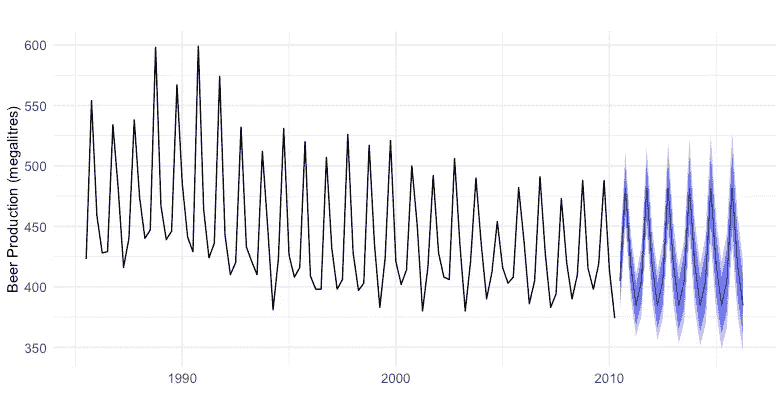

# 全球预测模型简介

> 原文：<https://towardsdatascience.com/introduction-to-global-forecasting-models-3ca8e69a6524>

## 使用 Python 训练具有多个时间序列的预测模型

照片由[郭佳欣·阿维蒂西安](https://unsplash.com/@kar111?utm_source=medium&utm_medium=referral)在 [Unsplash](https://unsplash.com?utm_source=medium&utm_medium=referral) 上拍摄

**全球模型正成为时间序列预测的首选方法。以下是如何使用 Python 构建这些模型。**

# 从本地模式到全球模式

假设我们想要预测给定时间序列的未来值。我们使用时间序列的历史观察来建立训练集。然后，使用该数据选择并拟合预测模型。图 1 显示了这个过程的一个例子。

这是我们创建模型的典型操作方式。这方面的例子是经典的方法，如 ARIMA 或指数平滑。ARIMA 的 AR(自回归)部分将未来观测值建模为过去观测值的线性组合。自动回归也可以应用于非线性回归模型，如随机森林。MA 部分类似，但使用过去的误差。指数平滑法使用过去值的加权平均值。对于较老的观测值，权重呈指数衰减。

这些模型是局部的，因为训练数据只涉及一个时间序列。

图 1:澳大利亚啤酒产量的时间序列，蓝色部分是 ARIMA 对未来观测的预测。在这种情况下，在预测之前，使用过去的观察训练一个**局部**模型。图片作者。

但是，全球预测模型越来越受欢迎。这些**汇集了多个时间序列的历史观测值，以符合预测模型**。

全球预测模型不同于多元时间序列预测。在前者中，我们将许多时间序列的观察值(表中的行)连接起来。对于多元时间序列，我们包括额外的序列作为解释变量(表中的列)。ARIMAX 就是一个例子。

## 直觉和假设

通过对多个时间序列的学习，模型获得了更好的泛化能力。这将导致更好的预测性能。额外的可用时间序列代表更多的训练数据。机器学习方法通过更大的训练样本提高了它们的预测性能。你可以在[之前的文章](https://medium.com/p/b5271ec784dc)中读到更多。

全球预测模型有一个重要的假设。输入的时间序列彼此之间有些关联。这里有个例子。假设我的目标是预测给定位置的风速以产生能量。加上谷歌的股价对训练模型帮助不大。然而，添加从不同位置捕获的风速可能会有一些用处。

在应用全局模型之前对时间序列进行聚类可能是一个合理的想法。详见参考文献[3]。

## 成功的例子

全球方法的有用性在 M4 和 M5 的预报竞赛中得到了证明。表现最好的方法遵循这种训练策略。

**从许多时间序列中交叉学习**是训练深度神经网络的标准方法。示例包括 DeepAR 或 N-BEATS 等。使用其他算法也可以提高预测性能。M5 竞赛的获胜者采用了 LightGBM 全球战略。

# 把手放在某物或者某人身上

现在我们对全球预测模型的运作有了基本的了解。在这里，我将编写一个简单的全球预测模型来预测电力需求。

## 案例研究—电力需求预测

[马太·亨利](https://unsplash.com/@matthewhenry?utm_source=medium&utm_medium=referral)在 [Unsplash](https://unsplash.com?utm_source=medium&utm_medium=referral) 上拍照

电力需求预测对于管理电网运行非常重要。例如，平衡能源的供求。这里我们将使用一组可用的时间序列。该数据集包含许多欧洲国家每小时的电力消耗数据。为简单起见，我们将重点关注三个国家:葡萄牙、法国和英国。

这是完整的代码，我将在下面解释。

我们首先读取数据，并将其准备成合适的格式(第 1–17 行)。这里，为了简洁起见，我跳过了基本的数据操作。我们创建函数 *ts_as_supervised* ，它将时间序列转换成表格格式。

对于每个时间序列，我们执行以下操作:

1.  将数据分成训练集和测试集。在 2015 年 7 月 1 日之后收集的所有观察结果用于测试(第 32-34 行)；
2.  根据训练数据中计算的平均值对时间序列进行规范化(第 36–39 行)。这一步很重要，因为输入的时间序列通常有不同的尺度。在这个阶段，您可能还需要执行其他预处理步骤。例如，应用幂变换来稳定方差。你可以查看[之前的一篇文章](/12-things-you-should-know-about-time-series-975a185f4eb2)，在这篇文章中我回顾了最常见的预处理步骤；
3.  应用函数 *ts_as_supervised* 将序列转换成表格格式(第 41–43 行)。

现在有趣的部分来了。**我们将所有时间序列的观测值连接起来，以训练一个预测模型**(第 46 行)。这是目前数据集的一个小样本。请注意，国家和指数列不用于培训。

在剩余的代码行(48-60)中，我们训练了一个岭回归模型，并将其应用于一个时间序列。

# 外卖

*   传统上，使用单个时间序列的历史观察来训练模型；
*   全球预测模型通过使用多个相关的时间序列训练模型来工作；
*   这些方法正在成为训练预测模型的标准方法。这些包括深度神经网络或梯度增强算法(例如 light GBM)；
*   全球方法的成功例子包括 M4 和 M5 预测竞赛的获胜者。

## 进一步阅读

[1] Hewamalage、Hansika、Christoph Bergmeir 和 Kasun Bandara。"时间序列预测的全球模型:模拟研究."*模式识别* 124 (2022): 108441。

[2] Makridakis，Spyros，Evangelos Spiliotis 和 Vassilios Assimakopoulos。" M5 精确度竞赛:结果、发现和结论."《国际预测杂志》 (2022)。

[3] Bandara、Kasun、Christoph Bergmeir 和 Slawek Smyl。"使用递归神经网络对相似序列组进行跨时间序列数据库的预测:聚类方法."*专家系统及应用* 140 (2020): 112896。