# GraphSAGE:放大图形神经网络

> 原文：<https://towardsdatascience.com/introduction-to-graphsage-in-python-a9e7f9ecf9d7>

## PyTorch 几何的 GraphSAGE 简介

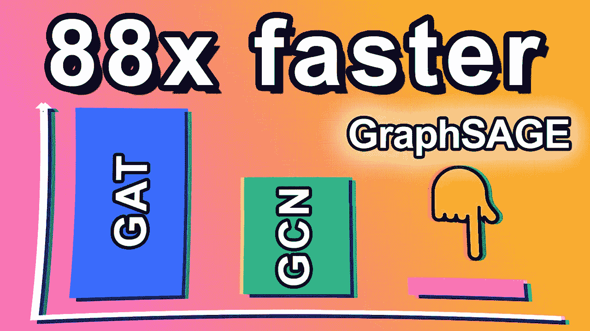

图片作者，表情符号作者[open moji](https://openmoji.org/)([CC BY-SA 4.0](https://creativecommons.org/licenses/by-sa/4.0/#))

**UberEats** 和 **Pinterest** 有什么共同点？

他们都使用 GraphSAGE 来为他们的推荐系统提供大规模的支持:数以百万计的节点和边。

*   🖼️ **Pinterest** 开发了自己的名为 [PinSAGE](https://medium.com/pinterest-engineering/pinsage-a-new-graph-convolutional-neural-network-for-web-scale-recommender-systems-88795a107f48) 的版本，向用户推荐最相关的图片(pin)。
    →他们的图有 180 亿个连接，30 亿个节点。
*   🍽️ **UberEats** 也报道了使用 GraphSAGE 的[修改版来推荐菜肴、餐馆和美食**。**
    → UberEats 号称支持超过 60 万家餐厅，6600 万用户。](https://eng.uber.com/uber-eats-graph-learning/)

在本教程中，我们将使用具有 20k 个节点的数据集，而不是数十亿个节点，因为 Google Colab 无法处理我们的雄心。我们将坚持使用最初的 GraphSAGE 架构，但是之前的变体也带来了我们将讨论的令人兴奋的特性。

可以用下面的 [Google Colab 笔记本](https://colab.research.google.com/drive/1udeUfWJzvMlLO7sGUDGsHo8cRPMicajl?usp=sharing)运行代码。

# 🌐I. PubMed 数据集

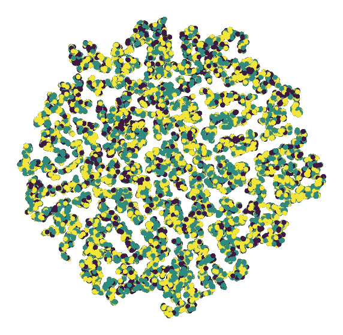

考研的 t-SNE 情节(图片由作者提供)

在本文中，我们将使用 **PubMed** 数据集。正如我们在[上一篇文章](/graph-attention-networks-in-python-975736ac5c0c)中看到的，PubMed 是[小行星](https://arxiv.org/abs/1603.08861)数据集的一部分(麻省理工学院许可)。这里有一个简短的总结:

*   它包含来自 PubMed 数据库的 **19，717 篇关于糖尿病的科学出版物**；
*   节点特征是[**TF-IDF**](https://en.wikipedia.org/wiki/Tf%E2%80%93idf)**500 维的加权词向量**，这是一种无需变形金刚的高效文档汇总方式；
*   该任务是一个多级分类，具有**三个类别**:实验性糖尿病、1 型糖尿病和 2 型糖尿病。

这就是深度学习的美丽和诅咒:我对糖尿病一无所知，但如果我们达到 70%的准确率，我仍然会感到非常满意。至少我们不会制造下一个 IBM Watson。

```
Dataset: Pubmed()
------------------- 
Number of graphs: 1
Number of nodes: 19717
Number of features: 500
Number of classes: 3Graph:
------
Training nodes: **60**
Evaluation nodes: **500**
Test nodes: **1000**
Edges are directed: False
Graph has isolated nodes: False
Graph has loops: False
```

正如我们所见，与整个图表相比，PubMed 的训练节点数量低得惊人**。只有 60 个样本来学习如何对 1000 个测试节点进行分类。**

尽管面临这一挑战，GNNs 仍设法获得高水平的准确性。以下是已知技术排行榜(更详尽的基准可以在[的论文中找到，代码为](https://paperswithcode.com/sota/node-classification-on-pubmed)):

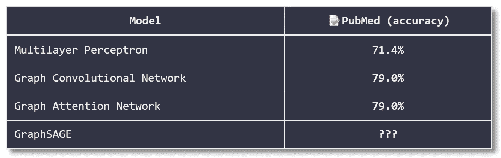

我在 PubMed 上找不到 GraphSAGE 在这种特定设置下的任何结果(60 个训练节点，1000 个测试节点)，所以我不期望有很高的准确性。但是在处理大型图表时，另一个度量标准也同样重要:**训练时间**。

# 🧙‍♂️二世。理论上的文法

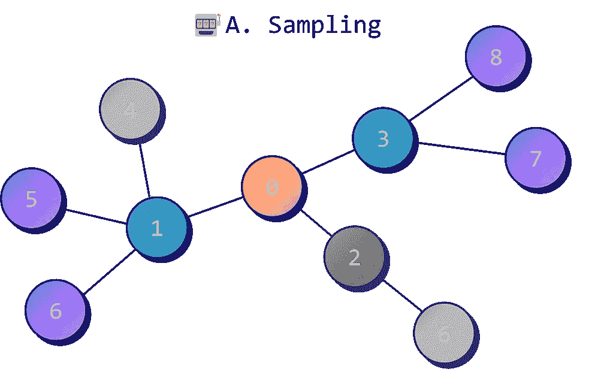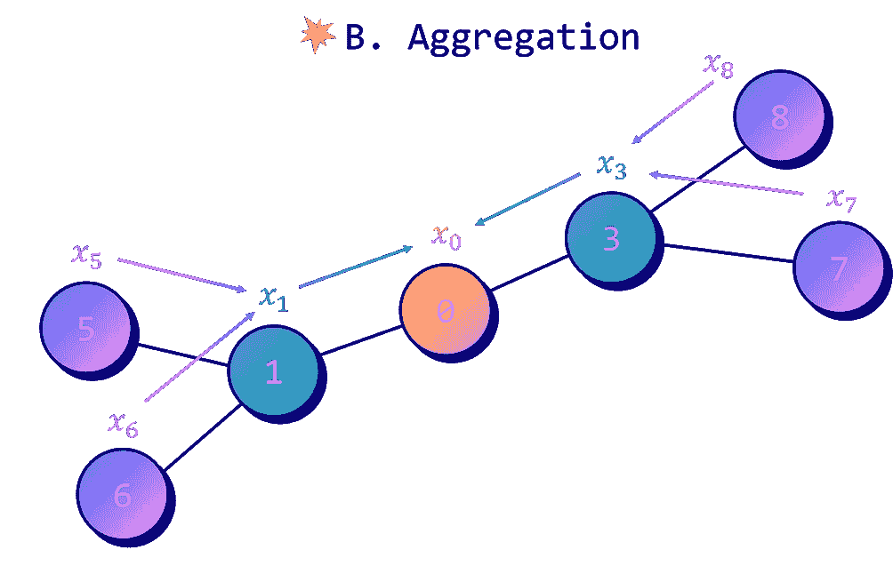

作者图片

GraphSAGE 算法可以分为两个步骤:

1.  **邻居抽样；**
2.  **聚合**。

# 🎰a .邻居抽样

小批量是机器学习中常用的技术。

它通过**将数据集** **分解成更小的批次**来工作，这允许我们更有效地训练模型。小批量有几个好处 **:**

1.  **提高精度** —小批量有助于减少过度拟合(梯度被平均)，以及误差率的变化；
2.  **提高速度** —小批量并行处理，比大批量花费更少的训练时间；
3.  **改进的可扩展性** —整个数据集可以超过 GPU 内存，但较小的批处理可以绕过这一限制。

小型批处理非常有用，它已经成为常规神经网络的标准。然而，对于图形数据来说就不那么简单了，因为将数据集分割成更小的块会破坏节点之间的基本连接。

那么，我们能做什么呢？近年来，研究人员开发了不同的策略来创建图形小批量。我们感兴趣的那个叫做 [**邻居采样**](https://arxiv.org/abs/1706.02216) 。你可以在 [PyG 的文档](https://pytorch-geometric.readthedocs.io/en/latest/modules/loader.html)上找到很多其他技术，比如[子图聚类](https://arxiv.org/pdf/1905.07953.pdf)。

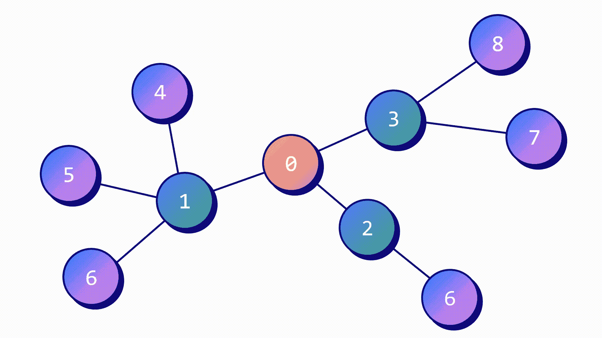

邻居采样(图片由作者提供)

邻居采样只考虑随机邻居中固定数量的。流程是这样的:

1.  我们定义**邻居数量** (1 跳)，邻居的邻居数量(2 跳)等等。我们想要。
2.  采样器查看邻居列表、邻居的邻居列表等。并且**随机选择**预定数量的目标节点；
3.  采样器**输出包含目标节点和随机选择的邻居节点的子图**。

对列表中的每个节点或整个图重复该过程**。然而，为每个节点创建一个子图是没有效率的，这就是为什么我们可以成批处理它们。在这种情况下，每个子图由多个目标节点共享。**

相邻采样还有一个额外的好处。有时，我们会观察到非常受欢迎的节点，这些节点就像枢纽一样，比如社交媒体上的名人。获得这些节点的隐藏向量在计算上是非常昂贵的，因为它需要计算数千甚至数百万个邻居的隐藏向量。GraphSAGE 通过简单地忽略大多数节点解决了这个问题！

在 PyG 中，邻居采样是通过`[NeighborLoader](https://pytorch-geometric.readthedocs.io/en/latest/modules/loader.html#torch_geometric.loader.NeighborLoader)`对象实现的。假设我们想要 **5 个邻居和他们的 10 个邻居** ( `num_neighbors`)。正如我们所讨论的，我们还可以通过为多个目标节点创建子图来指定一个`batch_size`来加速这个过程。

```
**Subgraph 0**: Data(x=[389, 500], edge_index=[2, 448], batch_size=16)
**Subgraph 1**: Data(x=[264, 500], edge_index=[2, 314], batch_size=16)
**Subgraph 2**: Data(x=[283, 500], edge_index=[2, 330], batch_size=16)
**Subgraph 3**: Data(x=[189, 500], edge_index=[2, 229], batch_size=12)
```

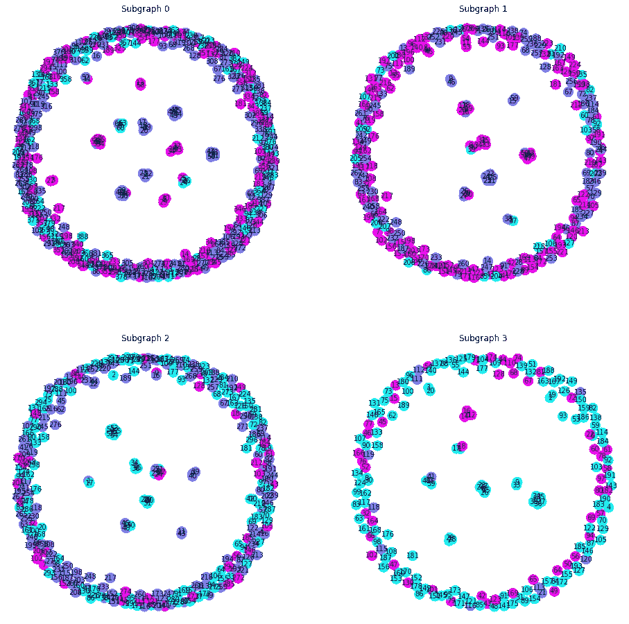

我们创建了 4 个不同大小的子图。它允许我们并行处理它们，并且它们更容易安装在 GPU 上，因为它们更小。

邻居的数量是一个重要的参数，因为修剪我们的图形会删除很多信息。具体多少钱？嗯，相当多。我们可以通过查看**节点度数**(邻居数量)来形象化这种影响。

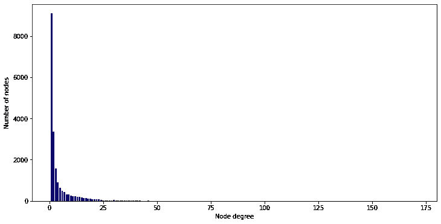

原始图中的节点度

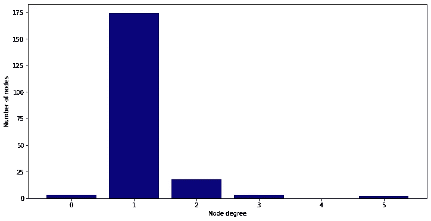

邻居采样后的节点度数

在这个例子中，我们的子图的**最大节点度**是 5，这比最初的最大值低得多。在谈论 GraphSAGE 时，记住这种权衡是很重要的。

PinSAGE 使用**随机游走**实现另一种采样解决方案。它有两个主要目标:

1.  样本 a **固定数量的邻居**(如 graph sage)；
2.  获取它们的**相对重要性**(重要节点比其他节点更频繁出现)。

这个策略感觉有点像快速**注意力机制**。它为节点分配权重，并增加最受欢迎的节点的相关性。

# **💥b .汇总**

聚集过程确定如何组合特征向量以产生节点嵌入。原始论文提出了三种聚合特征的方法:

*   **表示**聚合器；
*   **LSTM** 聚合器；
*   **汇集**聚合器。

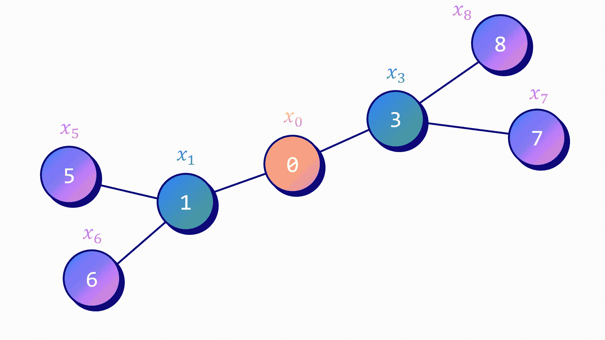

聚合(作者图片)

**均值聚合器**是最简单的一个。这个想法接近于 GCN 的方法:

1.  目标节点及其所选邻居的隐藏特征被平均(ñᵢ)；
2.  应用具有加权矩阵𝐖的线性变换。


然后，可以将结果反馈给非线性激活函数，如 *ReLU* 。

**LSTM 聚合器**可能看起来是一个奇怪的想法，因为这个架构是顺序的:它给无序的节点分配一个顺序。这就是为什么作者随机打乱它们来迫使 LSTM 只考虑隐藏的特征。在他们的基准测试中，这是性能最好的技术。

**汇集聚集器**将每个邻居的隐藏向量馈送给前馈神经网络。对结果应用最大池操作。

# 🧠三世。PyTorch 几何中的 GraphSAGE

我们可以用 PyTorch Geometric 的`SAGEConv`层轻松实现 GraphSAGE 架构。这种实现使用两个权重矩阵，而不是一个，就像 UberEats 的 GraphSAGE 版本:


让我们创建一个具有两层`SAGEConv`的网络:

*   第一个将使用 ***ReLU*** 作为激活函数和一个**脱落层**；
*   第二个将直接输出**节点嵌入**。

由于我们正在处理多类分类任务，我们将使用交叉熵损失作为我们的损失函数。我还添加了一个 0.0005 的 L2 正则化值，以便更好地测量。

要了解 GraphSAGE 的优势，让我们**将**与**GCN 和 GAT 进行比较，无需任何采样。**

**使用 GraphSAGE，我们遍历由邻居采样过程创建的**批**(我们的 4 个子图)。因此，我们计算准确度和验证损失的方法也不同。**

**以下是**GCN、GAT 和 GraphSAGE 的结果(根据**准确度**和**训练时间**):****

```
****GCN** test accuracy: **78.40% (52.6 s)
GAT** test accuracy: **77.10% (18min 7s)
GraphSAGE** test accuracy: **77.20% (12.4 s)****
```

****三个模型在精确度方面获得**相似的**结果。我们希望 GAT 性能更好，因为它的聚合机制更加细致，但情况并非总是如此。****

****真正的区别是训练时间:在这个例子中，GraphSAGE 比 GAT 快 88 倍，比 GCN 快 4 倍。****

****这就是 GraphSAGE 的真正力量。通过用邻居采样修剪我们的图，我们确实丢失了许多信息。最终的节点嵌入可能**不如我们用 GCN 或 GAT 找到的**好。但这不是重点:GraphSAGE 旨在提高可伸缩性。反过来，它可以构建更大的图表，从而提高准确性。****

****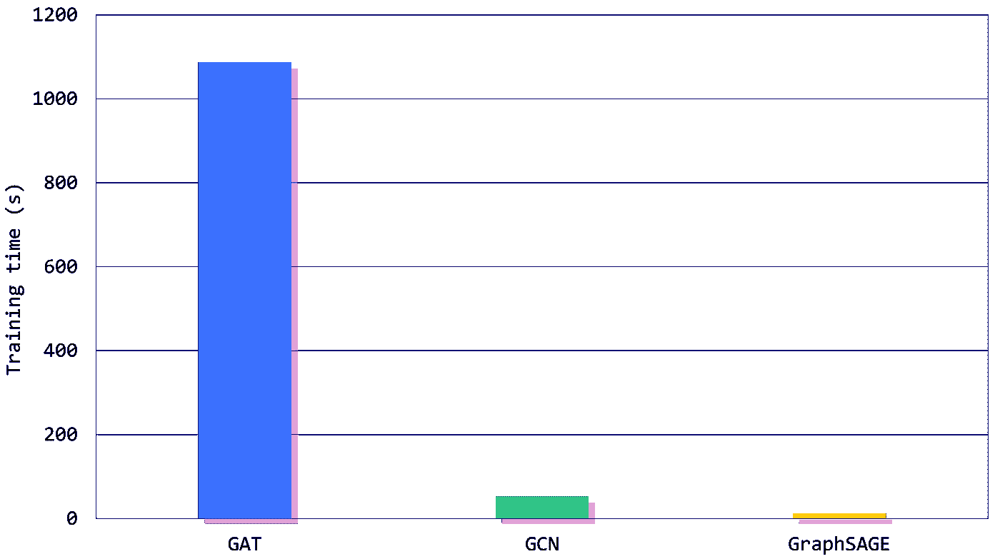****

****作者图片****

****这项工作是在有监督的训练环境中完成的(节点分类)，但是我们也可以用**无监督的方式**训练 GraphSAGE。****

****在这种情况下，我们不能使用交叉熵损失。我们必须设计一个损失函数，迫使原始图中相邻的节点在嵌入空间中保持彼此靠近。相反，相同的函数必须确保图中的**距离节点**在嵌入空间中必须具有**距离表示**。这是 GraphSAGE 的论文中提出的损失。****

****在 PinSAGE 和 UberEeats 的改进 GraphSAGE 的例子中，我们正在处理**推荐系统**。****

****目标是为每个用户正确地排列最相关的项目(大头针，餐馆)，这是非常不同的。我们不仅想知道最接近的嵌入是什么，我们还必须产生可能的最佳排名。这就是为什么这些系统也以无监督的方式训练，但具有另一个损失函数:最大利润排名损失。****

# ******结论******

****GraphSAGE 是一个处理大型图形的非常快速的架构。它可能没有 GCN 或 GAT 精确，但它是处理海量数据的基本模型。在本例中，它提供了这样的速度，这要归功于 1/邻居采样修剪图形和 2/快速聚合与平均聚合器的巧妙结合。在这篇文章中，****

*   ****我们用 PubMed 探索了一个**新数据集**，比之前大了好几倍；****
*   ****我们解释了**邻居采样**背后的思想，它在每一跳只考虑预定数量的随机邻居；****
*   ****我们在 GraphSAGE 的论文中看到了三个聚合器,并专注于均值聚合器；****
*   ****我们根据**精度**和**训练时间**对**和**三款车型(GraphSAGE、GAT 和 GCN)进行了基准测试。****

****我们看到了三种具有相同终端应用的架构:节点分类。但是 GNNs 已经成功应用于其他任务。在接下来的教程中，我想在两个不同的环境中使用它们:**图形和边缘预测**。这将是一个发现新的数据集和应用的好方法，在这些数据集和应用中，gnn 占据了最先进的水平。****

****如果你喜欢这篇文章，让我们在 Twitter 上联系[@ maxime labanne](https://twitter.com/maximelabonne)以获得更多的图形学习内容。****

****感谢您的关注！📣****

# ****相关文章****

****[](/how-to-design-the-most-powerful-graph-neural-network-3d18b07a6e66)  [](/graph-attention-networks-in-python-975736ac5c0c) ****