# 张量流图像分类简介(一)

> 原文：<https://towardsdatascience.com/introduction-to-image-classification-with-tensorflow-part-1-381d0a373b8f>

## Python 计算机视觉初学者实用指南

[计算机视觉是人工智能的一个领域，它使机器能够将图像和视频等视觉数据处理成有意义的信息](https://www.ibm.com/au-en/topics/computer-vision#:~:text=Computer%20vision%20is%20a%20field,recommendations%20based%20on%20that%20information.)。图像分类是计算机视觉的一个普遍应用。在这篇文章中，我们将学习如何使用谷歌开发的开源深度学习库 TensorFlow 在 Python 中进行基本的图像分类。


[康纳·乐迪](https://unsplash.com/@opticonor?utm_source=medium&utm_medium=referral)在 [Unsplash](https://unsplash.com?utm_source=medium&utm_medium=referral) 上的照片

# 📦数据

我们将使用手写数字的 MNIST 数据集，这是众所周知的介绍性图像数据集之一。这些数据可以在知识共享署名-同样分享 3.0 许可协议下获得。我们将加载必要的库和数据:

```
import numpy as np
import pandas as pd
from sklearn.model_selection import train_test_splitimport tensorflow as tf
from tensorflow.keras.datasets import mnist
from tensorflow.keras import Sequential
from tensorflow.keras.layers import (Flatten, Dense,  
                                     Conv2D, MaxPooling2D)import matplotlib.pyplot as plt
import seaborn as sns
sns.set(style='darkgrid', context='talk')(train_data, train_labels), (test_data, test_labels) = mnist.load_data()
train_data, valid_data, train_labels, valid_labels =  train_test_split(
    train_data, train_labels, test_size=10000, random_state=42
)
print("========== Training data ==========")
print(f"Data shape: {train_data.shape}")
print(f"Label shape: {train_labels.shape}")
print(f"Unique labels: {np.unique(train_labels)}")print("\n========== Validation data ==========")
print(f"Data shape: {valid_data.shape}")
print(f"Label shape: {valid_labels.shape}")
print(f"Unique labels: {np.unique(valid_labels)}")print("\n========== Test data ==========")
print(f"Data shape: {test_data.shape}")
print(f"Label shape: {test_labels.shape}")
print(f"Unique labels: {np.unique(test_labels)}")
```

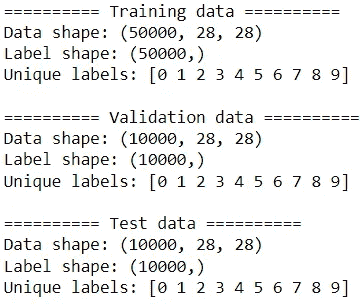

我们有 50K 的训练，10K 验证和 10K 测试 28×28 像素的图像。不出所料，有 10 类数字。现在让我们检查每个分区数据集的类分布:

```
n_classes = len(np.unique(train_labels))
(pd.concat([pd.Series(train_labels).value_counts(normalize=True)
              .sort_index(),
            pd.Series(valid_labels).value_counts(normalize=True)
              .sort_index(),
            pd.Series(test_labels).value_counts(normalize=True)
              .sort_index()], 
           keys=['train', 'valid', 'test'], axis=1)
   .style.background_gradient('YlGn', axis='index').format("{:.2%}"))
```

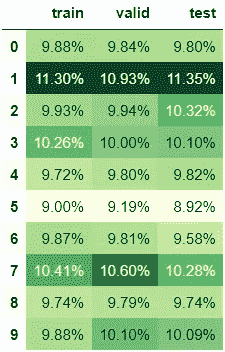

数据集之间的类分布相当均衡。如果你想学习如何像这样美化你的熊猫数据框，你可能会发现这个帖子[很有用。](/prettifying-pandas-dataframes-75c1a1a6877d)

在我们开始构建图像分类模型之前，让我们通过检查一些样本图像来研究数据:

```
def inspect_sample_images(data, labels, title, n_rows=2, n_cols=3, 
                          seed=42):
    np.random.seed(seed)
    indices = np.random.choice(range(len(data)), n_rows*n_cols, 
                               replace=False)
    plt.figure(figsize=(8,5))
    for i, ind in enumerate(indices):
        ax = plt.subplot(n_rows, n_cols, i+1)
        plt.imshow(data[ind], cmap='binary')
        plt.axis('off')
        plt.title(f"Label: {labels[ind]}", fontsize=14)
    plt.suptitle(title, fontsize=20)
    plt.tight_layout();

inspect_sample_images(train_data, train_labels, 'Sample training images')
```

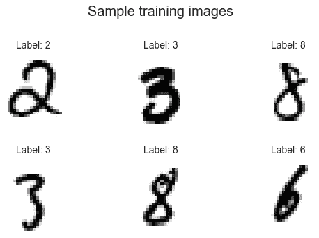

作者图片

我们可以看到图像反映了不同的笔迹。

```
inspect_sample_images(valid_data, valid_labels, 'Sample validation images')
```

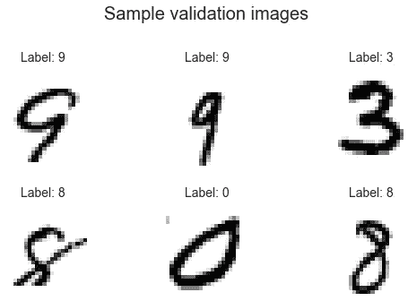

作者图片

左下角的数字 8 被稍微切掉了。也许一些图像可能被裁剪。

```
inspect_sample_images(test_data, test_labels, 'Sample test images')
```

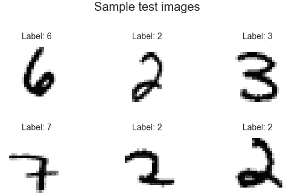

作者图片

在这个例子中有两个 2，他们都有自己的风格。

# 🔨系统模型化

这是令人兴奋的部分！由于模型构建过程是非常实验性和迭代性的，我们将迭代地构建两个模型。

## 🔧模型 0

目前，标签是 1D 数组格式。我们需要像这样对我们的标签进行一次热编码:

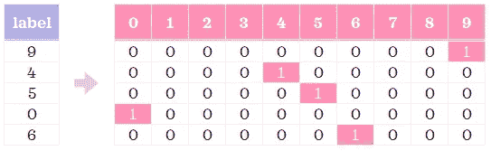

列标题仅用于说明|图片由作者提供

现在，让我们建立我们的第一个简单的神经网络。我们将为可复制性播下种子。

```
train_labels_ohe = tf.one_hot(train_labels, 10)
valid_labels_ohe = tf.one_hot(valid_labels, 10)
test_labels_ohe = tf.one_hot(test_labels, 10)tf.random.set_seed(42)
model_0 = Sequential([
    Flatten(input_shape=(28, 28)),
    Dense(16, activation="relu"),
    Dense(16, activation="relu"),
    Dense(n_classes, activation="softmax")
])model_0.compile(loss="categorical_crossentropy", optimizer='Adam',
                metrics=["accuracy"])
model_0.summary()
```

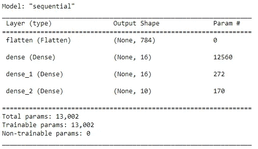

这里我们首先定义了神经网络的架构，然后编译它并打印它的摘要。让我们仔细看看。

◼️ **在第一层`flatten`定义了神经网络** 的架构，它将图像从(28，28) 2D 阵列展平到(784) 1D 阵列。然后，我们有两个完全连接的隐藏层(`dense` & `dense_1`)。对于这些层，我们使用 ReLu 激活函数。接下来是具有`softmax`激活功能(`dense_2`)的输出层，其单元数量与类别数量相同。

**◼编译的模型** 我们用的是`categorical_crossentropy`损失函数。输出层中的损失函数和 softmax 激活函数允许我们获得每个类别的概率，因为我们正在构建多类别分类模型。我们使用了`Adam`优化器。

**◼打印出模型概要** 一旦编译完成，我们可以从概要中看到模型的层数以及参数的数量。

现在，是时候训练网络了:

```
hist_0 = model_0.fit(train_data, train_labels_ohe, epochs=5, 
                     validation_data=(valid_data, valid_labels_ohe))
```

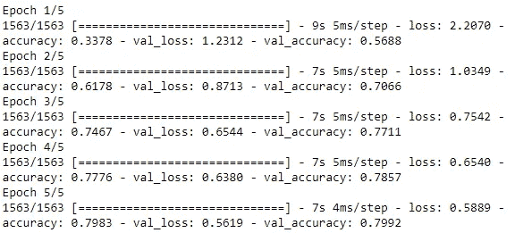

为了更快的训练，我们将只做 5 个周期。这意味着网络将遍历数据 5 次。从上面的总结中，我们看到精度随着每个历元而提高。让我们想象一下各个时期的精确度:

```
def clean_history(hist):
    epochs = len(hist.history['accuracy'])
    df = pd.DataFrame(
        {'epochs': np.tile(np.arange(epochs), 2),
         'accuracy': hist.history['accuracy'] + 
                     hist.history['val_accuracy'], 
         'loss': hist.history['loss'] + 
                 hist.history['val_loss'], 
         'dataset': np.repeat(['train', 'valid'], epochs)}
    )
    return dfsns.lineplot(data=clean_history(hist_0), x='epochs', y='accuracy', 
             hue='dataset');
```

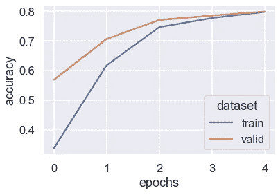

作者图片

我们已经创建了一个函数，因为这将有助于评估后续模型。我们将继续为其他评估方法构建函数。让我们根据看不见的测试数据来评估模型的性能:

```
test_preds_0 = model_0.predict(test_data)
test_classes_0 = test_preds_0.argmax(axis=1)
test_metrics = pd.DataFrame(columns=['Test accuracy'])
test_metrics.loc['model_0'] = np.mean(test_labels==test_classes_0)
test_metrics
```

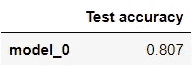

太好了，我们将把后续型号的性能添加到这个数据框架中，这样我们就可以一目了然了。`test_preds_0`由(10000，10) 2D 数组组成，该数组包含每条记录的分类预测概率。然后，我们为每条记录分配概率最高的类别，并将其保存到`test_classes_0`中。现在，让我们看看混淆矩阵:

```
def show_confusion_matrix(labels, classes):
    cm = (pd.crosstab(pd.Series(labels, name='actual'), 
                      pd.Series(classes, name='predicted'))
            .style.background_gradient('binary'))
    return cmshow_confusion_matrix(test_labels, test_classes_0)
```

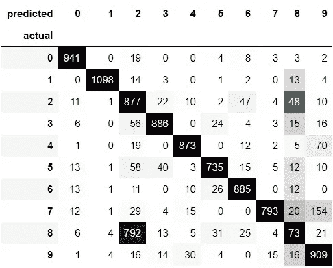

很高兴看到大多数记录都是沿着对角线从左上延伸到右下。有趣的是，目前的模型经常把 8s 和 2s 搞错。

让我们用它们的预测来检查一些示例图像:

```
def inspect_sample_predictions(data, labels, preds, dataset='test', 
                               seed=42, n_rows=2, n_cols=3):
    np.random.seed(seed)
    indices = np.random.choice(range(len(data)), n_rows*n_cols, 
                               replace=False)
    plt.figure(figsize=(8,5))
    for i, ind in enumerate(indices):
        ax = plt.subplot(n_rows, n_cols, i+1)
        plt.imshow(data[ind], cmap='binary')
        plt.axis('off')
        proba = preds[ind].max()
        pred = preds[ind].argmax()
        if pred == labels[ind]:
            colour = 'green'
        else:
            colour = 'red'
        plt.title(f"Prediction: {pred} ({proba:.1%})", fontsize=14, 
                  color=colour)
    plt.suptitle(f'Sample {dataset} images with prediction', 
                 fontsize=20)
    plt.tight_layout();

inspect_sample_predictions(test_data, test_labels, test_preds_0)
```

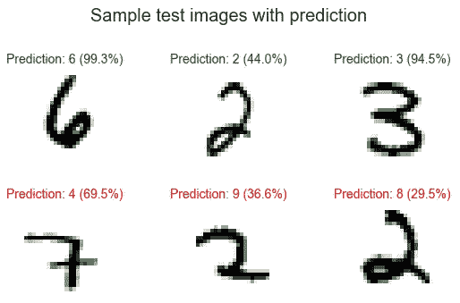

作者图片

我们现在来看看最不正确的预测(即最有可能的不正确预测):

```
def see_most_incorrect(data, labels, preds, dataset='test', seed=42, 
                       n_rows=2, n_cols=3):
    df = pd.DataFrame()
    df['true_class'] = labels
    df['pred_class'] = preds.argmax(axis=1)
    df['proba'] = preds.max(axis=1)

    incorrect_df = df.query("true_class!=pred_class")\
                     .nlargest(n_rows*n_cols, 'proba')

    plt.figure(figsize=(8,5))
    for i, (ind, row) in enumerate(incorrect_df.iterrows()):
        ax = plt.subplot(n_rows, n_cols, i+1)
        plt.imshow(data[ind], cmap='binary')
        plt.axis('off')
        true = int(row['true_class'])
        proba = row['proba']
        pred = int(row['pred_class'])

        plt.title(f"Actual: {true} \nPrediction: {pred} ({proba:.1%})", 
                  fontsize=14, color='red')
    plt.suptitle(f'Most incorrect {dataset} images', fontsize=20)
    plt.tight_layout();

see_most_incorrect(test_data, test_labels, test_preds_0)
```

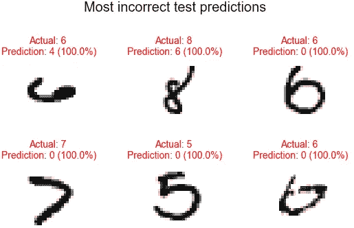

作者图片

由于我们在打印概率时四舍五入到小数点后一位，所以这里的 100.0%很可能代表像 99.95 这样的概率..%或 99.99..%.这让我们看到了该模型肯定会出错的图像。即使对人类来说，第一个和最后一个图像也很难识别为 6。

让我们看看是否可以改进模型。

## 🔧模型 1

神经网络倾向于很好地处理介于 0 和 1 之间的数据。因此，我们将使用以下公式将数据重新调整到此范围:

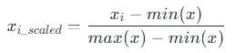

由于像素值的范围在 0(最小值)和 255(最大值)之间，我们只需将值除以 255 即可缩放。除了重新调整，我们将保持其他一切和以前一样。一次改变一件事并理解它的影响是一个好习惯:

```
train_data_norm = train_data/255
valid_data_norm = valid_data/255
test_data_norm = test_data/255tf.random.set_seed(42)
model_1 = Sequential([
    Flatten(input_shape=(28, 28)),
    Dense(16, activation="relu"),
    Dense(16, activation="relu"),
    Dense(n_classes, activation="softmax")
])model_1.compile(loss="categorical_crossentropy", optimizer='Adam',
               metrics=["accuracy"])
model_1.summary()
```

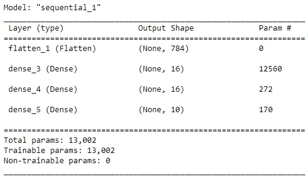

让我们根据重新调整后的数据训练编译后的模型:

```
hist_1 = model_1.fit(
    train_data_norm, train_labels_ohe, epochs=5, 
    validation_data=(valid_data_norm, valid_labels_ohe)
)
```

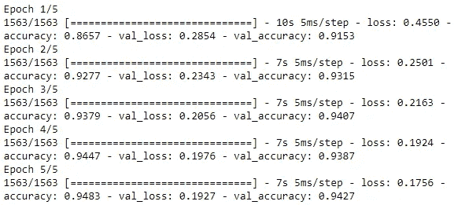

通过简单的预处理步骤，性能比以前好了很多！现在，让我们来看看各个时期的表现:

```
sns.lineplot(data=clean_history(hist_1), x='epochs', y='accuracy', 
             hue='dataset');
```

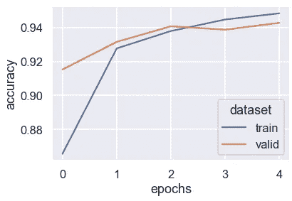

作者图片

是时候根据测试数据评估模型并将其添加到我们的`test_metrics`数据框架中了。

```
test_preds_1 = model_1.predict(test_data_norm)
test_classes_1 = test_preds_1.argmax(axis=1)
test_metrics.loc['model_1'] = np.mean(test_labels==test_classes_1)
test_metrics
```

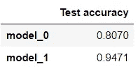

我们通过一个简单的改变大大提高了模型的预测能力。让我们用混淆矩阵更仔细地看看性能:

```
show_confusion_matrix(test_labels, test_classes_1)
```

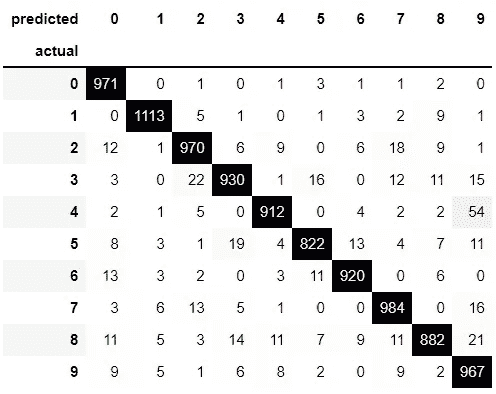

现在，8 不再经常与 2 混淆。现在最常见的错误就是混淆了 4 和 9。这并不奇怪，因为在一些笔迹中，它们看起来确实很相似。

```
inspect_sample_predictions(test_data_norm, test_labels, 
                           test_preds_1)
```


作者图片

当我们使用相同的种子来抽取随机图像时，我们看到的是与之前相同的图像子集。我们可以看到，一些先前预测不正确的图像现在被正确预测了。很高兴看到正确的图像具有高概率，而不正确的图像具有较低的概率。

```
see_most_incorrect(test_data_norm, test_labels, test_preds_1)
```


作者图片

我们可以看到仍有改进的余地。

让我们看看是否可以改进模型。

## 🔧模型 2

我们将使用`model_1`作为基础，并将隐藏层中的单元数量从 16 增加到 64:

```
tf.random.set_seed(42)model_2 = Sequential([
    Flatten(input_shape=(28, 28)),
    Dense(64, activation="relu"),
    Dense(64, activation="relu"),
    Dense(n_classes, activation="softmax")
])model_2.compile(loss="categorical_crossentropy", optimizer='Adam',
                metrics=["accuracy"])model_2.summary()
```

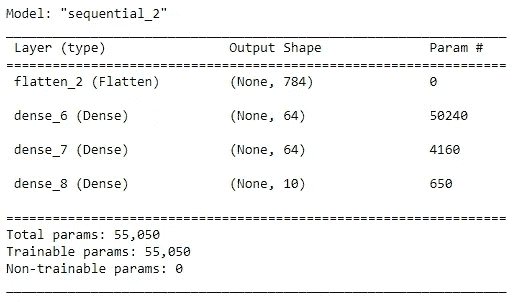

由于增加了单位数量，我们现在有了更多的参数。

```
hist_2 = model_2.fit(
    train_data_norm, train_labels_ohe, epochs=5, 
    validation_data=(valid_data_norm, valid_labels_ohe)
)
```

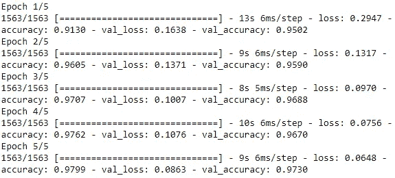

模型性能看起来比以前略好。

```
sns.lineplot(data=clean_history(hist_2), x='epochs', y='accuracy', 
             hue='dataset');
```

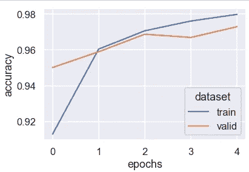

作者图片

在过去的两个时代中，该模型略有过度拟合。让我们根据测试数据评估模型:

```
test_preds_2 = model_2.predict(test_data_norm)
test_classes_2 = test_preds_2.argmax(axis=1)
test_metrics.loc['model_2'] = np.mean(test_labels==test_classes_2)
test_metrics
```

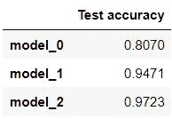

太棒了，很高兴看到我们仍然看到模型的改进。

```
show_confusion_matrix(test_labels, test_classes_2)
```

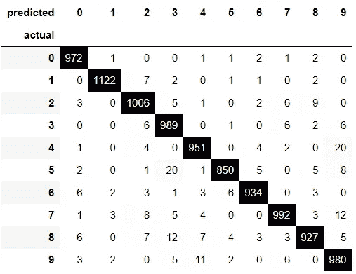

随着模型越来越精确，混淆矩阵看起来沿着对角线越来越集中，在剩余的单元中主要是浅灰色到白色的单元。

```
inspect_sample_predictions(test_data_norm, test_labels, 
                           test_preds_2)
```

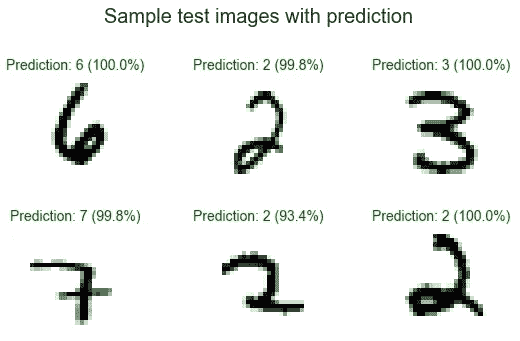

作者图片

现在，模型得到了所有正确的样本图像！

```
see_most_incorrect(test_data_norm, test_labels, test_preds_2)
```

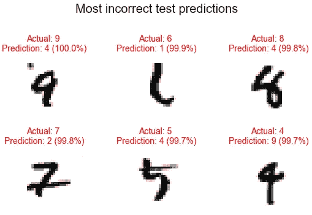

作者图片

顶部中间的图像看起来很棘手，而其余的图像相对来说更容易被人类识别。

让我们看看我们是否能最后一次改进模型。

## 🔧模型 3

卷积神经网络(CNN)可以很好地处理图像数据。现在让我们用一个简单的 CNN 来分析我们的数据。

```
model_3 = Sequential([
    Conv2D(32, 5, padding='same', activation='relu', 
           input_shape=(28,28,1)),
    Conv2D(32, 5, padding='same', activation='relu'),
    MaxPooling2D(), 
    Conv2D(32, 5, padding='same', activation='relu'),
    Conv2D(32, 5, padding='same', activation='relu'),
    MaxPooling2D(), 
    Flatten(),
    Dense(128, activation='relu'),
    Dense(n_classes, activation="softmax")
])model_3.compile(loss="categorical_crossentropy", optimizer='Adam',
                metrics=["accuracy"])
model_3.summary()
```

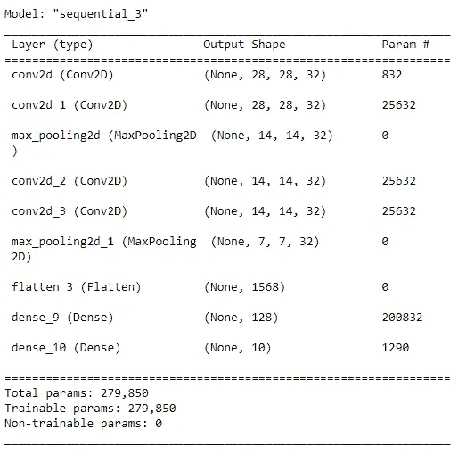

我们现在有了更多的参数。让我们训练模型:

```
hist_3 = model_3.fit(
    train_data_norm, train_labels_ohe, epochs=5, 
    validation_data=(valid_data_norm, valid_labels_ohe)
)
```

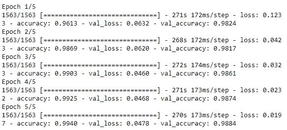

太棒了，性能似乎有轻微提高！

```
sns.lineplot(data=clean_history(hist_3), x='epochs', y='accuracy', 
             hue='dataset');
```

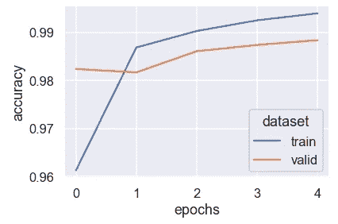

作者图片

我们可以看到，该模型是非常轻微的过度拟合。

```
test_preds_3 = model_3.predict(test_data_norm)
test_classes_3 = test_preds_3.argmax(axis=1)
test_metrics.loc['model_3'] = np.mean(test_labels==test_classes_3)
test_metrics
```

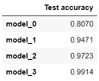

哇，我们已经达到 99%的准确率了！✨

```
show_confusion_matrix(test_labels, test_classes_3)
```

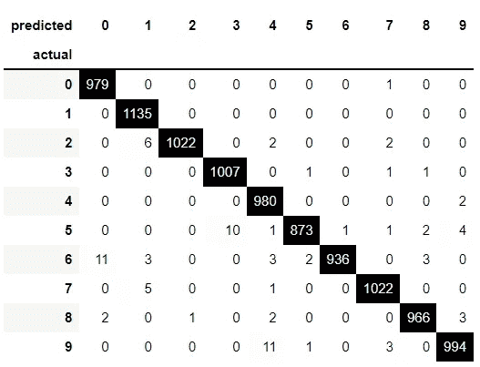

这是迄今为止最好看的混淆矩阵。我们看到对角线上有许多零，一些数字的对角线上有 1000+。

```
inspect_sample_predictions(test_data_norm, test_labels, 
                           test_preds_3)
```

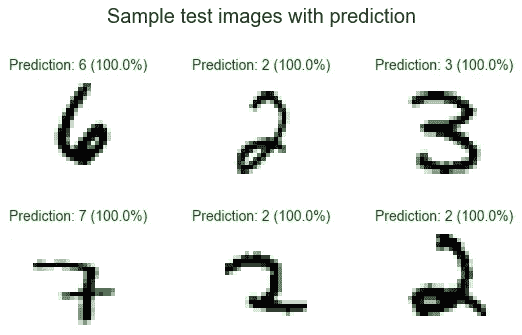

作者图片

像以前一样，样本图像被正确预测。

```
see_most_incorrect(test_data_norm, test_labels, test_preds_3)
```

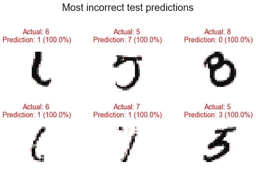

作者图片

其中一些图像有点棘手，尤其是 6s 和 7。这些 6 中的一个似乎也被`model_2`认定为最不正确的预测之一。

为了节省时间，我们将在这里结束我们的模型实验。在实践中，几乎可以肯定的是，在我们确定一个模型之前，我们将不得不进行更多的迭代。在这篇文章中，我们看到每一次迭代都提高了我们的模型预测能力。然而，这在实践中并不总是正确的，因为一些实验想法并不奏效。这是正常的，只是实验方法的一种性质。

虽然我们只探索了四个模型中的几个想法，但我们可以通过无数种方式扩展实验来改进模型。这里有一些尝试改进模型的方法:
◼️增加层数
◼️改变激活函数
◼️训练更长时间(即更多的时期)

如果您正在处理众所周知的数据集，获得神经网络设计灵感的一种方法是查看领先的模型架构。例如，我们可以从代码为的[论文中看到 MNIST 数据集上的领先模型。写这篇文章的时候，](https://paperswithcode.com/sota/image-classification-on-mnist)[简单 CNN 的齐次系综](https://paperswithcode.com/paper/an-ensemble-of-simple-convolutional-neural)正以 99.91 的准确率领先。如果你很好奇，你可以从[论文](https://arxiv.org/pdf/2008.10400v2.pdf)中了解更多关于该模型及其架构的信息。此外，通常还有一个[伴随代码](https://github.com/ansh941/MnistSimpleCNN)来进一步挖掘。由于大多数领先的模型往往有很强的性能，你的选择不仅仅局限于顶级模型。

# 🔐保存模型

一旦我们对一个模型满意了，就有一个方便直观的方法来保存我们的模型:

```
model_3.save('model_3')
```

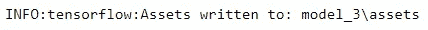

通过保存模型，我们可以在下次加载模型，并直接使用它来进行预测，而不必从头开始构建。加载的模型的性能将与我们刚刚训练的模型完全相同。

```
loaded_model_3 = tf.keras.models.load_model('model_3')
print(f"Test accuracy: {np.mean(loaded_model_3.predict(test_data_norm).argmax(axis=1)==test_labels):.1%}")
```

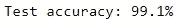

这就是这篇文章的全部内容！希望这篇文章简要介绍了使用 Tensorflow 构建基本的图像分类模型以及如何迭代改进结果。完成基本的图像分类后，我们将在系列的第 2 部分[中通过查看更真实的图像来积累经验。](/introduction-to-image-classification-with-tensorflow-part-2-219cf37aceef#d5c8-d9d3f896c5a)


[拥有摄影](https://unsplash.com/@possessedphotography?utm_source=medium&utm_medium=referral)的照片在 [Unsplash](https://unsplash.com?utm_source=medium&utm_medium=referral) 上

*您想访问更多这样的内容吗？媒体会员可以无限制地访问媒体上的任何文章。如果您使用* [*我的推荐链接*](https://zluvsand.medium.com/membership)*成为会员，您的一部分会费将直接用于支持我。*

谢谢你看我的帖子。如果你感兴趣，这里有我的一些帖子的链接:

◼️️ [管道、ColumnTransformer 和 FeatureUnion 解释](/pipeline-columntransformer-and-featureunion-explained-f5491f815f?source=your_stories_page-------------------------------------)
◼️️ [FeatureUnion、ColumnTransformer &管道用于预处理文本数据](/featureunion-columntransformer-pipeline-for-preprocessing-text-data-9dcb233dbcb6)
◼️ [用这些提示丰富您的 Jupyter 笔记本](/enrich-your-jupyter-notebook-with-these-tips-55c8ead25255)
◼️ [用这些提示整理您的 Jupyter 笔记本](/organise-your-jupyter-notebook-with-these-tips-d164d5dcd51f)
◼️ [解释 Scikit-用 SHAP 学习模型](/explaining-scikit-learn-models-with-shap-61daff21b12a)
◼️️ [在 scikit 中选择特性](/feature-selection-in-scikit-learn-dc005dcf38b7)

再见🏃 💨