# 张量流图像分类简介(二)

> 原文：<https://towardsdatascience.com/introduction-to-image-classification-with-tensorflow-part-2-219cf37aceef>

## Python 计算机视觉初学者实用指南

[在](/introduction-to-image-classification-with-tensorflow-part-1-381d0a373b8f)系列的第一部分中，我们在包含手写数字黑白图像的 MNIST 数据集上构建了基本的图像分类模型。这些数据很容易通过 TensorFlow 获得。然而，在实践中，现实生活中的图像是丰富多彩的，数据通常不容易获得。在这篇文章中，我们将练习自己加载图像数据，并在彩色图像上建立模型。我们还将学习一点关于迁移学习的知识。


照片由 [Mae Mu](https://unsplash.com/@picoftasty?utm_source=medium&utm_medium=referral) 在 [Unsplash](https://unsplash.com?utm_source=medium&utm_medium=referral) 上拍摄

# 📦数据

我们将使用从蔬菜农场和市场收集的 15 种蔬菜的图像。关于该数据集的官方论文可在[这里](https://www.researchgate.net/publication/352846889_DCNN-Based_Vegetable_Image_Classification_Using_Transfer_Learning_A_Comparative_Study)获得。数据集可通过 [CC BY-SA 4.0 许可证](https://creativecommons.org/licenses/by-sa/4.0/)获得。

如果您想跟随教程，请从[蔬菜图像数据集| Kaggle](https://www.kaggle.com/datasets/misrakahmed/vegetable-image-dataset) 下载数据集，并将数据保存在与您的笔记本位于同一目录的名为`data`的文件夹中，并将`validation`子目录重命名为`valid`。完成后，您的工作目录将如下所示:

```
image_classification
├── *.ipynb
├── data
│   ├── train
│   │   ├── class 1
│   │   │   ├── image1.jpg
│   │   │   ├── ...
│   │   │   ├── imagen.jpg
│   │   ├── ...
│   │   ├── class n
│   │   │   ├── image1.jpg
│   │   │   ├── ...
│   │   │   ├── imagen.jpg
│   ├── valid
│   │   ├── class 1
│   │   │   ├── image1.jpg
│   │   │   ├── ...
│   │   │   ├── imagen.jpg
│   │   ├── ...
│   │   ├── class n
│   │   │   ├── image1.jpg
│   │   │   ├── ...
│   │   │   ├── imagen.jpg
│   ├── test
│   │   ├── class 1
│   │   │   ├── image1.jpg
│   │   │   ├── ...
│   │   │   ├── imagen.jpg
│   │   ├── ...
│   │   ├── class n
│   │   │   ├── image1.jpg
│   │   │   ├── ...
│   │   │   ├── imagen.jpg
```

这是组织图像的完美格式。每个分区数据集将不同类别的图像保存在以类别命名的单独子目录中。

我们现在将加载图像库并检查图像总数:

```
import pathlib
import numpy as np
import pandas as pd
import matplotlib.pyplot as plt
import matplotlib.image as mpimg
import seaborn as sns
sns.set(style='darkgrid', context='talk')import tensorflow as tf
from tensorflow.keras.preprocessing import image_dataset_from_directory
from tensorflow.keras.models import Sequential
from tensorflow.keras.layers import (Input, Rescaling, Conv2D, 
                                     MaxPooling2D, Flatten, Dense)
from tensorflow.keras.optimizers import Adam
from tensorflow.keras.applications.resnet import ResNet50images = [*pathlib.Path('data').glob('**/*.jpg')]
print(f"There are {len(images)} images.")
```

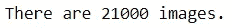

我们总共有 21K 张图片。让我们确认在分区的数据集中类名是相同的:

```
train_classes = [item.name for item in 
                 pathlib.Path('data/train').glob('*')]
valid_classes = [item.name for item in 
                 pathlib.Path('data/valid').glob('*')]
test_classes = [item.name for item in 
                pathlib.Path('data/test').glob('*')]if train_classes==valid_classes==test_classes:
    print("All datasets have the same classes.")
print(f"There are total of {len(train_classes)} classes.")
```

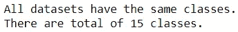

太棒了，数据集上的类名都匹配。我们现在将创建 [TensorFlow 数据集](https://www.tensorflow.org/api_docs/python/tf/data/Dataset)，它将在需要时批量加载数据。我们将混洗训练图像，以便在每一批中我们都有混合的蔬菜。

```
image_size = (224, 224)
shape = image_size + (3,)
batch_size = 32print("========== Training data ==========")
train_data = image_dataset_from_directory(
    directory='data/train', label_mode='categorical',
    image_size=image_size, batch_size=batch_size,
    seed=42
)
print("\n========== Validation data ==========")
valid_data = image_dataset_from_directory(
    directory='data/valid', label_mode='categorical',
    image_size=image_size, batch_size=batch_size,
    shuffle=False
)print("\n========== Test data ==========")
test_data = image_dataset_from_directory(
    directory='data/test', label_mode='categorical',
    image_size=image_size, batch_size=batch_size,
    shuffle=False
)len(train_data.class_names)==len(valid_data.class_names)==len(test_data.class_names)
```

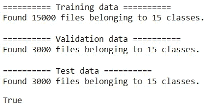

从图像的父目录推断图像的类名。我们看到这些推断的类名可以通过`.class_names`属性访问。让我们按类检查每个数据集的图像数量:

```
summary = pd.DataFrame()
for d in ['train', 'valid', 'test']:
    for c in train_classes:
        n = len([i for i in 
                 pathlib.Path(f'data/{d}/{c}').glob('*.jpg')])
        summary.loc[c, d] = n
summary.style.format("{:.0f}")
```


每堂课有 1000 个训练、200 个验证和 200 个测试图像。

现在，让我们在开始建模之前看看示例图像:

```
n_rows = 2
n_cols = 3train_path = pathlib.Path('data/train')
train_images = [item for item in train_path.glob('*/*.jpg')]
np.random.seed(42)
sample_images = np.random.choice(train_images, n_rows*n_cols, 
                                 replace=False)plt.figure(figsize=(12,8))
for i, image in enumerate(sample_images):
    ax = plt.subplot(n_rows, n_cols, i+1)
    plt.imshow(mpimg.imread(image))
    plt.axis('off')
    plt.title(image.parts[2])
plt.suptitle('Sample training images', fontsize=20);
```

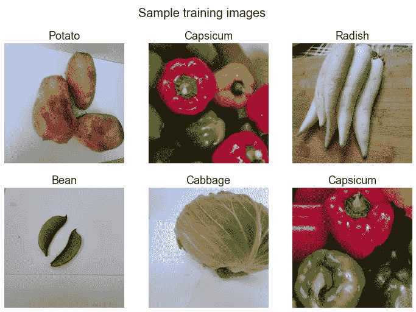

# 🔨系统模型化

## 🔧型号 0

在第 1 部分中，我们构建的 CNN 架构被证明是 MNIST 数据集上表现最好的模型。因此，我们将从对蔬菜数据应用与基线模型相同的体系结构开始:

```
n_classes = len(train_data.class_names)model_0 = Sequential([
    Rescaling(1./255, input_shape=shape),
    Conv2D(32, 5, padding='same', activation='relu'),
    Conv2D(32, 5, padding='same', activation='relu'),
    MaxPooling2D(), 
    Conv2D(32, 5, padding='same', activation='relu'),
    Conv2D(32, 5, padding='same', activation='relu'),
    MaxPooling2D(), 
    Flatten(),
    Dense(128, activation='relu'),
    Dense(n_classes, activation='softmax')
])model_0.compile(loss='categorical_crossentropy', optimizer='Adam', 
                metrics=['accuracy'])
model_0.summary()
```

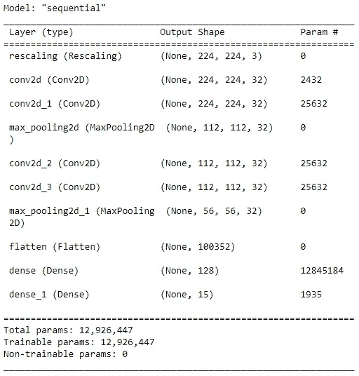

让我们训练网络。我们将只运行两个阶段，因为现在培训更加耗时:

```
hist_0 = model_0.fit(train_data, epochs=2, 
                     validation_data=valid_data)
```

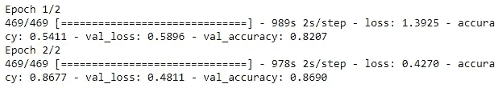

对于 15 个类别，大约 87%的准确率相当不错。让我们看看不同时期的准确性:

```
def clean_history(hist):
    epochs = len(hist.history['accuracy'])
    df = pd.DataFrame(
        {'epochs': np.tile(np.arange(epochs), 2),
         'accuracy': hist.history['accuracy'] + 
                     hist.history['val_accuracy'], 
         'loss': hist.history['loss'] + 
                 hist.history['val_loss'], 
         'dataset': np.repeat(['train', 'valid'], epochs)}
    )
    return dfsns.lineplot(data=clean_history(hist_0), x='epochs', y='accuracy', 
             hue='dataset');
```

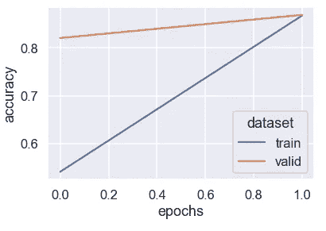

我们将为每个测试图像准备标签。这将有助于进一步评估模型:

```
test_path = pathlib.Path('data/test')
test_images = [item for item in test_path.glob('*/*.jpg')]test_labels = []
for _, labels in test_data.unbatch():
    test_labels.append(labels.numpy().argmax())
test_labels[:10]
```

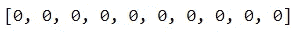

现在，让我们根据测试数据检查模型的性能:

```
test_preds_0 = model_0.predict(test_data)
test_classes_0 = test_preds_0.argmax(axis=1)
test_metrics = pd.DataFrame(columns=['Test accuracy'])
test_metrics.loc['model_0'] = np.mean(test_labels==test_classes_0)
test_metrics
```

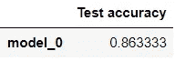

第一个模型约 87%的准确率是一个很好的开始。让我们通过课堂来理解表演:

```
def show_confusion_matrix(labels, classes):
    cm = (pd.crosstab(pd.Series(labels, name='actual'), 
                      pd.Series(classes, name='predicted'))
            .style.background_gradient('binary'))
    return cmshow_confusion_matrix(test_labels, test_classes_0)
```

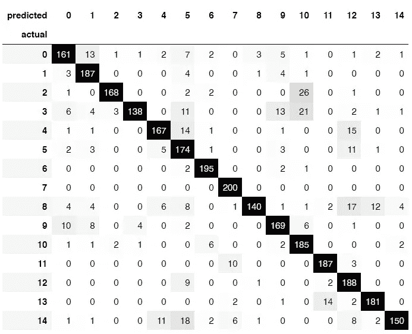

很高兴看到大部分图像都集中在对角线上。在这里，我们选择不命名类，因为有空格(用类名代替数字会扩大表格的尺寸)。对角线上有一些较深的灰色单元格。例如，3 班有时会与 10 班混淆。有一种方法可以找到 3 级和 10 级的标签:

```
print(f"Class 3 is {train_data.class_names[3]}")
print(f"Class 10 is {train_data.class_names[10]}")
```

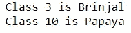

所以布林哈尔偶尔会被误认为是木瓜。现在，让我们看看一些示例图像及其预测:

```
def inspect_sample_predictions(images, preds, dataset='test', 
                               seed=42, n_rows=2, n_cols=3):
    np.random.seed(seed)
    indices = np.random.choice(range(len(images)), n_rows*n_cols, 
                               replace=False)
    plt.figure(figsize=(12,8))
    for i, index in enumerate(indices):
        ax = plt.subplot(n_rows, n_cols, i+1)
        image = images[index]
        plt.imshow(mpimg.imread(image))
        plt.axis('off')

        proba = preds[index].max()
        pred = preds[index].argmax()
        pred_class = test_data.class_names[pred]
        if pred_class == image.parts[2]:
            colour = 'green'
        else:
            colour = 'red'
        plt.title(f"Actual: {image.parts[2]} \nPredicted: {pred_class} ({proba:.1%})", color=colour, fontsize=14)
    plt.suptitle(f'Sample {dataset} images with prediction', fontsize=20)
    plt.tight_layout();

inspect_sample_predictions(test_images, test_preds_0)
```

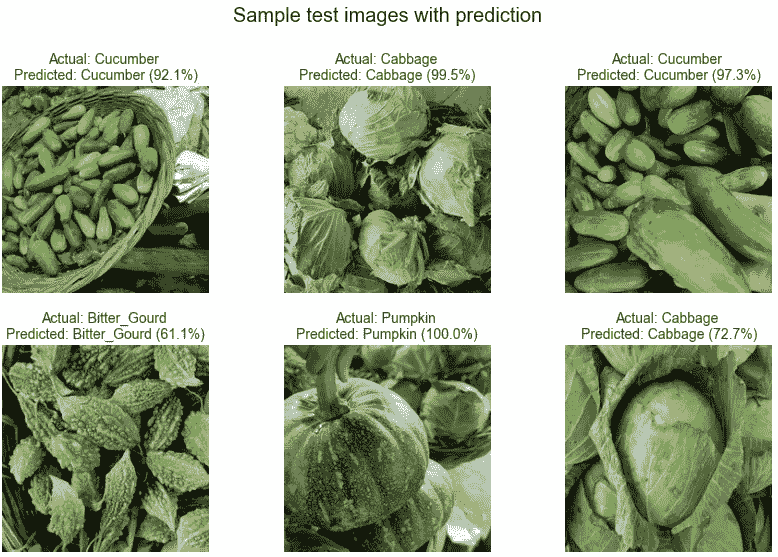

很高兴看到所有这些样本图像都被正确预测。我们看到各种预测的置信度。现在，我们来看看最不正确的预测:

```
def see_most_incorrect(data, images, preds, dataset='test', seed=42, 
                       n_rows=2, n_cols=3):
    df = pd.DataFrame()    
    df['true_class'] = [image.parts[2] for image in images]
    df['pred_class'] = [data.class_names[pred] for 
                        pred in preds.argmax(axis=1)]
    df['proba'] = preds.max(axis=1)
    incorrect_df = df.query("true_class!=pred_class")\
                     .nlargest(n_rows*n_cols, 'proba')

    plt.figure(figsize=(8,5))
    for i, (ind, row) in enumerate(incorrect_df.iterrows()):
        ax = plt.subplot(n_rows, n_cols, i+1)
        plt.imshow(plt.imread(images[ind]), cmap='binary')
        plt.axis('off')
        true = row['true_class']
        proba = row['proba']
        pred = row['pred_class']

        plt.title(f"Actual: {true}\nPred: {pred} ({proba:.1%})", fontsize=14, color='red')
    plt.suptitle(f'Most incorrect {dataset} predictions', fontsize=20)
    plt.tight_layout();

see_most_incorrect(test_data, test_images, test_preds_0)
```

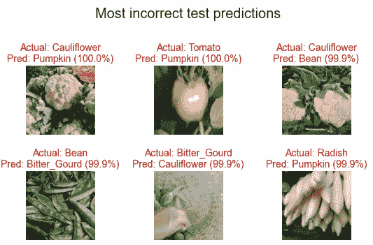

在上面的中间图像中，您能马上分辨出是西红柿吗？西红柿的颜色不是你所期望的。

正如我们在上一篇文章中所了解到的，我们可以尝试通过添加层、更多单元、运行更多时代来增加模型的复杂性。如果模型对训练数据过拟合，在神经网络中加入[脱落层](https://www.tensorflow.org/api_docs/python/tf/keras/layers/Dropout)有助于减少过拟合。或者，通过数据增强等技术获取更多数据或增加数据的多样性也有助于最小化过度拟合。[数据增强](https://www.tensorflow.org/tutorials/images/data_augmentation)是一种通过变换图像使训练数据多样化的技术。例如，作为数据增强的一部分，可以随机旋转、裁剪、平移、缩放和翻转图像。当没有更多数据可用时，通过数据增强使数据多样化可以帮助在更具普遍性的图像上训练模型。

让我们看看是否能改进这个模型。

## 🔧型号 1

到目前为止，我们一直在自己构建模型。然而，我们可以考虑另一种选择:迁移学习，在这种情况下，我们重用预先训练的模型。对于这个迭代，我们将使用迁移学习。特别是，我们将使用一种称为特征提取的迁移学习。在特征提取中，我们将保持预训练模型不变，只改变输出层以适应我们的用例。

我们将使用 [ResNet-50 型号](https://paperswithcode.com/method/resnet)。该模型在通过 [ImageNet](https://image-net.org/) 数据库获得的数千张图像上进行训练。在 TensorFlow 中，有几种不同的方法来加载预训练的模型。我们将使用下面的简单方法来加载一个模型。这里，我们指定 ResNet 模型不包括顶层，因为我们想要构建自己的输出层，它适用于 15 个蔬菜类。我们将在 ResNet 模型上添加展平层和输出层。

```
model_1 = Sequential([
    ResNet50(include_top=False, weights='imagenet', 
             input_shape=shape),
    Flatten(),
    Dense(n_classes, activation='softmax')
])model_1.compile(optimizer=Adam(learning_rate=0.0001), 
                loss='categorical_crossentropy', 
                metrics=['accuracy'])
model_1.summary()
```

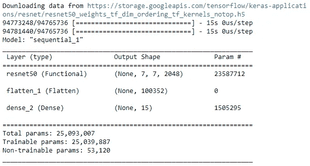

现在，我们将确保所有层都被设置为不可训练，以便从 ImageNet 学习的模型的权重和偏差保持不变。然后，我们将训练模型:

```
for layer in model_1.layers[0].layers:
    layer.trainable=False
hist_1 = model_1.fit(train_data, validation_data=valid_data, 
                     epochs=2)
```

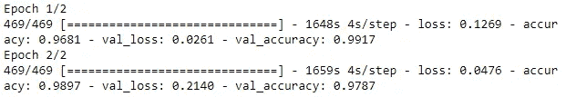

哇，模型精度明显提高了！即使有 1 epoch，性能看起来也很棒。

让我们按时代来看性能:

```
sns.lineplot(data=clean_history(hist_1), x='epochs', y='accuracy', 
                                hue='dataset');
```

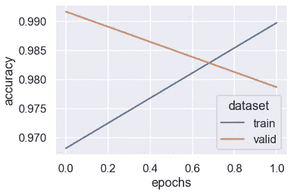

随着第二个纪元，我们开始稍微过度拟合。

```
test_preds_1 = model_1.predict(test_data)
test_classes_1 = test_preds_1.argmax(axis=1)
test_metrics.loc['model_1'] = np.mean(test_labels==test_classes_1)
test_metrics
```

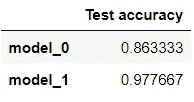

15 个类别的准确率达到 98%左右，这是一个很好的性能。让我们按类进一步挖掘:

```
show_confusion_matrix(test_labels, test_classes_1)
```

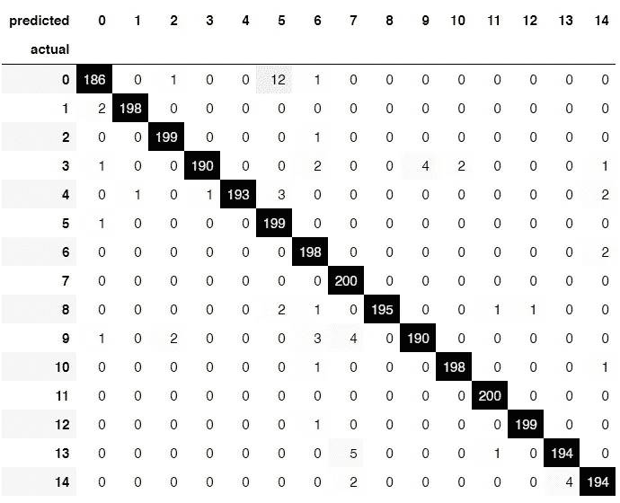

很高兴看到大多数值都集中在对角线上。通过重用预训练模型，我们可以达到事半功倍的效果。

```
inspect_sample_predictions(test_images, test_preds_1)
```

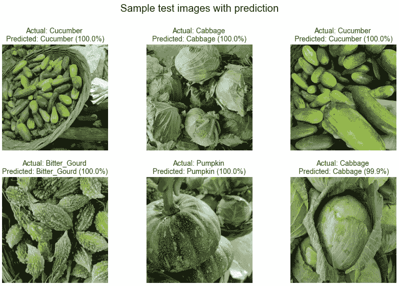

与上一次迭代一样，样本图像被正确预测。预测概率比以前更高。

```
see_most_incorrect(test_data, test_images, test_preds_1)
```

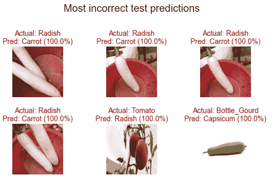

有趣的是，红底萝卜和胡萝卜被混淆了。这有助于了解模型的错误之处。

迁移学习也适用于较小的数据集(即较少的图像)，只要您使用的模型是在相似的数据集上预先训练的。已经对迁移学习有了一个快速的介绍，如果你想了解更多关于迁移学习的知识，[这个资源](https://www.tensorflow.org/tutorials/images/transfer_learning)可能会有帮助。如果您想尝试其他预训练模型，请从[这里](https://www.tensorflow.org/api_docs/python/tf/keras/applications)查看其他可用模型。

这就是这篇文章的全部内容！希望你已经学到了一些实用的技能，可以开始你的计算机视觉之旅。如果你想通过在不同的数据集上应用我们作为系列的一部分所学的知识来获得更多的图像分类经验，Kaggle 中的这个[开放数据集可能对你有用。](https://www.kaggle.com/datasets?tags=13207-Computer+Vision)


安娜·佩尔泽在 [Unsplash](https://unsplash.com?utm_source=medium&utm_medium=referral) 上的照片

*您想访问更多这样的内容吗？媒体会员可以无限制地访问媒体上的任何文章。如果你使用* [*我的推荐链接*](https://zluvsand.medium.com/membership) ，*成为会员，你的一部分会费会直接去支持我。*

谢谢你看我的帖子。如果你感兴趣，这里有我的一些帖子的链接:

◼️️ [管道、ColumnTransformer 和 FeatureUnion 讲解](/pipeline-columntransformer-and-featureunion-explained-f5491f815f?source=your_stories_page-------------------------------------)
◼️️ [FeatureUnion、ColumnTransformer &管道用于预处理文本数据](/featureunion-columntransformer-pipeline-for-preprocessing-text-data-9dcb233dbcb6)
◼️ [用这些提示丰富您的 Jupyter 笔记本](/enrich-your-jupyter-notebook-with-these-tips-55c8ead25255)
◼️ [用这些提示整理您的 Jupyter 笔记本](/organise-your-jupyter-notebook-with-these-tips-d164d5dcd51f)
◼️ [讲解 Scikit-用 SHAP 学习模型](/explaining-scikit-learn-models-with-shap-61daff21b12a)
◼️️ [在 scikit 中选择特性](/feature-selection-in-scikit-learn-dc005dcf38b7)

再见🏃 💨