# 图像嵌入和精度简介

> 原文：<https://towardsdatascience.com/introduction-to-image-embedding-and-accuracy-53473e8965f>

## [潜在空间的广泛介绍](https://towardsdatascience.com/tagged/image-autoencoder)

## 通过聚类、线性判别分析和性能评估

[马特·霍华德](https://unsplash.com/@thematthoward?utm_source=medium&utm_medium=referral)在[号航天飞机](https://unsplash.com?utm_source=medium&utm_medium=referral)上拍摄的照片

[前一章](/introduction-to-embedding-clustering-and-similarity-11dd80b00061)是嵌入、相似性和聚类的概述。本章通过扩展嵌入的概念将图像也包括在内，从而建立在这些基础之上。我们将探索在[上一章](/introduction-to-embedding-clustering-and-similarity-11dd80b00061)中介绍的 K-Means 聚类在图像嵌入中的表现，并介绍通过准确度和召回率来衡量性能的方法。引入了一种简单的线性判别分析形式的潜在空间嵌入(LSE)，以帮助我们理解聚类和性能是如何作用于图像的。本章不解释伦敦经济学院，因为它将在下一章介绍。

目录:

*   2.1 图像嵌入
*   2.2 集群性能
*   2.3 讨论
*   2.4 结论

## 2.1 图像嵌入

[第 1 章](/introduction-to-embedding-clustering-and-similarity-11dd80b00061)解释了相同对象的不同嵌入如何适用于不同的应用。以图像形式嵌入书籍不适合书籍推荐，但需要以流派形式嵌入。然而，我们不能阅读使用体裁嵌入的书，因为这个应用程序需要实际的文本。一般来说，当使用嵌入时，目标是找到一种嵌入方法，为我们提供适合应用的相似性。

当寻找相似之处时，图像是一种复杂的嵌入形式。一个例子可能是一个用例，我们需要一个移动应用程序来帮助我们识别我们正在观察的[动物](https://www.kaggle.com/datasets/alessiocorrado99/animals10)。在这里，我们需要找到图像和动物物种之间的相似之处。

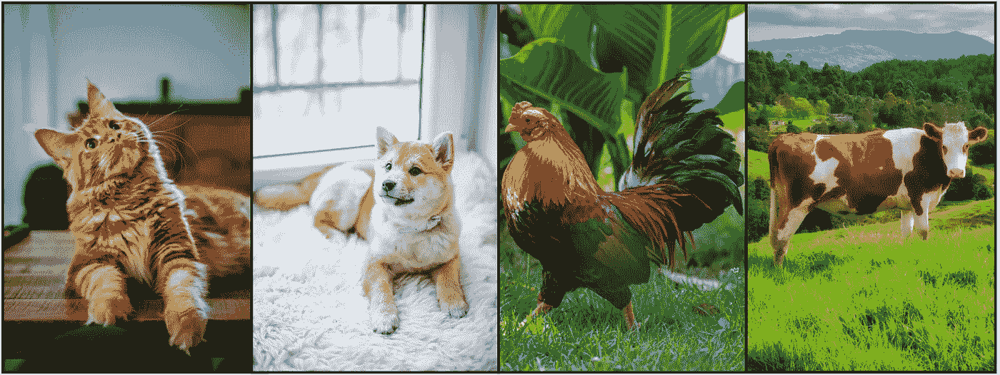

图 2.1 —作为数据集类别示例的动物图像:[动物-10](https://www.kaggle.com/datasets/alessiocorrado99/animals10) 。在 [Unsplash](https://unsplash.com/photos/75715CVEJhI) 上 [Amber Kipp](https://unsplash.com/@sadmax) 的猫照，在 [Pexel](https://www.pexels.com/photo/brown-and-white-short-coated-puppy-1805164/) 上 [Valeria Boltneva](https://www.pexels.com/@valeriya/) 的狗照，在 [Pexel](https://www.pexels.com/photo/red-and-black-rooster-on-green-grass-3820303/) 上 [Erik Karits](https://www.pexels.com/@erik-karits-2093459/) 的鸡照，在 [Unsplash](https://unsplash.com/photos/nUCt1PjRNHE) 上 [Gabriel Porras](https://unsplash.com/@gabrielizalo) 的牛照。

图像是我们在现实世界中看到的嵌入物。图像包括像素，每个像素是一种颜色。上面的图像是由 10.000 个这样的像素组合而成的。确切地说是图像)。每个像素提供了少量独特的信息，我们只能获得所有像素的完整图像。每个像素代表一种知识，因此应该有自己独特的维度。第一章展示了如何用两种体裁来表现一本书，给它两个维度。然而，一个 250x400 像素的灰度图像总共有 100.000 个维度！

图 2.2 —将图像转化为数字的过程。摘自[第一章](/introduction-to-embedding-clustering-and-similarity-11dd80b00061)，图 1.1。由[杰斯·贝利](https://unsplash.com/photos/gL2jT6xHYOY)在 [Unsplash](https://unsplash.com?utm_source=medium&utm_medium=referral) 上拍摄的图书照片

那么问题就变成了，像素嵌入可以用来对图像中的动物进行分类吗？图 2.1 有四组动物(即猫、狗、鸡和牛)。从 [Animal-10](https://www.kaggle.com/datasets/alessiocorrado99/animals10) 数据集中提取每组的 16 幅图像，并放置在图 2.3 中的坐标系内(每组动物都有独特的颜色)。这些动物来自于[ka ggle](https://www.kaggle.com/datasets/alessiocorrado99/animals10)【1】上的 [Animal-10](https://www.kaggle.com/datasets/alessiocorrado99/animals10) 数据集，可以免费下载。

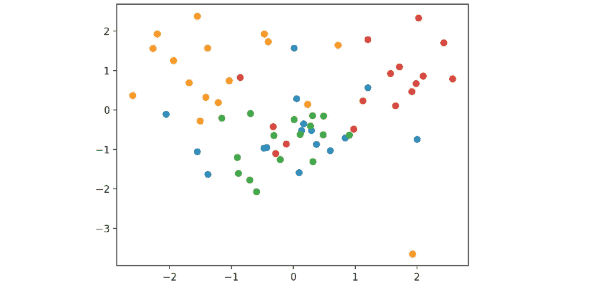

图 2.3 —图 2.1 中的四种动物在 2D 空间中各有 16 张图片。线性判别分析(LDA)用于将图像转换为 2D，因为它侧重于分类。

细心的读者可能会认识到，该图只显示了两个维度，而不是所有的 100.000。为了简单起见，我们从二维开始，然后将技术扩展到所有 100.000 维。关键要点是，彩色点没有清晰的单一颜色组，而是全部混合在一起。

[主成分分析【2】](/principal-component-analysis-pca-explained-visually-with-zero-math-1cbf392b9e7d)(PCA)和[线性判别分析【3】](/linear-discriminant-analysis-explained-f88be6c1e00b)(LDA)都可以将一幅图像变换成 2D。PCA 侧重于转换没有类的数据，LDA 侧重于转换有类的数据。LDA 用于将图像转换为 2D，因为每幅图像中的动物是预先已知的。

**图像嵌入**部分的剩余部分解释了如何从图 2.3 生成图形。您可以继续阅读下一节 **2.2 集群性能**，跳过如何生成图表的详细说明

**如何从图 2.3 中生成图形的详细说明:** 图 2.3 中的点代表 Kaggle 上托管的 [*Animal-10*](https://www.kaggle.com/datasets/alessiocorrado99/animals10) 数据集的动物。该数据集可以在免费登录后从网站下载。下载按钮在图 2.4 中突出显示。

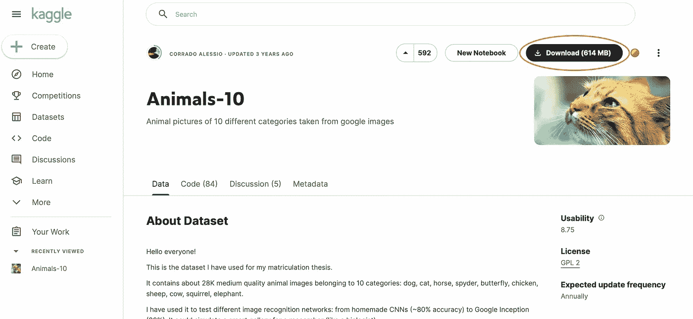

图 2.4—ka ggle 上的 Animal-10 数据集，突出显示了下载按钮。

将从 Kaggle 下载一个“存档”文件夹，由一个名为 *raw-img* 的文件夹和一个名为 *translate.py* 的文件组成。将 *raw-img* *文件夹*放在已知位置；参见图 2.5。我们在代码 2.1 中定义了数据集的位置，以便以后可以访问它。

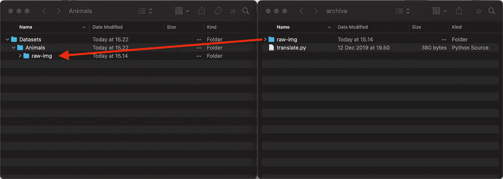

图 2.5 —将“raw-img”文件移动到已知位置。在本例中，它被移动到“数据集/动物/”文件夹中。代码 2.1 中提到了该位置。

代码 2.1 —定义动物 10 文件夹的位置

现在，我们可以通过定义动物的名称和要提取的图像数量，为每个动物组(即猫、狗、鸡和牛)提取十六个图像。代码 2.2 使用这些信息来遍历每个动物文件夹，加载 16 个图像并使它们大小相同。比较相同大小的图像更容易，并且是 LDA 等功能所必需的。

代码 2.2 —加载 16 张猫、狗、鸡和牛的图片。

我们现在可以为每只动物显示一张图片，以检查数据是否正确加载。每只动物显示一幅图像的代码可在代码 2.3 中找到。

代码 2.3 —为每只动物展示一张图片

之后，通过使用代码 2.4，可以使用[线性判别分析](/linear-discriminant-analysis-explained-f88be6c1e00b) (LDA)将图像转换成 2D。在将图像转换到 2D 之前，必须“调整”LDA。拟合是教导 LDA 如何转换数据的过程。通过首先定义在变换完成后图像应该具有多少维度，然后给 LDA 哪些图像属于同一类的例子(即，给 LDA 图像并告诉其中是哪种动物)来进行拟合。它使用这些信息来计算如何转换这些和未来的图像。最后一步是使用 LDA 将我们的 16x4 图像转换为 2D。

代码 2.4 —将动物图像转换为 2D

2D 点可以用代码 2.5 绘制在如图 2.3 所示的图表中。

代码 2.5-从多个类中绘制 2D 点，每个点使用唯一的颜色。该图应与图 2.3 相匹配。

## 2.2 集群性能

我们在[第 1 章](/introduction-to-embedding-clustering-and-similarity-11dd80b00061)中学习了如何使用 K-Means 将 k-clusters 应用于无色数据(没有类别/没有预定义动物的数据)。K-Means 侧重于在数据中找到 K 个组，并在每个组的中心放置一个点。该点被放置在中心以最好地代表其组，因为它到所有点的距离最短。我们的例子与 K-Means 略有不同，因为我们已经知道了组(相同动物物种的图像来自同一个组)。然而，K-Means 的想法可以通过在每个组/动物的中心放置一个点来最好地代表它。图 2.6 使用等式 2.1 添加了新的中心点。代码 2.6 显示了如何添加集群并绘制新的图表。 **OBS！**代码的输出不会突出显示带有黑色边框的集群。

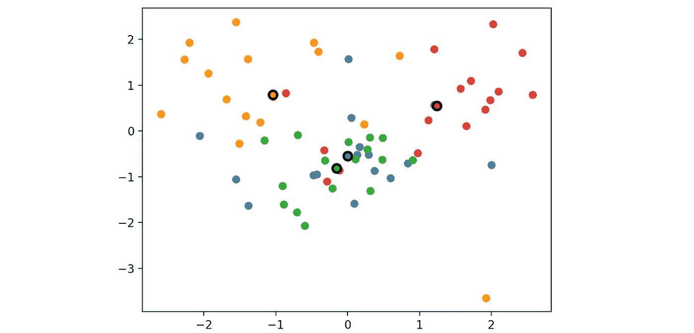

图 2.6-每组/每只动物的中心都标有一个用黑色边框突出显示的新点。橙色:狗，红色:牛，绿色:鸡，蓝猫:

等式 2.1-计算组的中心

代码 2.6 —找到每个动物群的中心，并将其与其余动物群一起标绘

棘手的部分是，当我们得到一张新的图像并想弄清楚上面是哪种动物时会发生什么。图 2.7 显示了我们计算从新的变换图像到每个聚类的距离，因为每个聚类代表一个动物群。距离越小意味着相似度越高；使用欧几里德相似性选择最接近的聚类作为最佳拟合。等式 2.2 显示了如何计算两点之间的相似性。

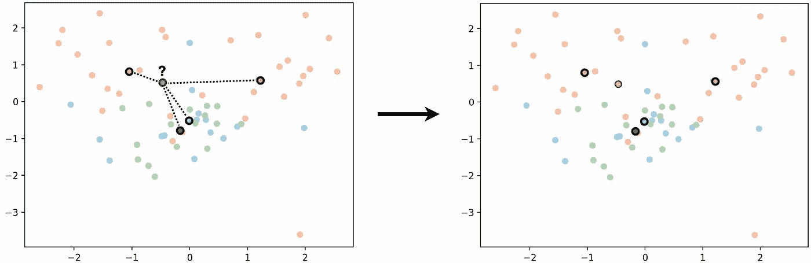

图 2.7-测量到每个中心的距离，并选择最近的一个作为其组

等式 2.2-计算两点间欧几里得相似性得分的公式

那么，我们如何计算我们的集群识别动物的能力呢？一种简单的方法是首先忘记每个点属于哪个组，然后使用等式 2.2 来计算它们与哪个组最接近/最相似。图 2.8 和代码 2.7 使用这种方法来改变每个点的颜色，以匹配最近的聚类(继续阅读，很快就有意义了！).

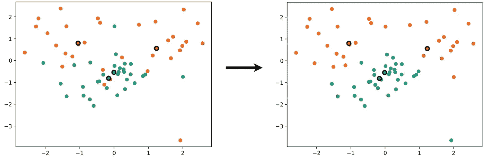

图 2.8-点被重新分配，因此它们现在属于离它们最近的组

代码 2.7-通过计算最接近的类来分配点

当我们改变每个点的颜色以匹配最近的聚类时，会发生四种情况。我们举一个简单的例子来解释发生了什么。为了简单起见，这个例子使用了 Corona 测试而不是集群。电晕测试可以是*阳性*或*阴性*。当测试呈阳性时，会发生两种情况，要么是真的呈阳性，称为*真阳性，*，要么是假的，称为*假阳性*。如果测试为阴性，也会发生同样的事情，它可能是真的，称为*真阴性*，也可能是假的，称为*假阴性*。当测试得到更多的真阳性和真阴性时，我们更信任它。

我们的情况更复杂，因为我们有四个结果，而不是两个(即四个聚类/动物类型对*阳性*和*阴性*)。我们当时观察单个集群，以确定其性能如何。当我们确定它的性能时，同样的四种情况(真阳性、假阳性、真阴性和假阴性)也会发生。让我们关注蓝色的簇:前后都是蓝色的点被称为*真阳性(TP)* 。之前是另一种颜色但现在是蓝色的点被称为*假阳性(FP)* 。之前是蓝色但现在是另一种颜色的点被称为*假阴性(FN)。*最后，前后都是另一种颜色的点被称为*真底片(TN)* 。图 2.9 展示了关注蓝色集群时的每个场景。

我们必须为每个集群继续这一过程，以确定每个集群的表现如何。

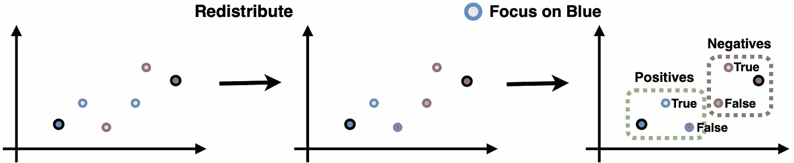

图 2.9 —一个聚类的表现如何可以通过观察重新分配点后它有多少真阳性和假阳性以及真阴性和假阴性来衡量

我们在图 2.8 中使用的方法是有问题的，因为我们只使用现有的点来评估性能。这些点被用于创建/拟合 LDA，并且 LDA 自然更擅长获得这些正确的点。好消息是，我们在 Animal-10 数据集中有更多的图像可以测试！代码 2.8 显示了如何从每个动物类加载 128 张图片并转换到 2D。

代码 2.8-为每个动物类别加载 128 幅图像，并使用代码 2.2 和 2.4 中定义的函数将它们转换为 2D。

一个集群的表现如何可以通过[精度和召回](https://developers.google.com/machine-learning/crash-course/classification/precision-and-recall) [4]来衡量。 *Precision* 测量真阳性和假阳性之间的比率——因此，该聚类仅预测自己的点就有多好。*回忆*测量真阳性和假阴性之间的比率——因此，当预测时，聚类在包括其所有点方面有多好。公式 2.3 显示了精度公式，公式 2.4 显示了召回公式。代码 2.9 计算所有 512 个图像(128 个图像 pr)的每个聚类的阳性和阴性以及精确度和召回率。类)。

等式 2.3-计算聚类精度的公式。它是真阳性和假阳性之间的比率

等式 2.4 —计算聚类召回率的公式。它是真阳性和假阴性之间的比率

代码 2.9 —计算 2D 所有 512 个(128*4 类)图像的每个集群的性能

2D 图像的精度和召回率结果可在表 2.1 中找到。平均准确率 34%，平均召回率 33%，一点都不伟大！但是等等，我们只用了二维？让我们对所有 100.000 维尝试相同的计算，看看它是否比以前执行得更好。

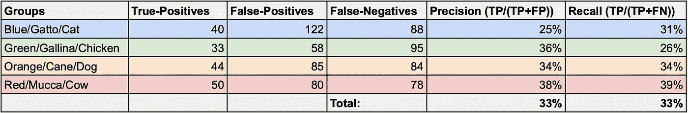

表 2.1-使用 LDA 将点转换为 2D 时的精度和召回率

表 2.2 显示了所有 100.000 尺寸的结果以及代码 2.10 如何获得它们。平均准确率 31%，平均召回率 30%，比以前更差了！LDA 表现得更好，因为它专注于分离每个组，并使它们更加不同，即使只是一点点。

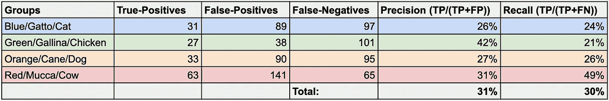

表 2.2-使用无任何变换的点时的精度和召回率

代码 2.10-在不转换数据的情况下使用所有维度时计算聚类准确度的代码

但是等等 LDA 只使用了两个维度…如果两者都转换数据并让它有更多的维度呢？LDA 的最大维数是“类数-1”，在我们的例子中是 4–1 = 3。表 2.3 显示了我们使用所有三个维度时的结果，代码 2.11 显示了如何获得它。平均准确率是 38%，平均召回率是 38%，仍然不是很好，但比以前好！

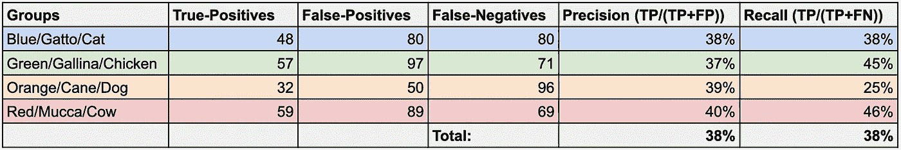

表 2.3-使用 LDA 将点转换为 3D 时的精度和召回率

代码 2.11-使用 LDA 将其转换为 3D 时用于计算聚类精度的代码

## **2.3 讨论**

3D LDA 仅获得 38%的分数，因为它仅使用每组 16 幅图像来训练 LDA，并且因为它像未变换的图像一样，仅查看像素颜色。

当训练时，更多的图像给予 LDA 更多的上下文，因为它有更多的图像可以在图上绘制的例子。如果我们有 16 个图像而不是单个图像，则更容易判断来自同一组的未来点将在哪里。同样，128 张图片比 16 张图片给我们更多的信息。图 2.10 描绘了每组 128 幅图像；左图使用在 64 (16*4)幅图像上训练的 LDA，右图使用在 512 (128*4)幅图像上训练的 LDA。该图说明了当在更多图像上训练时，LDA 如何更好地分离点。代码 2.11 显示了如何绘制这两个图形。

LDA 在转换图像时只查看像素颜色。这种方法有局限性，因为它优先考虑像素的颜色，而不是图像中的形状。这意味着棕色的猫和棕色的狗会比白色的狗和棕色的猫更相似！

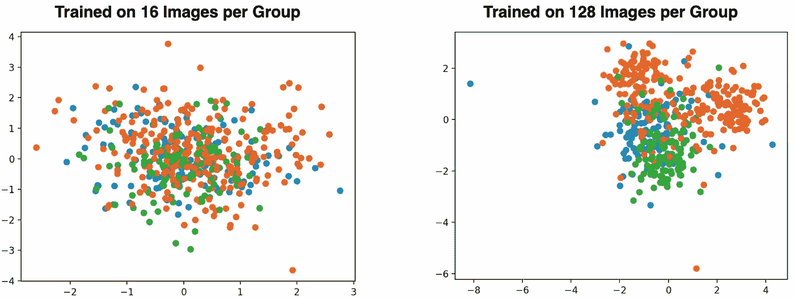

图 2.10–512 张动物图像，使用 LDA 对每组 16 张图像(左)和每组 128 张图像(右)进行训练

代码 2.11 —创建一个新的 LDA，它将图像转换为 2D，并用每组 128 幅图像进行训练。

在第 3 章**图像潜在空间嵌入简介**中，我们将利用我们所了解的图像嵌入和 LDA 的优缺点来提高动物识别应用的准确性。

## 2.4 结论

我们现在已经学完了第 2 章，以及图像嵌入和精确度的介绍。

第一部分，**图像嵌入，**解释了图像由像素组成，每个像素代表一种颜色。每种颜色都是一个维度，就像第一章中的“人生旅程”和“小说”是书籍的维度。我们使用了来自四个动物群体(即猫、狗、鸡和牛)的 64 幅图像来展示如何在 Python 中嵌入图像。使用线性判别分析(LDA)将每幅图像转换成 2D，从而可以将它们绘制成图表并显示它们的相似性。

第二部分，**集群性能**，看我们如何通过在每个动物群的中心放置一个点来表示它们。这些点可以通过计算图像最接近哪个中心来帮助识别图像中的动物。精确度和召回率是确定一种方法如何识别正确动物的两种方法。Precision 检查有多少图像被识别为正确的动物，而 Recall 检查每个中心在包括其物种的所有图像方面有多好。对没有转换的图像和使用 LDAs 转换为 2D 和 3D 的图像进行了性能测试。

**精度和召回率显示**用 LDA 转换的图像比未转换的图像更好地识别正确的动物种类(38%对 31%)。原因是 LDA 变换图像以使每个组更明显。然而，图像和 LDA 只看颜色，而不看图像中的内容的形式。这意味着两种方法都认为棕色的猫和棕色的狗比棕色的狗和白色的狗更相似。

第 3 章，**图像潜在空间嵌入简介**，利用我们从图像嵌入和 LDA 的优缺点中学到的知识来提高动物识别应用的准确性。第三章利用变换的强度，解决了只看颜色的问题，达到了更好的精度。

## 参考

[1]科拉多·阿莱西奥，[动物-10](https://www.kaggle.com/datasets/alessiocorrado99/animals10) ，Kaggle.com

[2] Casey Cheng，[用零数学直观地解释主成分分析法](/principal-component-analysis-pca-explained-visually-with-zero-math-1cbf392b9e7d) (2022)，

[3]杨，，[线性判别分析，](/linear-discriminant-analysis-explained-f88be6c1e00b) (2020)解释

[4]谷歌开发者，[分类:精度与召回](https://developers.google.com/machine-learning/crash-course/classification/precision-and-recall) (2022)，developers.google.com

所有图片和代码，除非另有说明，均为作者所有。

感谢你阅读这本关于潜在空间的书！当分享我们的想法时，我们学得最好，所以请分享一个评论，无论是一个问题，新的见解，还是一个分歧。任何建议和改进都非常感谢！

*如果你喜欢这本书，并且对机器学习和数据科学的新见解感兴趣，请注册中级会员，以便完全访问我的内容。关注我，以便在我发布新章节或帖子时收到电子邮件。*

<https://medium.com/@mathiasgronne/membership>  

## 书籍章节

简介:[进入图像嵌入和潜在空间](/an-extensive-introduction-to-image-embedding-and-auto-encoders-0-6-5c5d9a18fcaa)

第 1 章:[嵌入、聚类和相似性介绍](/introduction-to-embedding-clustering-and-similarity-11dd80b00061)

第 2 章:[图像嵌入和精度介绍](/introduction-to-image-embedding-and-accuracy-53473e8965f)